# Java Swing

> 原文：<https://www.tutorialandexample.com/swing-in-java>

Java Swing 是抽象 Windows 工具包 **(AWT)的扩展。**任何在 Swing 中设计的组件，在任何平台上都是一样的。

### 抽象 Windows 工具包(AWT)的问题/缺点:

1.  正如我们所知，AWT 在内部依赖于 C 语言代码，而 C 语言依赖于平台，所以在 Java 中，这是不可取的。
2.  在 AWT 中开发的任何组件，其外观和感觉都会随着平台的不同而变化。例如，如果您为 AWT 中的按钮编写代码，当您在 windows 中运行该代码时，它将显示 Windows 类型的按钮，而在 UNIX 操作系统中执行的相同代码将显示 UNIX 类型的按钮。因此，我们无法确定特定的屏幕在特定的操作系统上会是什么样子，因为它的外观会因系统而异。
3.  在 AWT 中开发的组件是非常重的，因此它消耗更多的系统资源，例如更多的内存空间、更多的处理器时间等。

### 上述(AWT)问题的解决方案:

To fix the problems of AWT, JavaSoft people redeveloped complete AWT package without internally taking the help of native methods. So all AWT classes extended to form new classes and new class library is created, further this library is called as Java Foundation Classes (JFC). *Java Foundation Classes* created five main library package which is very popular in GUI designing.

1.  Javax.swing
2.  Javax.accessibility
3.  Javax.swing.plaf
4.  Java.awt.dnd
5.  Java.aet.geon

### JFC 库对于 GUI 设计的优势:

1.  JFC 库类创建了一个轻量级组件，因此它消耗的资源(内存、处理器)更少，执行速度比 AWT 组件快得多。
2.  使用 JFC 库类创建的任何组件在每个平台上都是一样的。
3.  JFC 是 AWT 的扩展，所以我们在 AWT 中使用的所有方法也适用于 JFC。

Among the five main JFC library, *Javax.swing* Library is very famous, and it’s used by every programmer.

## 让我们一起探索" *Javax.swing* *"* :

Its most commonly used JFC library for the graphical user interface (GUI) designing in Java programming. It provides classes to create components such as push button, checkbox, menu list, radio button, etc. Swing Follow Model – View – Controller (MVC) architecture: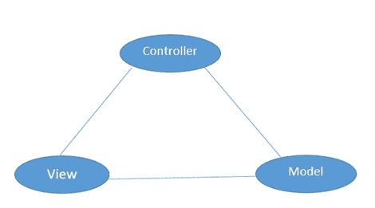 **Model:** It represents the data of any swing component.**View:** It represents the visual appearance of any swing component based on the data model.**Controller:** It is the mediator between the model and view. Whenever a user interacts with the swing component, first of all, the controller will understand this and modify the model data accordingly.

### “摇摆包”的重要类别

In *Javax.swing* package there are lots of important classes. These swing classes are derived from *the java.awt* package. 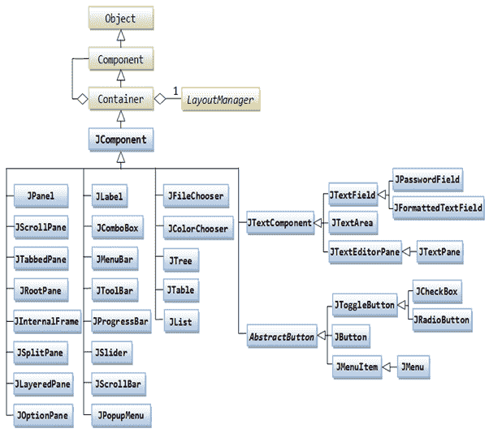

### 如何在 swing 中创建框架？

A frame represents a window with the free area which has a Title bar and border. In that free area, we can display any Text, or any component can be displayed. To create a frame we have a *JFrame* class in swing package.

*   创建不带标题的框架

```
JFrame frame= new JFrame();
```

*   创建带标题的框架

```
JFrame frame= new JFrame(“ Frame Title ”);
```

*   创建带有标题和框架大小的框架

```
JFrame frame= new JFrame(“ Frame Title ”);
frame.setSize(x,y);
```

**Note:** in place of x and y, put some value in pixel.  Such as :

```
 frame.setSize(200,400);

```

#### 创建 200x200 像素大小的帧的 Java 程序:

```
import javax.swing.*;
class SimpleFrame{
public static void main(String args[]){
// Frame Name
String framename = "Simple Frame";
//Create Frame with Title
JFrame frame= new JFrame(framename);
//set Size of this new frame
frame.setSize(200, 200);
// Now Display the Frame
frame.setVisible(true);
}
}
```

**Output : **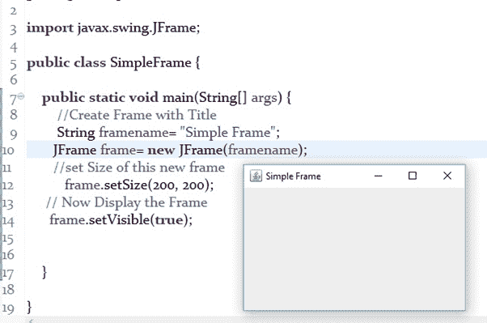

#### 注意:

1.  要关闭一个 Swing 框架，我们需要借助 JFrame 类的方法。
2.  getDefaultCloseOperation(parameter)= >它是 JFrame 类的方法。
3.  JFrame。EXIT_ON_CLOSE = >点击关闭按钮，关闭框架/应用程序。

**Program:**

```
import javax.swing.JFrame;
public class CloseFrame extends JFrame {
          public static void main(String[] args) {
                    //Create Frame
                   CloseFrame cframe=new CloseFrame();
                   //set Frame Name
                   cframe.setTitle("Close Frame");
                   //Set Frame Size
                   cframe.setSize(200,300);                
      // Close the application upon clicking Close Button
      cframe.setDefaultCloseOperation(JFrame.EXIT_ON_CLOSE);
          }
}
```

**Output: **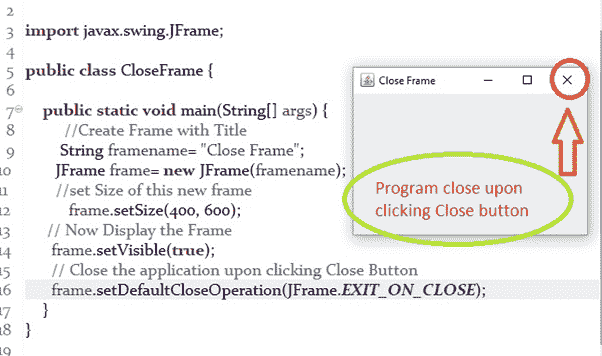

### 如何设置任何框架的背景颜色:

To set the background color in frame, we have to set the background color in the Content pane. Content pane is the free area of any frame. **Program:**

```
import java.awt.Color;
import java.awt.Container;
import javax.swing.JFrame;
public class SetBackgroundColor extends JFrame  {
          public static void main(String[] args) {
      //Create a Frame
                   SetBackgroundColor setbg=new SetBackgroundColor();
                   //Create Content pane, it's a container
                   Container container=setbg.getContentPane();
                   //Set Background Color
                   container.setBackground(Color.CYAN);
                   //set the size of frame
                   setbg.setSize(200,300);
                   //display the frame
                   setbg.setVisible(true);
                   //Close application upon clicking Exit button
                   setbg.setDefaultCloseOperation(JFrame.EXIT_ON_CLOSE);
          }
}
```

**Output:**   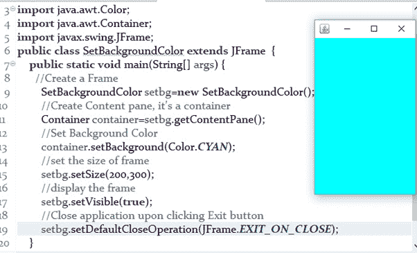 **How To Display Text in Swing Frame/Application?** Text can be displayed by using the label. We can use *the JLabel* class to create label.

```
  JLabel label=new JLabel(“Any Text”);
```

**Program:**

```
import java.awt.Color;
import java.awt.Container;
import java.awt.FlowLayout;
import java.awt.Font;
import javax.swing.JFrame;
import javax.swing.JLabel;
public class TextOnFrame extends JFrame {
          public static void main(String[] args) {
                   JLabel label; //Variable
                   TextOnFrame tframe=new TextOnFrame();
                   tframe.setTitle("Text on Frame");
                   tframe.setSize(200,300);
                   Container container=tframe.getContentPane();
                   container.setLayout(new FlowLayout());
                   container.setBackground(Color.*YELLOW*);
                   //Creating Label with any Text
                   label=new JLabel("Welcome to Swing...");
                   //Set Font for label
                   label.setFont(new Font("Helvetica",Font.*BOLD*,24));
                   //set color for label
                   label.setForeground(Color.*RED*);
                   //add the label to Content pane
                   container.add(label);
                   tframe.setVisible(true);
                   tframe.setDefaultCloseOperation(JFrame.*EXIT_ON_CLOSE*);
          }
}
```

**Output: **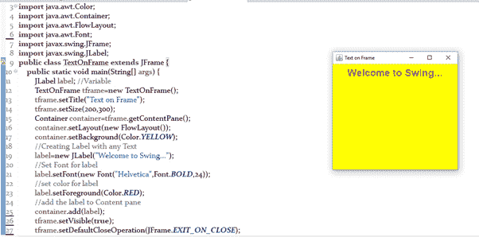

### 创建复选框、单选按钮、文本字段和文本区域等组件:

**Check Box:** with the help of *the JCheckBox* class, we can create Check Boxes.

*   没有任何标签或图像的复选框

```
JCheckBox bx=new JCheckBox();
```

*   带标签的复选框

```
JCheckBox bx=new JCheckBox(“label”);
```

*   带有图像的复选框

```
JCheckBox bx=new JCheckBox(ImageIcon image);
```

Image will be loaded from ImageIcon object

*   带有标签和图像的复选框

```
JCheckBox bx=new JCheckBox(“label”, ImageIcon image);
```

**Text Field:  **Text field can be created with the help of *JTextField* Class. Text field can accommodate only one line of text.

*   没有任何文本的文本字段

```
JTextField textfield=new   JTextField();
```

*   文本字段，其中显示一些文本

```
 JTextField textfield=new   JTextField(“Some Text ”);
```

*   宽度为 35 个字符文本字段

```
 JTextField textfield=new   JTextField(35);
```

*   包含文本且宽度为 35 个字符文本字段

```
 JTextField textfield=new JTextField(“Some Text ”,35);
```

**Radio Button:** Radio Button can be created with the help of *JRadioButton* Class.

*   没有任何标签或图像的单选按钮

```
JRadioButton radio=new JRadioButton ();
```

*   带标签的单选按钮

```
JRadioButton radio=new JRadioButton (“label”);
```

*   带有图像的单选按钮

```
JRadioButton radio=new JRadioButton (ImageIcon image);
```

Image will be loaded from ImageIcon object

*   带有标签和图像的单选按钮

```
 JRadioButton radio=new JRadioButton (“Label”, ImageIcon image);
```

**Text Area:** Text  Area can display multiple lines of text. With the help of *the JTextArea* class, we can create a text area.

*   没有任何文本的文本区域。

```
JTextArea text=new JTextArea();
```

*   包含一些文本的文本区域。

```
JTextArea text=new JTextArea(“ Some Text”);
```

*   文本区域有 10 行，每行 30 个字符

```
JTextArea text=new JTextArea(10,30);
```

*   包含一些文本的文本区域，10 行，每行 30 个字符

```
JTextArea text=new JTextArea(“Some Text”, 10,30);

```

## 写一个程序实现“单选按钮、复选框和文本区”:

**Program:**

```
import java.awt.Container;
import java.awt.FlowLayout;
import java.awt.event.ActionEvent;
import java.awt.event.ActionListener;
import javax.swing.ButtonGroup;
import javax.swing.JCheckBox;
import javax.swing.JFrame;
import javax.swing.JRadioButton;
import javax.swing.JTextArea;
public class RadioCheckboxTextAreaDemo extends JFrame implements ActionListener {     
               JCheckBox cbox1, cbox2;
               JRadioButton rbutton1, rbutton2;
               JTextArea tarea;
               ButtonGroup bg;
               String message="";
               //Constructor
                public RadioCheckboxTextAreaDemo() {
                      //create container pane
            Container container=getContentPane();
            //set Layout
            container.setLayout(new FlowLayout());
            //create text row in that 15 row and each row has 30 character
            tarea=new JTextArea(15,30);
            //Create two checkbox with label and status
            cbox1=new JCheckBox("Spring", true);
            cbox2=new JCheckBox("Hiberate");       
            //create two radio button with label and status
            rbutton1=new JRadioButton("Boy Batch",true);
            rbutton2 =new JRadioButton("Girl Batch");        
            //Create Button group
            bg=new ButtonGroup();
            bg.add(rbutton1);
            bg.add(rbutton2);           
            //add these all check box, radio button, text area in to the container
            container.add(cbox1);
            container.add(cbox2);
            container.add(rbutton1);
            container.add(rbutton2);
            container.add(tarea);           
            //Now add the action listener on radio button and checkbox
            cbox1.addActionListener(this);
            cbox2.addActionListener(this);
            rbutton1.addActionListener(this);
            rbutton2.addActionListener(this);          
            //Close the Frame or application upon Close button clicking
            setDefaultCloseOperation(JFrame.EXIT_ON_CLOSE);
                   }        
          @Override
          public void actionPerformed(ActionEvent e) {
                   //Check which component is selected by user
                   if(cbox1.getModel().isSelected()){
                             message +="\n Spring";
                   }
                   if(cbox2.getModel().isSelected()){
                             message +="\n Hibernate";
                   }
                   if(rbutton1.getModel().isSelected()){
                             message +="\n Boy Batch";
                   }else {
                             message +="\n Girl Batch";
                   }                
                   //set the selected message in text area
                   tarea.setText(message);                  
                   //clear the message with empty string
                   message="";              
          }
          public static void main(String[] args) {
                    ///create frame
                   RadioCheckboxTextAreaDemo frame=new RadioCheckboxTextAreaDemo();
                   frame.setTitle("Checkbox and Radio button demo");
                   frame.setSize(500,400);
                   frame.setVisible(true);
          }
}
```

**Output:** 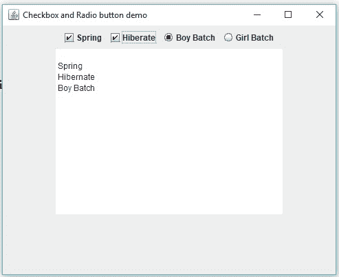

### 如何在 Swing 框架/应用程序中创建菜单:

Menu is collection of similar types of group of items. With the help of *JMenu* class, we can create a menu in Swing frame/application.

*   我们可以这样创建菜单栏:

```
JMenuBar menubar=new JMenuBar();
```

*   我们可以创建单独的菜单，将它们附加到菜单栏上:

```
JMenu  menulist=new JMenu(“File”);
```

Now attach this file to menu bar:

```
menubar.add(menulist);
```

*   使用 *JMenuItem* 类，我们可以创建菜单项组。

```
JMenuItem save=new JMenuItem(“Save”);
```

Now add it to menulist:

```
Menulist.add(save);
```

**Program:  **Creating a Sample Menu List.

```
package pkg1;
import java.awt.BorderLayout;
import java.awt.Color;
import java.awt.Container;
import java.awt.event.ActionEvent;
import java.awt.event.ActionListener;
import javax.swing.JCheckBoxMenuItem;
import javax.swing.JFrame;
import javax.swing.JMenu;
import javax.swing.JMenuBar;
import javax.swing.JMenuItem;
public class SwingMenuModule extends JFrame implements ActionListener {
           JMenuBar jmbar;
           JMenu file,edit,font;
           JMenuItem op,sa,cl,cp,pt,f1,f2;                  
             public SwingMenuModule() {
                   //create container
                      Container container=getContentPane();
                      container.setLayout(new BorderLayout());
                      container.setBackground(Color.CYAN);                     
                      //Create a Menu bar
                      jmbar=new JMenuBar();                     
                      //add member to container
                      container.add("North", jmbar);                     
                      //create the File and Edit menu and attach them to menu bar
                      file=new JMenu("File");
                      edit=new JMenu("Edit");
                      jmbar.add(file);
                      jmbar.add(edit);                     
                      //Create Menu Items
                      op=new JMenuItem("Open");
                      sa=new JMenuItem("Save");
                      cp=new JMenuItem("Copy");
                      pt=new JMenuItem("Paste");
                      cl=new JMenuItem("Close");                     
                      //add Open, Save, Close to file Menu and Copy, Paste to edit menu
                      file.add(op);
                      file.add(sa);
                      file.add(cl);
                      edit.add(cp);
                      edit.add(pt);                     
                      //add  separator (horizontal line) to File menu
                       file.addSeparator();
                      //Create Font SubMenu and add it to file menu
                        font=new JMenu("Font");
                        file.add(font);                     
                        //Create submenu items
                        f1=new JMenuItem("Arial");
                        f2=new JMenuItem("Times New Roman");
                        //Add item to submenu
                        font.add(f1);
                        font.add(f2);                 
                        //Attach action listener to all menu items
                        op.addActionListener(this);
                        sa.addActionListener(this);
                        cl.addActionListener(this);
                        cp.addActionListener(this);
                        pt.addActionListener(this);
                        f1.addActionListener(this);
                        f2.addActionListener(this);                            
                        //Close Application upon Close Button Click
                       setDefaultCloseOperation(JFrame.EXIT_ON_CLOSE);                     
          }
             //it will execute when menu item is clicked.
                   @Override
                   public void actionPerformed(ActionEvent e) {
                             if(op.isArmed()){
                                      System.out.println("Open is Selected");
                             }
                             if(sa.isArmed()){
                                      System.out.println("save is Selected");
                             }
                             if(cl.isArmed()){
                                      System.out.println("Close is selected");
                             }
                             if(pt.isArmed()){
                                      System.out.println("Paste is selected");
                             }
                             if(f1.isArmed()){
                                      System.out.println("Arial Font is selected");
                             }
                             if(f2.isArmed()){
                                      System.out.println("Times New Roman is selected");
                             }                           
                   }            
          public static void main(String[] args) {                 
                    //Create the frame
               SwingMenuModule menu=new SwingMenuModule();
               menu.setTitle("Menu List");
               menu.setSize(500,400);
               menu.setVisible(true);
          }
}
```

**Output:**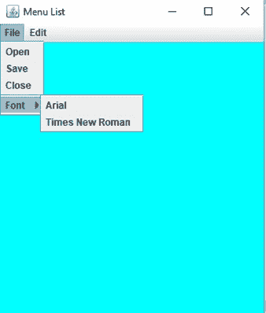   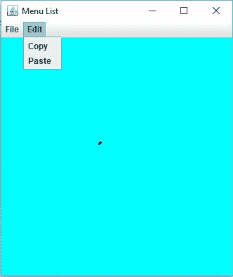

###  **T2】**

### **如何在 Swing 中创建进度条？**

Progress Bar is visual representation of any task completion. It represent that how much any particular or a group of task has been completed. With the help of JProgressBar class, we can create Progress Bar.

*   默认情况下，水平进度条将创建:

```
JProgressBar progress=new JProgressBar();
```

*   但是你可以创建水平和垂直的进度条

```
new JProgressBar(Choice)
```

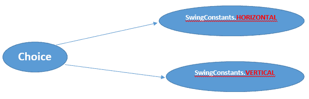
**Program:**

```
package com.pramodsoft;
import java.awt.Color;
import java.awt.Container;
import java.awt.FlowLayout;
import java.awt.event.ActionEvent;
import java.awt.event.ActionListener;
import javax.swing.JButton;
import javax.swing.JFrame;
import javax.swing.JProgressBar;
public class Progressbar extends JFrame  implements ActionListener {
            JButton b;
            JProgressBar pbar;        
            public Progressbar() {                  
                     Container container=getContentPane();
                     container.setLayout(new FlowLayout());
                     container.setBackground(Color.cyan);                 
                     //Create a button
                     b=new JButton("Click Again...");                  
                     //Create Progress bar
                     pbar=new JProgressBar();                 
                     //set foreground colour
                     pbar.setForeground(Color.green);                  
                     //display the percentage starting
                     pbar.setStringPainted(true);                  
                     // add progress bar and button to container
                     container.add(b);
                     container.add(pbar);
                     //add action listener to progress bar
                     b.addActionListener(this);                    
          }
                            @Override
                   public void actionPerformed(ActionEvent e) {                            
                             //on every button click.. Progress bar will increase 10%
                             pbar.setValue(pbar.getValue()+10);                            
                   }         
          public static void main(String[] args) {                   
                   Progressbar progress=new Progressbar();
                    progress.setTitle("Progress Bar");
                    progress.setSize(400,500);
                    progress.setVisible(true);
                    progress.setDefaultCloseOperation(JFrame.EXIT_ON_CLOSE);
          }
}
```

**Output:** 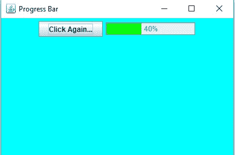**Note:** Swing is a big topic, so in 1000 words we can’t explain every feature. It’s a 1900 word Article.
 [← Prev](/java-network-programming)[Next →](/collections-in-java)