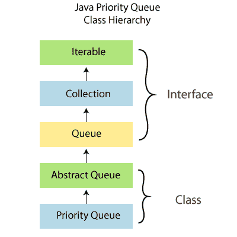
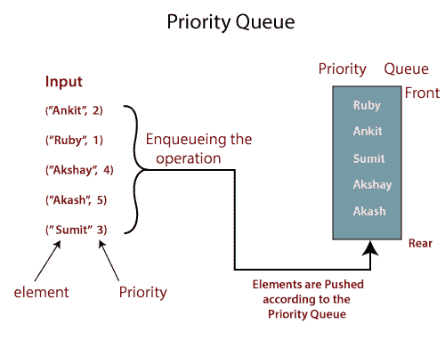

# Java 中的优先级队列

> 原文：<https://www.tutorialandexample.com/priority-queue-in-java/>

**Java 中的优先级队列**

PriorityQueue 是 **Java 集合框架**的成员，当需要根据优先级处理值时使用。



优先级队列的操作类似于标准队列，只是每个元素都有一个与之相关联的特定优先级。



PriorityQueue 中元素的优先级决定了从 PriorityQueue 中删除元素的顺序。

它是一个抽象数据类型(ADT ),并且是无界的，但是它有一个内部容量，用来控制用来存储队列中元素的数组的容量。

优先级队列支持可比较的数据，即插入队列中的数据必须能够以某种方式排序，从“最小到最大”或“最大到最小”，这样我们可以为每个元素分配相对优先级。

JDK 1.5 版首次引入了优先级队列。

### 优先级队列的构造函数

| **构造函数** | **描述** |
| PriorityQueue() | 它初始化一个初始默认容量为 11 的 ProirityQueue，元素的顺序根据它们的默认排序。 |
| 优先级队列(集合 c) | 它初始化包含参数中指定的集合元素的 PriorityQueue。 |
| 优先级队列(int initialCapacity) | 它用参数中指定的初始容量初始化 PriorityQueue，元素的顺序根据其默认顺序。 |
| 优先级队列(int initialCapacity，比较器比较器) | 它使用参数中指定的初始容量创建一个 PriorityQueue，元素的顺序取决于指定的比较器。 |
| PriorityQueue(优先级队列:<e>c)</e> | 它创建一个 PriorityQueue，其中包含指定优先级队列所包含的元素。初始化优先级队列的顺序与给定优先级队列的顺序一致。 |
| 优先级队列(sort dset<e>c)</e> | 它初始化包含指定排序集元素的 PriorityQueue。 |

### 优先级排队方法

| **修饰符/数据类型** | **方法** | **描述** |
| 布尔型 | 添加(英英) | 它将指定的元素添加到优先级队列中。 |
|   | 包含(对象 o) | 如果队列包含参数中指定的元素，那么它将返回 true。 |
|   | 移除(对象 o) | 此方法将删除队列中第一个出现的 argumented 元素。 |
|   | 报价(英英) | 它将参数中指定的元素插入到队列中。 |
| 空的 | 清除() | 它清除队列中的所有元素。 |
| （同 Internationalorganizations）国际组织 | 大小() | 它返回队列中可用条目的数量。 |
| 比较器 | 比较器() | 它返回对队列中的元素进行排序的比较器，或者如果队列是根据其元素的默认排序进行排序的，则返回 null。 |
| 迭代器 | 迭代器() | 它返回队列中元素的迭代器。 |
| E | peek() | 它检索队列的顶部元素，如果列表为空，则返回 null。 |
| E | 投票() | 它检索并删除队列头，如果队列为空，则返回 null。 |
| 对象[] | 托阵列() | 它返回一个包含队列中所有元素的数组。 |
| T[] | toArray(T[] a) | 它返回一个包含队列所有元素的数组，返回的数组的返回类型是指定数组的类型。 |

**使用 add(E e)方法在优先级队列中添加元素的示例。**

```
import Java.util.*;
 class AddDemo {
  public static void main(String[] args) {
  //Creating priority queue of default size
  PriorityQueue pq= new PriorityQueue<String>();
  //Adding elements to the queue
  pq.add("Java");
  pq.add("Pyhton");
  pq.add("DBMS");
  pq.add("MongoDB"); 
  //printing the elements in the priority queue
  System.out.print("Elements in the Queue are:\n");
  for(String val : pq)
  {
  System.out.println(val);
  }
  }
 } 
```

**输出:**

```
Elements in the Queue are: 
 DBMS
 MongoDB
 Pyhton
 Java 
```

**举例说明包含(对象 o)的方法。**

```
import Java.util.*; 
 class ContainsDemo { 
 public static void main(String[] args)
 {
  //initializing queue
 Queue q = new PriorityQueue<string>(); 
 //adding element
 q.add("Java");  
 q.add("C#"); 
 q.add("Python"); 
 q.add("CCNA"); 
 for (String val : q){ 
 System.out.println(val);  
  } 
 /*using contains() method to check whether the specified element 
  is present in the queue or not*/ 
  System.out.println("Does the Queue contains 'Java'? " +q.contains("Java"));
  System.out.println("Does the Queue contains 'SQL'? " +q.contains("SQL")); 
  } 
 }</string> 
```

**输出:**

```
C#
CCNA
Python
Java
Does the Queue contains 'Java'? true
Does the Queue contains 'SQL'? false 
```

**使用 remove(Object o)方法从队列中删除元素的例子。**

```
import Java.util.*; 
 class RemoveDemo { 
  public static void main(String args[]) 
  { 
  // Creating an empty PriorityQueue 
  PriorityQueue q = new PriorityQueue<string>();
 //adding elements into the Queue 
  q.add("Java"); 
  q.add("C++");  
  q.add("Python"); 
  q.add("SQL"); 
  q.add("Selenium"); 
  // Displaying the PriorityQueue 
  System.out.println("Elements in the Queue: " + q); 
  // Removing elements using remove() method 
  q.remove("Selenium");  
  q.remove("Python"); 
  // Displaying the PriorityQueue after removing the elements 
  System.out.println("Elements in the queue after removing elements: " + q); 
  } 
 }</string> 
```

**输出:**

```
Elements in the Queue: [C++, Java, Python, SQL, Selenium]
Elements in the queue after removing elements: [C++, Java, SQL] 
```

**举例说明要约(E e)的方法。**

```
import Java.util.*;
 public class OfferDemo {
  public static void main(String args[])
  {
  //initializing an empty PriorityQueue
  PriorityQueue q =new PriorityQueue<string>();
  //Adding elements to the queue using add() method 
  q.add("Java");
  q.add("Python");
  q.add("SQL");
  q.add("MongoDB");
  q.add("C#");
  //now printing the elements in the queue 
  System.out.println("Elements int the Queue"+ q);
  //Inserting new elements using offer() method
  q.offer("Tutorial");
  q.offer("Example");
  //Printing the final queue
  System.out.println("Priority Queue after Offer method::" +q);
  }
 }</string> 
```

**输出:**

```
Elements int the Queue[C#, Java, SQL, Python, MongoDB]
Priority Queue after Offer method::[C#, Java, Example, Python, MongoDB, Tutorial, SQL] 
```

**使用 clear()方法从 PriorityQueue 中删除所有元素的例子。**

```
import Java.util.*;
 public class ClearDemo {
  public static void main(String[] args) 
  {
  //Initializing an empty PriorityQueue
  PriorityQueue q= new PriorityQueue<string>();
  //Adding elements to the queue
  q.add("Java");  
  q.add("C++"); 
  q.add("Python"); 
  q.add("SQL"); 
  q.add("Selenium"); 
  //Printing the Queue
  System.out.println("Element in the queue are::"+q);
  //deleting all the elements in the queue 
  q.clear();
  //printing the queue
  System.out.println("Queue is empty::"+q);
  }
 }</string> 
```

**输出:**

```
Element in the queue are::[C++, Java, Python, SQL, Selenium]
Queue is empty::[] 
```

**示例使用 size()方法获取 PriorityQueue 的大小。**

```
import Java.util.*;
 public class SizeDemo {
  public static void main(String[] args) {
  //Initializing an empty PriorityQueue
  PriorityQueue q= new PriorityQueue<string>();
  //Adding elements to the queue
  q.add("Java"); 
   q.add("C++"); 
   q.add("Python");  
   q.add("SQL"); 
   q.add("Selenium"); 
  //Printing the Queue
  System.out.println("Element in the queue are:"+q);
  //Printing the size of the PriorityQueue 
  System.out.println("The size of the given queue is::"+q.size());
  }
 }</string> 
```

**输出:**

```
Element in the queue are:[C++, Java, Python, SQL, Selenium]
The size of the given queue is::5 
```

**举例说明 comparator()方法。**

```
import Java.util.Comparator; 
 import Java.util.PriorityQueue; 
 class Student { 
 public String name; 
 public int marks; 
 Student(String name,int marks){  
 this.name=name; 
 this.marks=marks; 
  } 
 public String toString(){ 
 return this.name+" got "+ this.marks+" marks."; 
  } 
 } 
 class sort implements Comparator{ 
 @Override 
 //using compare() method to compare on the basis of marks of students 
 public int compare(Student a, Student b) { 
 if(a.marks<b.marks return="" else="" if="">b.marks) { 
 return 1; 
 }else{
 return 0;  
 }
  } 
  } 
 public class ComparatorDemo { 
 public static void main(String[] args) { 
  //creating objects to store the values 
  Student student1 = new Student("Ankit", 98); 
  Student student2 = new Student("Anubhav", 19); 
  Student student3 = new Student("Aakash", 78); 
  Student student4 = new Student("Sumit", 18); 
 //Initializing priority queue  
 PriorityQueue<student>Pqueue = new PriorityQueue<student>(5,new sort()); 
 //adding elements to the queue from the object student
 Pqueue.add(student1); 
 Pqueue.add(student2); 
 Pqueue.add(student3); 
 Pqueue.add(student4);  
 //using the comparator method to sort the queue, if it is not in its natural ordering
 Pqueue.comparator(); 
 //printing the sorted elements in the queue
 for(Student xyz:Pqueue){ 
 System.out.println(xyz); 
 } 
  } 
 }</student></student></b.marks> 
```

**输出:**

```
Sumit got 18 marks.
Anubhav got 19 marks.
Aakash got 78 marks.
Ankit got 98 marks.  
```

**举例说明 iterator()方法。**

```
import Java.util.Iterator;
 import Java.util.PriorityQueue;
 public class IteratorDemo {
  public static void main(String[] args) {
  // initializing an empty PriorityQueue 
  PriorityQueue q = new PriorityQueue<string>();
 //adding elements into the Queue 
  q.add("xamarin");  
  q.add("Python"); 
  q.add("SQL"); 
  q.add("Selenium"); 
  // printing the PriorityQueue 
  System.out.println("Elements in the Queue: " + q); 
  // Initializing an iterator  
  Iterator val = q.iterator(); 
  // printing the values after iterating through the queue 
  System.out.println("Elements after iteration: "); 
  while (val.hasNext()) { 
  System.out.println(val.next()); 
  } 
  }
 }</string> 
```

**输出:**

```
Elements in the Queue: [Python, Selenium, SQL, xamarin]
 Elements after iteration: 
 Python
 Selenium
 SQL
 xamarin 
```

**举例说明 peek()方法。**

```
import Java.util.*;
 public class PeekDemo {
  public static void main(String[] args) {
  //Initializing an empty PriorityQueue
  PriorityQueue q= new PriorityQueue<string>();
  //adding elements using add() method
  q.add("Java");
  q.add("Python"); 
  q.add("SQL");
  q.add("MogoDB");
  //printing the queue
  System.out.println("Elements in the Queue are :"+q);
  //fetching element using peek() method
  System.out.println("The head element in the queue is:" +q.peek());
  //printing the queue after the peek()
  System.out.println("Elements in the queue after peek() :"+q); 
  }
 }</string> 
```

**输出:**

```
Elements in the Queue are :[Java, MogoDB, SQL, Python]
The head element in the queue is:Java
Elements in the queue after peek() :[Java, MogoDB, SQL, Python] 
```

**举例说明 poll()方法。**

```
import Java.util.PriorityQueue;
 public class PollDemo {
  public static void main(String[] args) {
  //Initializing an empty PriorityQueue
  PriorityQueue q= new PriorityQueue<string>();
  //adding elements using add() method
  q.add("Java");
  q.add("Python"); 
  q.add("SQL");
  q.add("MogoDB");
   //printing the queue
  System.out.println("Elements in the Queue are :"+q);
  //fetching element using poll() method
  System.out.println("The element at the top is:" +q.poll());
  //printing the queue after the poll() method
  System.out.println("Elements in the queue after poll() :"+q); 
  }
 }</string> 
```

**输出:**

```
Elements in the Queue are :[Java, MogoDB, SQL, Python]
The element at the top is:Java
Elements in the queue after poll() :[MogoDB, Python, SQL] 
```

**举例说明 toArray()方法:**

```
import Java.util.PriorityQueue;
 public class ToArrayDemo {
  public static void main(String[] args) {
  //initializing an empty PriorityQueue 
  PriorityQueue q = new PriorityQueue<string>(); 
  //adding elements into the Queue 
  q.add("Xamarin"); 
  q.add("Android");  
  q.add("Java"); 
  q.add("Ruby"); 
  q.add("MongoDB"); 
  // Printing the PriorityQueue 
  System.out.println("The PriorityQueue is: " + q); 
  // defining the array and using toArray() 
  Object[] ar = q.toArray(); 
  System.out.println("The array is:");  
  for (int k = 0; k < ar.length; k++) 
  System.out.println(ar[k]); 
  }
 }</string> 
```

**输出:**

```
The PriorityQueue is: [Android, MongoDB, Java, Xamarin, Ruby]
 The array is:
 Android
 MongoDB
 Java
 Xamarin
 Ruby 
```