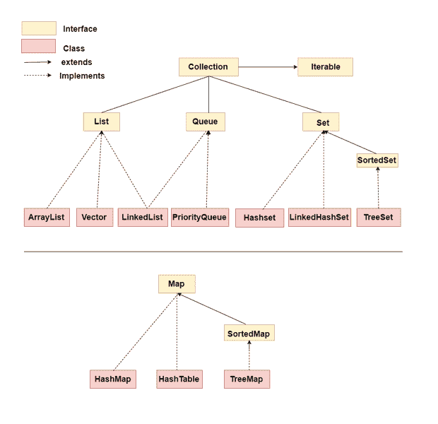

# Java 中的集合

> 原文：<https://www.tutorialandexample.com/collections-in-java/>

集合框架是 Java 最强大的子系统之一。它是一组类和接口，是管理对象和一组对象的最新技术。简单来说；“集合框架是一个允许将多个元素组合在一起的容器”。它在排序数据和高效处理数据方面是共生的。集合框架像图书馆一样工作。集合框架具有:

*   接口
*   实现接口的类。
*   算法。

### 集合框架和数组有什么不同？

Unlike array;

*   集合的大小不需要在实例化时声明。它们可以根据对象自动调整自身大小。
*   集合不能保存基本数据类型。

### 可以对集合执行的操作

A list of operations that can be performed on any collection:

*   添加新对象。
*   删除现有对象。
*   遍历对象。
*   检索所需的对象。
*   删除所需的对象。
*   搜索特定的对象。

### 集合接口层次结构



### 集合框架中的接口

Collection interfaces determine the fundamental nature of collection classes. There are various interfaces in the collection framework. They are listed below. **1\. Collection?** It is a generic interface at the top of the collection hierarchy. Every class needs to implement this interface. It enables the users to work with a group of objects. Collection implements the Iterable interface. The general declaration is: interface *CollectionE* specifies the type of objects that the collection will hold. **2\. Queue ?** It extends the Collection interface and declares the behavior of a queue. Queue is a data structure that follows the first in first out (FIFO) principle. It is a generic interface. The declaration of queue is: interface *QueueE* specifies the type of objects that the queue will hold. **3\. Dequeue?** It extends the Queue interface. Dequeue is a double-ended queue in which the insertion and deletion of elements are possible from both the ends of queue. It is a generic interface with the declaration as interface *Dequeue.E* specifies the type of objects that dequeue will hold. **4\. List ?** It extends the collection interface and declares a structure to store a sequence of the element. Elements can be accessed, inserted, deleted by specifying their position in the list. It is a generic interface with declaration as interface *List.E* specifies the type of objects that the list will hold. **5\. Set ?** It extends the collection interface and declares a set. The set stores the element such that there is no repetition. It is a generic interface with declaration as interface *Set.E* specifies the type of objects that the set will hold. **6\. SortedSet?** It extends the set and declares the behavior stored in a set in ascending order. It is a generic interface with declaration as interface *SortedSet*.E specifies the type of objects that the set will hold. **7\. NavigableSet?** It extends the SortedSet interface and declared the behavior of elements such that element with the closest match to a given value is retrieved. It is a generic interface with declaration as interface *NavigableSet.E* specifies the type of objects that the set will hold.

### 集合中的类

There are various classes in the Collection. Some classes provide full implementation while the rest provide a skeletal structure. **The various classes are discussed below:**

1.  这个类实现了集合中定义的大多数接口。
2.  **AbstractList:** 这个类继承了 AbstractCollection 类，实现了 List 接口中的大部分接口。
3.  **AbstractQueue:** 这个类继承了 AbstractCollection 类，实现了队列接口中的大部分接口。
4.  **abstractsequentialist:**这个类继承了 AbstractList 类，用于使用顺序访问的文件。顺序存取是每个字一个一个地重复的存取。
5.  **LinkedList:** 这个类继承了 AbstractSequentialList 类，实现了链表。
6.  **ArrayList:** 这个类继承了 AbstractList 类，实现了一个动态数组。动态数组是在运行时声明大小的数组。
7.  **ArrayDeque:** 这个类继承了 AbstractCollection 类，实现了 dequeue 接口。它实际上实现了双端队列动态。
8.  **AbstractSet:** 这个类继承了 AbstractCollection 类，实现了 list 接口中的大部分接口。
9.  **EnumSet:** 这个类继承了 AbstractSet 类，并与 enum 元素一起使用。
10.  **HashSet:** 这个类继承了 AbstractSet 类，并和哈希表一起使用。
11.  **LinkedHashSet:** 这个类继承了 HashSet 类，允许按照插入的顺序迭代。
12.  **PriorityQueue:** 这个类继承了 AbstractQueue 类，并使用它来创建优先级队列。
13.  **TreeSet:** 这个类继承了 AbstractSet 类，并使用在树中创建一个排序集。

### 集合中的算法

The collection defines several algorithms that can be used with the collection class.

收集接口的有用方法如下:

**add()**:add()方法向集合中插入一个新元素，并返回是否成功。

方法签名是

```
boolean add(E element)
```

集合使用泛型“E 代表元素”。  表示用于创建集合的通用类型。

**例如:**

```
import java.util.ArrayList;
import java.util.HashSet;
import java.util.List;
import java.util.Set;

public class ListExample {
public static void main(String[] args)
{
List<String> countries = new ArrayList<>(); // Creating list of
System.out.println(countries.add("INDIA")); // will return true.
Set<String> countries1 = new HashSet<>();
System.out.println(countries1.add("INDIA")); // will return true
System.out.println(countries1.add("INDIA")); // will return false (set does not allows duplicate)
}
}
```

**输出:**

```
true
true
false
```

**remove():**remove()方法删除集合中的单个匹配值，并返回是否成功。

方法签名是

```
boolean remove(Object object)

```

**例如:**

```
import java.util.ArrayList;
import java.util.List;
public class RemoveExample {
public static void main(String[] args) {
List<String> countries = new ArrayList<>(); // creating List of countries
countries.add("INDIA"); // adding INDIA will return true // [INDIA]
countries.add("INDIA"); // adding INDIA again will return true //[INDIA,INDIA]
System.out.println(countries .remove("CHINA")); // removing CHINA and will return false
System.out.println( countries .remove("INDIA")); // removing INDIA and will return true
System.out.println(countries); // will print list of countries ([INDIA])
}
}
```

**输出:**

```
false
true
[INDIA]
```

**isEmpty() :** 检查集合中是否有元素:

签名: 布尔型 isEmpty()

**例如:**

```
import java.util.ArrayList;
import java.util.List;
public class IsEmptyExample {
public static void main(String[] args) {
List<String> countries = new ArrayList<>(); 
System.out.println(countries.isEmpty());  // returns false
countries.add("INDIA");
System.out.println(countries.isEmpty());  // returns true
}
}
```

**输出:**

```
true
false
```

**size()**:looks收藏了多少元素。

签名是: int size()

**例如:**

```
import java.util.ArrayList;
import java.util.List;
public class SizeExample {
public static void main(String[] args) {
List<String> countries = new ArrayList<>(); 
System.out.println(countries.size()); // returns 0
countries.add("INDIA");
System.out.println(countries.size()); // returns 1
}
}
```

**输出:**

```
0
1
```

**【clear():**clear()方法提供了一种丢弃集合中所有元素的简单方法。方法签名是

```
void clear()
```

**例如:**

```
import java.util.ArrayList;
import java.util.List;
public class ClearExample {
public static void main(String[] args) {
List<String> countries = new ArrayList<>(); 
countries.add("INDIA");
countries.add("CHINA");
System.out.println(countries.size());  // returns 2
countries.clear();  // []
System.out.println(countries.size());  // return 0
}
}
```

**输出:**

```
2
0
```

**contains():**contains()方法检查某个值是否在集合中。

方法签名是

```
boolean contains(Object object)
```

**例如:**

```
import java.util.ArrayList;
import java.util.List;
public class ListExample {
public static void main(String[] args) {
List<String> countries = new ArrayList<>(); 
countries.add("INDIA");
System.out.println(countries.contains("INDIA")); // returns true
System.out.println(countries.contains("CHINA"));// returns false
}
}
```

**输出:**

```
true
false
```

[← Prev](https://www.tutorialandexample.com/swing-in-java)[Next →](https://www.tutorialandexample.com/java-list-interface)