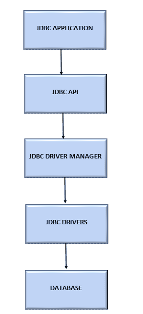

# JDBC 建筑

> 原文：<https://www.tutorialandexample.com/jdbc-architecture>

## JDBC:

JDBC 代表 Java 数据库连接。太阳微系统公司有一个称为 JDBC 的规范。JDBC 是一个 Java API(应用程序编程接口),它使用户能够与不同的数据库进行交互或通信。

JDBC API 使应用程序能够向指定的数据库提交请求。

我们可以使用 JDBC 创建访问数据库所需的软件。通过 JDBC 和数据库驱动程序可以访问数据库和电子表格。JDBC API 有利于访问保存在关系数据库(RDB)中的业务数据。

ODBC(开放式数据库连接)驱动程序可以提供有效的数据库连接，这是数据库交互所必需的。这个 ODBC 驱动程序和 JDBC 可用于与不同类型的数据库进行交互或连接。

### 为什么使用 JDBC:

在 JDBC 之前，用于连接和运行数据库查询的数据库 API 称为 ODBC。

然而，ODBC API 使用基于 C 的不安全的 ODBC 驱动程序，该驱动程序依赖于平台。Java 自己的 API (JDBC API)利用了 JDBC 驱动程序，它就是为此而创建的:

*   JDBC 帮助客户存储和检索数据库中的数据。
*   客户可以通过 JDBC 更新数据库。

用来建立与的连接的元素

使用 JDBC 的数据库

1.  JDBC API
2.  JDBC 司机经理
3.  JDBC-ODBC 桥

### JDBC 建筑:

1.应用程序:与数据源连接的 Java applet 或 Servlet 是 JDBC 中的应用程序。

2.JDBC API: JDBC API 为 Java 应用程序提供了运行 SQL 查询和获取数据库结果所需的类、方法和接口。以下列表包括 JDBC API 中包含的一些重要的类和接口:

驱动程序、连接、语句、结果集、SQL 数据

JDBC API 由两个包组成:

*   java.sql
*   javax.sql

应用程序员使用的 JDBC API 的初始组件分为两个部分。数据库服务器连接的低级 API 是第二个组件(JDBC 驱动程序)。

java.sql 包包含 JDBC API 的初始组件。为了使用 Java 编程语言访问和处理存储在数据源(通常是关系数据库)中的数据，我们使用 java.sql 包 API。JDBC 驱动程序用于第二部分(有四种不同类型的 JDBC 驱动程序)。一组实现 JDBC 接口并面向特定数据库的 Java 类被称为 JDBC 驱动程序。标准 Java 包括 JDBC 接口。然而，这些接口的实现取决于我们想要连接的数据库。JDBC 驱动程序是这种实现的名称。

3.车手经理:车手经理在 JDBC 设计中至关重要，车手经理至关重要。企业应用程序通过驱动程序管理器成功地连接到数据库，驱动程序管理器利用了一些特定于数据库的驱动程序。驱动程序管理器类是 Java.sql 包和 JDBC API 的一部分。用户和驱动程序可以使用驱动程序管理器类相互通信。它设法在数据库和适当的驱动程序之间创建链接，并保持对可用驱动程序的跟踪。可以注册和注销数据库驱动程序类，以及使用其中包含的方法建立 Java 应用程序和数据库之间的连接。T

4.JDBC 驱动程序:JDBC 驱动程序支持基于 JDBC 的与数据源的通信。一个可以与相关数据源智能对话的 JDBC 驱动程序是我们所需要的。

JDBC 驱动程序是 JDBC API 的一种实现，用于连接到某种数据库。有几种 JDBC 驱动程序类型，包括:

*   **类型 1** -包括到另一个数据访问 API 的映射；JDBC-ODBC 驱动程序就是一个例子。
*   类型 2——有时被称为本地 API 驱动程序——是一个利用目标数据库客户端库的实现。
*   第 3 类——有时被称为网络协议驱动——使用中间件将 JDBC 调用转换成特定于数据库的调用。
*   **Type 4**——通过将 JDBC 调用转换为特定于数据库的调用，直接连接到数据库，有时称为瘦驱动程序或数据库协议驱动程序。

5.数据库:使用 Oracle、SQL 等数据库

### JDBC 建筑类型:

JDBC 支持两层和三层数据库访问处理模型。

1.**双层架构**

这种设计支持 Java 程序之间的直接数据库通信。与特定数据库通信需要 JDBC 驱动程序。用户向数据库发送一个查询或请求，数据库用结果进行响应。数据库可以在同一个工作站上找到，也可以在通过网络连接的任何其他远程机器上找到。这种方法被称为客户端-服务器架构或配置。

2.**三层架构**

这里不存在直接的交流。请求被发送到中间层，即 Java 程序请求 HTML 浏览器，该浏览器随后被转发到数据库。随后与用户交互的中间层接收来自数据库的请求并转发响应。性能和应用程序部署都变得更加容易。