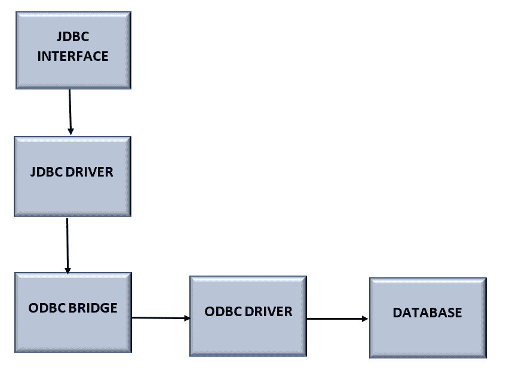
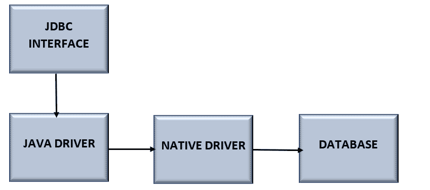
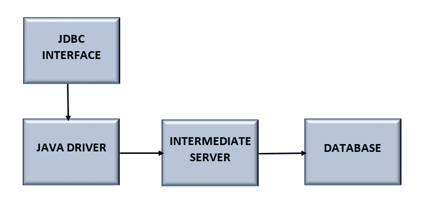
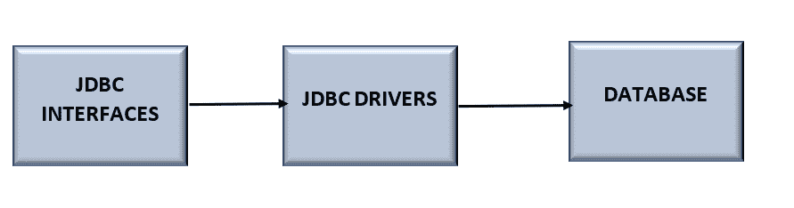

# JDBC 司机的类型

> 原文：<https://www.tutorialandexample.com/types-of-jdbc-drivers>

### JDBC 司机:

一个叫做 JDBC 驱动程序的软件允许 Java 应用程序和服务器之间的数据库通信。

为了与我们的数据库服务器通信，JDBC 驱动程序将 JDBC API 中已建立的接口付诸实践。

例如，JDBC 驱动程序允许我们通过发出 SQL 或数据库指令，然后用 Java 接收响应，来建立数据库连接并与之通信。

JDK 附带的 Java.sql 包提供了许多具有指定行为的类；然而，第三方驱动程序处理这些类的实际实现。java.sql.Driver 接口由第三方供应商在其数据库驱动程序中实现。

一组被称为 JDBC 驱动程序的 Java 类允许我们连接到某个数据库。

例如，MySQL 的 JDBC 驱动程序将是独一无二的。许多 JDBC API 是由 JDBC 驱动程序实现的。当我们的代码使用某个 JDBC 驱动程序时，会用到真正的 JDBC 接口。在 JDBC 接口的背后是实际使用的 JDBC 驱动程序。因此，我们的代码不会知道我们放入的新的 JDBC 驱动程序。

## JDBC 司机的类型:

有 4 种类型的 JDBC 驱动程序:

*   **类型 1:** JDBC-ODBC 桥驱动程序
*   **类型 2:** 原生 API 驱动程序
*   **类型 3:** 网络协议驱动
*   **第四类:**瘦司机

### 1) JDBC-ODBC 桥驱动程序

JDBC-ODBC 桥驱动程序使用 ODBC 驱动程序连接到数据库。JDBC 方法调用通过 JDBC-ODBC 桥驱动程序被转换成 ODBC 函数调用。由于瘦驱动程序，目前不鼓励这种做法。

一个将 JDBC 接口调用转换为 ODBC 调用的 Java 组件构成了类型 1 JDBC 驱动程序。然后通过 ODBC 桥调用数据库的 ODBC 驱动程序。当第 4 类驱动程序还不可用时，第 1 类驱动程序主要是为开始时使用而设计的(都是 Java 驱动程序)。

**优点:**

数据库的 ODBC 驱动程序已经安装在客户的 PC 上，这使得它很容易使用，连接到任何数据库，并访问几乎任何数据库。

**缺点:**

将 JDBC 方法调用转换为 ODBC 函数调用会降低性能。

由于 JDBC 调用在到达本机数据库连接库之前会通过桥传递到 ODBC 驱动程序，因此该驱动程序的性能会降低。通过一个相反的过程，返回结果。

### 2)本地 API，部分是 Java 驱动程序

本地 API 驱动程序使用数据库的客户端库。驱动程序将对 JDBC 方法的调用转换成对数据库的本地 API 调用。它不完全是用 Java 编写的。

类型 2 JDBC 驱动程序类似于类型 1 驱动程序，除了 ODBC 组件已经被本机代码组件替换。一个特定的数据库产品是本机代码部分的焦点。

**优点:**

性能比 JDBC-ODBC 桥驱动程序有所提高。

**劣势:**

每台客户机都必须安装本机驱动程序。

客户端系统必须安装供应商客户端库。因此，类型 2 驱动程序不能用于互联网。类型 2 的驱动器表现出比类型 3 和 4 的驱动器差的性能。

 **### 3)网络协议-纯 Java 驱动程序

特定于供应商的数据库协议由网络协议驱动程序的中间件(应用服务器)直接或间接地从 JDBC 调用转换而来。它完全是用 Java 写的。

将 JDBC 接口调用传递到中央服务器的全 Java 驱动程序被称为类型 3 JDBC 驱动程序。然后，JDBC 驱动程序通过中间服务器建立到数据库的连接。

**优点:**

这是因为应用服务器能够处理多种功能，如审计、负载平衡、日志记录等。，不需要客户端库。

**缺点:**

客户端机器必须有网络支持。

类型 3 驱动程序需要中间层特定于数据库的代码(在 net server 中)。维护中间层服务器的成本上升。

由于中间层需要特定于数据库的编码，网络协议驱动程序的维护变得非常昂贵。

### 4)瘦驱动程序(或)本机协议-纯 Java 驱动程序

瘦驱动程序将 JDBC 调用直接转换为供应商特定的数据库协议。为此它被称为“瘦驱动程序”。它完全是用 Java 编写的。

直接连接到数据库的全 Java 驱动程序被称为第 4 类 JDBC 驱动程序。它用于某个数据库产品。今天，大多数 JDBC 驱动程序都是 4 类驱动程序。

**优点:**

与所有其他驱动程序相比，性能更好。无需在客户端(或)服务器上安装专门的软件。

客户端和服务器端都不需要任何软件。

**劣势:**

驱动程序依赖于数据库。

根据用户的说法，类型 4 驱动程序要求每个数据库有不同的驱动程序。例如，我们要求 Oracle 驱动程序与 Oracle 服务器交互，Sybase 驱动程序与 Sybase 服务器交互。**