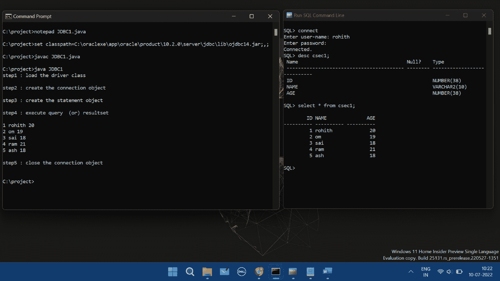

# JDBC 的设计

> 原文：<https://www.tutorialandexample.com/design-of-jdbc>

Java 应用程序可以使用来自许多供应商的数据库系统，使用来自 Sun Microsystem 的 Java 数据库连接(JDBC)应用软件接口(API)。为了连接电子表格，JDBC 和数据库驱动程序进行协作。用于连接数据库的 JDBC 设计指定了 JDBC 元素。

## JDBC 模块

JDBC 的四个主要部分被用来连接两个数据库。

JDBC API(应用编程接口)

JDBC 测试套件

JDBC 司机经理

JDB- ODBC 桥驱动程序

1.JDBC API: JDBC API 提供了多种接口和技术来快速连接到不同的数据库。

```
javax.sql.*;  
java.sql.*; 
```

2) **JDBC 测试套件:**JDBC 测试套件使程序员能够测试 JDBC 驱动程序的不同动作，包括删除、更新和插入。

3) **JDBC 驱动程序管理:**为了链接到数据库，JDBC 驱动程序管理器将数据集的特定驱动程序加载到应用程序中。此外，使用 JDBC 驱动程序管理器对数据库进行数据系统调用，以执行请求。

4) **JDBC-ODBC 桥驱动程序:**为了将数据库驱动程序链接到数据库，使用了 JDBC-ODBC 桥驱动程序。ODBC 函数调用是通过桥从 JDBC 方法调用转换而来的。为了操作 ODBC(开放数据库连接)功能，它使用 sun 中包含的本机库。jdbc.odbc 模块。

## JDBC 结构

1) **应用:**与两个数据源交互的 Apache servlet 或 applet 就是实现。

2)**JDBC API:**该工具使 Java 程序能够执行 SQL 操作并得到结果。

下面是 JDBC API 中指定的一些基本接口和类:

*   司机
*   驾驶员管理器
*   声明
*   关系
*   请求即付的
*   声明
*   准备报表
*   结果
*   一组
*   SQL 数据

3.**driver manager:**driver manager 是 JDBC 设计的一个关键组件。

企业应用程序通过特定于每个数据库的驱动程序链接到众多数据库。

4) **JDBC 驱动程序:**要使用 JDBC 与数据源进行交互，需要一个 JDBC 驱动程序，以一种可行的方式与目标数据源进行交互。

## 各种 JDBC 配置类型包括:

JDBC 设计使用两层和三层范例来访问指定的数据库。

两层模式:在这种架构中，程序直接与两个数据源通信。JDBC 驱动程序在数据源和程序之间建立连接。每当用户向数据源发送查询时，用户都会立即收到查询的答复。客户范例将用户设备链接到数据源，数据源可能在单独的系统上。客户端计算机发送问题，服务器发送这些问题的结果，起到服务器的作用。

**三层架构:**在这种架构中，用户查询被路由到中间层系统，用户从中间层系统获得指令，然后这些指令被转发到数据源。中间层接收对此类请求的响应，并将这些响应发送回用户。

### JDBC 的运作

任何想要与数据库通信的软件应用程序都必须使用 JDBC API。在与数据源进行通信之前，必须安装 Oracle 或 MySql 等数据源的 JDBC 驱动程序。

```
import java.lang.*;
import java.sql.*; 
import java.io.*; import java.util.*; class JDBC1
{ 
public static void main(String args[]) { 
try { 
System.out.println("step1 : load the driver class \n"); Class.forName("oracle.jdbc.driver.OracleDriver"); 
System.out.println("step2 : create the connection object \n"); 

Connection con=DriverManager.getConnection(“jdbc:oracle:thin:@localhost:1521:xe",
"rohith","1113"); 
System.out.println("step3 : create the statement object \n"); 
Statement stmt=con.createStatement(); 
System.out.println("step4 : execute query (or) resultset \n"); ResultSet rs=stmt.executeQuery("select * from csec1"); 
while(rs.next()) { 
System.out.println(rs.getInt(1)+" "+rs.getString(2)+" "+rs.getInt(3)); }
System.out.println("\nstep5 : close the connection object \n"); con.close(); 
79 
}//try 
catch(Exception e)
{ System.out.println(e); }//catch 
}//main 
}//JDBC1 
```

**输出**

 ****