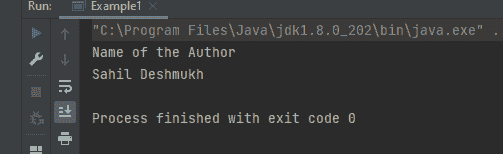

# Java 中的静态与非静态

> 原文：<https://www.tutorialandexample.com/static-vs-non-static-in-java>

静态方法可以访问和更新静态数据成员的值。static 关键字在 Java 中主要用于内存管理。static 关键字可用于变量、方法、块和嵌套类。static 关键字指的是一个类，而不是该类的特定实例。静态方法属于一个类，但不属于该类的实例，因此可以在没有该类的实例或对象的情况下调用。静态方法总是以静态关键字开始。

下面的代码是一个静态方法的示例。

**StaticExample.java**

```
public class StaticExample {
   //Static variable
   static String name = "Sahil is the Writer of this Article";  
    static void display()                              //Static  method
    {
        System.out.println("Hello Everyone");
    }
    public static void main(String[] args) {
        display();     
//calling the method without creating its object
    System.out.println(name);            
 // calling the static variable
    }
} 
```

**输出:**


如果 Java 中的每个方法前面没有 static 关键字，则默认为非静态方法。非静态方法可以访问每个静态方法和静态变量，而无需创建对象的实例。动态或运行时绑定与非静态方法一起使用。与静态方法不同，我们可以覆盖非静态方法。下面是一个非静态方法的示例。

```
public class Example {
    public void display()                     // non static method
    {
        System.out.println("This method is a non-static method with public as its access speciifer");
    }

    private  void  display2()           // non static method
    {
        System.out.println("I hope you can now differentiate between Static and Non-Static Method");

    }

    String name = "Sahil Deshmukh";                     // non static variable
    static String Autor = "Name of the Author";        // static method
    static void display1()                            // static method
    {
        System.out.println("Have a good day");
    }

    public static void main(String[] args) {

        Example e = new Example();

        System.out.println(Autor);                 // printing a static variable
        System.out.println(e.name);               //  printing a non-static variable
        System.out.println();
        e.display();
        e.display2();

        display1();

    }

} 
```

**输出:**


正如您所观察到的，没有创建实例来调用静态方法，而要首先调用非静态方法，我们需要创建一个类实例，然后调用特定的方法。

下表总结了上述方法之间的差异


| **静态方法** | **非静态方法** |
| 静态方法属于一个类，但不属于该类的实例，因此可以在不需要该类的实例或对象的情况下调用。 | 如果 Java 中的每个方法前面没有 static 关键字，则默认为非静态方法。非静态方法可以在不使用类对象的情况下访问每个静态方法和静态变量。 |
| 静态方法只能访问其他类或同一类的静态数据成员和方法；非静态方法或变量不可访问。 | 非静态方法既可以访问静态数据成员和静态方法，也可以访问来自同一个或另一个类的非静态成员和方法。 |
| 静态技术中使用编译时或早期绑定。 | 非静态技术中使用运行时或动态绑定。 |
| 由于早期绑定，静态方法是不可重写的。 | 由于运行时绑定，非静态方法可以被改变。 |
| 静态方法使用较少的内存来执行，因为 static 关键字在 ram 中为该操作提供了一个特定的内存地址，所以内存分配只发生一次。 | 非静态方法在执行过程中会消耗大量内存，因为内存是在调用该方法时分配的，并且每次调用该方法时都会分配内存。 |


在前一篇文章中描述了静态和非静态方法，因为它讨论了这些方法及其实现。现在让我们仔细看看静态和非静态变量。

变量是在程序(如 Java 应用程序)运行时保留值的容器。变量被分配了一个数据类型。术语“变量”指的是内存区域的名称。在 Java 中，有三种类型的变量:

*   静态变量
*   局部变量
*   实例变量

非静态变量是局部变量和实例变量的组合。因此，可以将 Java 变量分为两类:

### **静态变量**

当一个变量被声明为静态变量时，它会被复制一份，并在类中的所有对象之间共享。另一方面，静态变量实际上是全局变量。它是特定于类的变量，而不是特定于对象的变量。该类的所有实例共享静态变量。静态变量可以简单地通过类名来访问，不需要使用对象。它提高了软件的内存效率(即，它节省内存)。

```
// Example of static variable
public class Example1 {
    static String name ="Sahil";          //Static Variable
    public static void main(String[] args) {
        System.out.println(name);
    }
} 
```

**输出:**


**局部变量**

*   局部变量是在块、方法或函数中声明的变量。
*   这些变量是在进入块或调用函数时生成的，当块或函数调用返回时，这些变量将被删除。
*   这些变量的作用域仅限于定义它们的块，也就是说，这些变量只能在该块中访问。
*   需要初始化局部变量。

```
public class Example1 {
   void author()
   {
       String  name  ="Sahil Deshmukh";   // local variable
       System.out.println(name);
   }
    public static void main(String[] args) {

        Example1 e = new Example1();
        System.out.println("Name of the Author");
       e.author();
    }
} 
```

**输出:**



**实例变量**

*   这些是在类的任何方法、构造函数或块之外定义的非静态变量。
*   当类声明实例变量时，这些变量在类的对象形成时产生，在对象销毁时删除。例如，与局部变量不同，变量可以利用访问说明符。如果没有提供访问说明符，将使用默认的访问说明符。没有必要初始化实例变量。默认情况下，它的值为 0。只有通过构造对象，才能访问实例变量。
*   与局部变量相反，我们可以在实例变量上使用访问说明符。如果没有提供替代访问说明符，将使用默认访问说明符。
*   实例变量不需要初始化。默认情况下，该值设置为 0。
*   实例变量只能通过创建对象来访问。

```
// Example of Instance variable
public class Example1 {
    String  name  ="Sahil Deshmukh";          //instance variable
    public static void main(String[] args) {
        Example1 e = new Example1();
        System.out.println("Name of the Author");
        System.out.println(e.name);
    }
} 
```

**输出**:


### 局部变量、实例变量和静态变量

下表总结了这三个变量之间的差异


| **局部变量** | **实例变量** | **静态变量** |
| 在过程或代码块中，定义了一个变量。 | 在类级别，在方法之外定义。 | 在类级别，在方法之外定义。 |
| 只能在声明它的方法/代码块中访问它。 | 在课堂上随时可用。 | 在课堂上随时可用 |
| 只要该过程在运行，它就留在内存中。 | 只要事情被记住，它就会留在记忆中。 | 只要应用程序在运行，它就一直留在内存中。 |
| 不需要唯一的关键字。 | 不需要特定的关键字；但是，可以提供任何访问说明符(private、protected 或 public)。通常使用术语私有和受保护。 | 有必要使用 static 关键字。您还可以指定任何访问说明符(private、protected 或 public)。“公共”一词经常被使用。 |
| 在使用它之前，必须对它进行初始化。 | 因为它有一个取决于其数据类型的默认值，所以在使用前不需要初始化。 | 因为它有一个取决于其数据类型的默认值，所以在使用前不需要初始化。 |

