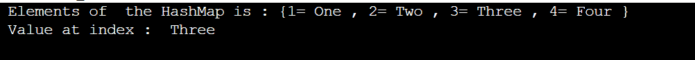

# 哈希表 Vs 哈希表

> 原文：<https://www.tutorialandexample.com/hashmap-vs-hashtable>

## 散列表

HashMap 是 Java 中 Map 接口的基本实现。HashMap 将数据存储在键和值对中。键用于访问元素的值。

声明为< k ,v >。

HashMap 类似于 HashTable，但是 HashMap 是不同步的。它遵循散列技术来存储键和值对。要使用 HashMap，我们必须导入 java。Util 包。

**语法**

```
HashMap <k ,v> hashmapname = new HashMap < >( );
```

这里 k 和 v 代表键和值对的数据类型。

### HashMap 程序的例子

HashMap.java

```
// importing the required packages
// util package is required to implement hashmap 
import java. util. HashMap ;
import java . io . * ;
class HashMap {
  public static void main( String[] args) {
    // create a hashmap
    HashMap < String , Integer> h1  = new HashMap < > ();
    // adding  elements to hashmap
    h1 . put ( " Hi " ,  2);
    h1 . put ( " Hello " ,  3);
    h1 . put ( " Everyone " ,  8);
    System . out. println ( " HashMap is : " + h1);
  } // Main
}//  HashMap 
```

**输出**


## HashMap 上的操作

*   添加元素
*   移除元素
*   访问元素
*   改变元素

### 向 HashMap 添加元素

为了向 HashMap 添加元素，我们使用 put()方法。

AddElements.java

```
 import java. util. HashMap;
import java . io . * ;
class AddElements {
  public static void main( String[] args) {
    // Object creation for hashmap with name h
    HashMap < String, Integer> h  = new HashMap < > ();
    // add elements to hashmap
    h . put (" One " , 1);
    h . put (" Two " , 2);
    h . put (" Three " , 3);
    System . out. println("HashMap is : " + h);
  } // Main
} // AddElements 
```

### 移除 HashMap 中的元素

为了移除 HashMap 中的元素，我们使用 remove()方法。

RemoveElements.java

```
import java. util. HashMap;
import java . io . * ;
class RemoveElements {
  public static void main( String[] args) {
    // create a hashmap
    HashMap < String, Integer> h2  = new HashMap < > ();
    // add elements to hashmap
    h2 . put ( " One " , 1);
    h2 . put ( " Two " , 2);
    h2 . put ( " Three " , 3);
    h2 . put ( " Four " , 4);
    System . out. println ( " Before removing elements the HashMap is : " + h2 );
    // removing the element with the key "Two."
    h2 . remove ( "  Two " ) ;
    System . out. println ( " After removing element the HashMap is : "  + h2 ) ;
  } // main
}  // RemoveElements 
```

**输出**


### 访问 HashMap 中的元素

为了访问 HashMap 中的元素，我们使用 get 方法

AccessElement.java

```
import java. util. HashMap;
import java . io . * ;
class AccessElement {
  public static void main( String[] args) {
    // create a hashmap
    HashMap < Integer,String>  h3 = new HashMap <> ();
    // add elements to hashmap
    h3 . put(1," One ");
    h3 . put(2," Two ");
    h3 . put(3," Three ");
    h3 . put(4," Four ");
    // Printing the HashMap elements
    System . out. println (" Elements of  the HashMap is : " + h3);
    // Accessing the elements of the HashMap
     String value = h3 . get (3);
     // Printing the value of element at index 3
    System . out . println (" Value at index : " + value);
  } // main
} 
```

**输出**



### 改变 HashMap 中的元素

HashMap 是可变的。我们可以通过使用 replace()方法来改变 HashMap 的数据。

**AlterElements.java**

```
import java. util. HashMap;
import java . io . * ;
class Alterelements {
  public static void main( String[] args) {
    // create a hashmap
    HashMap < Integer,String> h4  = new HashMap <> ();
    // add elements to hashmap
    h4 . put(1," One ");
    h4 . put(2," Two ");
    h4 . put(3," Three ");
    h4 . put(4," Four ");
    // Printing the HashMap elements
    System . out. println (" Elements of  the HashMap before changing the data is: " + h4);
    // Changing the value of element at index 4 from four to changed
    h4\. replace (4," changed ");
    // Printing the Elements of HashMap after altering it
    System . out. println (" Elements of  the HashMap after changing the data is : " + h4); 
  } // Main
} //AlterElements 
```

**输出**


## 散列表

HashTable 是 Java 中 map 接口的基本实现。HashTable 以键和值对的形式存储数据。键用于访问元素的值。

声明为< k ,v >。这是一个同步的数据结构。

**语法**

```
HashTable <k ,v> hashtablename = new HashTable < >( );
```

### 哈希表程序示例

HashTableExample.java

```
import java.util.*;  
class HashTableExample{ 
 public static void main(String args[]){  
     // Hashtable declaration
  Hashtable <  String, Integer  > h1 = new Hashtable <  String ,Integer>();  
  // Adding data to Hashtable
  h1 . put ( "Om" , 201  ) ;  
  h1 . put (  "Sai" , 202  ) ;  
  h1 . put ( "Ram", 203  ) ;  
  // Accessing the data of Hashtable
  for( Map . Entry r : h1 . entrySet ( ) ){  
   System . out . println ( r . getKey ( ) + "   " + r . getValue ( ) ) ;  
  }  // for
 }  // main
}  // HashTableExample
```

**输出**


## HashMap 上的操作

*   添加元素
*   移除元素
*   访问元素

### 在 Java 中向哈希表添加元素

为了向 HashTable 添加元素，我们使用 put()方法。

**AddElements.java**

```
import java .io .*;
import java . util . *;  
class AddElements { 
 public static void main ( String args [ ] ) {  
     // Hashtable declaration
  Hashtable <  String, Integer  > h1 = new Hashtable <  String ,Integer>();  
  // Adding data to Hashtable
  h1 . put ( "Om" , 201  ) ;  
  h1 . put (  "Sai" , 202  ) ;  
  h1 . put ( "Ram", 203  ) ;  
  // Printing the data of Hashtable

   System . out . println (h1) ;  

 }  // main
}  // AddElements 
```

**输出**


### 在 Java 中将元素移至哈希表

为了向 HashTable 添加元素，我们使用 remove()方法。

RemoveElements.java

```
import java .io .*;
import java . util . *;  
class RemoveElements { 
 public static void main ( String args [ ] ) {  
     // Hashtable declaration
  Hashtable <  String, Integer  > h1 = new Hashtable <  String ,Integer>();  
  // Adding data to Hashtable
  h1 . put ( "Om" , 201  ) ;  
  h1 . put (  "Sai" , 202  ) ;  
  h1 . put ( "Ram", 203  ) ; 
  // Before removing the element from Hashtable
   System . out . println ("Hashtable  before removing is"+h1) ; 
  // Printing the data of Hashtable
   h1 .remove("Om");
   System . out . println ("After removing element from Hashtable"+h1) ;  
 }  // main
}  // RemoveElements 
```

**输出**


### Java 中哈希表的访问元素

AccessElements.java

```
import java.util.*;  
class AccessElements{ 
 public static void main(String args[]){  
     // Hashtable declaration
  Hashtable <  String, Integer  > h1 = new Hashtable <  String ,Integer>();  
  // Adding data to Hashtable
  h1 . put ( "Om" , 201  ) ;  
  h1 . put (  "Sai" , 202  ) ;  
  h1 . put ( "Ram", 203  ) ;  
  // Accessing the data of Hashtable
  for( Map . Entry r : h1 . entrySet ( ) ){  
   System . out . println ( r . getKey ( ) + "   " + r . getValue ( ) ) ;  
  }  // for
 }  // main
}  // AccessElemets
```

**输出**


## HashMap 和 HashTable 的区别


| **HashMap** | **哈希表** |
| --- | --- |
| HashMap 没有同步。如果没有合适的同步代码，它就不能被多个线程共享，也不是线程安全的。 | 哈希表是同步的。它由多个线程共享，并且是线程安全的。 |
| 因为多线程可以同时运行，所以 HashMap 对象不是线程安全的。 | 哈希表的对象一次只能由一个线程操作。因此，它是线程安全的。 |
| HashMap 支持单个空键和多个空值。 | 哈希表中不允许有无效的键和值。 |
| 线程等待时间的减少带来了高性能。 | 低性能源于线程等待时间的增加。 |
| 通过调用这个函数，我们可以使散列表同步。map m = collections . synchronized map(hashMap)； | 哈希表的内部同步防止了不同步的发生。 |
| 迭代器遍历 HashMap。 | 枚举器和迭代器遍历哈希表。 |
| HashMap 派生自 AbstractMap 类。 | Dictionary 类由 HashTable 继承。 |
| HashMap 迭代器是可靠的。 | 哈希表中的迭代器不是防错的。 |
| 它没有遗产。 | 遗产就在那里。 |

