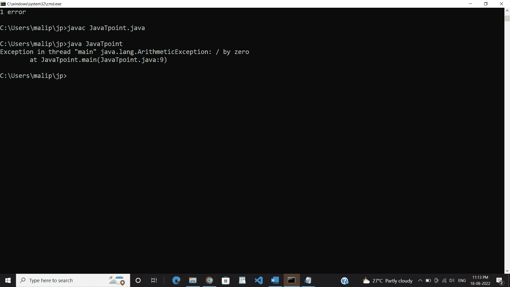

# Java 中的检查异常与未检查异常

> 原文：<https://www.tutorialandexample.com/checked-vs-unchecked-exceptions-in-java>

在本教程中，我们将讨论 Java 的检查异常和未检查异常。

## 例外

异常是一个不希望的事件，它会扰乱程序的正常运行。运行时会引发异常。

它预示着一些不寻常的事件。通常，这可能是一个错误。在 Java 中，通过使用以下关键字来处理异常

*   尝试
*   捕捉
*   扔
*   投
*   最后
*   这种特殊情况解决了一个编程错误，通常，我们不应该抛出和捕捉运行时豁免。NullPointerException 是 Java 中一个非常显著的运行时特例。到目前为止，我们有可能是运行时异常或编译时的错误和异常，然后在 JDK 中处理三种类型的错误和异常。在错误和异常下，有大量的子类。例如，IOException 解决了一个 I/O 错误和子类。FileNotFoundException 是一个更具体的例子，表明记录不能位于圆上。这就是 Java 豁免 API 的协调方式。

java 编程语言中包含两种类型的异常:

1.  检查异常
2.  未检查的异常

## 检查异常

检查异常在程序编译时被检查。在程序中，如果代码的某个部分抛出错误或异常，它必须使用 throws 关键字将其抛出到控制台，或者处理异常处理关键字。

检查的异常进一步分为两种类型:

*   **全面检查的异常:**

完全检查的异常由子类检查，如 IOException 和 InterruptedException。

*   **部分检查的异常:**

部分检查的异常是指少数子类像异常一样未被检查的异常。

这些异常被归类为检查异常，并按包分组。

以下是 Java.lang 包中涉及或定义的一些异常:

*   输入输出异常
*   ClassnotFound Exception(类 notFound 异常)
*   套接字异常
*   sqlexception
*   clonenotsupportedexception
*   中断异常

类似地，我们将在 java 的 java.net 中得到更多检查过的异常。SQL 等。包裹。

这是一个检查异常的示例程序。最初，我们将检查我们是否得到一个异常，然后尝试处理那个异常。

例如，考虑这样一个 Java 程序，它从本地存储打开文件，路径为**" C:\ \ Users \ \ malip \ \ jp \ \ test . txt "**，并打印文件的前两行。下面的程序没有编译，因为 main 方法使用了 FIleReader 并抛出了一个 FileNotFoundException，这是一个已检查的异常。但是同样，因为 readLine 和 close 方法，它又抛出了 IOException 的两个异常。

**代码:**

```
import java.io.*;
class Tutorialandexample {
// Main method
public static void main(String s[]) 
{
// Reading file from the local directory
FileReader f = new FileReader("C:\\Users\\malip\\jp\\test.txt");
BufferedReader br = new BufferedReader(f);
// Printing the first two lines of the file 
for (int counter = 0; counter < 2; counter++)
System.out.println(br.readLine());
// Closing file 
br.close();
}
} 
```

**输入:**

```
test.txt
Welcome to Tutorialandexample.
Today, we will discuss checked exceptions. 
```

**输出:**


要解决上面的程序，我们要么需要指定 throws 块，要么必须通过 try 和 catch 块来处理它。在下面的程序中，我们使用了抛出来处理异常。通常，获得的异常是 FileNotFoundException。尽管如此，由于它是 IOException 的子类，我们可以在 throws 列表中声明 IOException，以使上面的程序不会出现编译错误。

**程序:**

```
// Java program to Handle  FileNotFoundException 
import java.io.*;
class Tutorialandexample {
// Main method
public static void main(String s[]) throws IOException 
{
// Reading file from the local directory
FileReader f = new FileReader("C:\\Users\\malip\\jp\\test.txt");
BufferedReader br = new BufferedReader(f);
// Printing the first two lines of the file 
for (int counter = 0; counter < 2; counter++)
System.out.println(br.readLine());
// Closing file 
br.close();
}
} 
```

**输入:**

```
test.txt
Welcome to Tutorialandexample.
Today, we will discuss checked exceptions.
```

**输出:**


## 未检查的异常

未检查的异常是编译时未被检查的异常。在编译语言中，所有获得的异常都是未经检查的，因此编译器处理或指定异常并不是强制性的。它基于程序员开发、确定或捕捉异常。

这些异常基于包进行分类。下面提到的是 Java 中标准的未检查异常。

*   算术异常
*   NumberFormatException
*   IndexOutOfBoundsException
    *   ArrayIndexOutOfBoundsException
    *   StringIndexOutOfBoundsException
*   NegativeArraySizeException
*   NullPointerException
*   安全异常

类似地，我们将在 java.sql、java.sql 等中得到更多未经检查的异常。包裹。

**程序:**

```
// Java Program for Un-checked Exceptions
           class Tutorialandexample
             {
            // Main method
               public static void main(String s[])
           {
                 int x = 0;
               int y = 10;
              int z = y / x;
               System.out.println(z);
}
}
```

**输出:**



在上面的输出中，我们可以看到程序成功编译，但是在运行时，我们得到了一个 ArithmeticException，这是未检查的异常类型之一。