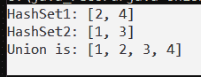
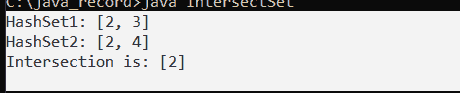
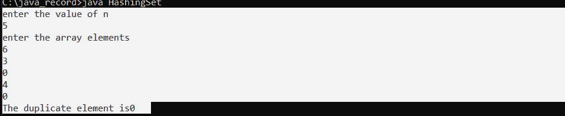
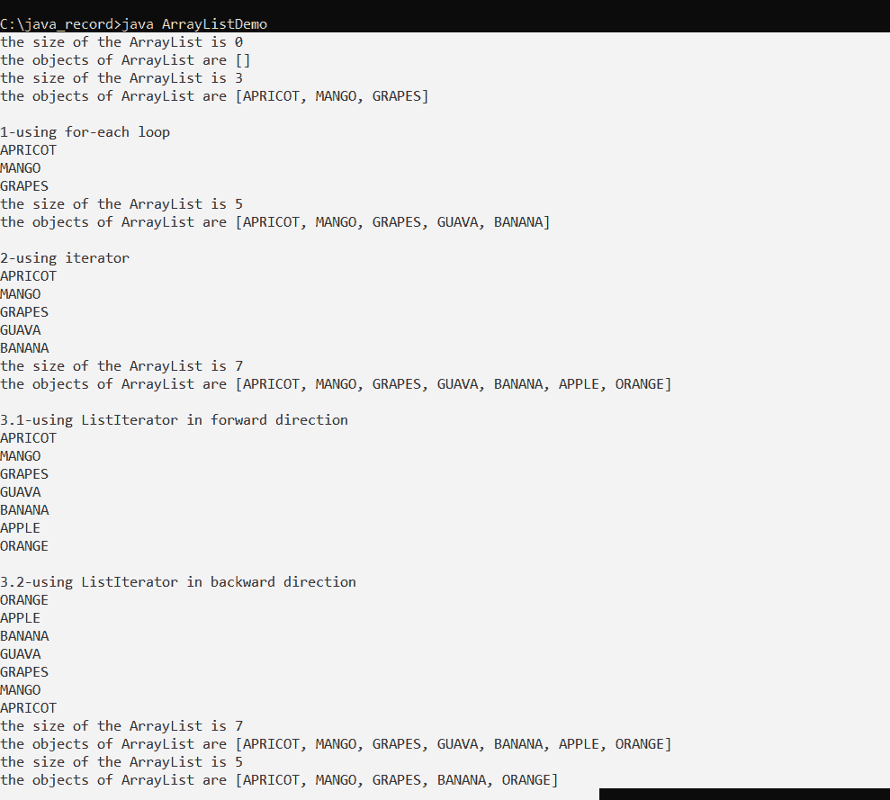

# Java 中集合和列表的区别

> 原文：<https://www.tutorialandexample.com/differences-between-set-and-list-in-java>

## 在 Java 中设置:

爪哇咖啡。util 包包含一个名为 set 的接口。set 接口扩展了集合接口。集合接口是一个无序列表集合，其中禁止重复。数学集合是使用集合接口生成的。set 接口使用 collection 接口的方法来防止插入重复的元素。有两个接口可以改进 set 实现:SortedSet 和 NavigableSet。

**语法:**

```
Set<DataType/Wrapper class> variableName = new Set< > ();
```

**设定方法:**

集合接口中的所有方法都包含在集合接口中。这是因为集合接口是集合的超接口。


| 方法 | 描述 |
| 添加() | 使用 add()方法将所需元素添加到集合中。 |
| 阿德拉() | 使用 addAll()方法将所提供集合的每个组件添加到集合中。 |
| 迭代器() | 提供可用于连续访问集合元素的返回值。 |
| 移除() | 使用 remove()从集合中移除请求的元素。 |
| removeAll() | 从集合中删除同时出现在所提供的另一个集合中的每个元素。 |
| 零售() | 保留同时出现在另一个给定集合中的所有集合元素。 |
| 清除() | 从集合中删除每个元素。 |
| 大小() | 得出集合的长度(条目数)。 |
| 托阵列() | 为集合中的每个元素提供一个数组。 |
| 包含() | 如果集合包含指定的元素，则函数 contains()返回 true。 |


### 设置操作:

考虑两个集合(比如集合 c 和集合 d)，

我们可以使用 Java Set 接口执行基本的集合操作，比如并集、交集和子集。

使用 c.addAll (d)，我们可以找到两个集合 c 和 d 的并集，使用 x，我们可以找到两个集合 c 和 d 的交集。

使用 d.containsAll (c)，我们可以确定 c 是否是 d. (c)的子集。

**集合的并集:**

**UnionSet.java**

```
import java.util.*;
import java.io.*;

class UnionSet {
    public static void main (String [] args) {
        HashSet <Integer> eNums = new HashSet<> ();
        eNums.add (2);
        eNums.add (4);
        System.out.println ("HashSet1: " + eNums);

        HashSet <Integer> nums = new HashSet<>();
        nums.add (1);
        nums.add (3);
        System.out.println ("HashSet2: " + nums);

        //Union of the given sets
        nums.addAll (eNums);
        System.out.println ("Union is: " + nums);
    }
}
```

**输出:**

**  

**集合的交集:**

```
import java.io.*;
import java.util.*;
import java.util.HashSet;

class IntersectSet {
    public static void main (String[] args) {
        HashSet <Integer> pNums = new HashSet<>();
        pNums.add (2);
        pNums.add (3);
        System.out.println ("HashSet1: " + pNums);

        HashSet <Integer> eNums = new HashSet<> ();
        eNums.add (2);
        eNums.add (4);
        System.out.println ("HashSet2: " + eNums);

        //Intersection of two sets
        eNums.retainAll (pNums);
        System.out.println ("Intersection is: " + eNums);
    }
} 
```

  

**Java 中的 HashSet:**

带有哈希表存储的集合是使用 Java HashSet 类创建的。它实现 Set 接口并从 AbstractSet 类派生。

以下是 Java HashSet 类的主要特性:

*   HashSet 使用散列技术来存储组件。
*   HashSet 只有不同的组件。
*   HashSet 接受空值。
*   HashSet 类缺乏同步。

HashSet 不维护插入顺序。元素的 hashcodes 用于将它们插入这个位置。

搜索操作的最佳方法是 HashSet。

HashSet 的负载系数是 0.75，其初始默认容量是 16。

**散列程序:T1**

**HashingSet.java**

```
import java.io.*;
import java.util.*;
import java.lang.*;

class Solution {
    public int findDuplicate (int [] nums) {
       HashSet <Integer> p = new HashSet<> ();
       // creation of Hashset 
        int rep = 0;
        // entering numbers into the hash set if a number is with its first frequency 
        for (int i = 0; i < nums.length; i++)
        { 
            if (p.contains (nums [i]))
            {
                rep = nums [i];
                break;
               // if a number is already found in the hash set
               // then it breaks from the loop and returns the duplicate element 
            }
            p.add (nums [i]);
        }
        return rep;
    }
}

class HashingSet
{
	public static void main ( String args [])
	{
		Scanner scan = new Scanner (System.in);
		System.out.println ("enter the value of n");
		int n = scan.nextInt ();
		System.out.println ("enter the array elements");
		int [] arr = new int [n];
		for (int I = 0; i < n; i++)
		{
			arr [i] = scan.nextInt ();
		}
		Solution obj =new Solution ();
            System.out.println ("The duplicate element is " +obj.findDuplicate  (arr));
	}
} 
```

**输出:**



### Java 列表:

Java 的列表特性使得保持一个有组织的集合成为可能。它包括添加、更新、删除和搜索组件的基于索引的技术。重复元素也是可能的。列表也可以包含空元素。

集合接口由列表接口继承，列表接口可以在 Java 中找到。util 包。它是接口的 ListIterator 工厂。我们可以使用 ListIterator 向前和向后迭代列表。ArrayList、LinkedList、Stack 和 Vector 类是 List 接口的实现类。在 Java 编程中，经常使用 ArrayList 和 LinkedList。从 Java 5 开始，Vector 类就被弃用了。

**语法:**

```
List<Object> list = new ArrayList<Object> ();
```

列表是一个界面。因此，不能创建 list 类型的对象。为了构建一个对象，我们总是需要一个实现这个列表的类。此外，因为泛型是在 Java 1.5 中添加的，所以现在可以限制可以放在列表中的对象的种类。列表是由 ArrayList 类实现的用户定义的“接口”，它是在 Java.util 包中预定义的，就像许多其他用户定义的“接口”是由用户定义的“类”实现的一样。

**Java 中的数组列表程序:**

**ArrayListDemo.java**

```
import java.io.*;
import java.util.*;
class ArrayListDemo
	{
	public static void main(String args[])
	{
		ArrayList<String> a=new ArrayList<String>();
		System.out.println("the size of the ArrayList is " +a.size());
		System.out.println("the objects of ArrayList are " +a);
		a.add("APRICOT");
		a.add("MANGO");
		a.add("GRAPES");
		System.out.println("the size of the ArrayList is " +a.size());
		System.out.println("the objects of ArrayList are " +a);
		System.out.println("\n1-using for-each loop");
		for(String i:a)
		{
			System.out.println(i);
		}//i
		a.add("GUAVA");
		a.add("BANANA");
		System.out.println("the size of the ArrayList is " +a.size());
		System.out.println("the objects of ArrayList are " +a);
		System.out.println("\n2-using iterator");
		Iterator it=a.iterator();
		while(it.hasNext())
		{
			System.out.println(it.next());
		}
		a.add("APPLE");
		a.add("ORANGE");
		System.out.println("the size of the ArrayList is " +a.size());
		System.out.println("the objects of ArrayList are " +a);
		System.out.println("\n3.1-using ListIterator in forward direction");
		ListIterator lit=a.listIterator();
		while(lit.hasNext())
		{
			System.out.println(lit.next());
		}//while

		System.out.println("\n3.2-using ListIterator in backward direction");
		while(lit.hasPrevious())
		{
			System.out.println(lit.previous());
		}//while
		System.out.println("the size of the ArrayList is " +a.size());	
		System.out.println("the objects of ArrayList are " +a);
		a.remove(3);
		a.remove("APPLE");
		System.out.println("the size of the ArrayList is " +a.size());
		System.out.println("the objects of ArrayList are " +a);
	}//main
}//ArrayListDemo 
```

**输出:**



### 集合和列表之间的差异:

列表和集合都是 Java 中集合框架的一部分。集合和列表接口用于将对象集合存储为单个实体。除了这些相似之处，这两种界面还有以下不同之处:


| S.no | 设置 | 目录 |
| 1. | 这里，我们不能使用 set 实现添加相同或重复的元素。 | 这里，我们可以使用 list 实现添加相同或重复的元素。 |
| 2. | 插入元素的顺序不是由 set 接口维护的。 | 列表接口维护元素的插入顺序。 |
| 3. | 不允许插入空值，set 接口至少允许一个空值。 | 列表中允许插入空值。 |
| 4. | 集合实现类包括 HashSet、TreeSet 和 LinkedHashSet。 | 列表实现类包括 LinkedList 和 ArrayList。 |
| 5. | 集合接口不提供 get 方法，我们无法根据索引()从集合中定位元素。 | get()方法允许我们从特定索引的列表中检索元素。 |
| 6. | 当我们想要创建一个独特元素的集合时，我们使用它。 | 当我们经常需要使用索引来访问元素时，就会用到它。 |
| 7. | 当我们需要迭代集合元素时，我们使用迭代器。 | 使用 List 接口的 listiterator()方法迭代列表的元素。 |

**