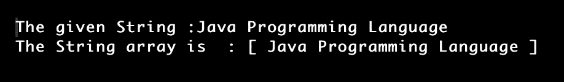
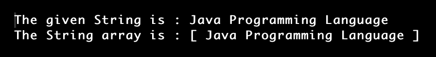

# 如何在 Java 中将字符串转换成字符串数组

> 原文：<https://www.tutorialandexample.com/how-to-convert-string-to-string-array-in-java>

Java 中的字符串是表示字母集合的东西。如果我们想使用字符串，我们必须包含 java.lang 包中的 String 类。包含具有这种设定长度的字符串的数组确实是字符串数组。将字符串转换为字符串数组有 5 种方法。

**举例:**

 **Input: String=“Om Ram”

输出:String[]=[Om，Ram]

以下是其中的一些:

1.  使用 String.split()函数
2.  创建循环
3.  使用 Set.toArray()方法
4.  应用字符串标记器
5.  使用 Pattern.split()方法

## 方法 1:使用 String.split()函数

### 方法:

1.  创建字符串类型的数组。
2.  用于拆分数组的字符串数组。
3.  String name.split()可用于分割所提供的字符串。
4.  应该打印分割后的字符串数组。

**StringArr.java**

```
// This program is for converting the string to a String array
// by using the str.split() method
// import section
import java.io.*;
// Main section
public class StringArr {
 // Main method of the program
 public static void main(String[] args)
 {
  // Given input string to convert to string array
  String st = "Java Programming Language";

  String stArray[] = st.split(" ");

  System.out.println("Given String is: " + st);
  System.out.println("Converted String array : [ ");

  // Iterating over the string
  for (int i = 0; i < stArray.length; i++) {
   // The array of elements is printed
   System.out.print(stArray[i] + ", ");
  }

  System.out.print("]");
 }
}
```

**输出:**


## 方法 2:通过使用循环

**ArrayHash.java**

```
//  This program is for converting the string to a String array
// by using the HashSet and the set classes
// import section
import java.io.*;
import java.util.Arrays;
import java.util.HashSet;
import java.util.Set;

// Main section
public class ArrayHash{
 // 1st method
 // converting string to string[] array
 public static String[] method(Set<String> string)
 {
  // Create String[] of size of setOfString
  String[] stringarray = new String[string.size()];

  //elements are copied to set array
  //by using the for loop
  int position = 0;
  for (String st: string) {
   stringarray[position++] = st;
  }

  // returning the formed character array
  return stringarray;
 }

 // 2nd Method
 // Main method
 public static void main(String[] args)
 {
  // user input
  String st= "Java Programming language";

  // object set_String is created
  Set<String> set_string
   = new HashSet<>(Arrays.asList(st));

  // Printing the setOfString
  System.out.println("The given String is: " + st);

  // the set is converted to a string array
  String[] Stringarray = method(set_string);

  // printing the array consisting of strings
  // by using the arrays.toString() method
  System.out.println("The String array is: "
      + Arrays.toString(Stringarray));
 }
}
```

**输出:**


## 3.使用 Set.toArray()方法

**方法:**

 **1.  将提供的字符串转换为一组字符串。
2.  现在创建一个空的字符串数组。
3.  通过给 set.toArray()一个整数类型的空白数组，可以将字符串集合转换为字符串数组。
4.  显示字符串数组。

**举例:Stringarr.java**

```
//This program is for converting the string to string array
//By using the method Set.toArray() 
//import section
import java.io.*;
import java.util.Arrays;
import java.util.HashSet;
import java.util.Set;
// Main section
public class Stringarr {
 // 1 st Method
 // to convert the string to string array
 public static String[] convert(Set<String> setOfString)
 {
  // a string String[] is created
  String[] arrayString  = setOfString.toArray(new String[0]);
  // returning the resultant string
  return arrayString;
 }
 // 2 Method
 //Main Method
 public static void main(String[] args)
 {
  //creating the string 
  String st = "Java Programming language";
  //Set of string
  Set<String> strings
   = new HashSet<>(Arrays.asList(st));
  //printing the string
  System.out.println("Given String: " + st);

  // Converting Set to String array
  String[] stringarray = convert(strings);
  // Print the arrayOfString In the print statement
  // the method is used (Arrys.toString())
  System.out.println("The converted String array : "
      + Arrays.toString(stringarray));
 }
}
```

**输出:**


## 4.使用字符串标记器

string tokenizer 是一个工具，它将一个字符串对象分解成越来越小的片段。令牌指的是这些更紧凑的组件。

1.  对提供的字符串进行标记。
2.  创建一个类型字符串数组，其中包含令牌计数的大小。
3.  应该将这些标记保存在字符串数组中。
4.  在 print 语句中显示字符串数组。

**举例:StringToken.java**

```
// This program is for converting the string to a String array
// by using the string tokenizer class
// importing the required packages
import java.io.*;
import java.util.StringTokenizer;
// Main section of the program
public class StringToken {
 // Main method of the class 
 public static void main(String[] args)
 {
  // the integer value iss declared
  // to 0
  int i = 0;
  // giving the user input
  String st = "Java Programming Language";
  // the string is divided into tokens
  // using the delimiter
  StringTokenizer strtokenizer
   = new StringTokenizer(st);
  String[] stringarray
   = new String[strtokenizer.countTokens()];
  // the tokens are appended to the array
  while (strtokenizer.hasMoreTokens()) {
   stringarray[i] = strtokenizer.nextToken();
   i++;
  }
  //printing the given string
  System.out.print("The given String :" + st);
  // displaying the string array
  System.out.print("\nThe String array is  : [ ");
  // the string array is printed
  // by using the loos
  for (String s: stringarray) {
   System.out.print(s + " ");
  }
  System.out.print("]");
 }
}
```

**输出:**



## 5.使用 pattern.split()函数的方法。

使用 split()函数，提供的文本按照预定义的模式分成一个数组。通过提供某种模式，我们可以划分我们的字符串。

**方法:**

 **1.  创建模式(正则表达式)
2.  然后使用编译技术制作一个模式。
3.  然后利用模式分割字符串。
4.  使用特定模式使用 split()，并将结果保存在数组中。
5.  打印字符串数组

**PatternSplit.java**

```
// This program is for converting the string to a String array
// by using the pattern.split() method
// importing the required packages
import java.io.*;
import java.util.regex.Pattern;
// Main section
public class PatternSplit {
	// Main method of the program
	public static void main(String[] args)
	{
		// user input as the string
		String s = "Java Programming Language";

		// Step:1 defining the re expression
		String mypattern = "\\s";

		// Step2:The pattern is created by using the compile method
		Pattern patt = Pattern.compile(mypattern);

		// Step 3:The arry is created by using the declared pattern in above
		String[] stringarray = patt.split(s);

		// Printing the given string
		// and also it's converted array
		System.out.print("The given String is : " + s);
		System.out.print("\nThe String array is : [ ");

		// The String iterated using the for loop
		for (int i = 0; i < stringarray.length; i++) {
			// the Stringarray is printed
			System.out.print(stringarray[i] + " ");
		}

		System.out.print("]");
	}
}
```

**输出:**

******