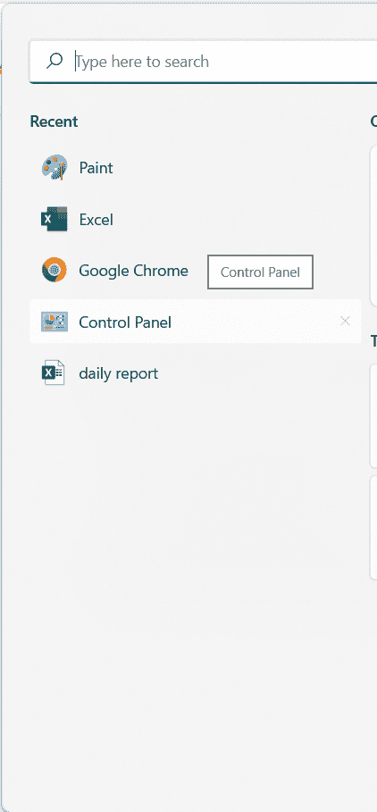
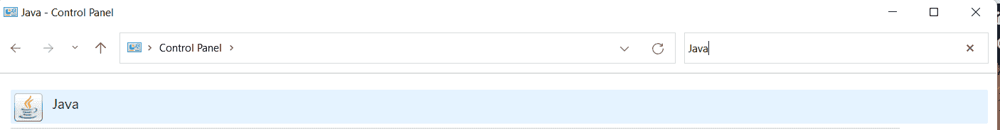
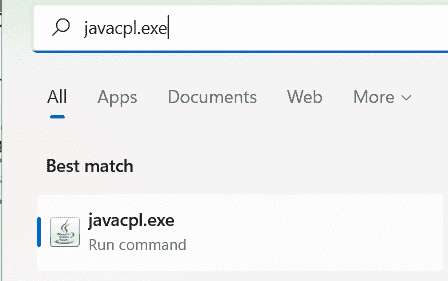
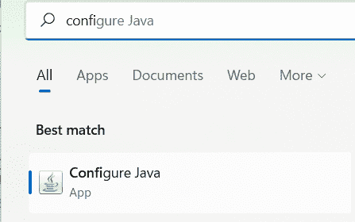
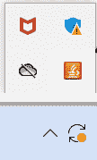
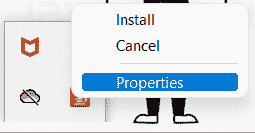
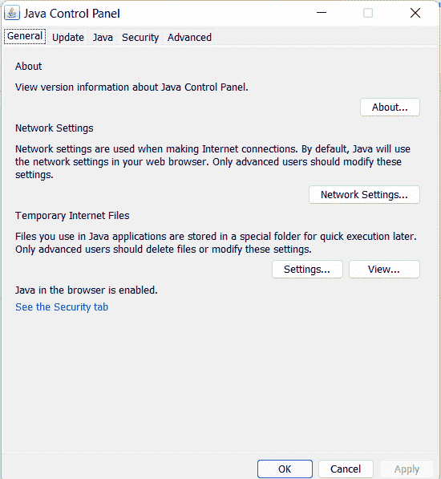

# 如何打开 Java 控制面板

> 原文：<https://www.tutorialandexample.com/how-to-open-the-java-control-panel>

本节将介绍启动 Java 控制面板的许多方法。我们还将介绍如何使用 Java 控制面板。

## Java 控制面板

Java 控制面板提供了许多功能。它使我们能够查看和修改各种控制参数。以下是 Java 控制面板的一些应用程序:

*   为了确保我们总是拥有最新的 JRE，它提供了一种更新早期 Java 版本的机制。
*   我们可以为小程序处理、调试和其他事情设置选项。
*   对于使用 Java Web Start 的应用程序和使用 Java 插件运行的小程序，它使我们能够设置运行时参数。
*   它使我们能够查看活动的部署规则集并控制例外站点的列表。
*   应用程序和小程序可以通过网络安全使用，因为它使我们能够管理证书。
*   使用该工具还可以查看和删除中的 Java 插件临时文件。

## 如何打开 Java 控制面板？

可以通过多种方式访问 Java 控制面板。

*   使用控制面板窗口
*   直接访问 javacpl.exe
*   使用开始按钮
*   使用系统托盘图标

### 使用控制面板窗口

点击开始选择控制面板。

  

单击 Java 时，屏幕上会显示 Java 控制面板。

### 直接访问 javacpl.exe

选择开始按钮

在搜索框中，键入 exe 的路径。

  

按下 Javacpl 按钮。

屏幕上将显示 Java 控制面板。

### 使用开始按钮

通过按 Windows 键或单击开始按钮选择配置 Java。

屏幕上将显示 Java 控制面板。

  

还有另一种方法:

按下 Windows 键。

然后选择所有程序。

决定 Java。

点击 Java 配置。

屏幕上将显示 Java 控制面板。

### 使用系统托盘图标

这个系统托盘图标位于任务栏的右下角。点击它。

通过右键单击 Java 来选择属性。

     

屏幕上将显示 Java 控制面板。

  

以下单独可见的面板是 Java 控制面板的一部分:

*   一般
*   更新
*   Java 语言(一种计算机语言，尤用于创建网站)
*   安全性
*   先进的