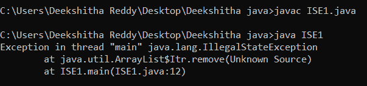

# 如何解决 Java 中的非法状态异常

> 原文：<https://www.tutorialandexample.com/how-to-resolve-illegal-state-exceptions-in-java>

## 什么是 IllegalStateException？

当一个方法在不正确的时间被调用，一个运行时异常被称为 IllegalStateException 在 Java 中被引发。该异常用于表明方法被不正确地或在错误的时间调用。

例如，线程一旦开始就不能再次启动。如果执行这样的过程，将引发 IllegalStateException。

作为 RuntimeException 的子类，IllegalStateException 是一个未检查的异常。当在错误的时间调用一个方法时，编码器或 API 开发人员会抛出一个显式异常。此方法通常用于表示以未经授权或不适当的方式调用了某个方法。

因为 IllegalStateException 是未检查的异常，所以它不需要包含在本机代码中名为 Object()的方法或函数的 throws 子句中。

## IllegalStateException 的原因

当 Java 程序或环境处于不适合所请求操作的状态时，将引发 IllegalStateException。在某些情况下，使用线程或 Java.util 包的集合框架时会发生这种情况。此例外可能适用的几种情况如下所示:

*   当已经启动的线程被给予 Thread.start()函数调用时。
*   当使用列表上的迭代器接口调用 delete()方法而没有首先使用 next()方法时。因此，列表集合进入不稳定状态并引发 IllegalStateException。
*   如果试图将元素添加到打包队列中。如果添加的元素超过了队列所能容纳的数量，将会出现 IllegalStateException。

## IllegalStateException 的示例

下面是迭代器抛出 IllegalMonitorStateException 的例子。

remove()技术用于在使用 next()方法之前从 ArrayList 中删除一项:

//ISE1.java

```
import java.util.ArrayList;
import java.util.Iterator;

class ISE1 {
    public static void main(String args[]) {
        ArrayList<String> alist = new ArrayList<String>();
        alist.add("Java");
        alist.add("T");
        alist.add("point");

        Iterator<String> i = alist.iterator();
        i.remove();
    }
} 
```

因为 remove()技术用于删除迭代器引用的前一个元素，所以在尝试删除元素之前应该使用 next()技术。因为在这种情况下从未应用过 next()方法，所以迭代器试图删除第一个元素之前的元素。

运行上面的代码会导致 IllegalStateException，因为该活动是非法的:

  

## IllegalStateException Fix

为了避免 Java IllegalStateException，确保代码中没有方法在未授权或不合适的时间被调用是很重要的。

上面例子中的问题可以通过在调用 remove()过程从数组列表中移除一个项之前利用数组列表的 Iterator.next()方法来解决:

ISE2.java

```
import java.util.ArrayList;
import java.util.Iterator;

public class ISE2 {
    public static void main(String args[]) {
        ArrayList<String> al = new ArrayList<String>();
        al.add("Java");
        al.add("T");
        al.add("point");

        Iterator<String> i = al.iterator();
        i.next();
        i.remove();

        System.out.println(al);  
    }
} 
```

通过调用 next()方法，迭代器位置被更改为下一个元素。稍后通过调用 remove()方法从 ArrayList 中移除初始元素是有助于解决异常的合法操作。

运行上面的代码会正确地产生预期的结果:

