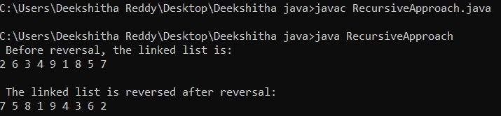
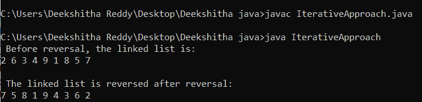
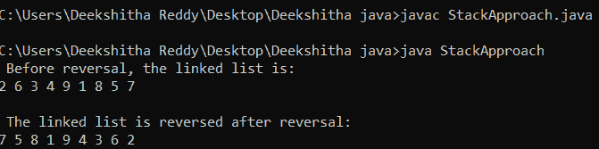
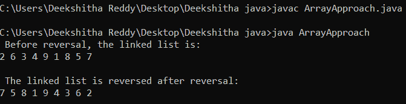

# 如何在 java 中反转一个链表

> 原文：<https://www.tutorialandexample.com/how-to-reverse-a-linked-list-in-java>

本节将介绍在 Java 中反转链表的过程。面试中最常见的问题之一是关于反转链表。如果链表的头或初始节点是已知的，那么目标就是反转链表。

给定:链表的头或者它的第一个节点(在我们的例子中是 2)

2 - > 6 - > 3 - > 4 - > 9 - > 1 - > 8 -> 5 - > 7 ->空

返回:

7 - > 5 - > 8 - > 1 - > 9 - > 4 - > 3 - > 6 - > 2 ->空

鉴于:

7 - > 5 ->空

返回:

5 - > 7 ->空

鉴于:

4 ->空

返回:

4 ->空

鉴于:

空

返回:

空

有两种方法可以解决这个问题。这两种策略是:

*   递归方法
*   迭代方法

先说递归策略。

## 使用递归方法反转链表

递归技术包括下面列出的步骤。

步骤 1:将列表分为第一个节点和其余的链表节点。

步骤 2:对链表的剩余元素调用 reverseList()方法。

步骤 3:将剩余部分连接到第一个。

第四步:调整头部指针。

### 履行

下面的代码演示了使用上述步骤执行链表反转。

//RecursiveApproach.java

```
public class RecursiveApproach  
{  
// the list's head node or first node 
static LinkedListNode head;   
static class LinkedListNode   
{  
// for storing the value of a node  
int v;  
// the following pointer refers to the following list node or to null  
LinkedListNode next;  
// constructor for the class  
LinkedListNode(int e)  
{  
// putting the values in  
v = e;  
next = null;  
}  
}  

// a technique that reverses the list  
public LinkedListNode reverseList(LinkedListNode head)  
{  
// if the list or the head is empty
// includes only one entry then inverting the list
// does not affect the list in any way. Consequently, we
// without making any operations can return the initial list.
if (head == null || head.next == null)  
{  
return head;  
}  
// reverse the remaining items on the list and put
// the last item on the list is the first one   
LinkedListNode r1 = reverseList(head.next);  
head.next.next = head;  
head.next = null;  
// correcting the head pointer  
return r1;  
}  
 /* Displaying the connected list in this way */  
public void printList(LinkedListNode h1)  
{  
LinkedListNode t1 = h1;  
while (t1 != null)   
{  
System.out.print(t1.v + " ");  
// going to the following node  
t1 = t1.next;  
}  
System.out.println();  
}  
// main method  
public static void main(String args[])  
{  
// creating an instance to the class RecursiveApproach  
RecursiveApproach lo = new RecursiveApproach();  
// 2 -> NULL  
lo.head = new LinkedListNode(2);  
// 2 -> 6 -> NULL  
lo.head.next = new LinkedListNode(6);  
// 2 -> 6 -> 3 -> NULL  
lo.head.next.next = new LinkedListNode(3);  
// 2 -> 6 -> 3 -> 4 -> NULL  
lo.head.next.next.next = new LinkedListNode(4);  
// 2 -> 6 -> 3 -> 4 -> 9 -> NULL  
lo.head.next.next.next.next = new LinkedListNode(9);  
 // 2 -> 6 -> 3 -> 4 -> 9 -> 1 -> NULL  
lo.head.next.next.next.next.next = new LinkedListNode(1);  
// 2 -> 6 -> 3 -> 4 -> 9 -> 1 -> 8 -> NULL  
lo.head.next.next.next.next.next.next = new LinkedListNode(8);  
// 2 -> 6 -> 3 -> 4 -> 9 -> 1 -> 8 -> 5 -> NULL  
lo.head.next.next.next.next.next.next.next = new LinkedListNode(5);
 // 2 -> 6 -> 3 -> 4 -> 9 -> 1 -> 8 -> 5 -> 7 -> NULL
lo.head.next.next.next.next.next.next.next.next = new LinkedListNode(7);  
 System.out.println(" Before reversal, the linked list is: ");  
lo.printList(head);  
head = lo.reverseList(head);  
System.out.println(" ");  
System.out.println(" The linked list is reversed after reversal: ");  
lo.printList(head);  
}  
} 
```

**输出:**



### 空间和时间复杂性:

上述程序具有 O(n)时间复杂度和 O(1)空间复杂度，其中 n 是列表中节点的总数。由于递归，上面的程序使用了内置的堆栈。为了简单起见，我们省略了内置堆栈占用的区域。

## 使用迭代方法反转链表

迭代技术包括下面列出的阶段。

**步骤 1:** 如下初始化 3(上一个、当前和下一个)。

current = head，previous = NULL，next = NULL。

**步骤 2:** 使用循环遍历链表，执行以下操作。

```
// Retain the next node before 
// modifying the currents next.
next = current -> next
// The reversing is now accomplished by 
// switching the direction of the current.
Current -> next = previous
// advancing the past and present by one step
Previous = current
Current = next 
```

### 履行

下面的代码演示了使用上述步骤执行链表反转。

//IterativeApproach.java

```
public class IterativeApproach   
{  
// the list's head node or first node 
static LinkedListNode head;  
// a class for building linked list nodes
// The value of a node in a linked list and 
// a pointer to another node are the two things 
// that a node in the list fetches.
static class LinkedListNode   
{  
int v;   
LinkedListNode next;  
// constructor for the class   
LinkedListNode(int no1)  
{  
v = no1;  
next = null;  
}  
}  
// a technique that reverses the list   
LinkedListNode reverse(LinkedListNode node)  
{  
//initializing in accordance 
// with the specified stages  
LinkedListNode previous = null;  
LinkedListNode current = node;  
LinkedListNode next = null;  
while (current != null)   
{  
next = current.next;  
current.next = previous;  
previous = current;  
current = next;  
}  
node = previous;  
return node;  
}  
// reveals the connected list's content  
void printList(LinkedListNode nd)  
{  
while (nd != null)   
{  
System.out.print(nd.v + " ");  
nd = nd.next;  
}  
}  
// main method  
public static void main(String args[])  
{  
// creating an instance to the class IterativeApproach   
IterativeApproach lo = new IterativeApproach();  
// 2 -> NULL  
lo.head = new LinkedListNode(2);  
// 2 -> 6 -> NULL  
lo.head.next = new LinkedListNode(6);  
// 2 -> 6 -> 3 -> NULL  
lo.head.next.next = new LinkedListNode(3);  
// 2 -> 6 -> 3 -> 4 -> NULL  
lo.head.next.next.next = new LinkedListNode(4);  
// 2 -> 6 -> 3 -> 4 -> 9 -> NULL  
lo.head.next.next.next.next = new LinkedListNode(9);  
 // 2 -> 6 -> 3 -> 4 -> 9 -> 1 -> NULL  
lo.head.next.next.next.next.next = new LinkedListNode(1);  
// 2 -> 6 -> 3 -> 4 -> 9 -> 1 -> 8 -> NULL  
lo.head.next.next.next.next.next.next = new LinkedListNode(8);  
// 2 -> 6 -> 3 -> 4 -> 9 -> 1 -> 8 -> 5 -> NULL  
lo.head.next.next.next.next.next.next.next = new LinkedListNode(5);
 // 2 -> 6 -> 3 -> 4 -> 9 -> 1 -> 8 -> 5 -> 7 -> NULL
lo.head.next.next.next.next.next.next.next.next = new LinkedListNode(7);  
System.out.println(" Before reversal, the linked list is: "); 
lo.printList(head);  
head = lo.reverse(head);  
System.out.println("\n");  
System.out.println(" The linked list is reversed after reversal: ");  
lo.printList(head);  
}  } 
```

**输出:**



### 空间和时间复杂性:

给定程序的时间复杂度为 O(n)，但其空间复杂度为 O(1)，其中 n 是列表中节点的数量。

## 使用堆栈反转 LinkedList

前面是利用堆栈反转链表时所采取的过程。

**步骤 1** :输入完每个节点值后，继续将节点值输入堆栈。

**步骤 2** :用列表最后一个节点的内容修改步骤 2 中的头指针。

**步骤 3** :一旦栈为空，开始将节点的内容添加到头节点，并继续这样做。

步骤 4: 当追加过程完成时，检查列表的最后一个节点是否指向空。

### 履行

只有借助前面提到的步骤，才能在下面的代码中反转链表。

//StackApproach.java

```
// significant import assertion 
import java.util.*;  
public class StackApproach  
{  
// the list's head node or first node 
static LinkedListNode head;   
static class LinkedListNode   
{  
// for holding the node's value
int v;  
// the next pointer either link to the second node 
// on the list or to null.
LinkedListNode next;  
// constructor for the class  
LinkedListNode(int d1)  
{  
// putting the values in 
v = d1;  
next = null;  
}  
}  
// a technique that reverses the list   
public LinkedListNode reverseList(LinkedListNode head, Stack<Integer> stck)  
{  
//Reversing the list does not affect it if the 
// head is empty or there is only one element 
// in the list. As a result, we may just provide 
// the original list without making any changes. 
if (head == null || head.next == null)  
{  
return head;  
}  
// iterating through the list and 
// adding the nodes' values to the stck  
while(head != null)  
{  
    stck.push(head.v);  
    head = head.next;  
}  
// The initial node of the inverted 
// linked list is referred to as h1.  
LinkedListNode h1 = null;  
while(stck.empty() == false)   
{  
if(head == null)  
{  
// making the inverted linked lists 
// initial node
h1 = new LinkedListNode(stck.peek());  
head = h1;  
stck.pop();  
}  
else  
{  
// all remaining nodes of a reversed 
// linked list is created  
head.next = new LinkedListNode(stck.peek());  
stck.pop();  
head = head.next;  
}  
}  
// the very first node of a 
// reversed linked list will be returned.
return h1;  
}  
/* Displaying the connected list in this way  */  
public void printList(LinkedListNode h2)  
{  
LinkedListNode t1 = h2;  
while (t1 != null)   
{  
System.out.print(t1.v + " ");  
// going to the following node  
t1 = t1.next;  
}  
System.out.println();  
}  
// main method  
public static void main(String args[])  
{  
// creating an instance for the class StackApproach
StackApproach lo = new StackApproach();  
// 2 -> NULL  
lo.head = new LinkedListNode(2);  
// 2 -> 6 -> NULL  
lo.head.next = new LinkedListNode(6);  
// 2 -> 6 -> 3 -> NULL  
lo.head.next.next = new LinkedListNode(3);  
// 2 -> 6 -> 3 -> 4 -> NULL  
lo.head.next.next.next = new LinkedListNode(4);  
// 2 -> 6 -> 3 -> 4 -> 9 -> NULL  
lo.head.next.next.next.next = new LinkedListNode(9);  
 // 2 -> 6 -> 3 -> 4 -> 9 -> 1 -> NULL  
lo.head.next.next.next.next.next = new LinkedListNode(1);  
// 2 -> 6 -> 3 -> 4 -> 9 -> 1 -> 8 -> NULL  
lo.head.next.next.next.next.next.next = new LinkedListNode(8);  
// 2 -> 6 -> 3 -> 4 -> 9 -> 1 -> 8 -> 5 -> NULL  
lo.head.next.next.next.next.next.next.next = new LinkedListNode(5);
 // 2 -> 6 -> 3 -> 4 -> 9 -> 1 -> 8 -> 5 -> 7 -> NULL
lo.head.next.next.next.next.next.next.next.next = new LinkedListNode(7);  
// creating an instance for the class Stack  
// the new stack will be void.  
Stack<Integer> stck = new Stack<Integer>();  
System.out.println(" Before reversal, the linked list is:  ");  
lo.printList(head);  
head = lo.reverseList(head, stck);  
System.out.println(" ");  
System.out.println(" The linked list is reversed after reversal:  ");  
lo.printList(head);  
}  
} 
```

**输出:**



### 空间和时间的复杂性:

前面的程序时间复杂度为 O(n)，空间复杂度也为 O(n)，其中 n 是列表中的节点总数。

## 使用数组反转 LinkedList

利用数组反转链表所涉及的过程如下。

**第一步:**首先确定提供的列表中有多少个节点。

**步骤 2:** 在步骤 2 中准备一个整数数组，使其大小与列表的长度相当。

**第三步:**通过遍历列表，从左到右用列表中节点的值填充数组。

**步骤 4:** 从数组的末尾开始，一次取一个数组的元素，形成一个列表，最后一个元素作为列表的头。列表的第二个节点由数组的倒数第二个元素组成，依此类推。

### 履行

在前面提到的步骤的帮助下，链表在下面的代码中是反向的。

//ArrayApproach.java

```
// significant import assertion   
import java.util.*;  
public class ArrayApproach  
{  
// the list's head node or first node  
static LinkedListNode head;   
static class LinkedListNode   
{  
// for holding the node's value 
int v;  
// the next pointer either link to the second node 
LinkedListNode next;  
// constructor for the class  
LinkedListNode(int d1)  
{  
// putting the values in   
v = d1;  
next = null;  
}  
}  
// a method for counting all of the 
// nodes in the linked list 
public int countNodes(LinkedListNode head)  
{  
// The linked list's total number of
// nodes are stored in variable c.  
int c = 0;  
while(head != null)  
{  
// adding one to the total
c = c + 1;  
// advancing the head one more step  
head = head.next;  
}  
return c;  
}  
// a technique that reverses the list    
public LinkedListNode reverseList(LinkedListNode head, int s)  
{  
// array to store the linked list's nodes' values 
int a[] = new int[s];  
// populating the array with loops  
for(int k = 0; k < s; k++)  
{  
a[k] = head.v;  
head = head.next;  
}  
// j holds the array's last index, a. 
int j = s - 1;  
// The initial node of the inverted 
// linked list is referred to as h1.  
LinkedListNode h1 = null;  
while(j >= 0)  
{  

if(h1 == null)  
{  
// making the inverted linked lists 
// initial node
h1 = new LinkedListNode(a[j]);  
head = h1;  
}  
else  
{  
// generating and adding the remaining nodes 
// to the h1 of a reversed linked list 
head.next = new LinkedListNode(a[j]);  
head = head.next;  
}  
// iterating from end to beginning   
// therefore, decreasing the j by 1  
j = j - 1;  

}  
// the very first node of a 
// reversed linked list will be returned.
return h1;  
}  
/* Displaying the connected list in this way  */  
public void printList(LinkedListNode h2)  
{  
LinkedListNode t1 = h2;  
while (t1 != null)   
{  
System.out.print(t1.v + " ");  
// going to the following node  
t1 = t1.next;  
}  
System.out.println();  
}  
// main method  
public static void main(String args[])  
{  
// creating an instance for the class ArrayApproach  
ArrayApproach lo = new ArrayApproach();  
// 2 -> NULL  
lo.head = new LinkedListNode(2);  
// 2 -> 6 -> NULL  
lo.head.next = new LinkedListNode(6);  
// 2 -> 6 -> 3 -> NULL  
lo.head.next.next = new LinkedListNode(3);  
// 2 -> 6 -> 3 -> 4 -> NULL  
lo.head.next.next.next = new LinkedListNode(4);  
// 2 -> 6 -> 3 -> 4 -> 9 -> NULL  
lo.head.next.next.next.next = new LinkedListNode(9);  
 // 2 -> 6 -> 3 -> 4 -> 9 -> 1 -> NULL  
lo.head.next.next.next.next.next = new LinkedListNode(1);  
// 2 -> 6 -> 3 -> 4 -> 9 -> 1 -> 8 -> NULL  
lo.head.next.next.next.next.next.next = new LinkedListNode(8);  
// 2 -> 6 -> 3 -> 4 -> 9 -> 1 -> 8 -> 5 -> NULL  
lo.head.next.next.next.next.next.next.next = new LinkedListNode(5);
 // 2 -> 6 -> 3 -> 4 -> 9 -> 1 -> 8 -> 5 -> 7 -> NULL
lo.head.next.next.next.next.next.next.next.next = new LinkedListNode(7);  
System.out.println(" Before reversal, the linked list is: "); 
lo.printList(head);  
// the total amount of nodes with 
// in the linked list is known as size. 
int s = lo.countNodes(head);  
head = lo.reverseList(head, s);  
System.out.println(" ");  
System.out.println(" The linked list is reversed after reversal: ");  
lo.printList(head);  
}  
} 
```

**输出:**



### 空间和时间复杂性:

前面的程序时间复杂度为 O(n)，空间复杂度也为 O(n)，其中 n 是列表中的节点总数。