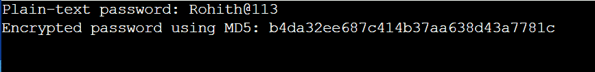
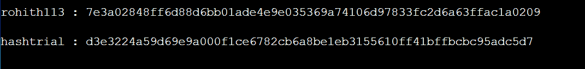
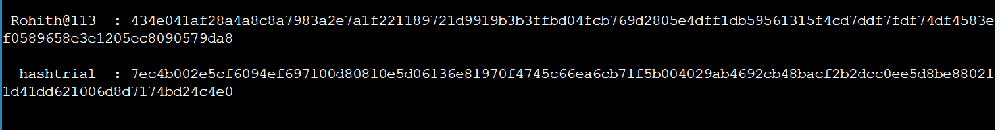
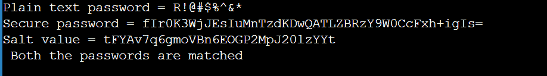

# 如何在 Java 中加密密码

> 原文：<https://www.tutorialandexample.com/how-to-encrypt-password-in-java>

每个软件程序都需要用户名和密码来识别合法用户。用户名可以是任何数量的东西，包括电子邮件地址或字符串。但是在创建密码时必须非常小心。因为用户的密码在设置时以纯文本的形式存储在数据库中，所以任何具有适当凭证的人都可以访问系统并读取信息。在当前状态下将纯文本存储在数据库中是不安全的。黑客可能会攻破数据库，然后窃取密码。使用各种加密算法对用户密码进行加密，以保护其安全性。使用各种加密方法将明文密码以加密形式保存在数据库中。

我们使用哈希方法将数据安全地存储在数据库中。

## Java 散列技术

特定算法根据用户提供的纯文本密码生成加密的哈希值。可以使用 Java 编程支持的各种哈希方法对密码进行加密。

## MD5 散列过程

被称为 MD5(消息摘要)的散列方法尤其受欢迎。它是一种加密散列函数，产生 128 位的散列值。任何长度的消息都可以输入加密哈希函数算法 MD5，该算法将其转换为固定长度为 16 字节的消息。在 Java 编程中，这种方法是用 Java 描述的。安全包。

### 使用 MD5 程序加密密码的程序

EncryptedMD5.java

```
import java.security.NoSuchAlgorithmException; 
import java.security.MessageDigest; 
public class EncryptedMD5 
{ 
/* Driver Code */ 
public static void main(String[] args) 
{ 
String pd = "Rohith@113"; 
String ed = null; 
try 
{ 
MessageDigest m1 = MessageDigest.getInstance("MD5"); 
/* Use the MD5 update() function to add plain-text password bytes to the digest. */ 
m1.update(pd.getBytes()); 
/*The hash value should be converted to bytes.*/ 
byte[] bt = m1.digest(); 
/*Decimal bytes are contained in the bytes array. Changing the format to hexadecimal. */
StringBuilder str = new StringBuilder(); 
for(int i=0; i< bt.length ;i++) 
{ 
str.append(Integer.toString((bt[i] & 0xff) + 0x100, 16).substring(1)); 
} 
ed = str.toString(); 
} 
catch (NoSuchAlgorithmException e) 
{ 
e.printStackTrace(); 
} 
/* Displaying the unencrypted and encrypted passwords. */ 
System.out.println (" Original password: " + pd); 
System.out.println("Encrypted password using MD5: " + ed); 
} 
}
```

**输出**



**解释**

MessageDigest 类是用 Java 实现的。安全包，如上面的代码所示。MD5 返回的字节数组必须转换成可读的十六进制格式。

虽然 MD5 哈希方法简单且使用快速，但它也容易受到字典或暴力攻击。

## SHA256

安全哈希算法是 SHA。使用加密算法将 32 位明文密码转换为固定大小的 256 位哈希值。爪哇咖啡。安全包的 MessageDiagest 类用于创建此哈希方法。它采用单向加密。密码一旦加密就无法解密。国家安全局在 2001 年开发了 SHA-2 作为 SHA-1 的替代品。SHA-256 算法是 SHA-2 的一种变体。获得专利的加密哈希算法 SHA-256 产生一个 256 位的值。

### 使用 SHA256 程序加密密码的程序

SHA256.java

```
// importing math package to use BigInterger to store 32-bit integers
import java. math.BigInteger; 
import java.nio.charset.StandardCharsets; 
// importing Message digest library from the security package 
//Message package is used to represent fixed numeric values
import java.security.MessageDigest; 
import java.security.NoSuchAlgorithmException; 
public class SHA256 
{ 
public static byte[] getSHA(String input) throws NoSuchAlgorithmException 
{ 
/* Use the SHA-256 update() function to add plain-text password bytes to the digest. */ 
MessageDigest m = MessageDigest.getInstance("SHA-256"); 
/* digest() method called to calculate message digest of input and return array of byte */ 
return m.digest(input.getBytes(StandardCharsets.UTF_8)); 
} 
public static String toHex(byte[] hash) 
{ 
/* Convert byte array of hash into digest */ 
BigInteger nr = new BigInteger(1, hash); 
/* Convert the digest into hex value */ 
StringBuilder hS = new StringBuilder(nr.toString(16)); 
while (hS.length() < 32) 
{ 
hS.insert(0, '0'); 
} 
return hS.toString(); 
} 
/* Main section where execution of the program is started*/ 
public static void main(String args[]) 
{ 
try 
{ 
String s1 = "rohith113"; 
System.out.println("\n" + s1 + " : " + toHex(getSHA(s1))); 
String s2 = "hashtrial"; 
System.out.println("\n" + s2 + " : " + toHex(getSHA(s2))); 
} 
catch (NoSuchAlgorithmException en) 
{ 
System.out.println("Exception is 
thrown if thee is incorrect algorithm: " + en); 
} 
} 
}
```

**输出**



**解释**

上面的代码中使用 MessageDigest 类实例来创建 SHA256 哈希。SHA256 算法产生的字节数组必须转换成可读的十六进制表示形式。最后，哈希值显示为加密的。

## SHA512 MD5 哈希技术

Java 的 MessageDiagest 类。使用 SHA512 通过加密算法将 64 位纯文本密码转换为固定大小的 512 位哈希值。安全包也用于实现这种散列方法。

### 使用 SHA512 MD5 程序加密密码的程序

SHA512.java

```
import java . math.BigInteger; 
import java.nio.charset.StandardCharsets; 
import java.security.MessageDigest; 
import java.security.NoSuchAlgorithmException; 
public class SHA512 
{ 	
public static byte[] getSHA(String input) throws NoSuchAlgorithmException 
{ 
MessageDigest m = MessageDigest.getInstance ( "SHA-512" ) ; 
return m.digest (input.getBytes(StandardCharsets.UTF_8)); 
} 
public static String toHexaStr(byte[] h) 
{ 
BigInteger n = new BigInteger(1, h); 
StringBuilder ht = new StringBuilder(n.toString(16)); 
while (ht.length() < 32) 
{ 
ht.insert ( 0 , '0' ) ; 
} 
return ht.toString ( ); 
} 
public static void main ( String args [ ] ) 
{ 
try 
{ 
// Using s1 
String s1 = " Rohith@113 " ; 
System.out.println( " \n " + s1 + " : " + toHexaStr(getSHA(s1))); 
String s2 = " hashtrial " ; 
System. out.println ( " \n " + s2 + " : " + toHexaStr(getSHA(s2))); 
} 
catch (NoSuchAlgorithmException ex) 
{ 
System.out.println(" Exception is thrown due to wrong algorithm : " + ex ) ; 
} 
} 
} 
```

**输出**



## 盐和碱 64 技术

哈希值是使用纯文本密码和 salt 值通过基于密码的加密方法生成的。之后，从哈希值创建 Base64 字符串。salt 值包括由来自 java util 包的随机类实例产生的随机数据。

### 使用 SALT 和 BASE 64 技术进行加密的程序

SaltEncryption.java

```
import java . util . *;
import java . security . NoSuchAlgorithmException ; 
import java . security . SecureRandom ; 
import java . security . spec .InvalidKeySpecException; 
import java . util . Arrays ; 
import java . util . Base64 ; 
import java . util . Random ; 
import javax . crypto . SecretKeyFactory ; 
import javax . crypto . spec . PBEKeySpec ; 
public class SaltEncrpytion 
{ 
public static void main ( String [ ] args ) 
{ 
// Random password 
String pass = "R!@#$%^&*"; 
// A salt value is generated which is stored in the database 
String salt_value = PassBasedEnc.getSaltvalue( 30 ) ; 
// Encrypted password is generated 
String encrypted_password = PassBasedEnc . generateSecurePassword ( pass, salt_value); 
System.out.println("Plain text password = " + pass); 
System.out.println("Secure password = " + encrypted_password); 
System.out.println("Salt value = " + salt_value); 
Boolean status = PassBasedEnc.verifyUserPassword(pass,encrypted_password,salt_value); 
if(status==true) 
System.out.println ( " Both the passwords are matched " ) ; 
else 
System.out.println ( " Both the passwords are not matched " ) ; 
} 
} 
class PassBasedEnc 
{ 
private static final Random r = new SecureRandom(); 
private static final String c = "0123456789ABCDEFGHIJKLMNOPQRSTUVWXYZabcdefghijklmnopqrstuvwxyz"; 
private static final int re = 10000; 
private static final int length_key = 256; 
public static String getSaltvalue(int length) 
{ 
StringBuilder final_value = new StringBuilder(length); 
for (int i = 0; i < length; i++) 
{ 
final_value.append(c.charAt(r.nextInt(c.length()))); 
} 
return new String(final_value); 
} 
public static byte[] hash(char[] pass, byte[] salt) 
{ 
PBEKeySpec sp = new PBEKeySpec(pass, salt, re, length_key); 
Arrays.fill(pass, Character.MIN_VALUE); 
try 
{ 
SecretKeyFactory srf = SecretKeyFactory.getInstance("PBKDF2WithHmacSHA1"); 
return srf.generateSecret(sp).getEncoded(); 
} 
catch ( NoSuchAlgorithmException | InvalidKeySpecException e ) 
{ 
throw new AssertionError ( " Error raised at the time of hashing : " + e.getMessage() , e) ; 
} 
finally 
{ 
sp.clearPassword () ; 
} 
} 
public static String generateSecurePassword (String pass , String salt ) 
{ 
String final_value = null ; 
byte[] secure_password = hash ( pass . toCharArray() , salt . getBytes()) ; 
final_value = Base64 . getEncoder ( ) . encodeToString ( secure_password ) ; 
return final_value ; 
} 
public static boolean verifyUserPassword ( String provided_password , 
String secured_password , String salt ) 
{ 
boolean final_value = false ; 
String newSecurePassword = generateSecurePassword (provided_password , salt ) ; 
final_value = newSecurePassword . equalsIgnoreCase(secured_password) ; 
return final_value ; 
} 
}
```

**输出**



**解释**

该程序的驱动程序代码位于类 PassEncTech4 中。PassBasedEnc 类中定义了 4 种方法。第一个函数 getSaltvalue()使用 util 包中的 Random 类来生成值。然后，定义 hash()函数，以字节数组作为返回类型。generateSecurePassword()函数使用 hash()方法和一个纯文本密码和 salt 值。然后使用 verifyUserPassword()方法来比较这两个密码。