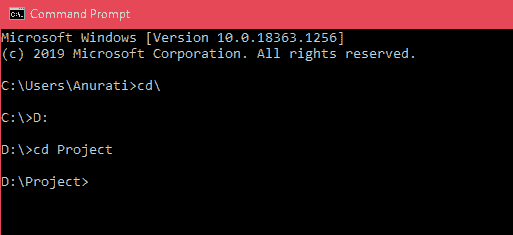
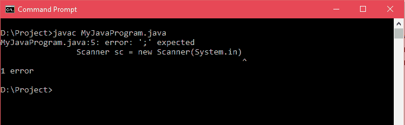
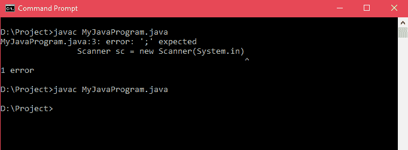
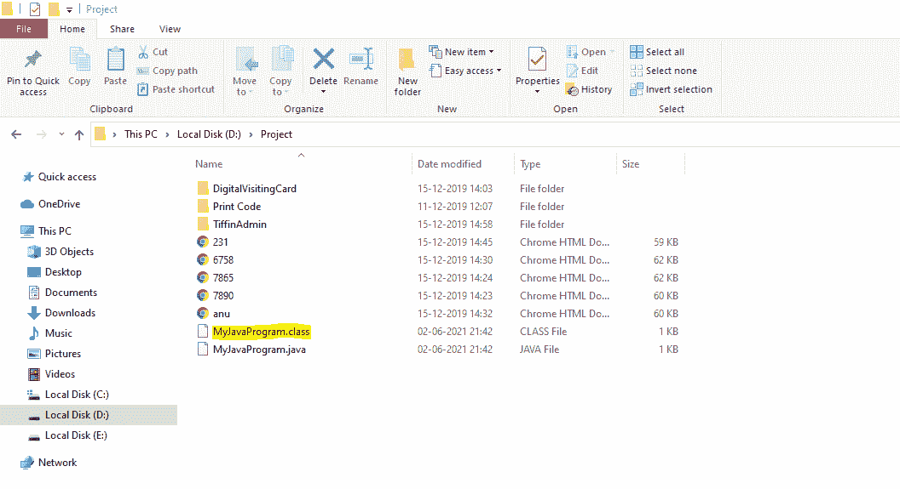
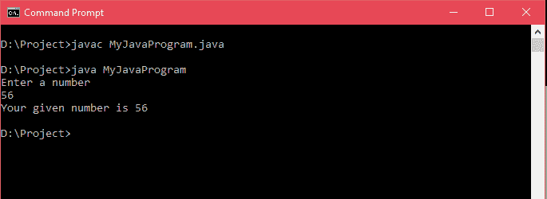

# 如何运行 Java 程序？

> 原文：<https://www.tutorialandexample.com/how-to-run-java-program/>

**如何运行 Java 程序**

在本节中，我们将学习如何在命令提示记事本中编写、编译和运行 Java 程序。

为了运行 Java 程序，我们必须在我们的系统中安装 JDK (Java 开发工具包),它为应用程序提供运行时环境。JDK 安装后，路径必须设置正确，否则我们无法运行代码。设置 JDK 的路径有两种方法，点击 **<u>此处</u>** 学习。

按照下面给出的步骤运行 Java 程序:

*   打开记事本。
*   在里面写一个 Java 程序，用扩展名保存文件。 **java**

**注意:**文件名应该和类名相同。

*   打开命令提示符(CMD)，输入命令并运行 Java 程序。

**注意:**在继续本节之前，请确保成功安装了 JDK，并且正确设置了类路径。

让我们按照以下步骤运行 Java 程序:

**第一步:**打开代码编辑器，键入基本的 Java 代码。用 MyJavaProgram.java 的名字**保存文件。**

```
 public class MyJavaProgram{
 public static void main(String args[]){
 Scanner sc = new Scanner(System.in);
 System.out.println("Enter a number");
 int n = sc.nextInt();
 System.out.println("Your given number is "+n);
 }
 } 
```

**第二步:**打开命令提示符。设置保存 Java 文件的目录。在我们的例子中，Java 文件保存在 D:\Project 目录中。



**第三步:**首先，我们将使用 javac 命令编译 Java 程序。

```
javac MyJavaProgram.java
```

它在同一个文件夹中生成一个. class(字节码)文件。如果代码中有任何错误，它用行号显示该错误。



一旦我们解决了错误并再次运行该命令，将在同一文件夹(D:\Programs)中创建一个. class 文件。





**步骤 4:** 运行。类文件(字节码)，我们使用 java 命令后跟类名。

```
java MyJavaProgram
```

一旦程序没有错误，并且创建了类文件，Java 程序就成功运行了，如下所示:



注意:你也可以使用不同的用户友好的代码编辑器直接运行 Java 程序，比如 Visual Studio Code、Eclipse、Atom 等。因为这些编辑有他们自己的虚拟环境来运行程序。

这样，我们就学会了如何运行 Java 程序。