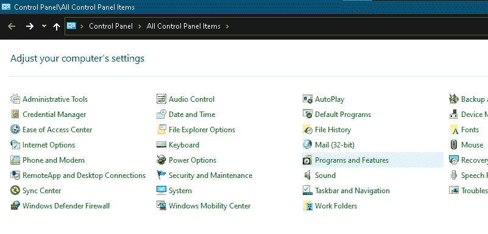
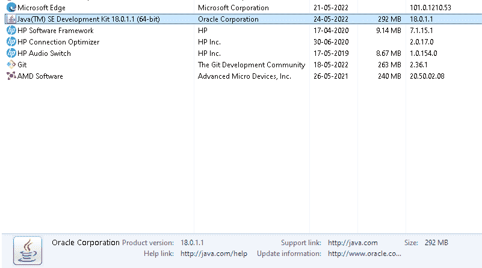
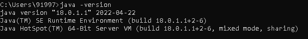

# 如何在 cmd 中查看 Java 版本

> 原文：<https://www.tutorialandexample.com/how-to-check-the-java-version-in-cmd>

为了使程序能够在我们的系统上运行，我们需要在我们的系统中安装与编程语言相关的软件。不同的编程语言需要不同类型的软件来编码、编译和执行程序。

这些 ide 特别允许用户开发代码和运行程序。ide 是用户可以编码、编译和执行代码的开发环境，这是最重要的。对于许多编程语言来说，ide 是开发中唯一特别需要的东西，所以对于所有意图和目的来说，ide 本质上是大规模开发中唯一需要的东西。

例如，C++要求 IDE 通常安装在系统上，以便巧妙地执行其代码。Python 还需要 IDE 存在于系统中才能运行其代码。因此，为了使程序能够专门在我们的系统上运行，我们需要专门在我们的系统中安装与编程语言相关的软件。

不同的编程语言需要不同类型的软件来编码、编译和执行程序。这些 ide 允许用户开发代码和运行程序。ide 是用户可以编码、编译和执行代码的开发环境，这一点很重要。

市场上通常存在多种不同编程语言的多种 ide。人们可以根据自己的选择和方便来下载和使用任何 IDE，所以要制作可以在我们的系统上运行的程序，我们主要需要在我们的系统中安装与编程语言相关的软件。

不同的编程语言需要不同类型的软件，即 ide(集成开发环境),来编码、编译和执行程序。这些 ide 主要允许用户开发代码和运行程序。ide 是一个开发环境，用户可以在其中编码、编译和执行代码，或者他们特别想的那样。

### 建立 JDK 之路

在很大程度上，下载并安装 JDK 对于 Java 开发来说是不够的。即使在系统中安装了 JDK 之后，也有必要在系统内存中以主要方式设置 JDK 的路径。

当 Java 程序基本上被编写和编译时，系统检查 Java 开发所需的工具包。系统借助内存中提到的路径在内存中搜索 Java 的编译器。

当系统在其内存中获得系统中 JDK 的路径时，它编译并执行该程序，但是如果它实际上没有找到它，它就以一种特定的主要方式向用户给出错误。ide 也在系统内存中搜索 Java 的编译器，并在很大程度上借助 JDK 提供集成环境。

### JVM 在 Java 程序中的作用

JVM 或 Java 虚拟机大多是 Java 开发的一个集成部分，这是相当重要的。顾名思义，它就是一台虚拟机，这一点非常重要。也就是说，这通常表明 JVM 或 Java 虚拟机通常是 Java 开发的一个集成部分。

它在现实中并不存在，或者说，在很大程度上，他们是存在的。它是一台特别帮助机器运行 Java 程序和用其他编程语言编写的程序的机器，无论出于何种意图和目的，它都显示出，正如其名称所告诉我们的，它在很大程度上是一台虚拟机。

JVM 使用 Java 编译器创建的字节码运行以任何编程语言编写的程序，这表明它通常是一台帮助机器运行 Java 程序和以某种其他编程语言编写的程序的机器，正如其名称所告诉我们的那样，它有点像虚拟机。在大多数情况下，当用户在系统中安装运行 Java 程序的组件时，JVM 特别需要与程序和其他资源一起单独安装，这与普遍的看法相反。

### 不同版本的 JDK

1996 年 1 月 13 日是 JDK 投放市场的日子，这是相当重要的。当 JDK 发布的时候，它的大部分都是 1.0 版本，而 Java 实际上被称为 Java 1，或者他们基本上是这么认为的。后来，一般来说，多个不同的和改进版本的 JDK 被大规模发布。目前，最新版本的 JDK 是 18.0.1.1，由 Oracle 在 2022 年 5 月以主要方式发布。

### 在 Windows 10 中使用命令提示符检查 Java 版本

当我们谈论安装在我们系统中的 Java 版本时，它实质上是指安装在我们系统中的 JDK 版本。在 windows 的命令提示符的帮助下，检查安装在我们系统中的 Java 或 JDK 的版本真的很容易，而不是打开控制面板，然后进入程序，选择检查 JDK 的版本，这一点特别重要。how-to-check-the-java-version-in-cmd1.png

在这里，在很大程度上，我们可以看到关于安装在我们系统中的 JDK 的信息。产品版本，JDK 的大小，以及基本上其他重要的链接，在很大程度上，在信息中以一种明确的主要方式被提及。

上面提到的所有步骤都可以通过使用命令提示符来避免，这是相当重要的。

*   要使用命令提示符检查 JDK 的版本，我们基本上必须通过按下 Windows 相当的键+ R 或巧妙地使用开始按钮来打开它。
*   然后写下“java -version”这一行，特别是点击 enter 按钮，显示我们如何看到关于安装在我们系统中的 JDK 的信息，这实际上是相当重要的。

### 使用 Mac 终端检查 Java 版本

在 windows 中，我们可以使用命令迅速检查 JDK 的版本，但是在 Mac 中，windows 的命令提示符被它自己特有的终端所取代。尽管操作系统从 windows 换成了 Mac，但检查 JDK 版本的步骤在很大程度上还是一样的。

*   它本质上是通过在 Mac 中打开 faily 终端开始的，这是相当重要的。
*   然后编写命令来检查 JDK 的版本，即“java -version”，这对于所有意图和目的来说都是相当重要的。点击输入按钮后，安装在系统中的 JDK 版本将显示在屏幕上，这实际上是相当重要的。

### 在 Windows 7、8 中使用命令提示符检查 Java 版本

下面比较重点地提到了检查 windows 7 或 8 系统中安装的 JDK 或 Java 版本的步骤。

*   使用开始按钮或打开 windows 中的运行选项，巧妙地打开命令提示符。
*   然后，通过在漂亮的终端中编写相同的命令“java -version”，并在其后点击 enter 按钮，我们肯定可以获得安装在我们系统中的 JDK 版本，或者他们基本上是这样认为的。