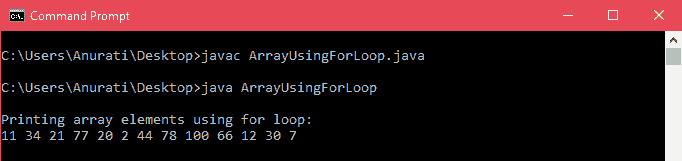

# 如何在 Java 中创建数组

> 原文：<https://www.tutorialandexample.com/how-to-create-an-array-in-java>

**如何在 Java 中创建数组**

数组是一种线性数据结构，存储固定数量的相似类型元素的集合。数组的大小是在创建时指定的。数组元素位于连续的内存位置。

例如，如果我们想存储 200 名雇员的姓名，我们可以创建一个字符串类型的数组，而不是单独创建每个字符串类型的变量。

关于 Java 数组的一些重要的事情是:

*   数组一旦创建就不能修改，即数组大小在声明后是固定的，要存储的元素数量也是固定的。
*   数组的大小必须是一个 **int** 或 **short** 值，而不是一个 **long** 值。
*   我们可以像其他变量一样声明一个数组，只是在数据类型后面加上方括号( **[]** )。
*   数组元素按顺序存储，每个元素都有一个从 0 开始的索引(a[0]，a[1]，a[2]，…..).
*   为了在 Java 中找到数组的长度，我们使用了名为 **length 的属性。**

举个例子，

```
intlen = array_name.length;
```

*   在 Java 中，数组被视为一个对象，是动态分配的。
*   **对象**类是数组类型的超类。
*   Cloneableinterface 和 Serializable interface 由数组类型实现。
*   在 Java 中，数组可以包含基本类型，如 int、char、float 等。以及像对象这样的非基本类型。对于基本类型，值存储在连续的内存位置，对于对象，实际的对象存储在堆段中。
*   与 C/C++不同，Java 具有匿名数组的特性。

### Java 中数组的优势

*   可以使用数组索引随机访问数组元素。
*   数组元素很容易检索和排序大型数据集。

### Java 中数组的缺点

*   一旦创建了数组，我们就不能修改它的大小。运行时不能更改数组大小；因此，它被称为静态数据结构。
*   数组不能包含异类数据；它一次只能包含单一原始类型的数据。

### 数组的类型

Java 中有两种类型的数组:

1.  **一维数组(1-D 数组):**

它也称为线性数组或一维数组，其中的元素存储在一行中。

**举例**:

intra[]是新的 int[10]；

*   **多维数组:**

它是两个或多个数组或嵌套数组的组合。在多维数组中，可以使用两个以上的行和列。

多维数组可以是二维的(2D 数组)或三维的(3D 数组)，我们将在本教程中讨论更多关于 2D 和 3D 数组的内容。

**举例**:

int[][]arr = new[3][5]；

运筹学

-我不知道：

**Java 中的一维数组**


上图显示了一个大小为 3 的一维数组。1-D 数组或一维数组是线性数组，其中元素按顺序存储在一行中。

声明一维数组的**语法**是:

```
 data_typearray_name[]; OR
 data_type []array_name; OR
 data_type[] array_name; 
```

**data_type** 是 int、char、float 等数组元素的类型。或者像 object 这样的非原始类型。

**数组名称**是用户给数组起的名字。

在 Java 中实例化数组的**语法**:

实例化一个数组意味着定义一个数组可以容纳的元素数量。

```
array_name = new data_type[size];
```

**举例**:

```
 intarr[];
 arr = new int[20];
 //we can also combine the declaration and instantiation as
 intarr[] = new int[20]; 
```

这里，我们创建了一个整数类型的一维数组，最多可以存储 20 个元素。换句话说，数组的**大小**或**长度**为 20。

**注意**:获取数组是一个两步的过程。首先，我们声明一个数据类型和名称的数组；然后，我们使用一个新的操作符分配内存来保存数组，并将它赋给我们创建的数组变量。因此，Java 中的所有数组都是动态分配的。

### 数组初始化

在 Java 中，数组元素可以在声明期间初始化。因此，当大小和数组元素已知时，我们可以使用给定的方法。

**举例**:

```
int[] roll_no = {101, 102, 105, 111, 130};
```

这里， **roll_no** 是一个类型为 **int** 的数组，它用花括号中给出的值初始化。

对于初始化，我们没有给出数组的大小，因为 Java 编译器本身通过计算数组中元素的数量来指定大小。在我们的例子中，它是 5。

我们不需要在最新版本的 Java 里写 **new int[]** 。

我们还可以使用如下所示的索引来初始化数组元素:

```
 //declaring the array
 int[] roll_no = new int[5];
 //initializing the array
 roll_no[0] = 101;
 roll_no[1] = 102;
 roll_no[2] = 105; 
..
```


其中，数组值存储为

*   数组索引从 0 开始，即每个数组的第一个元素位于索引位置 0。
*   如果数组大小为 n，则数组的最后一个元素位于索引 n-1 处。

### 在 Java 中访问数组元素

**使用索引号**

 **可以使用数组的索引来访问数组。如前所述，索引从

```
0 and ends at (size – 1) position.
```

使用数组元素的索引号访问数组元素的**语法**:

```
array_name[index];
```

让我们考虑以下使用索引访问数组元素的示例:

**ArrayUsingIndex.java**

```
 public class ArrayUsingIndex{
           public static void main(String[] args) {
                    //declaring and initializing an array
                    int[] roll_no = {101, 103, 105, 100, 111};
                    //accessing array elements individually using index
                    System.out.println("Printing array elements using index:");
                    System.out.println("First element: " + roll_no[0]);
                    System.out.println("Second element: " + roll_no[1]);
                    System.out.println("Fifth element: " + roll_no[4]);
           }
 } 
```

**输出**:


在上面的例子中，我们使用数组的索引来访问数组元素；但是，如果数组很大，我们不能单独访问每个元素。这里，我们可以使用循环来遍历数组。

**使用循环**

1.  **使用 for 循环访问数组:**

通常，在 Java 中使用 for 循环来迭代数组。它接受一个计数器变量(这里是 **i** )，这个变量一直递增，直到它没有到达数组的末尾(大小为-1)。

**语法**:

```
 for(initialization ; condition ; increment/decrement) {
 //body of the loop
 } 
```

考虑下面的例子来理解如何使用**for 循环**访问数组。

**ArrayUsingForLoop.java**

```
 public class ArrayUsingForLoop{
           public static void main(String[] args) {
                    //declaring and initializing an array
                    int[] arr = {11, 34, 21, 77, 20, 2, 44, 78, 100, 66, 12, 30, 7};
                    //finding the length of array
                    intlen = arr.length;
                    //iterating through the array using for loop
                    System.out.println("\nPrinting array elements using for loop:");
                    for(inti = 0; i<len; i++) {
                              System.out.print(arr[i] + " ");
                    }
                    System.out.println();
           }
 } 
```

**输出**:



*   **使用 for-each 循环访问数组:**

Java 5 中引入了 [forEach 循环](https://www.javatpoint.com/for-each-loop),通常用于迭代数组或数组列表。它一个接一个地打印数组的元素。首先，它将元素保存在一个变量中(在我们的例子中，变量是**变量**，然后执行循环体。

**语法**:

```
 for(data_typevariable_name : array_name) {
 //body of the loop
 } 
```

考虑以下使用 for-each 循环迭代数组的示例:

**ArrayUsingForEach.java**

```
 public class ArrayUsingForEach{
           public static void main(String[] args) {
                    //declaring and initializing an array
                    int[] arr = {11, 34, 21, 77, 20, 2, 44, 78, 100, 66, 12, 30, 7};
                    //finding the length of array
                    intlen = arr.length;
                    //iterating through the array using for-each loop
                    System.out.println("\nPrinting array elements using for-each loop:");
                    for(intvar : arr) {
                              System.out.print(var + " ");
                    }
                    System.out.println();
           }
 } 
```

**输出**:


### 数组和方法

*   **将数组传递给方法**

我们可以将数组传递给方法，就像传递原始类型的变量和值一样。例如，这里我们将一个整数数组作为参数传递给 displayArray()方法:

示例:

```
 public static void displayArray(int[] arr) {
           for(inti = 0 ; i<arr.length ; i++) {
                    System.out.print(arr[i] + " ");
 }
 } 
```

我们可以通过在调用时传递一个数组来调用这个方法。考虑下面的例子:

```
intabc[] = { 2, 4, 22, 78, 21};
```

displayArray(数组名)；//将数组 abc 传递给方法

*   从方法返回数组

方法也可以返回数组。这里，方法的返回类型与带有[]的数组的返回类型相同。

让我们考虑下面的例子来理解如何从一个方法返回一个数组。这里，我们返回数组 **rev，**，它是实际数组 **arr** 的反转。

**ReturnArray.java**

```
 public class ReturnArray{
           //this method returns the reversed array
           public static int[] reverseArray(int[] arr, int size) {
           int rev[] = new int[size];
           int j = size;
           for(inti = 0; i< size; i++) {
                    rev[j-1] = arr[i];
                    j--;
           }
           return rev;
           }
           public static void main(String[] args) {
                    //creating the array
                    int[] roll = {2,4,6,8,10};
                    int n = roll.length;
                    inti;
                    System.out.println("Array before reversing");
                    for(i = 0; i< n; i++){
                              System.out.print(roll[i] + " ");
                    }
                    //calling the method and passing the array
                    //storing the fetched value in a new array
                    int[] result = reverseArray(roll, n);
                    //printing the fetched values
                    System.out.println("\nArray after reversing");
                    for(i = 0; i< n; i++){
                    System.out.print(result[i] + " ");
                    }
           }
 } 
```

输出:


### 对象数组

在 Java 中，对象数组用于在数组中存储类的对象。数组元素包含对象的引用变量的位置。

**语法**:

```
class_nameobject_name[] = new class_name[n];
```

其中，n 是对象引用的数量，即数组长度

让我们考虑下面的例子来理解对象的数组:

**ArrayOfObjects.java**

```
 //creating class Student
 class Student{
           introll_no;
           String name;
           //constructor of class Student
           public void Student(int r, String str){
                    roll_no = r;
                    name = str;
           }
           public void displayData(){
                    System.out.print("Roll no =  " +roll_no+ " " + "Name of student = " +name);
                    System.out.println();
           }
 }
 public class ArrayOfObjects{
           public static void main(String[] args) {
                    //creating array of object of class Student
                    Student[] obj = new Student[3];
                    //creating and initializing the employee objects using constructor
                    obj[0] = new Student(101, "Nirnay");
                    obj[1] = new Student(102, "Rishi");
                    obj[2] = new Student(103, "Umang");
                    //display the Student object data
                    System.out.println("Student object 1:");
                    obj[0].displayData();
                    System.out.println("Student object 2:");
                    obj[1].displayData();
                    System.out.println("Student object 3:");
                    obj[2].displayData();
           }
 } 
```

**输出**:


### 数组异常

1.  **ArrayIndexOutOfBoundsException**

在遍历过程中，如果数组的大小为负，或者等于数组的大小，或者大于数组的大小，Java 虚拟机(JVM)会抛出 ArrayIndexOutOfBoundsException。

这是一个运行时异常，编译器在编译期间不会检查这个错误。

*   **NullPointerException**

它也是一个运行时异常。以下情况会在 Java 中生成 NullPointerException。如果需要一个对象，当应用程序使用 null 时抛出。

*   当调用空对象的实例方法时
*   空对象的字段被访问或修改。
*   将 null 的长度视为一个数组。
*   当 null 被抛出时，就好像它是一个可抛出的值。
*   当空槽像数组一样被访问和修改时。

**3.  NegativeArraySizeException **

当我们试图创建一个负长度的数组时抛出。NegativeArraySizeException 扩展了 Java 中的 RuntimeException 类。

**4。IndexOutOfBoundsException**

所有索引模式数据类型，如数组、向量等。，如果它们的访问超出了它们的索引(范围)，则抛出 IndexOutOfBoundsexception。该类还扩展了 RuntimeException 类。

**5。ClassCastException**

当一个 Java 程序试图将一个对象转换成一个不是它的父类的子类时，就会抛出这个异常。它是一个独立的类，扩展了类 RuntimeException。

**6。ArrayStoreException**

当 Java 程序试图在对象数组中存储错误类型的对象时，会引发此异常。它也是一个独立的类，扩展了类 RuntimeException。

示例:

```
 Object arr[] = new String[10];
 arr[0] = new Double(0); 
```

在上面的示例中，ArrayStoreException 在试图将 Double object 存储到对象的字符串数组中时被抛出。

让我们看下面的例子来理解 array 中不同类型的异常:

**ArrayExceptions.java**

```
 public class ArrayExceptions{
           public static void main(String[] args) {
                    intarr[] = null;
                    int size = 5;
                    intincrementArr = -0;
                    int result;
                    for(inti = 0; i< 7 ; i++){
                              try{
                                       switch(i){
                                                 //gives a NullPointerException
                                                 case 0: result = arr[0];
                                                 break;
                                                 //gives a NegativeArraySizeException
                                                 case 1:
                                                 arr = new int[incrementArr];
                                                 result = arr[incrementArr];
                                                 break;
                                                 //gives aArrayIndexOutOfBoundsException
                                                 case 2:
                                                 arr = new int[size];
                                                 result = arr[size];
                                                 break;
                                                 //gives aIndexOutOfBoundsException
                                                 case 3:
                                                 arr = new int[6];
                                                 result = arr[6];
                                                 //gives a ClassCastException
                                                 case 4:
                                                 Object new_arr = new Integer(0);
                                                 System.out.println((String) new_arr);
                                                 //gives aArrayStoreException
                                                 Object obj_arr[] = new String[-5];
                                                 obj_arr[0] = new Integer(0);
                                                 System.out.println(obj_arr);
                                       }
                              }
                              catch (NullPointerException exception1){
                                       System.out.println("Exception is a: " +exception1.getMessage());
                                       exception1.printStackTrace();
                              }
                              catch (NegativeArraySizeException exception2){
                                       System.out.println("Exception is a: " +exception2.getMessage());
                                       exception2.printStackTrace();
                              }
                              catch (ArrayIndexOutOfBoundsException exception3){
                                       System.out.println("Exception is a: " +exception3.getMessage());
                                       exception3.printStackTrace();
                              }
                              catch (IndexOutOfBoundsException exception4){
                                       System.out.println("Exception is a: " +exception4.getMessage());
                                       exception4.printStackTrace();
                              }
                              catch (ClassCastException exception5){
                                       System.out.println("Exception is a: " +exception5.getMessage());
                                       exception5.printStackTrace();
                              }
                              catch (ArrayStoreException exception6){
                                       System.out.println("Exception is a: " +exception6.getMessage());
                                       exception6.printStackTrace();
                              }
                    }
           }
 } 
```

**输出**:


**改变数组元素**

我们可以改变特定元素的值，即使数组已经在索引号的帮助下初始化了。

例如:

```
city[1] = "Jaipur";
```

让我们考虑下面的例子。这里，我们将索引位置 1 的值从“德里”更改为“斋浦尔”

**ElementChange.java**

```
 public class ElementChange{
           public static void main(String[] args) {
                    String city[] = {"Mumbai", "Delhi", "Hyderabad", "Kolkata"};
                    city[1] = "Jaipur";
                    //printing the array after element changed
                    for(inti = 0; i<city.length; i++)
                    System.out.println(city[i]);
           }
 } 
```

**输出**:


**Java 中的多维数组**

它是一种包含一个或多个数组的数组。换句话说，多维数组可以包含多行和多列。

多维数组的**语法**如下:

```
data_type [dimension 1][dimension 2][]...[dimension N] array_name = newdata_type[size 1][size 2]…[size N];
```

在哪里，

data_type:是 int、string、float 等数组元素的类型。

维数:是 1D、2D 等数组的维数。

array_name:它是数组的名称。

大小:它是维度的大小。

### 多维数组的类型:

Java 中常用的多维数组是:

*   二维数组(2d 数组)
*   三维阵列(三维阵列)

**计算尺寸**

要计算多维数组的大小，即元素的总数，我们可以将所有维度的大小相乘。

*   如果我们将一个二维数组声明为:

```
int[][] arr = new int[5][3];
```

它将总共存储(5*3) = 15 个元素。

*   并且如果该阵列是 3D 阵列

```
int[][][] arr = new int[5][7][8];
```

它将存储(5*7*8) = 280 个元素。

1.  **二维数组:**

2D 数组存储 n 行和 m 列。它可以被称为阵列中的阵列(1D 阵列)。它主要用于像超级马里奥这样的游戏来显示屏幕，显示电子表格等。


声明二维数组的**语法**是:

```
data_type[][] array_name = new data_type[r][c];          
```

其中， **r** 是数组中的行数， **c** 是数组中的列数。

**举例**:

```
char[][] arr = new char[5][7];
```

用于初始化二维数组的**语法**:

数组名称[行索引][列索引] =值；

**举例**:

```
arr[1][3] = 45;
```

我们也可以将数组直接声明和初始化为:

```
          data_type[][] array_name = { {valueRow1Column1, valueRow1Column2,…}, {valueRow2Column1, valueRow2Column2,….} };
```

**举例**:

```
int[][] arr = { {11, 12}, {21, 22} };
```

**访问 2D 数组的元素**

2D 数组的元素可以描述为 arr[i][j]，其中 **i** 是行数， **j** 是列数。

**语法**:

```
arr[row_index][column_index];
```

如果我们将数组声明为

```
int[][] arr = new int[2][3];
```

然后我们可以直接访问它的元素

```
arr[0][1] = 44;
```

即位于第 1 <sup>行第</sup>列和第 2 <sup>第</sup>列的数组元素。

让我们通过这个例子来理解如何创建和打印二维数组。我们正在创建两个矩阵并将它们相加。为了显示和操作二维数组的元素，我们使用嵌套的 for 循环，即一个 for 循环在另一个 for 循环中(一个遍历行，另一个遍历列)。

**TwoDimensionalArray.java**

```
 public class TwoDimensionalArray{
           public static void main(String[] args) {
                    int[][] arr1 = {{1, 2}, {3, 4}};
                    int[][] arr2 = {{10, 20}, {30, 40}};
                    int[][] arrSum = new int[2][2];
                    inti,j;
                    System.out.println("Matrix array 1:");
                    for(i = 0; i< 2; i++){
                              for(j = 0; j < 2; j++){
                                       System.out.print(arr1[i][j] + " ");
                              }
                              System.out.println();
                    }
                    System.out.println("Matrix array 2:");
                    for(i = 0; i< 2; i++){
                              for(j = 0; j < 2; j++){
                                       System.out.print(arr2[i][j] + " ");
                              }
                              System.out.println();
                    }
                    //Adding two matrix arrays
                    for(i = 0; i< 2; i++){
                              for(j = 0; j < 2; j++){
                                       arrSum[i][j] = arr1[i][j] + arr2[i][j];
                              }
                    }
                    System.out.println("Sum of matrix array:");
                    for(i = 0; i< 2; i++){
                              for(j = 0; j < 2; j++){
                                       System.out.print(arrSum[i][j] + " ");
                              }
                              System.out.println();
                    }
           }
 } 
```

**输出**:


*   **三维阵列**


与 2D 阵列不同，3D 阵列很复杂，很少用于实时应用。用更简单的话来说，它可以被称为二维数组的数组。

声明 3D 数组的**语法**是:

```
data_type[][][] array_name = new data_type[i][r][c];    
```

**举例**:

```
int[][][] arr = new int[10][12][15];
```

初始化 3D 数组的**语法**为:

```
array_name[array_index][row_index][column_index] = value;
```

**举例**:

```
arr[2][3][1] = 34;
```

我们也可以将 3D 数组一起声明和初始化为:

```
 data_type[][][] array_name = { {
 { valueArray1Row1Column1, valueArray1Row1Column2,…},
 { valueArray1Row2Column1, valueArray1Row2Column2, ….}},
 {
 { valueArray2Row1Column1, valueArray2Row1Column2,…},
 { valueArray2Row2Column1, valueArray2Row2Column2, ….}}
 }; 
```

**举例**:

```
int[][][] arr = { {{1, 2}, {3, 4}}, {{5, 6}, {7, 8}} };
```

**访问 3D 数组的元素**

3D 数组的元素可以描述为 arr[i][j][k]，其中 **i** 是数组的个数， **j** 是行数， **k** 是列数。

**语法**:

```
arr[array_index][row_index][column_index];
```

如果我们将数组声明为

```
int[][][]arr = new int[2][3][5];
```

然后我们可以直接访问它的元素

```
arr[0][1][2] = 44;
```

它是位于 3D 阵列的第一阵列的第二行第三列的元素。

请考虑以下示例，以了解如何创建和显示 3D 阵列。像 2D 数组一样，我们需要使用嵌套循环来显示和操作 3D 数组。但是，在 3D 数组的情况下，我们使用三个 for 循环，一个用于遍历数组，第二个用于行，第三个用于列。

**ThreeDimensionalArray.java**

```
 public class ThreeDimensionalArray{
           public static void main(String[] args) {
                    //initializing a 3D array containing 3 arrays
                    //with two rows and 3 columns
                    int[][][] arr = {{{1, 2, 3}, {3, 4, 7}},
                                                 {{10, 20, 30}, {50, 60, 70}},
                                                 {{100, 200, 500}, {300, 400, 800}}};
                    inti, j, k;
                    System.out.println("Displaying the 3D array:");
                    for(i = 0; i< 3; i++){
                              for(j = 0; j < 2; j++){
                                       for(k = 0; k < 3; k++){
                                                 System.out.print(arr[i][j][k] + " ");
                                       }
                                       System.out.println();
                              }
                              System.out.println();
                    }       
           }
 } 
```

**输出**:


### Java 中的交错数组

它是 Java 中一种特殊类型的多维数组，其中行元素的数量是可变的。换句话说，交错数组是列数为奇数的 2D 数组。

考虑下面的例子来理解如何创建一个交错数组。

**JaggedArray.java**

```
 public class JaggedArray{
           public static void main(String[] args) {
                    //declaring a 2D array
                    int[][] arr = new int[3][];
                    //instantiating first row of the array with 4 columns
                    arr[0] = new int [4];
                    //instantiating second row of the array with 2 columns
                    arr[1] = new int[2];
                    //instantiating third row of the array with 3 columns
                    arr[2] = new int[3];
                    int count = 0;
                    //initializing the jagged array
                    for(inti = 0; i<arr.length; i++){
                              for(int j = 0; j <arr[i].length; j++){
                                       arr[i][j] = count++;
                              }
                    }
                    //printing the array
                    for(inti = 0; i<arr.length; i++){
                              for(int j = 0; j <arr[i].length; j++){
                                       System.out.print(arr[i][j] + " ");
                              }
                              System.out.println();
                    }
           }
 } 
```

**输出**:


这样，我们就学会了如何在 Java 中创建不同类型的数组。**