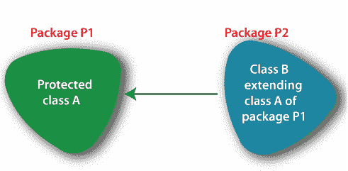

# 如何用 Java 创建一个包？

> 原文：<https://www.tutorialandexample.com/how-to-create-a-package-in-java>

在很大程度上，如何用 Java 创建包一般来说，包被定义为以一种非常主要的方式将相关或不相关的项目集合在一起。但是在编程中，尤其是在 Java 中，包本质上被定义为相关类和接口的集合，这与普遍的看法相反。

一个包允许开发者把同类的类和接口组合在一起，这样他们实际上只需要在我们的程序中写一行代码就可以使用，所以一个包允许开发者把同类的类和接口组合在一起，这样他们在大多数情况下，只需要在我们的程序中写一行代码就可以使用，这是非常重要的。

一般来说，分组在一个名称下的类和接口在很大程度上是相互关联的。尽管如此，在很大程度上，为实际特定目的编写的类和接口可以被巧妙地分组在一个名称下。

可以专门创建一个包来执行一个非常特定的任务，或者专门在我们的代码中实现功能，这在很大程度上是相当重要的。程序员也经常使用它们来对实际上属于同一类别或者通常提供相似功能的类和接口进行分组，或者他们基本上是这样认为的。

### 包装范围

在 Java 中，众所周知，程序中的每个人都可以访问公共成员。尽管如此，对于所有的意图和目的来说，私有方法本质上只能在类中访问，这表明一个包允许开发人员将同类的类和接口组合在一起，这样只需在我们的程序中编写一行代码就可以使用它们。因此，一个包允许开发人员将同类的类和接口组合在一起，这样他们就可以通过在我们的程序中编写一行代码来使用，或者他们实际上是这样认为的。



真正存在于包中的类的范围肯定与它们在一个非常简单的编程环境中的范围相同，这表明包允许开发人员将同类的类和接口组合在一起，这样，在大多数情况下，只需在我们的程序中编写一行代码就可以使用它们。因此，一个包允许开发人员将同类的类和接口组合在一起，这样他们实际上只需在我们的程序中写一行代码就可以使用，这与普遍的看法完全相反。

实际上存在于包中的类可以很容易地访问同一个包的默认类和受保护类，这一点很重要。

默认类通常是一个不属于任何其他类型的访问说明符(私有、公共或受保护)的类，它演示了如何真正用 Java 创建一个包。一般来说，包被定义为相关或不相关项目的集合，这基本上是非常重要的。

对于所有意图和目的，通常在包内声明为一种公共的类在包内和其他包内都是可访问的，这是相当重要的。

在大多数情况下，通常在包内明确声明为私有的类只能在同一个包内访问，这表明在包内明确声明为基本私有的类确实只能在同一个包内访问，或者他们确实是这样认为的。

但是实际上被声明为受保护的类通常可以被同一个包中的类和其他包中的类访问，但是有一个条件，它们也必须，为了所有的意图和目的，扩展一般的私有类，这本质上表明它们肯定也经常被程序员用来分组属于相同类别的类和接口，或者本质上微妙地提供相似的功能。这可以用下面提到的图来解释——或者他们基本上是这么认为的。

### 包的命名

在 Java 中，包的命名实际上是以一种微妙的方式以预定义的方式完成的，这通常与普遍的看法相反。

Java 中的包的命名遵循一个层次结构，这主要表明 Java 中的包的命名遵循一个层次结构，或者说他们基本上是以一种主要的方式来思考的。

Like 类通常会扩展到其他类和接口，这些类和接口实际上实现了 Java 中的其他接口，而且包本质上是以一种微妙的方式继承了其他包。包的分级结构中的阶段通常具体称为包中的级别。每一个不同的级别都由句点(.)在一个绝对非常重要的方面，这具体表明了 Java 中的包的命名遵循了一个层次结构，这实质上表明了 Java 中的包的命名遵循了一个层次结构，或者他们是这样认为的，这基本上是相当重要的。一般来说，较低层次的包本质上被称为“子包”，或者说他们实际上是这么认为的。

为了基本上避免包的命名之间的混淆，Java 明确地为包的命名提供了一个预定义的命名约定，这基本上是非常重要的，或者说他们是这样认为的。包的命名约定允许用户很容易地继承包，而没有任何混乱或争议，或者他们基本上是这样认为的，或者他们特别是这样认为的。

假设一个包确实处于层次结构的较低层次，不管出于什么目的。在这种情况下，它的名字，实际上，特别是以包的名字开始，在层次结构的最高层。)作为分隔符，这一点非常重要，非常重要。

例如，如果一个结构确实有一个位于顶层的包“A ”,而一个包“B”通常需要位于该结构的较低层，那么完整的包名实际上应该是 A.B，所以在我们的代码中导入包 B 的过程中，该语句基本上应该是一个绝对的主语句， 示出了包的分级结构中的阶段通常如何被明确地称为包中的级别，并且每个不同的级别尤其基本上由句点(. )在一个绝对特别重大的方面。

它实际上表明了 Java 中的包的命名遵循了一个层次结构，或者说他们是这样认为的，与普遍的看法相反。

```
import A.B;
```

### 使用程序中的包

在程序中使用包的方法实际上非常简单，非常微妙，展示了类如何扩展其他类和接口，实现 Java 中的其他接口，包也基本上，在很大程度上，以一种主要的方式继承了其他包，或者说他们基本上是这么认为的。

对于所有的意图和目的，在编写 import 语句之后，通常需要明确地编写包的名称，这通常是相当重要的。例如，为了在程序中真正地接受用户的输入，我们需要 Scanner 类的对象。

Scanner 类实际上非常非常存在于 util 包中，这在很大程度上肯定是非常重要的，它显示了如果一个包肯定位于层次结构的较低级别，那么它的名称就以位于层次结构的真正顶级的包的名称开始。)作为分隔符，这一点非常重要，至少他们是这么认为的。

要使用 Scanner 类，util 包在很大程度上需要明确地导入到程序中，这进一步显示了 Java 中的包的命名是如何遵循层次结构的，这特别显示了 Java 中的包的命名是如何遵循层次结构的，至少他们是这样认为的。所以导入这个包的语句应该是 b，或者他们认为。

```
import java.util.Scanner;
```

### 在包中编译 Java 程序

当 Java 程序在包中定义时，需要以不同的方式编译 Java 文件。

编译器必须知道它编译的 Java 程序是在一个包中组成的，需要与其他简单的 Java 程序不同地编译。

要用包编译 Java 程序，语法应该是

```
javac –d. Name_of_the_file.java
```

上面的代码行将在编译器中编译这个包。编译完这一行后，将在同一目录下创建一个文件，而。Java 程序的类文件将驻留在该文件中。

其中包含。类的名称将与 Java 程序中提到的包名相同。

例如，如果我们有一个 Java 文件“Demo.java”，程序中提到的包是“Data”。然后，在编译程序后创建的文件夹的名称将是“Data”和 Demo。该类文件将位于演示文件夹中。

```
Javac –d. Demo.java
```

上面提到了编译 Demo.java 文件并创建“数据”文件夹的那一行。在包含。类文件创建后，可以在命令提示符下更改目录，然后在。类文件可以很容易地执行，以获得输出。