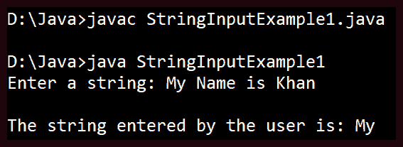

# 如何在 Java 中获取字符串输入

> 原文：<https://www.tutorialandexample.com/how-to-take-string-input-in-java>

Java 中取**字符串输入有多种方式。在这一节中，我们将讨论**如何在 Java** 中接受字符串输入。在 Java 中有以下几种获取字符串输入的方法:**

1.  通过使用 Java 扫描器类
2.  通过使用 Java BufferedReader 类
3.  通过使用命令行参数

### 通过使用 Java 扫描器类

在 *java.util* 包中定义了 [Scanner](https://www.tutorialandexample.com/how-to-use-scanner-in-java) 类，用于接收用户的输入。Scanner 类提供了以下两种方法来获取用户输入。

1.  Scanner.nextLine()方法
2.  Scanner.next()方法

让我们讨论一下上面提到的每一种获取用户输入的方法。

#### 1.Scanner.nextLine()方法

方法读取输入，直到该行结束，并将光标移动到下一行。 *nextLine()* 方法的语法是:

**语法:**

```
public String nextLine()
```

该方法不接受任何参数。它返回被跳过的字符串。如果该方法没有找到要读取的行，该方法抛出***NoSuchElementException***。

**文件名**:字符串示例. java

```
 // importing the Scanner class
import java.util.Scanner;
public class StringInputExample
{ 
// main method
public static void main(String argvs[])
{
// To hold the string input by the user
String str;
// creating an object of the Scanner class
Scanner scnr = new Scanner(System.in); 
System.out.print("Enter a string: "); // invoking the method nextLine()
// to take input from the user
str = scnr.nextLine();
// for new line
System.out.println();
// displaying the entered string
System.out.print("The string entered by the user is: " + str );
}
} 
```

**输出:**


**说明:**显示**输入字符串**消息后，光标在控制台上等待用户输入字符串。方法 *nextLine()* 一直读到用户点击 enter 键并返回读取的内容，该内容由变量 *str* 捕获。输出中显示了相同的读取字符串。请注意，点击 enter 按钮表明该行已被终止。

#### Scanner.next()方法

*next()* 方法读取输入，直到该行结束或遇到空白。 *nextLine()* 和 *next()* 方法的主要区别在于，后者在遇到空白时终止，而前者只有在按下 enter 时才终止。 *next()* 方法的语法是:

**语法:**

```
public String next()
```

**退货:**

读取的行被返回。

该方法不接受任何参数。它返回被跳过的字符串。如果该方法没有找到要读取的行，该方法抛出***NoSuchElementException***。

**文件名**:字符串示例 1.java

```
 // importing the Scanner class
import java.util.Scanner;
public class StringInputExample1
{ 
// main method
public static void main(String argvs[])
{
// To hold the string input by the user
String str;
// Instantiating the Scanner class by creating its object
Scanner scnnr = new Scanner(System.in); 
System.out.print("Enter a string: ");
// invoking the method next()
// to take input from the user
str = scnnr.next();
// for new line
System.out.println();
// displaying the entered string
System.out.print("The string entered by the user is: " + str );
}
} 
```

**输出:**



**说明:**用户输入我叫可汗。但是，在“我的”一词后会遇到空格。因此，剩余的三个字没有被读取，同样可以通过观察输出来确认。

### 通过使用 Java BufferedReader 类

Java BufferedReader 类用于读取字符流。该类接受一个 *InputStreamReader* 类的对象。因此，有必要创建一个 [*InputStreamReader* 类](https://www.tutorialandexample.com/java-inputstreamreader)的构造函数，并将其对象作为参数传递给 *BufferedReader 类。 *BufferedReader* 类有一个 *readLine()* 方法来接受用户的输入。 *readLine()* 方法一次读取一行。*

**语法:**

```
public String readLine()
```

它返回用户输入的行。它不包含任何行终止字符，或者如果已经到达流的末尾，则为 null。

让我们观察下面的程序来理解如何使用 *BufferedReader* 类从用户那里获取输入。

**文件名**:字符串示例 2.java

```
 // Import statements
import java.io.BufferedReader;
import java.io.IOException;
import java.io.InputStreamReader;
public class StringInputExample2
{ 
// main method
public static void main(String argvs[]) throws IOException
{
String str;
// Creating an object of the InputStreamReader class
InputStreamReader inputStrObj = new InputStreamReader(System.in);
// Creating an object of the BufferedReader class
BufferedReader bufrObj = new BufferedReader(inputStrObj);
System.out.print("Enter a string: ");
// invoking the method readLine()
// to take input from the user
str = bufrObj.readLine();
// for new line
System.out.println();
// displaying the entered string
System.out.print("The string entered by the user is: " + str );
}
} 
```

**输出:**


**说明:**在 *InputStreamReader* 类的构造函数中， *System.in* 被传递。这样做是因为输入是从键盘上取得的。在 *InputStreamReader* 类的帮助下， *BufferedReader* 类存储用户通过键盘输入的内容。

### 通过使用命令行参数

[命令行参数](https://www.tutorialandexample.com/java-command-line-argument)出现在主[方法](https://www.tutorialandexample.com/how-to-call-a-method-in-java) (String argvs[])中。String argvs[]是一个字符串数组，接受一行作为输入。让我们借助下面的 [Java](https://www.tutorialandexample.com/java-tutorial) 程序来理解命令行参数的用法。

**文件名**:字符串示例 3.java

```
 public class StringInputExample3
{ 
// main method
public static void main(String argvs[])
{
// To store the elements of the String array argvs
String str = "";
// Calculating the size of the String array
int size = argvs.length;
// loop for iterating over the elements of the String array argvs
for(int i = 0; i < size; i++)
{
    // Converting the String array into a string
    str = str + argvs[i] + " ";
}
// displaying the entered string
System.out.print("The string entered by the user is: " + str );
}
} 
```

**输出:**


**解释:**命令行参数是在使用 **java** 命令执行程序时放置的。字符串数组 argvs[]中的元素数量由输入字符串中的空格决定。在输入字符串(“我的名字是 Khan”)中，有三个空格。因此，数组 argvs 中有四个字符串元素(“My”、“name”、“is”、“Khan”)。然后使用 for 循环解析数组 argvs，然后连接数组 argvs 的元素以再次构建字符串，如上面的输出所示。