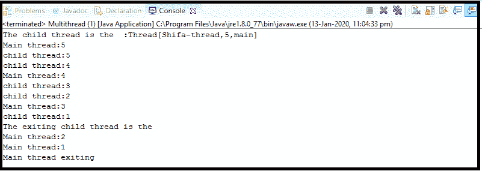
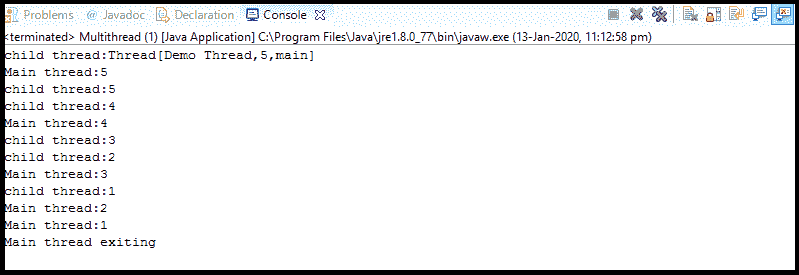
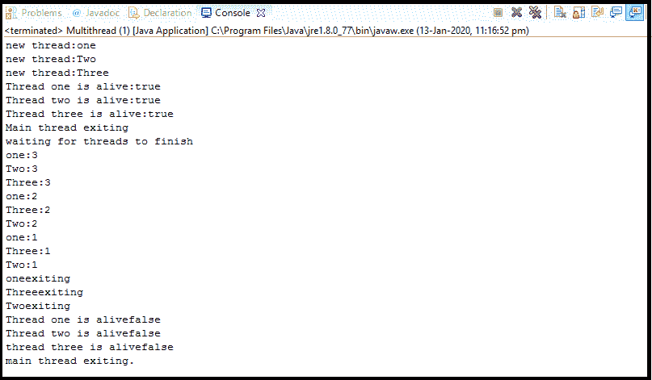

# Java 线程创建

> 原文：<https://www.tutorialandexample.com/java-thread-creation>

### Java 提供了两种创建线程的方法:

*   实现 Runnable 接口。
*   扩展线程类。

### 实现可运行接口

创建线程最简单的方法是创建一个实现 Runnable 接口的类。runnable 接口代表一个可执行代码单元。我们可以在实现 Runnable 的对象上创建一个线程。如果一个类实现了 Runnable 接口，那么它只实现了一个名为 **run()** 的方法。

我们将在构成新线程的 Runnable 接口的 run 方法中定义代码。run()可以调用该类的其他方法，可以使用其他类，并声明变量。run()为程序中线程的执行建立入口点。run()完成时，线程将结束。

我们可以实例化一个 Thread 类型的对象，其中传递了一个实现 Runnable 的类，这样我们就可以启动新的线程。Thread 有一个构造函数，我们将使用它来启动 Thread 类的 run 方法。

**语法:**

 **```
Thread(Runnable r1,
String tname)
```

在这个构造函数中，r1 是实现 Runnable 接口的类的实例，tname 是新线程的名称。当新线程被创建时，它将在您调用它的 start()方法时开始运行，该方法是在 thread 中声明的。

### 使用 Runnable 创建新线程的步骤:

**Step1:** 创建一个 Runnable 实现类，实现 run()方法。

**Step2:** 实例化 Thread 类并将 Runnable implemented 类传递给线程，Thread 有一个接受 Runnable implementer 实例的构造函数。

**Step3:** 调用线程实例的 start()，start()内部调用实现类的 run()。通过调用 start()创建一个新线程，该线程执行 run()中编写的代码。

**示例 1:使用 Runnable 接口创建线程。**

```
class Thread2 implements Runnable{
 Thread t;
 Thread2(){
 //create a new,second thread.
 t=new Thread(this, "Shifa-thread"); 
 System.out.println("The child thread is the  :"+t);
 t.start();//we are starting the thread.
 }
 //this is the entry point for  execution of the second thread. 
 public void run()
 {
 try
 {
 for(int i1=5;i1>0;i1--) 
 {
 System.out.println("child thread:"+i1);
 Thread.sleep(500);
 }
 }catch(InterruptedException ex) 
 {
 ex.printStackTrace();
 }
 System.out.println("The exiting child thread is the"); 
 }
 }
 public class Multithread{
 public static void main(String[] args) { 
 new Thread2();//create a new thread.
 try
 {
 for(int i=5;i>0;i--) 
 {
 System.out.println("Main thread:"+i);
 Thread.sleep(1000);
 } 
 }catch(InterruptedException e) {
 e.printStackTrace();
 System.out.println("Main thread interrupted");
 }
 System.out.println("Main thread exiting");
 }
 } 
```

**输出:**



### 解释:

在 Thread2 类的构造函数中，以下语句创建了一个新的 Thread 对象:

```
t=new Thread(this, "Shifa thread");
```

当 start()方法调用时，这将导致子线程的 for 循环开始。当主程序恢复执行时，它进入循环。然后双方共享 cpu，直到循环结束。

### 通过扩展 thread 类创建线程

一个线程类也可以通过扩展预定义的线程类来实现，然后实例化那个类。新线程的入口点 run()方法必须在扩展类中重写。下面是前面的程序被改写为扩展线程。

 **### 使用线程类创建新线程的步骤:

**Step1:** 根据你的需求创建一个线程扩展类，并覆盖线程类的 run()方法。

**Step2:** 实例化线程扩展类。

**Step3:** 通过线程扩展类的实例调用线程类的 start()，start()内部调用 run()方法，该方法在用户类中覆盖。run()中定义的线程的所有活动都会执行。

**示例 1:使用 thread 类创建线程。**

```
class Thread3 extends Thread{
 Thread3(){
 super("Demo Thread");
 System.out.println("child thread:"+this);
 start();//start the thread. This is equivalent to this.start().
 } 
 //The run() is the entry point for the second thread.
 public void run()
 {
 try
 {
 for(int i1=5;i1>0;i1--) 
 { 
 System.out.println("child thread:"+i1);
 Thread.sleep(500);
 }
 } 
 catch(InterruptedException ex)
 {
 ex.printStackTrace();
 }
 }
 } 
 public class Multithread { 
 public static void main(String args[]) 
  { 
 new Thread3();//create a new thread.
 try 
 {
  for(int i=5;i>0;i--)
 {
  System.out.println("Main thread:"+i); 
  Thread.sleep(1000);
  }
 }catch(InterruptedException e) 
 { 
 System.out.println("Main thread interrupted");
 } 
 System.out.println("Main thread exiting"); 
 }  
 } 
```

**输出:**



### 解释:

通过创建从 thread 派生的 Thread3 的对象来创建子线程。Thread3 中的 super()调用父线程构造函数，例如公共线程(字符串 tName)。这里，tName 指定了线程的名称。

**示例 2:创建多个线程并使用具有 isAlive()和 join()方法的线程类:**

它是一个确保主线程最后停止的程序。

```
class NewThread extends Thread{
 String name;// name of the thread.
 Thread t;
 NewThread(String threadname){
 name=threadname; 
 System.out.println("new thread:"+name);
 }
 //This is the entry point for the threads.
 public void run() 
 { 
 try
 {
 for(int i=3;i>0;i--)
 { 
 System.out.println(name+":"+i);
 Thread.sleep(1000);
 }
 }catch(InterruptedException e)
 {  
 System.out.println(name+"interrupted");
 }
 System.out.println(name+"exiting");
 }  
 } 
 public class Multithread { 
 public static void main(String args[]) 
 { 
 NewThread ob1= new NewThread("one");//start threads 
 NewThread ob2= new NewThread("Two");
 NewThread ob3=  new NewThread("Three");
 ob1.start();
 ob2.start(); 
 ob3.start();
 System.out.println("Thread one is alive:"+ob1.isAlive());
 System.out.println("Thread two is alive:"+ob2.isAlive());
 System.out.println("Thread three is alive:"+ob3.isAlive());
 System.out.println("Main thread exiting");
  //wait for threads to finish.  
  try 
 {//wait for the threads to finish.
 System.out.println("waiting for threads to finish");
 ob1.join();
  ob2.join();
  ob3.join(); 
 }catch(InterruptedException e) {
 System.out.println("Main thread Interrupted");
 }
 System.out.println("Thread one is alive"+ob1.isAlive());
 System.out.println("Thread two is alive"+ ob2.isAlive());
 System.out.println("thread three is alive"+ob3.isAlive());
 System.out.println("main thread exiting.");
 } 
 } 
```

**输出:**



### 解释:

如果我们想让主线程最后结束。程序是通过调用 main()内的 sleep()来完成的，但是一个线程怎么知道另一个线程什么时候结束了执行。我们可以在线程上调用 isAlive()来确定一个线程是否已经完成。如果调用 isAlive()方法的线程仍在运行，则返回 true。如果线程没有运行，则返回 false。

join()方法导致等待另一个线程，直到调用它的线程终止。

### 线程类和可运行接口的区别

下面是线程类和 Runnable 接口之间的一些关键区别:

**1。**有一个额外的方法必须在类中覆盖，即它们消耗过多或间接的内存、计算时间或其他资源。

**2** 。在 Java 中，我们只能扩展一个类，因此如果我们扩展了 Thread 类，那么我们将不能扩展任何其他类。这就是为什么我们应该实现 Runnable 接口来创建线程。

**3。** Runnable 使代码更加灵活，因为如果我们扩展一个线程，那么我们的代码将只在一个线程中，而在 Runnable 的情况下，人们可以在各种执行器服务中传递它，或者将它传递给单线程环境。

**4** 。如果我们实现了 Runnable 接口，代码的维护就很容易。****