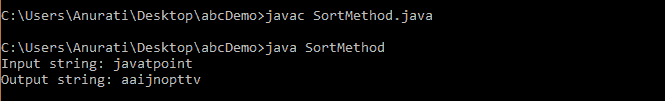
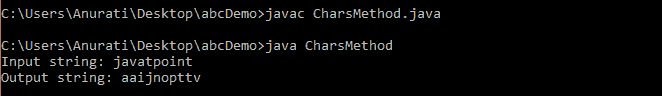
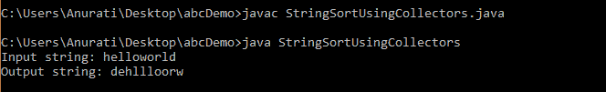
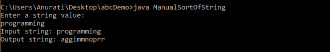
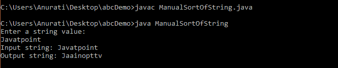
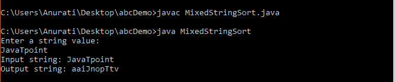

# 如何在 Java 中对字符串进行排序

> 原文：<https://www.tutorialandexample.com/how-to-sort-a-string-in-java>

排序是将元素按一定的顺序(升序或降序)排列的过程。大多数情况下，字母顺序或自然顺序用于字符串。换句话说，排序是以标准形式转换数据的过程(以使其可读)。

## Java 字符串

在 [Java](https://www.javatpoint.com/java-tutorial) 中，字符串被认为是存储字符值序列的对象。字符数组的工作方式类似于 Java 字符串。

[Java 字符串](https://www.javatpoint.com/java-string)本质上是**不可变的**，也就是说，一旦字符串对象被创建，我们就不能修改它的值。所以我们在对一个字符串进行排序时，排序后字符被打乱，我们要创建一个新的字符串来存储排序后的字符串。

在 Java 中，String 类没有任何直接对字符串进行排序的方法；但是，有不同的方法和类来对字符串进行排序。

## 在 Java 中对字符串排序

以下是在 Java 中对字符串进行排序的方法:

1.  使用 Arrays.sort()方法
2.  使用 String.chars()方法(Java 8)
3.  使用 toCharArray()方法进行手动排序
4.  使用比较器类

## 使用 Arrays.sort()方法

**数组**类的 **sort()** 方法根据 ASCII 值对字符进行排序，在这里我们可以定义自定义的比较器对字符串进行排序。

使用 Arrays.sort()方法的步骤如下:

1.  使用 **toCharArray()** 方法将输入字符串转换成字符数组。
2.  一旦我们得到了字符数组，就使用 Arrays.sort()方法对它进行排序。
3.  再次将排序后的字符数组转换回字符串。这里，我们将这个数组传递给 String 类的构造函数。

**举例**:

让我们考虑下面的例子，我们在 Java 中对指定的字符串进行排序。

**SortMethod.java**

```
//importing Arrays class
import java.util.Arrays;

public class SortMethod
{
    public static void main(String[] args)
    {
        //declaring and initializing a string
        String str = "javatpoint";

        //converting the string into character array using toCharArray() method
        char[] ch = str.toCharArray();

        //using sort() method to sort the array
        Arrays.sort(ch);

        //converting the sorted array back to String
        //storing it in new string
        String strNew = new String(ch);

        //printing the before sorting
        System.out.println("Input string: " + str);
        //printing the after sorting
        System.out.println("Output string: " + strNew);
    }
} 
```

**输出:**

  

## 使用 String.chars()方法(Java 8)

Java 8 流类提供了对字符串进行排序的特性。它有一个 **String.chars()** 方法，该方法返回 IntStream，它描述了字符串字符的整数表示。一旦我们获得了 IntStream，我们就可以对它进行排序，并将排序后的整数存储在 StringBuilder 对象中。

**例 1:**

考虑下面的例子，在 Java 中使用 **String.chars()** 方法对字符串进行排序。

**charm hod . Java**

```
public class CharsMethod
{
    public static void main(String[ ] args)
    {
        //declaring and initializing a string
        String str = "javatpoint";

        //converting the string into IntStream using chars()
        String strNew = str.chars()
                .sorted()
                .collect(
                        StringBuilder :: new,
                        StringBuilder :: appendCodePoint,
                        StringBuilder :: append)
                .toString();

        //printing the before sorting
        System.out.println("Input string: " + str);
        //printing the after sorting
        System.out.println("Output string: " + strNew);
    }
} 
```

**输出**:

  

**例 2:**

我们可以将字符串中的每个字符转换成一个单独的字符串，得到一个字符串流，而不是创建 IntStream 。

这里，我们需要导入**流。收藏家**班和**流。 **java.util** 包的流**类。

让我们考虑下面的例子来理解。

**StringSortUsingCollectors.java**

```
//importing necessary classes
import java.util.stream.Collectors;
import java.util.stream.Stream;

public class StringSortUsingCollectors
{
    public static void main(String[ ] args)
    {
        //declaring and initializing a string
        String str = "helloworld";

        //converting the string into IntStream using chars()
        String strNew = Stream.of (str.split(""))
                    .sorted()
                    .collect(Collectors.joining());

        //printing the before sorting
        System.out.println("Input string: " + str);
        //printing the after sorting
        System.out.println("Output string: " + strNew);
    }
} 
```

**输出:**

  

**使用 for()循环手动排序**

我们也可以使用循环的**手动排序一个 Java 字符串，并比较字符串元素，将它们打乱并按升序或降序排列。**

这里，我们使用两个 for 循环来比较每个元素。

以下是在 Java 中手动排序字符串的步骤

1.  使用 toCharArray()方法将输入字符串转换为字符数组。
2.  使用任何数组排序技术对数组进行排序。这里我们使用冒泡排序。
    *   比较数组的前两个元素。
    *   如果第一个元素大于第二个元素，交换(交换它们的位置)。
    *   类似地，比较第二个和第三个元素，如果第二个元素大于第三个元素，则交换。
    *   重复该过程，直到数组结束。

**举例:**

让我们考虑下面的例子，我们使用手动排序方法对字符串进行排序。

**ManualSortOfString.java**

```
//importing necessary classes
import java.util.Arrays;
import java.util.Scanner;
public class ManualSortOfString {
   public static void main(String args[ ]) {

      int temp, size;
      Scanner sc = new Scanner(System.in);

      //accepting String from the user
      System.out.println("Enter a string value: ");
      String str = sc.nextLine();

      //converting the string into character array
      char charArray[] = str.toCharArray();

      //finding the length of above array
      size = charArray.length;

      //traversing through the array to sort the elements
      for(int i = 0; i < size; i++ ){
         for(int j = i + 1; j < size; j++){
            if (charArray[i] > charArray[j]){
               temp = charArray[i];
               charArray[i] = charArray[j];
               charArray[j] = (char) temp;
            }
         }
      }

      //converting the character array back to string
      String strNew = new String(charArray);

      //printing the before sorting
      System.out.println("Input string: " + str);
      //printing the after sorting
      System.out.println("Output string: " + strNew);

 }
} 
```

**输出 1:**

  

**输出 2:**

  

正如我们所看到的，上面例子的第一个输出对所有小写字符进行了排序。但是，第二个输出没有对大写的字符串字符进行排序，因为它是一个混合字符串。

## 对混合字符串(包含大写和小写字符)进行排序

为了对一个混合的字符串进行排序，即一个既有大写字符又有小写字符的字符串，我们可以使用 Java 的**比较器**类。

以下是对混合字符串进行排序的步骤:

1.  将输入字符串转换成字符数组。这里我们将使用 for 循环向数组中添加元素。
2.  我们将使用 Arrays.sort( T [ ]，Comparator c)方法对字符数组进行排序。要使用它，我们必须实现基于自定义排序行为的 compare()方法。
3.  现在我们将使用 **StringBuilder** 类将排序后的字符数组转换回字符串。

**举例**:

让我们考虑下面的例子来理解如何在 Java 中使用 for 循环对混合字符串进行排序。

**MixedStringSort.java**

```
//importing necessary classes
import java.util.Arrays;
import java.util.Comparator;
import java.util.Scanner;

public class MixedStringSort {
	public static void main(String[] args) {

		Scanner sc = new Scanner(System.in);

		//accepting string from the user
		System.out.println("Enter a string value: ");
		String str = sc.nextLine();

		//finding the length of input string
		int len = str.length();

		//converting the string into character array
		Character charArray[] = new Character[len];

		for(int i = 0; i < len; i++){
			charArray[i] = str.charAt(i);
		}

		//sorting the string
		//ignoring case during sorting
		Arrays.sort(charArray, new Comparator<Character>(){
			@Override
			 public int compare(Character char1, Character char2)
            {
                // ignoring case
                return Character.compare(Character.toLowerCase(char1),
                                        Character.toLowerCase(char2));
            } 
		});

		//convert character array to String using StringBuilder class
		StringBuilder sb_obj = new StringBuilder(charArray.length);

		for (Character c : charArray){
			sb_obj.append( c.charArray() );
		}

		return sb_obj.toString();

	}

} 
```

**输出**:

  

在上面的输出中，字符串“JavaTpoint”的所有字符都是不分大小写排序的。

这样，我们已经学会了如何使用不同的方法和类在 Java 中对字符串进行排序。