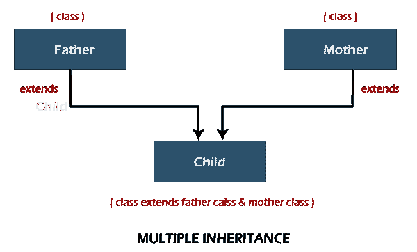
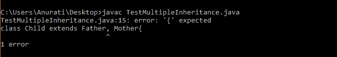
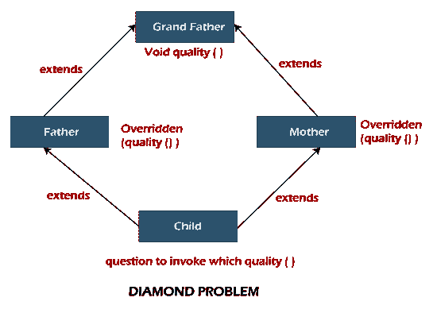
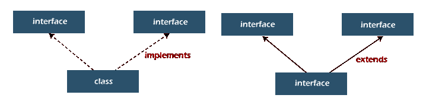
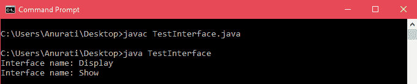

# 如何在 Java 中实现多重继承

> 原文：<https://www.tutorialandexample.com/how-to-achieve-multiple-inheritance-in-java>

多重继承是指一个类继承多个超类的属性。例如，类 **Child** 继承(扩展)了类 **Father** 和 **Mother。**如果 Java 中的超类和子类都有相同名称和参数的方法。

并且我们调用该方法，编译器无法确定调用哪个类方法。因此，Java 不支持多重继承。

  

## 多重继承示例

让我们考虑这个例子来理解为什么 Java 不支持多重继承。

```
//super class 1
class Father{
	void quality(){
		System.out.println("Discipline");
	}
}

//super class 2
class Mother{
	void quality(){
		System.out.println("Kindness");
	}
}

//subclass gives error as it inherits from multiple classes
class Child extends Father, Mother{
	public static void main(String[] args) {
		Child ch = new Child();
		ch.quality();
	}
} 
```

**输出:**

  

当我们从子类的对象中调用方法 quality()时，上面的代码会导致编译错误，从而导致歧义。

Java 不允许多重继承，以避免由此带来的歧义。

Java 没有多重继承的两个主要原因是:

**钻石问题:**

考虑下面的问题，它描述了多重继承。

*   在这里，我们有阶级**祖父**拥有方法**品质**()。
*   然后类**父亲**和**母亲**从**祖父**那里得到方法，并且它们都覆盖了方法**质量**()。
*   现在类 **Child** 派生自**父亲**类和**母亲**类，具有多重继承。如果调用方法 **quality** ()，编译器将无法确定调用哪个方法(父类的覆盖方法还是母类的覆盖方法)。这就是所谓的钻石问题。

  

**简单:**

使用类的 Java 中不允许多重继承，即一个类只能扩展一个类。处理由于多重继承而产生的复杂性是复杂的。各种操作，如造型、构造函数链接等。，都因它而受阻。所以为了避免这样的问题，Java 没有多重继承。

虽然 Java 不支持多重继承，但是有一种方法可以解决上述例子引起的歧义。

## Java 接口

通过使用**接口**可以实现 Java 中的多重继承。接口可以被称为一个类的蓝图。它包含**静态** **常量**和**抽象** **方法**。默认情况下，接口变量是静态的和最终的，方法是抽象的。

Java 8 在接口中引入了默认和静态方法。

Java 9 在接口中引入了私有方法。

## 接口声明

可以使用关键字 interface 来声明接口。抽象是在接口中实现的，因为所有的方法都是**抽象**，所有的变量默认都是**静态**和**最终**T6。

**注意**:如果一个类实现了一个接口，就必须实现那个接口的所有方法。

**语法**:

```
interface interface_name {
//declaring constant variables
//declaring methods 
} 
```

**举例**:

```
//defining the interface
interface InterfaceTest{
void display();
}

//defining the class and implementing the interface
class Class1 implements InterfaceTest {
public void display(){
System.out.println("Displaying the data");
}

//main method
public static void main(String[] args) {
	Class1 obj = new Class1();
	obj.display();
}
}
```

**输出:**

  

## Java 中的多重继承

当一个类实现了多个接口或者一个接口扩展了多个接口时，称为多重继承。

  

**例 1:**

让我们考虑在 Java 中使用多重继承的基本例子。

**TestInterface.java**

```
//interface 1
interface Display{

	//declaring the method 
	void display_method();
}

//interface 2
interface Show{

	//declaring the method 
	void show_method();
}

//defining the class which implements the interfaces
class TestInterface implements Display, Show {

	//defining method of Interface 1
	public void display_method(){
		System.out.println("Interface name: Display");
	}

	//defining method of Interface 2
	public void show_method(){
		System.out.println("Interface name: Show");
	}

	//main method
	public static void main(String[] args) {
		TestInterface obj = new TestInterface();

		//calling the methods
		obj.display_method(); 
		obj.show_method();
	}

} 
```

**输出**:

  

Java 中的类(由于不明确)不支持多重继承；但是，它受接口支持。这是因为实现接口的类提供了方法的实现。

**例 2:**

让我们考虑下面的例子，我们用相同的方法名创建了两个接口。这些方法在接口中声明，并在类中实现。

**TestClass.java**

```
//interface 1
interface Interface1{

	//declaring the method 
	void hello();
}

//interface 2
interface Interface2{

	//declaring the method 
	void hello();
}

//defining the class which implements the interfaces
class TestClass implements Interface1, Interface2 {

	//defining hello() method 
	public void hello(){
		System.out.println("Interfaces do not cause ambiguity");
	}

	//main method
	public static void main(String[] args) {
		TestClass obj = new TestClass();

		//invoking the method with class object
		obj.hello(); 

	}
} 
```

输出:

  

在上面的例子中，接口 1 和接口 2 有相同的方法 hello()；但是，它的实现是由 ClassTest 类提供的，所以没有歧义。

## 默认方法:

在 Java 中，一个类可以实现多个接口。这些接口提供了方法 *s.* 的默认实现，这里是*，*所有的接口都包含具有相同签名的默认方法，所以实现接口的类应该明确地指出要调用哪个默认方法，或者简单地覆盖默认方法。

**例 3:**

考虑下面这个使用默认方法实现多重继承的例子。

**TestDefaultMethod.java**

```
//defining first interface
interface Interface1{

	//defining default method
	default void display(){
	System.out.println("This is method of first interface");
	}
}

//defining second interface
interface Interface2{

	//defining default method
	default void display(){
	System.out.println("This is method of second interface");
	}
}

//class that implements Interface1 and Interface2
public class TestDefaultMethod implements Interface1, Interface2{

	//overriding default method display()
	public void display(){
		//using super keyword to invoke display() of Interface1
		Interface1.super.display();

		//using super keyword to invoke display() of Interface2
		Interface2.super.display();		
	}

	public static void main(String[] args) {
		TestDefaultMethod dm = new TestDefaultMethod();
		dm.display();
	}
} 
```

**输出:**

  

这样我们就学会了如何借助接口在 Java 中实现多重继承。