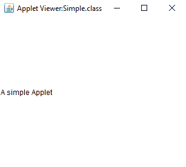
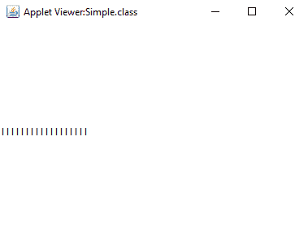
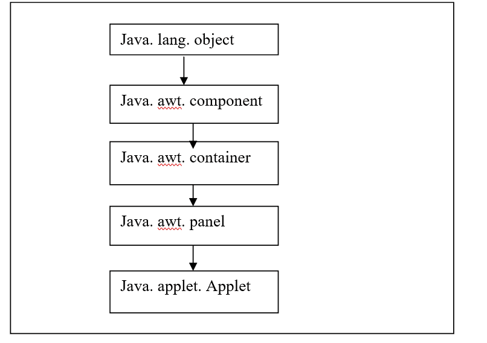
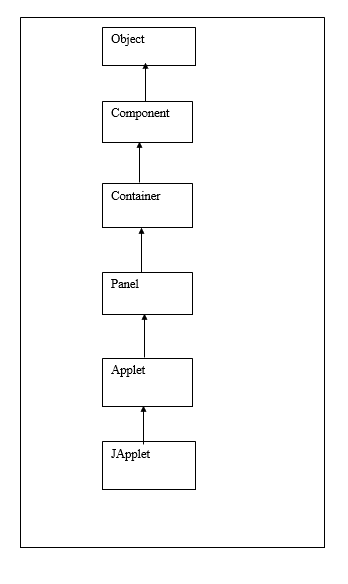
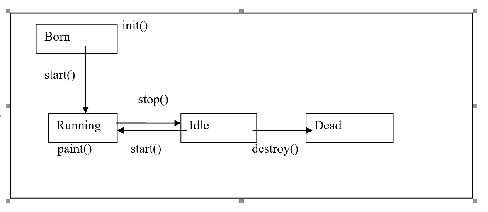
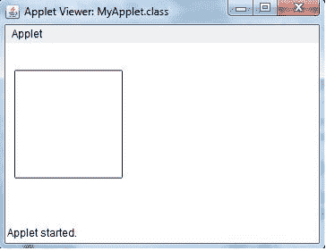

# 如何在 Java 中运行 Applet 程序

> 原文：<https://www.tutorialandexample.com/how-to-run-applet-program-in-java>

applet 是一种放在网页中的新型程序。通过将 applet 插入网页，可以创建动态内容。

### 小程序的特征

*   applet 是一个 Java 类
*   它位于名为 applet 的包中
*   小程序包可以导入为:

```
import java. applet. *
```

*   创建小程序是为了嵌入 HTML 代码或网页。
*   创建 applet 程序不需要创建 main 方法
*   当用户查看嵌入了 applet 的 HTML 网页时，applet 代码会自动下载到他们的计算机上。
*   要显示 applet，Java 虚拟机(JVM)是必需的。
*   在某些情况下，JVM 可以是浏览器插件，但也可以是安装在用户机器上的不同的运行时环境。
*   JVM 生成 applet 类的实例，并在 applet 的生命周期内在用户 PC 上调用 applet 中定义的方法。
*   web 浏览器对小程序施加了安全规则，这些规则通常比适用于 Java 独立程序的规则要严格得多。
*   它经常被称为沙盒设置。
*   这样做是为了阻止有害程序在用户计算机的后台运行。
*   如果 applet 需要定制类，可以为它下载一个单独的 Java 归档(JAR)文件。
*   随着我们技能水平的提高，我们可以设计自己的职业，这意味着选择是无限的。

### Applet 和应用程序之间的区别

我们应该知道这个区别，因为 applet 不是应用。它是一个 API。API 代表应用程序编程接口。


| **小程序** | **应用** |
| applet 不需要 main 方法来执行 applet 程序 | 应用程序需要一个 main 方法来执行。这是因为执行从 main 本身开始。 |
| 小程序必须嵌入到网页中才能执行。他们不能独立运作。它们需要执行一个网页 | 它们能够独立运行，这意味着它们的运行不需要网页。 |
| 小程序只能在浏览器或小程序查看器窗口中执行或查看 | 应用程序可以查看或执行命令行界面或任何空闲。 |
| 小程序是在被称为沙盒模型安全的严格安全审查下执行的 | 应用程序在 Java 编译器下执行。他们没有任何严格的安全审查。 |
| 小程序有生命周期。它是出生状态->开始状态->运行状态->空闲状态->死亡状态每个状态都有一个特定的功能，必须在每一步定义 | 应用程序也有生命周期。它从 main 方法开始，一直执行到完成所有定义的函数。 |


### 应用程序到 Applet 的转换

下面列出了将应用程序转换为 applet 的精确过程。

*   要加载 applet 代码，创建一个带有适当标签的 HTML 页面。
*   提供一个 JApplet 类子类。宣传这个班。如果不是，则小程序
*   无法加载。
*   移除应用程序的主方法。不要为应用程序制作窗口或也称为 awt 框架。在浏览器中，我们的应用程序将是可见的。
*   任何初始化代码都应该从框架窗口函数 Object()转移到 applet 的 init()函数。applet 对象不需要显式构造。它是由浏览器为我们创建的，浏览器还运行 init 函数。
*   移除对 setSize 的调用；HTML 文件中的宽度和高度参数用于调整小程序的大小。
*   删除 setDefaultCloseOperation 调用。没有办法结束小程序；它在浏览器关闭时结束。
*   如果应用程序使用 set Title，则放弃该方法调用。小程序中不允许标题栏。(当然，我们可以使用 HTML title 标签来给网页本身加标题。)
*   避免调用 set Visible (true)。小程序会自动显示。

## 小应用程序

applet 是一种独特的应用程序，它通过嵌入网页来创建动态信息。它在客户端和浏览器内部运行。

它是使用 JVM 查看的。JVM 可以使用 Web 浏览器的插件或单独的运行时环境来运行 applet 应用程序

为了初始化 applet，JVM 生成 Applet 类的一个实例，并调用 init()函数。

**例 1:**

文件名:Simple.java

```
// awt is required for frame creation
import java.awt.*;
// in built method for applets
 import java.applet.*;
 public class Simple extends Applet 
{ 
// All the the applets are created here using paint method only
// Applets do not require a main method
public void paint(Graphics g) 
{
 g.drawString("A simple Applet", 20, 20); 
}
 } 
```

**输出**

  

**例 2:**

文件名:Simple.java

```
// awt is required for frame creation
import java.awt.*;
// in built method for applets
 import java.applet.*;
 public class Simple extends Applet 
{ 
// All the the applets are created here using paint method only
// Applets do not require a main method
public void paint(Graphics g) 
{
 g.drawString(" I I I I I I I I I I I I I I I I I I ", 20, 20); 
}
 } 
```

**输出**

  

必须在每个 Applet 应用程序中声明 paint()方法。AWT 类定义了这个方法，applet 必须优先。

每当 applet 需要多次显示结果时，就会调用 paint()函数。applet 程序的执行是另一个需要注意的关键点。

main()方法不启动 applet。实际上，applet 程序缺少 main()方法。

### 优势

*   因为它在客户端运行，所以反应时间非常短。
*   可以在任何安装了 JVM 的浏览器上运行。
*   响应时间更短，因为它在客户端运行。
*   保护
*   它可以被运行在许多不同操作系统上的浏览器使用，例如 Linux、Windows、Mac OS 等。
*   这些应用程序简单明了，用户界面也很好。
*   包括 Windows、Linux 和 Mac 在内的各种平台都可以运行这些小程序。
*   大多数在线浏览器，包括 Internet Explorer、Netscape Navigator 和 Mozilla 浏览器，都支持它。
*   它支持实时应用。
*   使用小程序的客户机-服务器通信是可能的。

### 不足之处

*   要运行 applet，必须在客户端浏览器上安装插件。
*   Java 插件是必要的，但在 web 浏览器上并不总是缺省可用的。
*   与 HTML、DHTML、Flash 等脚本语言和技术相比，它基于 GUI 的编程是复杂的。
*   下载需要很长时间。所以，它需要更长的时间来执行。

## 小程序的类型

有两种类型的小程序，如

*   本地小程序
*   远程小程序

### 本地小程序

*   本地小程序是使用 Java 程序在本地创建的小程序
*   它们存储在本地计算机或硬盘中
*   它们被用在网页中
*   这些本地小程序嵌入在网页中

### 远程小程序

*   远程构建的小程序是在远程机器上创建的。
*   通过使用互联网，我们可以连接到这台远程计算机
*   仅使用互联网将远程小程序下载到我们的设备。

### 小程序安全问题

当顾客访问网页时，小程序可以被加载到他们的计算机上。Java 的安全范例保护用户免受有害小程序的侵害。

两种策略用于安全性:

*   小程序沙盒
*   签名的小程序

### 小程序沙箱

沙箱建立了一个设置，其中小程序受到限制。由于这些限制。

*   本地文件系统、可执行文件、系统剪贴板和打印机是 applet 不能访问的客户机资源的例子。
*   小程序无法加载本地库。
*   小程序无法切换安全管理器。
*   小程序无法读取系统属性。

### 签名的小程序

*   浏览器应该使用远程执行的授权中心来验证签名的小应用程序的数字证书。
*   签名的小程序通常总是要求用户批准它们在浏览器中的执行。
*   在小程序的签名被确认后，小程序具有进一步的权限。
*   然而，这种策略要求用户通过信任 applet 来承担更大的责任。

## Applet 类

applet 类为 applet 的执行提供所有需要的帮助，包括 applet 的初始化和销毁。此外，它还提供了加载、显示和播放音频剪辑以及照片的方法。

### Applet 的层次结构

     

如图所示:

*   子视图扩展面板
*   面板扩展容器

### 小程序的生命周期

*   已创建子视图
*   小程序已启动
*   小程序已绘制
*   小程序已停止
*   小程序被销毁

### Applet 的生命周期图

  

**出生或初始化状态**

当小程序第一次加载时，它处于“诞生”或“初始化”阶段。这是使用 Applet 类的 init()方法完成的。于是小程序出现了。

**运行状态**

当 applet 类的 start()方法被系统调用时，Applet 进入运行状态。applet 初始化后，这是自动发生的。

**空闲状态**

当小程序停止运行时，它进入空闲状态。当我们退出活动小程序所在的页面时，停止会自动发生。直接调用 stop()方法可以做到这一点。

**破坏状态**

当内存被释放时，小程序被认为处于死状态。当我们希望关闭浏览器时，我们通过调用 destroy()方法自动关闭浏览器。

## Applet 的生命周期方法

生命周期方法存在于 java.applet. Applet 类和 java.awt. Component 类中。

### java.applet. Class 中的方法有:

*   公共 void init()
*   公共 void 开始()
*   公共无效站点()
*   公共 void 销毁()

**init()方法**

init()方法用于初始化 applet。它只能被调用一次。

**start()方法**

在 init()方法被声明或者浏览器被最大化之后，这个方法被调用。如果没有这个方法，applet 将无法启动。

**停止()方法**

调用此方法来停止小程序或最小化浏览器。

**销毁()方法**

调用该方法来销毁 applet。这个方法只能用一次。

### java.awt 中的方法。组件类是:

*   公共空白油漆(图形 g)

该方法被调用或调用或用于绘制小程序。它提供了图形类对象，可用于绘制椭圆形，圆形，油漆颜色等。

### Applet 程序结构

所有的小程序可能会也可能不会覆盖这些方法，但是它们使用得最多。他们是

**init()**

这个方法“init”用于我们的 applet 需要的任何初始化。在 applet 标签内的 param 标签被处理后，它被调用。要调用的第一个方法是 init()。变量在此时被初始化。在 applet 运行期间，这个函数只被调用一次。

**开始()**

Start 是在 init 方法调用之后由浏览器自动调用的方法。如果用户在离开 applet 到另一个页面后，又导航回到 applet 所在的页面，也会调用这个函数。init 之后，start()函数被调用()。使用此方法可以重新启动已停止的小程序。

**停止()**

当用户离开 applet 所在的页面时，会自动调用 stop 函数。因此，它可能会在同一个 applet 中被多次调用。使用了方法 stop()。当 applet 不可见时，调用一个不需要执行的线程来挂起它。

**销毁()**

这种方法 destroy 只能由浏览器的定期关闭来触发。一旦用户离开包含 applet 的页面，我们通常不应该留下资源，因为 applet 被设计为存在于 HTML 页面上。当我们的 applet 必须从内存中完全删除时，我们使用 destroy()函数。

**画图()**

在 start()函数之后，以及每次 applet 必须在浏览器中重新绘制自己时，都会立即调用 paint 方法。实际上，paint()函数继承自 java.awt. Component 类

> **注:**
> 
> Who is responsible to manage the life cycle of an applet?
> 
> Java Plug-in software

**举例:**

文件名:KK.java

```
import java. applet.*;
 import java.awt.*; 
public class KK extends Applet 
{
int h, w;
 public void init() 
{
h = getSize().height;
w = getSize().width; 
setName ("MyApplet"); 
}
 public void paint(Graphics gx) 
{ 
gx.drawRoundRect(11, 29, 130, 119, 3, 2); 
}
 } 
```

**输出:**

  

### Applet 程序结构

```
import java.awt.*; 
 import java.applet.*;
 public class Example extends Applet 
{ 
public void init ( ) 
{ 
 // An applet is born 
}
 public void start ( ) 
{ 
// start or resume running of an applet
} 
public void stop( ) 
{ 
// Stop the applet running
{
public void destroy ( ) 
{ 
// Killing the applet after completion
}
 public void paint (Graphics g) 
{ // Painting the applet with shapes, text etc.
 }
 }
```

### 小程序的运行

类似于我们编译控制台应用程序的方式，创建了一个 applet 程序。不过，有两种方法可以启动 applet，即在支持 Java 的 web 浏览器上运行 applet。

利用一个 applet 浏览器，像默认程序，Applet 浏览器。一个小程序的查看器给我们的小程序窗口执行

在同一目录中创建一个快速 HTML 文件，以便在 web 浏览器中运行 Applet。里面的

在文件的 body 标记中包含以下代码。使用下面给出的“Applet”标签加载 applet 类:

File Name: MyApplet. html

```
< html >
 < body >
< applet code = “ MyApplet. class” width = 399 height = 129 >
< / applet >
< / body >
< / html > 
```

### 使用小程序查看器运行小程序

要用 applet 查看器执行 Applet，如上所述编写简短的 HTML 文件。

如果将其命名为 MyApplet.html，那么下面的命令将运行我们的 applet 程序。

```
c:/>appletviewer MyApplet.html
```

**举例:**

使用小程序将两个数相加

文件名:Add.java

```
import java.awt.*;  
import java.awt.event.*;  
import java.applet.*;  
public class Add extends Applet implements ActionListener  
{  
    TextField t11 = new TextField(10);  
    TextField t22 = new TextField(10);  
    TextField t33 = new TextField(10);  
    Label l11 = new Label (“ N1 = “);  
    Label l22 = new Label (“ N2 = “); 
    Label l33 = new Label (" N1 + N2 is :");  
    Button b1 = new Button ("SUM");  
    public void init()  
    {  
        t1.setForeground(Color = Black);  
        add (l11);  
        add (t11);  
        add (l22);  
        add (t22);  
        add (l33);  
        add (t33);  
        add (b1);  
  b1.addActionListener (this);  
    }  
    public void actionPerformed (ActionEvent e)  
    {  
        if  (e.getSource() == b1)  
        {  
            int a = Integer.parseInt(t11.getText());  
            int b= Integer.parseInt(t22.getText());  
            t33.setText (" " + (a + b));  
        }  
    }  
} 
```

**HTML 代码**

```
< html> 
<body> 
<applet code= “Add.class” width="300" height="300">
 < / applet > 
< / body > 
< / html > 
```

**举例:**

使用小程序将两个数相加

File Name: Mul.java

```
import java.awt.*;  
import java.awt.event.*;  
import java.applet.*;  
public class Mul extends Applet implements ActionListener  
{  
    TextField t11 = new TextField(10);  
    TextField t22 = new TextField(10);  

    TextField t33 = new TextField(10);  
    Label l11 = new Label (“ N1 = “);  
    Label l22 = new Label (“ N2 = “); 
    Label l33 = new Label (" N1 X N2 is :");  
    Button b1 = new Button ("Mul");  
    public void init()  
    {  
        t1.setForeground(Color = Black);  
        add (l11);  
        add (t11);  
        add (l22);  
        add (t22);  
        add (l33);  
        add (t33);  
        add (b1);  
  b1.addActionListener (this);  
    }  
    public void actionPerformed (ActionEvent e)  
    {  
        if  (e.getSource() == b1)  
        {  
            int a = Integer.parseInt(t11.getText());  
            int b= Integer.parseInt(t22.getText());  
            t33.setText (" " + (a * b));  
        }  
    }  
} 
```

**HTML 代码**

```
< html> 
<body> 
<applet code= “Mul.class” width="300" height="300">
 < / applet > 
< / body > 
< / html >
```

### 小程序可用性

旧版本的 Java(Java SE 12 之后的版本)不支持 web Start 应用程序或小应用程序，因此，如果我们试图使用这些版本的 Java 执行 Java 小应用程序，我们可能会遇到某些问题。

小程序 API 在 JDK 17 中已被指定为不推荐使用，将被删除。这意味着 API 将从 JDK 18 中删除。鉴于所有的浏览器要么已经停止支持它们，要么已经计划这样做，Applet API 的淘汰是很长的时间。

由于现代浏览器和 Oracle JDK / JRE 取消了对 Java 插件的支持，一些小程序已被弃用。