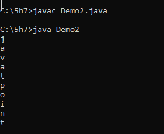
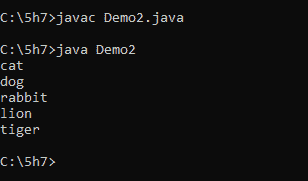
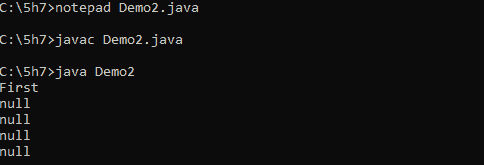

# 如何在 Java 中初始化字符串数组

> 原文：<https://www.tutorialandexample.com/how-to-initialize-string-array-in-java>

在本教程中，我们将学习如何在 java 中初始化字符串数组。

字符串数组的初始化在 java 中通过使用 **NEW** (它为类创建对象)操作符进行数组初始化。

java 中的字符串数组用于存储固定数量的字符串。

java main 方法也包含字符串参数，如下所示:

**Public static void main(String args[])**

字符串数组的初始化为空？

我们知道数组大小是不能改变的。

空数组的语法:

```
 private static final String[] EMPTY_ARRAY = new String[0];
```

java 字符串数组是数组中对象的集合。

在 java 中，数组是动态编写的。为了创建一个数组，我们使用两种方法。第一个是没有尺寸的创造，第二个是有尺寸的创造。

创建大小数组的语法:

```
String [] s1 = new String [‘Apple’, ‘Banana’, ‘Mango’];
```

我们可以对字符串数组执行不同的操作，如插入、删除、更新、排序、搜索等...

让我们看看创建一个没有大小的字符串数组的语法。

```
String [] S1;
```

我们也可以用另一种方法创建任何字符串。

```
String s1[];
```

但以上一种是标准方式。在上面的语法中，字符串是空值，我们声明为 String [3]的 s1 值放置了三个空值。

编译器会将存储的默认值作为空值。

众所周知，数组大小是固定的。但是我们可以在动态创建后改变数组的大小。ArrayList 方法通过增加或减少大小来改变大小。

*   让我们看看数组列表的语法:

```
List<String> ArrayList = new ArrayList<>(Arrays.asList(“apple”, “banana”, “mango”));
System.out.println(ArrayList);
```

*   我们可以使用实例变量创建一个字符串数组。以下语法将使用默认值创建一个新字符串。

```
   String [] array = (String []) Array.newInstance(String.class,2);
   System.out.println(Arrays.toString(arr));
```

**例题**

让我们看一个初始化字符串数组的简单程序。声明一个变量 String []并使用赋值操作符初始化字符串集合，我们可以将字符串赋给 String []类。

**例 1:**

```
import java.io.*;
public class Demo2
{
public static void main(String args[])
{
String letters[] = {"j", "a", "v", "a", "t" , "p" ,"o" , "i" , "n", "t"};
for(String letter: letters)
{
System.out.println(letter);
}
}
} 
```

**输出:**

**  

因此这是一个初始化字符串数组的简单程序。

**例 2:** 让我们看看另一个声明字符串数组的最简单的方法:

```
import java.io.*;
public class Demo2
{
public static void main(String args[])
{
String animals[] = new String[5];
animals[0] = "cat";
animals[1] = "dog";
animals[2] = "rabbit";
animals[3] = "lion";
animals[4] = "tiger";
for(String animal: animals)
{
System.out.println(animal);
}
}
} 
```

**输出:**

**  

上述两个程序将具有相同的值。但是如果你使用 equals 方法，它会以 false 退出。因为 equals 方法看不到内容，所以它显示基于程序的引用。

**让我们看看字符串数组将如何转换成字符串**

Arrays.toString()方法将字符串数组转换为字符串函数。我们不能直接实施。我们可以用字符串转换来表示字符串函数。

主要有许多方法来初始化字符串数组。我们将讨论其中的一些。

**例 3:**

```
Import java.io.*;
public class Demo2 
{
    public static void main(String args[]) 
{
        String[] myArr;
        myArr = new String[5];
        myArr[0] = "First";

        for (int i = 0; i < myArr.length; i++)
{
            System.out.println(myArr[i]);
        }
    }
} 
```

**输出:**

  

### Java 中字符串数组概述

*   java 字符串数组是数组中对象的集合。
*   在 java 中，数组是动态编写的。为了创建一个数组，我们使用两种方法。第一个是没有尺寸的创造，第二个是有尺寸的创造。
*   默认字符串值存储为空值。
*   java 中的字符串数组用于存储固定数量的字符串。****