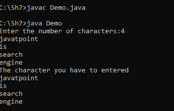
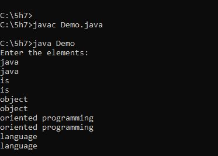
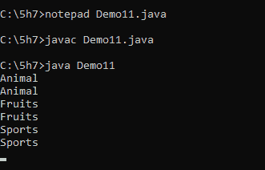
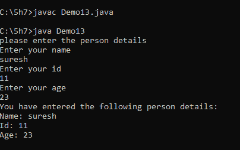

# 如何使用 Scanner 类在 Java 中输入多个字符串

> 原文：<https://www.tutorialandexample.com/how-to-take-multiple-string-input-in-java-using-scanner-class>

Scanner 类是通过对象和方法接受多个输入数据或单个输入数据的类。Scanner 类将在 java.util 包中提供。

在本文中，我们很兴奋地学习如何使用 Scanner 类读取 java 中的多字符串输入。

我们在与方法相关的数据类型中调用的 Scanner 类中的方法:


| **数据类型** | **方法** |
| 整数 | nextInt() |
| 浮点 | nextFloat() |
| 布尔代数学体系的 | nextBoolean() |
| 线 | nextLine() |
| 性格；角色；字母 | 下一个()。charAt(0) |


### 创建 Scanner 类的语法

```
Classname objectname = new Classname(parameters);
Scanner sc = new Scanner();
```

这里我们使用 Scanner 作为类名，sc 作为对象名。

 **现在我们将通过 java 中的例子来了解数据类型。

为了编写程序，我们主要使用一些数据类型。即字符串数据类型、整数数据类型、浮点数据类型、字符数据类型等...

### Java nextInt()方法:

java nextInt()方法将 Scanner 类移动到下一个整数值。它读取整数输入数据。

### Java nextFloat 方法:

java nextFloat()方法将当前 scanner 类移动到下一个浮点值。它读取浮点值。

### Java nextBoolean()方法:

java nextBoolean()方法将当前类移动到下一个布尔值。scanner 类读取布尔值 true 或 false。

### Java nextLine()方法:

java nextLine()移动到当前扫描器类的下一行。java scanner 类读取字符串输入数据，包括单词之间的空格。

### Java next.charAt(0)方法:

next.charAt(0)方法类似于 nextLine()方法。唯一的区别是它读取字符数据，而不读取单词之间的空格。

 ****例题**

让我们看一个使用 scanner 类读取个人数据的简单示例程序。

**例一**:

```
import java.util.Scanner;
public class Demo    // class name
{
public static void main(String[] args)   // main method
{
Scanner ss = new Scanner(System.in);  // scanner class
System.out.print("Enter the number of characters:");
String[] str1 = new String [ss.nextInt()];
sc.nextLine();// nextLine() Method
for (int i = 0; i < str1.length; i++)   // initializing for loop
{
str1[i] = ss.nextLine();
} //i
System.out.println("The character you have to entered");
for(String str: str1)// for-each loop syntax
{
System.out.println(str);
}// for
} // Demo
}// main
```

**输出:**

  

在上面的例子中，我们考虑多个字符串输入。我们使用 nextLine()这样的方法来移动下一行。

**例 2:**

```
import java.util.Scanner;
public class Demo  // class name
{
public static void main(String[] args)// main method
{

int n=5;
System.out.println("Enter the elements: ");
Scanner sc = new Scanner(System.in);  // scanner class
for(int i = 0; i < n; i++)  // initializing for loop
{
String str1 = sc.nextLine();// nextLine() method
System.out.println(str1);
}
}
}
```

**输出:**

  

在上面的 java 例子中，我们采用了多个字符串输入。在这个例子中，我们使用了 nextLine()方法。如果 scanner 类的另一个 nextLine()方法当前正在使用中，该方法将返回 true 语句。在下面的代码中，for 循环一直执行，直到方法返回 false。

**例 3:**

```
import java.util.Scanner;
public class Demo11  // class name
{
public static void main(String[] args)   // main method
{
Scanner scn = new Scanner(System.in);// scanner class
while(scn.hasNextLine())  //while loop with nextLine() method
{
System.out.println(scn.nextLine());
}
}
} 
```

**输出:**

  

在上面的 java 例子中，我们采用了多个字符串输入。在这个例子中，我们使用了 nextLine()方法。如果 scanner 类的另一个 nextLine()方法当前正在使用中，该方法将返回 true 语句。在下面的代码中，while 循环一直执行，直到方法返回 false。

**例 4:**

```
import java.util.Scanner;
public class Demo13  
{
public static void main(String[] args) 
{
String name;
int id, age;
Scanner sc = new Scanner(System. in );
System.out.println("please enter the person details");
System.out.println("Enter your name");
name = sc.nextLine();
System.out.println("Enter your id");
id = sc.nextInt();
System.out.println("Enter your age");
age = sc.nextInt();
System.out.println("You have entered the following person details:");
System.out.println("Name: " + name);
System.out.println("Id: " + id);
System.out.println("Age: " + age);
}
} 
```

**输出:**

  

这是初级水平学生的基本扫描仪课程。这里我们使用了两个方法，比如用于字符串输入的 nextLine()和用于整数输入的第二个方法 nextInt()。****