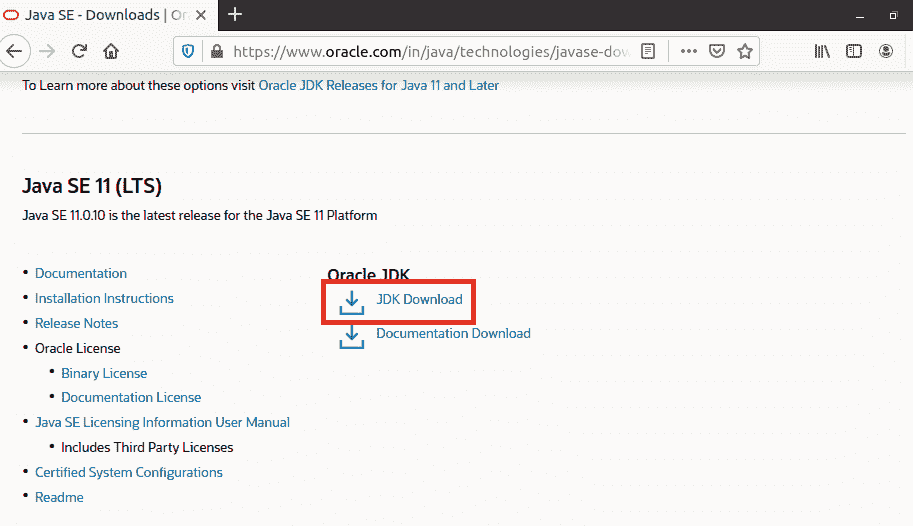

# 如何卸载 Ubuntu 中的 Java

> 原文：<https://www.tutorialandexample.com/how-to-uninstall-the-java-in-ubuntu>

我们在日常生活中需要在电脑上安装 java，因为有许多不同的应用程序是使用 java 环境开发的，所以我们必须在电脑上安装 java，以使基于 java 的应用程序运行起来没有困难。

我们需要从我们的计算机中删除 java，例如通过更新我们的 java 的最新版本或者释放我们机器上的空间。在 Ubuntu 上安装 Java 很容易，但是卸载它对很多事情来说很难破解。在这里，我们将学习 java 有多少个版本，有什么区别，以及如何从我们的计算机中完全删除它们。

### 如何在 Linux (Ubuntu)上检查哪种类型的 java:

当我们要从我们的设备上删除 java 时，首先我们必须检查我们在电脑上使用的是什么类型的 java。如果我们安装 java 只是为了运行 java 应用程序，那么它就是“Java 运行时环境(JRE)”或者，如果您出于开发目的安装了 java，那么我们可能会有这些:

*   JDK
*   Oracle Java

“开放 JDK”和“Oracle Java”的主要区别在于它是开源的，并且是基于许可的。Oracle Java 在性能和稳定性方面非常高效。

## 如何在 Ubuntu 上安装 Java

在 Java 中，有各种平台可供下载

1.  Java 标准版(Java SE)
2.  Java 微型版(Java ME)
3.  Java 企业版(Java EE)
4.  JavaFX

我们将下载 Java 的标准版，即 Java SE。

在不同的 Java 平台中，有各种各样的 Java 实现可以安装在我们的系统上。Ubuntu 库用于提供一个开源的 Java 实现，称为开放 JDK 和开放 JRE。Oracle Java 是另一种可以下载的实现方式。

### 安装 OpenJDK 和 OpenJRE

*   通过按键盘上的 Ctrl + Alt + T 启动终端。
*   更新系统的程序包列表。

```
sudo apt-get update
```

*   发出以下命令下载 OpenJDK。
*   键入字母

通过在终端中键入 **java - version** 来验证 Java 是否已成功安装在您的系统上。如果结果显示与 Java 包相关的版本信息，则 Java 已成功安装在您的系统上。

### 下载并安装 Oracle Java

Ubuntu 库不提供任何官方的 Oracle Java 包。因此，您必须添加第三方存储库来下载它。

1.  通过按 Ctrl + Alt + T 选项卡打开终端。
2.  输入以下命令在您的系统中获取 add-apt-repository。
3.  Oracle Java 包提供了两个存储库，可以将这两个 PPA 存储库中的任何一个添加到您的系统中。
4.  使用 **apt** **更新您系统的软件包列表**
5.  **在您的系统中安装 Oracle Java 11。**

 **我们也可以从 Oracle 官方网站下载 Oracle Java 包。为此:

*   前往[甲骨文 Java 下载](https://www.oracle.com/in/java/technologies/javase-downloads.html)网页。
*   向下滚动滚动条，直到找到 Java SE 11 (LTS)下载部分。

```
RE TO SUBSCRIBE
```

关闭



*   从可用下载列表中下载 **Linux x64Debian 包**
*   检查我是否已阅读并接受 Oracle Java SE 选件的 Oracle 技术网络许可协议。
*   点击下载获取软件包。

要安装刚刚下载的 Oracle Java 包，请转到保存**的位置。** **deb** 文件。双击文件启动 Ubuntu **软件位置**。

点击**安装**按钮，开始在您的系统上安装 Oracle Java。

### 将 Java 添加到环境变量中

如果您已经从官方网站安装了 Oracle Java，那么您必须在您的系统上手动设置 Java PATH 变量。

1.  在本地存储中找到 Java 的安装目录。
2.  在您的终端中发出给定的语句，并用前面命令的输出替换路径/to/java。
3.  验证 **JAVA_HOME** 是否是**路径**变量
4.  确保 Java 路径配置正确
5.  路径已成功设置。Java 目录将显示在输出中
6.  添加 Java **/** **bin** 目录，从 Ubuntu 中移除 Java

一旦你完成了 Java，你就可以很容易地在 Ubuntu 上卸载它。要删除 OpenJDK 和 OpenJRE:

1.  使用 Ctrl + Alt + T 启动终端。
2.  发出以下命令从系统中删除 Java。
3.  通过键入 y 来完成卸载过程。

OpenJDK 和 OpenJRE 将自动从您的计算机中删除。

安装了 Oracle JDK 的人有两种方法可以卸载 Java。我们可以双击. deb 包文件打开软件位置，然后单击 Remove 按钮卸载该包。

或者，我们可以使用您的系统终端删除不同的软件包。

1.  在 Ubuntu 上打开终端。
2.  使用 pkg 和 grep 获得 JDK 包名
3.  使用 apt 移除包装。
4.  用前面语句的输出替换包名。
5.  键入字母 y 并按 Enter 键继续卸载过程。

## 管理 Ubuntu 上的 Java 安装

现在，将数据库与 Java 应用程序集成已经变得更加容易。 **JDBC** (Java 数据库连接)是 Java SDK 的一个组件，它允许我们添加、删除、更新和安全地存储包含信息的记录。**