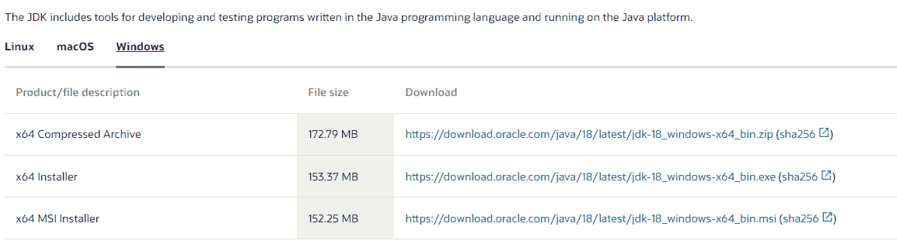

# 如何更新 Java

> 原文：<https://www.tutorialandexample.com/how-to-update-java>

众所周知，java 可以安装在所有操作系统中，如 windows、Linux、macOS。我们在市场上提供 java 17 和 java 18 版本。任何人都可以通过几个步骤将 java 安装到他们的操作系统中。

 **在本文中，我们正在学习和使用 windows 操作系统。

Java 是一种 OOP(面向对象编程)语言，可以在任何软件应用程序中运行。java 主要用于 web 应用程序、服务器应用程序和移动应用程序，用于开发应用程序。在目前的情况下，java 将用于主要的应用程序中，这些应用程序将促进技术的发展。

在这篇文章中，我们学习了 windows 操作系统的更新和安装过程。

为了首先更新 java，我们必须在 windows 中安装 java 应用程序。

此更新将应用于所有窗口，如 windows 7、8、10 和 11。

我们正在学习 windows 10 中的 java 更新应用。

用于在 windows 10 中安装当前版本的 java 应用程序。我们必须打开互联网浏览器，搜索安装 windows 的 JDK (Java 开发工具)应用程序。

我们将得到如下界面:


得到这个界面后，向下滚动安装窗口。



从上述文件中下载第一个 zip 文件。下载后，解压缩所有的 zip 文件，并为执行文件设置安装过程。


单击下一步，接受所有协议和条款，完成安装过程。


在填充状态栏之后，java 应用已经安装在 windows 10 中，并且在应用终端中设置了 JRE (Java 运行时环境)。

您可以通过按键在命令提示符下检查 java 版本

Windows + r

按下键盘中的以下键后，命令提示符终端将被打开。

使用命令检查 java 的版本

```
java –version
```


这是我的 windows 10 中当前的 java 版本。

### 现在我们来看看如何在 windows 10 中更新 java。

要更新 java 应用程序，我们可以用两种方法。

*   卸载以前或旧版本，安装当前或最新版本的 java 应用程序。
*   第二种<sup>和</sup>方式由一些步骤组成:

**步骤 1:** 从窗口搜索工具打开控制面板。


**第二步:**打开控制面板 app，会得到如下界面:


**第三步:**点击小图标，获得 java 图标。

  

**步骤 4:** 点击 java 应用程序获取更新。


您将获得这种类型的界面，单击更新按钮，然后单击立即更新。


更新将自动定向。

这是 windows 10 上更新 java 应用的完整流程。

我们可以在 windows 7、8、11 中更新。

**让我们看看 windows 7 中的更新:**

这也和 windows 10 类似

我们需要遵循几个步骤来更新 windows 7 中的 java 应用程序:

**第一步:**首先进入窗口搜索工具，搜索控制面板。

**第二步:**打开控制面板后，移动到右下角，点击查看通过:

我们有三种选择:

*   种类
*   大图标
*   小图标

点击小图标，你可以看到下面的一些列表。

**第三步:**之后点击控制面板标签中的 32 位 java 应用程序，你可以在那里找到一个带有蒸汽符号或图标的咖啡杯。

**步骤 4:** 然后选择选项卡上的更新按钮，然后单击控制面板中的立即更新按钮。

**第 5 步:**点击“是”进行更改。

**步骤 6:** 完成以下步骤后，下载并运行 java 更新应用程序，然后单击 ok。

**第七步:**之后在提示符下安装更新应用。

然后在提示符下检查更新是否已安装。

对于 windows 8 和 11，这是相同的过程。

我们也可以在 Linux 和 macOS 中更新 java。

**用于检查 java 应用程序中的最新更新；**

转到控制面板中的 java 选项卡，单击 java 小程序运行时设置中的查看按钮。之后，您可以在 version 列中注意到 java 的当前版本。然后与 java 应用软件的 java 运行时版本进行比较。检查那边的更新。如果有可用的更新，请单击并更新它。**