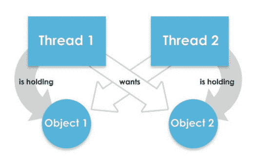

# 如何避免 java 中的死锁

> 原文：<https://www.tutorialandexample.com/how-to-avoid-deadlock-in-java>

## 死锁:

死锁是永远不会发生的事件。在 java 中，死锁只是多线程的一部分。这是一个允许我们连续运行多个线程进行多任务处理的环境。在某些情况下，不同的线程本身将等待，这将持续一个永远的状态，这就是所谓的死锁。

在线程中，每个块都有一个锁。为了制造锁，它提供同步来锁定到一个方法或代码块。



## 如何避免 java 中的死锁:

*   避免不必要的锁:我们应该只为那些将要执行操作的块分配锁。不必要地使用锁会导致死锁情况。我们建议您使用无锁数据结构。否则，保持您的代码没有锁。例如，使用并发链接队列，而不是使用同步数组列表。
*   **避免嵌套锁:**避免死锁的另一种可能方法是避免一次将一个锁分配给多个线程。如果我们已经将一个锁分配给一个线程，那么我们必须避免将一个锁分配给多个线程，否则会导致死锁。
*   **使用 Thread.join()方法:**如果我们使用两个或多个线程，通过使用另一个线程加入方法来等待对方完成，我们会得到一个死锁。如果我们的线程必须等待另一个线程完成，那么最好的方法就是使用 join 方法，并给出等待另一个线程完成的最长时间。
*   **使用锁排序:**在执行操作时，我们应该给每个锁分配一个数值。在给锁分配一个高数值之前，我们应该获取具有最小数值的锁。
*   **锁超时:**我们也可以指定线程执行锁的时间。如果一个线程没有分配锁，那么该线程在重试获取锁之前必须等待一段特定的时间。

**举例:**

```
public class DeadlockTest {
   public static void main(String[] args) throws InterruptedException {
      Demo obj1 = new       Demo ();
            Demo obj2 = new       Demo ();
           Demo obj3 = new       Demo ();
      Thread t1 = new Thread(new SyncThread(obj1, obj2), "t1");
      Thread t2 = new Thread(new SyncThread(obj2, obj3), "t2");
      t1.start();
      Thread.sleep(2000);
      t2.start();
      Thread.sleep(2000);
   }
}
class SyncThread implements Runnable {
   private       Demo obj1;
   private      Demo obj2;
   public SyncThread(      Demo o1,       Demo o2){
      this.obj1=o1;
      this.obj2=o2;
   }
   @Override
   public void run() {
      String name = Thread.currentThread().getName();
      System.out.println(name + " allocating lock on " + obj1);
      synchronized (obj1) {
         System.out.println(name + " allocated lock on " + obj1);
         work();
      }
      System.out.println(name + " removed lock on " + obj1);
      System.out.println(name + " allocating lock on " + obj2);
      synchronized (obj2) {
         System.out.println(name + " allocating lock on " + obj2);
         work();
      }
      System.out.println(name + " removed lock on " + obj2);
      System.out.println(name + " completed execution.");
   }
   private void work() {
      try {
         Thread.sleep(5000);
      } catch (InterruptedException ie) {
         ie.printStackTrace();
      }
   }
} 
```

**输出:**

```
t1 allocated g a lock on java. lang.Demo@917d8d4
t1 allocated lock on java. lang. Demo@ 917d8d4
t2 allocating lock on java. lang. Demo@ 5c4b42fb
t2 allocated lock on java. lang. Demo@ 5c4b42fb
t1 released the lock on java. lang. Demo@917d8d4
t1 allocating a lock on java. lang. Demo@ 5c4b42fb
t1 allocated lock on java. lang. Demo@ 5c4b42fb
t2 released the lock on java. lang.Object@5c4b42fb
t2 allocating lock on java. lang. Demo@ 528cb702
t2 allocated lock on java. lang. Demo@ 528cb702
t1 removed the lock on java. lang. Demo@ 5c4b42fb
t2 removed the lock on java. lang. Demo@ 528cb702
t1 completed execution.
t2 completed execution. 
```

### 出现死锁

**举例:**

```
// Importing the required packages
import java.io.*;
import java.util.*;

// Class 1
class Demo {

    public synchronized void last()
    {

        // Print and display the statement
        System. out.println("Inside Demo, last() method");
    }

    public synchronized void d1(B b)
    {
        System.out.println(
            "Thread1 start execution of d1() method");
        try {

            // Putting the existing thread to sleep for
            // specific time using sleep() method
            Thread.sleep(2000);
        }

        // Catch block to handle the exceptions
        catch (InterruptedException e) 
            System.out.println(e);
        }

        System.out.println(
            "Thread trying to call B's last() method");

        // Calling method 1 of this class as created
        // above
        b.last();
    }
}

// Class 2
// Helper class Sample
class Sample {

    // Method 1 of this class
    public synchronized void last()
    {

        // Display statement only
        System.out.println("Inside Sample, last() method");
    }
    public synchronized void d2(Demo a)
    {

        // Display message only
        System.out.println(
            "Thread2 start execution of d2() method");

        try {
            Thread.sleep(2000);
         }
        catch (InterruptedException e) {
             System.out.println(e);
        }

        System.out.println(
            "Thread2  trying to call A's last method");
        a.last();
    }
}

// Deadlock class which is extending Thread class
class Simple extends Thread {

    // Creating object of type class Demo
    Demo a = new Demo();

    // Creating object of type class Sample
    Sample b = new Sample();

    public void m1()
    {

        // Starting the thread
        this.start();

        // Calling d1 method of class A
        a.d1(b);
    }

    // run() method for the thread
    public void run()
    {

        // Calling d2 method of class B
        b.d2(a);
    }

    // Main driver method
    public static void main(String[] args)
    {

        // Creating object of this class
        Simple deadlock = new Simple();

        // Calling the m1 method
        deadlock.m1();
    }
} 
```