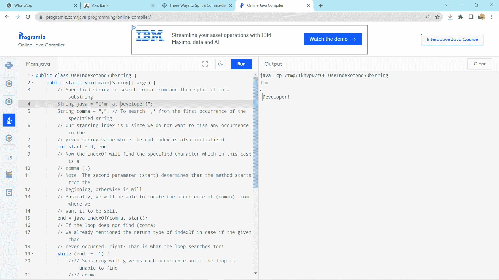

# 如何在 Java 中用逗号分割字符串

> 原文：<https://www.tutorialandexample.com/how-to-split-string-by-comma-in-java>

strsplit()技术允许您在给定显式 Java 字符串分隔符的情况下断开字符串。Java string split 属性通常是一个空格或一个逗号(，)，您希望用它来分隔字符串。

**语法**

```
public String split(String regex)
public String split(String regex, int limit) 
```

**参数**

**Regex:**Java split 中的标准清晰度应用于文本/字符串

**Limit:**Java string split 中的截止值是展示中值的最大数量。万一它被忽略或为零，它将返回每个匹配正则表达式的字符串。

**豁免抛出:PatternSyntaxException** -万一给定的普通发音的标点符号无效。

截止边界可以有三个特性:

*   **极限> 0** -如果是这种情况，在这一点上，该示例将被应用于所有被认为是极限的事物-多次，随后的簇的长度不会超过 n，并且随后的展示的最后部分将包含超过最后成对设计的所有贡献。
*   **Limit < 0** -对于这种情况，为了谨慎起见，该示例将被应用任意次数，并且随后的集群可以是任意大小。
*   **Limit = 0** -在这种情况下，为了谨慎起见，该示例将被应用任何次数，随后的集群可以是任何大小，并且随后的空字符串将被丢弃。

万一您对习惯发音不是特别熟悉，那么您同样可以使用 **StringTokenizer** 类，它同样可以分隔逗号分隔的字符串，但是 StringTokenizer 是一个旧类，不建议使用。您应该不断尝试利用来自 **java.lang.String 类**的 split()功能，因为任何展示改进都可能发生在这种技术上，而不是 StringTokenizer 类。在 Java 中，我们应该看到两到三个用逗号分隔字符串的指南。

**内部实施**

```
public String[] split(String regex, int limit) {  
        /* fast path if the regex is a
         (1)one-singe String and this character isn't one of the
            RegEx's metacharacters ".$|()[{^?*+\\", or
         (2)two-singe String and the principal roast is the oblique punctuation line and
            the second isn't the ASCII digit or ASCII letter.         */  
        char ch = 0;  
        if (((regex.value.len == 1 &&  
             ".$|()[{^?*+\\".indexOf(ch = regex.charAt(0)) == -1) ||  
             (regex.length() == 2 &&  
              regex.charAt(0) == '\\' &&  
              (((ch = regex.charAt(1))-'0')|('9'-ch)) < 0 &&  
              ((ch-'a')|('z'-ch)) < 0 &&  
              ((ch-'A')|('Z'-ch)) < 0)) &&  
            (ch < Character.MIN_HIGH_SURROGATE ||  
             ch > Character.MAX_LOW_SURROGATE))  
        {  
            int off = 0;  
            int n = 0;  
            boolean l= limit > 0;  
            ArrayList<String> list = new ArrayList<>();  
            while ((n = indexOf(ch, off)) != -1) {  
                if (!l || list.size() < limit - 1) {  
                    list.add(substring(off, n));  
                    off = n + 1;  
                } else {    // last one  
                    //assert (list.size() == limit - 1);  
                    list.add(substring(off, value.length));  
                    off = value.length;  
                    break;  
                }  
            }  
            // If no match was found, return this  
            if (off == 0)  
                return new String[]{this};  

            // Add remaining segment  
            if (!l || list.size() < limit)  
                list.add(substring(off, value.length));  

            // Construct result  
            int resultSize = list.size();  
            if (limit == 0)  
                while (resultSize > 0 && list.get(resultSize - 1).length() == 0)  
                    resultSize--;  
            String[] result = new String[resultSize];  
            return list.subList(0, resultSize).toArray(result);  
        }  
        return Pattern.compile(regex).split(this, limit);  
    } 
```

### 用分隔符分割 Java 中的字符串

下面的模型描述了在 java 中使用分隔符拆分文本的最佳技术:

假设我们有一个名为 strMain 的字符串变量，其中有几个用逗号分隔的单词，比如 Apple、Ball、Cat、Dog 和 Egg。假设我们需要每一个唯一的字符串，最好的例子是用逗号分隔。因此，我们将获得五个不同的字符串，如下所示:

*   苹果
*   球
*   猫
*   狗
*   蛋

将 java 方法中的字符串拆分应用于要分区的字符串，并提供分隔符作为参数。这个 java 按分隔符拆分字符串场景中的分隔符是逗号(，)，java 按逗号拆分字符串活动的结果是展示拆分。

**例子**

```
class StrSplit{
  public static void main(String []args){
   	String str = "Apple, Ball, Cat, Dog, Egg";
   	 String[] Split = str.split(", ");
    	for (int i=0; i < Split.length; i++)
    	{
      		System.out.println(Split[i]);
    	}
  }
}
```

**输出**

```
Apple
Ball
Cat
Dog
Egg 
```

### 分割逗号分隔字符串的三种 Java 方法:

1.  **Index()** 和 **Substring()方法**在 Java 中拆分逗号分隔的字符串
2.  **字符串列表**和**拆分方法**在 Java 中拆分逗号分隔的字符串
3.  **数组列表**和**拆分方法**以逗号分隔 Java 中的字符串值

Java string 类是大量有价值的组件，您可以利用它们来创建解决复杂问题声明的简单项目。这个教学练习将展示从逗号分隔的开始阶段或任何可以在字符串尊重集中使用的划分中分离字符串的酷方法。同样，我们将利用的**index()，这是一种用于我们最特殊的程序的技术，并协调 split()与 java 的动态集群和字符串类。**

### 1) Index()和 Substring()方法在 Java 中拆分逗号分隔的字符串:

我们可以直接利用更简单的策略来做类似的工作，因为 java 在它的 string 类中有许多保存的功能。

**Java 中的 indexof()方法**

它返回预定价值的初级事件在客户机中的位置

确定的字符串。

**参数:**


| 线 | String Str = "我，我，a，开发者"； | 假设开始记录设置为 0，indexOf()从" I "开始查找。 |
| 从索引 | 确定开始追踪的记录位置。 | 它将允许您试验索引。 |
| 茶 | 包含特定人的尊重。 | 任意的 |


**Java 中的 Substring()方法**

它返回一个字符串，该字符串是该字符串的子字符串。它始于指定的位置，止于指定点的人。

**例子**

```
public class UseIndexofAndSubString {
	public static void main(String[] args) {
		// Specified string to search comma from and then split it in a substring
		String java = "I'm, a, Developer!";
		String comma = ","; // To search ',' from the first occurrence of the specified string
		// Our starting index is 0 since we do not want to miss any occurrence in the
		// given string value while the end index is also initialized
		int start = 0, end;
		// Now the indexOf will find the specified character which in this case is a
		// comma (,)
		// Note: The second parameter (start) determines that the method starts from the
		// beginning, otherwise it will
		// Basically, we will be able to locate the occurrence of (comma) from where we
		// want it to be split
		end = java.indexOf(comma, start);
		// If the loop does not find (comma)
		// We already mentioned the return type of indexOf in case if the given char
		// never occurred, right? That is what the loop searches for!
		while (end != -1) {
			//// Substring will give us each occurrence until the loop is unable to find
			//// comma
			String split = java.substring(start, end);
			System.out.println(split); // print each sub string from the given string
			// Then add 1 to the end index of the first occurrence (search more until the
			// condition is set false)
			start = end + 1;
			end = java.indexOf(comma, start);
		}
		// Since there is no comma after the last index of the string (language!), the
		// loop could not find the end index; thus, it never printed the last word!
		// We will get the last instance of the given string using substring and pass
		// start position (Starts from L and ends at the !)
		String split = java.substring(start);
		// Brave, you got it all right!
		System.out.println(split);
	}
} 
```

**输出**



### 2)字符串列表和 Split 方法，用于在 Java 中拆分逗号分隔的字符串

在我们检查初级理解的重要性时，我们讨论了群集。伴随系统很简单。你不需要追踪开始和结束的位置，也不需要运行一些时间周期，看看回报尊重值是否为- 1。Java 的 string 和 array 类用四行简洁的代码总结了一切。与此同时，你真的想掌握两个必要的策略，这将有助于你的路线。

**Java 中的 Arrays.aslist())函数**

```
Syntax:   List<String> ArrayString = Arrays.asList(IwillBeSplit.split(","));
```

**参数:**

1.  展品组件质量等级。
2.  客户指出了存储纲要的一系列用途。
3.  它让你对你所描述的预定展品有一个大致的了解。

**Java 中的 Split()函数**

它涉及到分割技术中的两个边界，我们作为客户确定为普通清晰度和 0 的断点边界。相应地，它会在结果集中排除后面的空字符串。

**参数:**作为分隔符填充的常规关节。

**Returns:** 通过分离正则表达式发音的这一行创建的各种字符串。

**例子**

```
import java.util.Arrays;
import java.util.List;
public class UseStingListAndSplitMthd {
	public static void main(String[] args) {
		String str = "There,are,three,seasons,!&#^*,in,a,year";
		// List is an interface in Java
		List<String> ArraySting = Arrays.asList(str.split(","));
		// Using for each loop
		ArraySting.forEach(System.out::println);
	}
} 
```

**输出**

```
There
are
three
seasons
!&#^*
in
a
year 
```

### Java 中逗号分隔字符串值的数组列表和 Split 方法:

附带的代码块应该不会让您感到困惑。因为，您现在已经熟悉了**arrays . aslist())；**和**的分裂()。**在任何情况下，这里唯一不同的是处理排列的方式，即利用**数组列表<字符串>T5】而不仅仅是列表<字符串>。这并不困难。纲要是一个连接点，而数组列表是一个 Java 分类类。前面给出了一个静态展示，而最后一个选项产生了一个独特的集群来存储组件。**

**例子**

```
import java.util.ArrayList;
import java.util.Arrays;
public class ArrayListSplitMethod {
	public static void main(String[] args) {
		String str="So,many,ways,to,reach,delhi,from,hyderabad";
	ArrayList<String> Split=new ArrayList<>(Arrays.asList(str.split(",")));
		Split.forEach(System.out::println);
	}
} 
```

**输出**

```
So
Many
Ways
to
reach
Delhi
from
Hyderabad
```