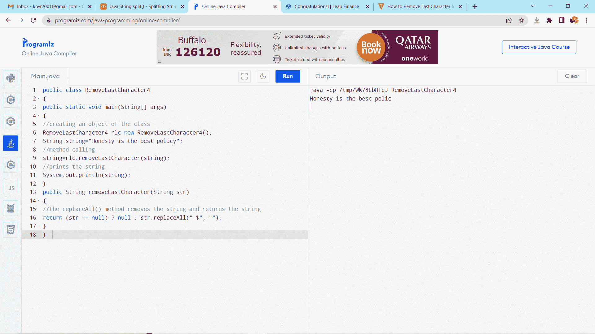

# 如何在 Java 中删除字符串的最后一个字符

> 原文：<https://www.tutorialandexample.com/how-to-remove-last-character-from-string-in-java>

在 **java** 中，主要有三个类与字符串相关联。这些类是 **String** 、 **StringBuilder** 和 **StringBuffer** 类，它们给出了与字符串控制相关的技术。从字符串中删除第一个和最后一个字符同样是我们可以在字符串上执行的活动。

有四种方法可以消除字符串中的最后一个字符:

1.  StringBuffer.deleteCahrAt()类
2.  字符串.子字符串()方法
3.  StringUtils.chop()方法
4.  正则表达式

### StringBuffer 类

StringBuffer 是 string 的一个伴生类，它提供了 string 的大部分用途。string 处理固定长度、不变的人员分组，而 StringBuffer 处理可增长和可写的人员继承。StringBuffer 可能将字符和子字符串嵌入中间或尽可能地附加在后面。考虑到这种增加，它将自然地发展，并且经常具有比允许发展空间所真正需要的更多数量的字符。

**string buffer 类的构造函数**

1.StringBuffer(): 它为 16 个字符保留空间，无需重新分配

```
     StringBuffer s1 = new StringBuffer();
```

2.StringBuffer( int size ):它确认一个整数争用，该整数争用明确设置了摇篮的大小。

```
     StringBuffer s2 = new StringBuffer(20);
```

3. **StringBuffer(String str):** 它确认一个字符串争用，该字符串争用设置 StringBuffer 对象中的底层项，并为 16 个额外的字符存储空间，无需重新分配。

```
     StringBuffer s3 = new StringBuffer("Hello !!! World");
```

### StringBuffer 类的方法

**append()** :用于向当前文本的末尾添加文本。

**Length()**:string buffer 的长度可以通过 Length()策略来追踪

**容量()**:限额()策略可以追踪到全部发放的限额

**delete()** :从召唤物 delete 中擦除一组字符。

**CharAt():** 删除由 loc 确定的文件中的人员

**ensureCapacity():** 担保限额实质上相当于给定的最小限额。

**Insert ():** 保证限额实质上等同于给定的最低限额。

**length():** 返回字符串的长度

**reverse():** 反转 StringBuffer 对象中的字符

**replace():** 用 StringBuffer 对象中的一个集合替换一串字符

StringBuffer 类给出了一个技术 **deleteCharAt()。**该技术将一个人从预定位置抹去。我们利用该技术从 java 字符串中删除一个字符。它确认 int 类型的边界列表。名单是我们需要抹去的人的位置。它返回这个对象。

**语法:**

```
public StringBuffer deleteCharAt(int index)  
```

**例子**

```
public class RemoveLastCharcterEx  
{  	
	public static void main(String args[])  
	{  
		String str = "Hello !!! World";  
		//constructor of StringBuffer class  
		StringBuffer sb= new StringBuffer(str);  
		sb.deleteCharAt(sb.length()-1);  
		//prints the string after deleting the character   
		System.out.println(sb);  
	}  
} 
```

**输出**


### 字符串.子字符串()方法

Java 字符串类 **substring** ()技术返回字符串的一部分。我们传递 Java 子串策略中的 beginIndex 和 endIndex 数字情况，其中 beginIndex 是全面的，endIndex 是限制性的。总而言之， **beginIndex** 从 0 开始，而 **endIndex** 从 1 开始。

Java string 中有两种子串技术。

1.  公共字符串 substring(int startIndex)
2.  公共字符串 substring(int startIndex，int endIndex)

接受 beginIndex 为负或 beginIndex > endIndex 或 endIndex >字符串长度，它抛出 IndexOutOfBoundsException。

substring()是 string 类的技术。它解析两个边界，int 类型的 beginIndex 和 endIndex。它返回另一个字符串(子字符串)。它没有被安全地串起来，因为它没有抛出一个假设字符串无效的特例。

**例子**

```
public class RemoveLastCharacterEx 
{  
	public static void main(String[] args)   
	{  
		//object of the class  
		RemoveLastCharacterEx R1 = new RemoveLastCharacterEx();  
		String str="Hello !!! World";  
		//method calling  
		str=R1.removeLastChar(str);        
		System.out.println(string);  
	}  
	private String removeLastChar(String s)   
	{  
		// returns the string in the wake of eliminating the last person
		return s.substring(0, s.length() - 1);  
	}   
} 
```

**输出**


### StringUtils.chop()方法

StringUtils 类提供了 chop()技术来消除字符串中的最后一个人。该技术分析字符串类型的边界。它同样将 invalid 作为一个参数。它返回在消除最后一个人之后的字符串。当我们输入一个无效的字符串时，它同样会返回一个无效的字符串。

**语法:**

```
public static String chop(String str) 
```

为了利用 StringUtils 类的 chop()技术，我们想在 pom.xml 文档中添加相应的 reliance。当我们在 pom 文档中添加 Apache lodge lang3 容器时，它下载容器记录并将容器记录添加到路中。我们应该导入包 org . Apache . commons . lang 3 . string utils。

```
<dependency>
            <groupId>org.apache.commons</groupId>
            <artifactId>commons-lang3</artifactId>
            <version>3.12.0</version>
</dependency>
```

**例子**

```
import org.apache.commons.lang3.StringUtils;  
public class RemoveLastCharacter3
{  
	public static void main(String[] args)   
	{  
		String string=" Google";  
		//invoking method  
		s=StringUtils.chop(string);  
				System.out.println(s);  
	}  
} 
```

**输出**


### 正则表达式

正则表达式是构成狩猎设计的一系列字符。当您在文本中查找信息时，您可以利用这个搜索示例来描述您正在查找的内容。正则表达式可以是一个孤独的人，也可以是一个更复杂的设计。正则表达式可用于执行各种文本搜索和文本替换任务。Java 没有底层的正则表达式类，但是我们可以导入 java.util.regex 包来处理标准发音。这个包包含了附带的类:

*   **模式类** -定义一个示例(在搜索中使用)
*   **匹配器类** -用于寻找例子
*   **PatternSyntaxException 类** -表示标准发音设计中的语法错误。

我们同样可以利用正则表达式从字符串中删除最后一个人。String 类给出了 replaceAll()技术，该技术解析两个边界 regex 和类型 String 的替换。该策略用预定义的匹配替换该字符串。

*   **Regex** :是排列字符串的动词化。
*   **替换**:每场比赛的交换字符串或替换字符串。

它返回后续的子字符串。

**语法:**

```
public String replaceAll(String regex, String replacement) 
```

**例子**

```
public class RemoveLastCharEx
{  
	public static void main(String[] args)   
	{  
		//creating an object of the class  
		RemoveLastCharEx R1=new RemoveLastCharEx ();  
		String str="Honesty is the best policy";  
		//method calling  
		str=R1.removeLastCharacter(string);  
		//prints the string  
		System.out.println(str);  
	}  
	public String removeLastChar(String str)   
	{  
		// the replaceAll() strategy eliminates the string and returns the string			return (str == null) ? null : str.replaceAll(".!$", "");  
	}  
} 
```

**输出:**

