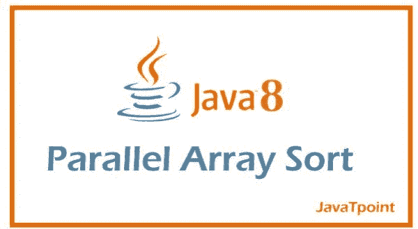

# Java 中的并行数组排序

> 原文：<https://www.tutorialandexample.com/parallel-arrays-sort-in-java>

***排序是一种按升序排列数字序列的技术，即第一个数字最低，数字逐渐递增，使最后一个数字在所有数字中最高。*** 我们也可以对无序的字母进行排序，也就是从 A、B、C 到 z 排列字母，Java 中对数组排序有不同的方法。下面借助合适的编程示例对此进行解释。

## 传统的数组排序

借助嵌套循环和一堆条件语句，可以对数组进行排序。这种方法的问题是过程很长，代码的可读性受到损害，此外，传统方法的时间复杂性和空间复杂性非常高，如果我们正在处理一个巨大的数组，不建议使用传统的排序方法。

**/*Java 程序使用传统方法对数组进行排序*/**

```
import java.util.*;

class Main{

   public static void main(String[] args){

      int arr[]=new int[150];

      System.out.println("Array before sorting:");

      for(int i=0;i<arr.length;i++){

         arr[i]=1+(int)(Math.random()*150);

         System.out.print(arr[i]+" ");     

      }

      System.out.println();

      for(int i=0;i<arr.length;i++){

         for(int j=i+1;j<arr.length;j++){

            int x=arr[i]; //Constant

            if(arr[i]>arr[j]){

               arr[i]=arr[j];

               arr[j]=x;

            }

         }    

      }

      System.out.println("Array after sorting using the traditional method:");

      for(int i: arr){

         System.out.print(i+" ");

      }

   }

}
```

**输出-**

```
Microsoft Windows [Version 10.0.22000.318]

(c) Microsoft Corporation. All rights reserved.

C:\Users\USER\Desktop\JTP Folder>javac Main.java //Compile

C:\Users\USER\Desktop\JTP Folder>java Main //Run

Array before sorting:

49 47 62 11 33 80 87 61 79 120 147 79 20 25 135 47 120 150 25 28 14 29 131 111 13 126 72 61 11 105 85 107 119 70 90 29 137 134 144 125 45 75 57 130 64 118 6 43 114 94 30 81 9 93 146 94 127 10 139 112 135 95 78 104 45 39 3 139 12 109 71 91 68 109 65 85 121 5 114 91 28 26 42 28 95 85 77 38 143 8 86 79 101 59 48 42 106 37 61 80 133 150 39 144 10 95 50 17 90 128 101 140 138 97 150 98 140 43 95 131 42 17 18 122 126 21 84 39 40 138 47 22 111 143 83 45 46 56 94 61 30 74 34 109 13 45 82 120 4 149

Array after sorting using the traditional method:

3 4 5 6 8 9 10 10 11 11 12 13 13 14 17 17 18 20 21 22 25 25 26 28 28 28 29 29 30 30 33 34 37 38 39 39 39 40 42 42 42 43 43 45 45 45 45 46 47 47 47 48 49 50 56 57 59 61 61 61 61 62 64 65 68 70 71 72 74 75 77 78 79 79 79 80 80 81 82 83 84 85 85 85 86 87 90 90 91 91 93 94 94 94 95 95 95 95 97 98 101 101 104 105 106 107 109 109 109 111 111 112 114 114 118 119 120 120 120 121 122 125 126 126 127 128 130 131 131 133 134 135 135 137 138 138 139 139 140 140 143 143 144 144 146 147 149 150 150 150
```

## 数组串行排序的内部工作

数组串行排序使用**归并排序算法**或 **Tim 排序算法**对内容进行排序。

这种类型的排序都是按顺序进行的，即使合并排序使用分治技术，它也是按顺序进行的。

**/*使用 Arrays.sort()方法对数组进行排序的 Java 程序*/**

```
import java.util.*;

class Main{

   public static void main(String[] args){

      int arr[]=new int[150];

      System.out.println("Array before sorting:");

      for(int i=0;i<arr.length;i++){

         arr[i]=1+(int)(Math.random()*150);

         System.out.print(arr[i]+" ");     

      }

      System.out.println();

      Arrays.sort(arr);

      System.out.println("Array after sort:");

      for(int i: arr){

         System.out.print(i+" ");

      }

   }

}
```

**输出-**

```
Microsoft Windows [Version 10.0.22000.318]

(c) Microsoft Corporation. All rights reserved.

C:\Users\USER\Desktop\JTP Folder>javac Main.java //Compile

C:\Users\USER\Desktop\JTP Folder>java Main //Run

Array before sorting:

28 13 58 117 142 144 88 139 123 131 135 134 89 81 127 55 96 56 119 95 117 122 72 59 111 30 20 107 2 62 28 11 80 18 128 36 17 113 40 102 8 45 9 12 46 14 143 104 84 116 107 142 39 18 32 35 138 8 97 39 92 143 115 25 22 20 2 2 85 145 114 17 4 41 68 24 70 145 53 18 110 47 93 40 87 90 21 125 124 57 137 66 60 142 30 34 14 36 70 115 37 111 23 57 7 109 125 123 143 98 90 133 21 142 132 137 132 93 98 110 139 17 115 23 92 17 100 123 114 56 14 83 17 111 29 80 113 134 98 100 6 120 120 138 17 1 30 80 90 77

Array after sort:

1 2 2 2 4 6 7 8 8 9 11 12 13 14 14 14 17 17 17 17 17 17 18 18 18 20 20 21 21 22 23 23 24 25 28 28 29 30 30 30 32 34 35 36 36 37 39 39 40 40 41 45 46 47 53 55 56 56 57 57 58 59 60 62 66 68 70 70 72 77 80 80 80 81 83 84 85 87 88 89 90 90 90 92 92 93 93 95 96 97 98 98 98 100 100 102 104 107 107 109 110 110 111 111 111 113 113 114 114 115 115 115 116 117 117 119 120 120 122 123 123 123 124 125 125 127 128 131 132 132 133 134 134 135 137 137 138 138 139 139 142 142 142 142 143 143 143 144 145 145
```

## 数组并行排序和数组串行排序有什么不同？

从查看者的角度来看，数组并行排序和数组串行排序的工作方式几乎相同，也可以互换。在内部，数组的并行排序算法是一种并行排序-合并算法，它负责将数组分解为子数组，子数组本身经过排序，然后进行合并。当子数组的长度达到最小粒度时，借助 Arrays.sort()方法对子数组进行排序。如果指定数组的长度小于最小粒度，则使用适当的 Arrays.sort()方法对其进行排序。该算法要求工作空间小于或等于原始数组指定范围的大小。ForkJoin 公共池用于执行任何并行任务。

  

**/*使用 Arrays.parallelSort()方法对数组进行排序的 Java 程序*/**

```
import java.util.*;

class Main{

   public static void main(String[] args){

      int arr[]=new int[150];

      System.out.println("Array before sorting:");

      for(int i=0;i<arr.length;i++){

         arr[i]=1+(int)(Math.random()*150);

         System.out.print(arr[i]+" ");     

      }

      System.out.println();

      Arrays.parallelSort(arr);

      System.out.println("Array after parallel sort:");

      for(int i: arr){

         System.out.print(i+" ");

      }

   }

}
```

**输出-**

```
Microsoft Windows [Version 10.0.22000.318]

(c) Microsoft Corporation. All rights reserved.

C:\Users\USER\Desktop\JTP Folder>javac Main.java //Compile

C:\Users\USER\Desktop\JTP Folder>java Main //Run

Array before sorting:

106 11 110 133 103 70 79 137 94 3 33 77 112 47 31 69 66 31 107 88 36 68 146 92 140 95 44 147 87 77 149 109 49 34 25 71 23 35 92 122 59 67 139 52 118 62 94 139 141 140 80 102 83 37 133 106 104 40 92 92 7 28 30 28 128 53 123 143 71 141 28 94 90 138 44 126 25 33 68 1 83 16 88 61 51 62 46 58 132 30 64 95 32 42 126 60 74 142 40 126 123 39 29 58 97 10 87 75 22 23 26 15 122 121 24 43 61 19 99 147 96 109 7 97 83 47 67 39 52 4 112 26 62 82 63 99 146 15 140 100 145 145 38 31 31 24 109 99 107 66

Array after parallel sort:

1 3 4 7 7 10 11 15 15 16 19 22 23 23 24 24 25 25 26 26 28 28 28 29 30 30 31 31 31 31 32 33 33 34 35 36 37 38 39 39 40 40 42 43 44 44 46 47 47 49 51 52 52 53 58 58 59 60 61 61 62 62 62 63 64 66 66 67 67 68 68 69 70 71 71 74 75 77 77 79 80 82 83 83 83 87 87 88 88 90 92 92 92 92 94 94 94 95 95 96 97 97 99 99 99 100 102 103 104 106 106 107 107 109 109 109 110 112 112 118 121 122 122 123 123 126 126 126 128 132 133 133 137 138 139 139 140 140 140 141 141 142 143 145 145 146 146 147 147 149
```

在数组并行排序方法的帮助下，还可以在一个间隔内定制和排序数组。下面给出的编程示例显示了这一点:

**/*使用 Arrays.parallelSort()方法对数组的前 50 个元素进行排序的 Java 程序*/**

```
import java.util.*;

class Main{

   public static void main(String[] args){

      int arr[]=new int[150];

      System.out.println("Array before sorting:");

      for(int i=0;i<arr.length;i++){

         arr[i]=1+(int)(Math.random()*150);

         System.out.print(arr[i]+" ");     

      }

      System.out.println();

      Arrays.parallelSort(arr,0,50);

      System.out.println("Array after sorting the 1st 50 elements:");

      for(int i: arr){

         System.out.print(i+" ");

      }

   }

}
```

**输出-**

```
Microsoft Windows [Version 10.0.22000.318]

(c) Microsoft Corporation. All rights reserved.

C:\Users\USER\Desktop\JTP Folder>javac Main.java //Compile

C:\Users\USER\Desktop\JTP Folder>java Main //Run

Array before sorting:

133 120 36 118 138 141 106 68 150 70 90 90 1 4 63 17 34 7 66 112 11 10 51 100 11 150 26 97 126 91 61 32 101 88 98 67 67 128 123 56 128 113 116 67 103 67 41 122 140 103 144 91 59 107 47 136 50 57 14 88 38 117 78 103 12 62 89 87 32 145 38 111 121 98 108 97 28 39 51 117 134 114 60 95 136 131 137 17 114 84 12 102 139 11 35 17 69 119 64 130 37 140 43 68 33 105 134 102 12 80 51 119 58 69 57 36 94 133 139 8 5 83 99 62 141 91 123 80 36 64 32 54 41 142 8 80 90 14 92 23 71 145 139 28 105 85 92 54 37 111

Array after sorting the 1st 50 elements:

1 4 7 10 11 11 17 26 32 34 36 41 51 56 61 63 66 67 67 67 67 68 70 88 90 90 91 97 98 100 101 103 103 106 112 113 116 118 120 122 123 126 128 128 133 138 140 141 150 150 144 91 59 107 47 136 50 57 14 88 38 117 78 103 12 62 89 87 32 145 38 111 121 98 108 97 28 39 51 117 134 114 60 95 136 131 137 17 114 84 12 102 139 11 35 17 69 119 64 130 37 140 43 68 33 105 134 102 12 80 51 119 58 69 57 36 94 133 139 8 5 83 99 62 141 91 123 80 36 64 32 54 41 142 8 80 90 14 92 23 71 145 139 28 105 85 92 54 37 111
```

**/*Java 程序使用 Arrays.parallelSort()方法对数组的后 50 个元素进行排序*/**

```
import java.util.*;

class Main{

   public static void main(String[] args){

      int arr[]=new int[150];

      System.out.println("Array before sorting:");

      for(int i=0;i<arr.length;i++){

         arr[i]=1+(int)(Math.random()*150);

         System.out.print(arr[i]+" ");     

      }

      System.out.println();

      Arrays.parallelSort(arr,arr.length-50,arr.length);

      System.out.println("Array after sorting the last 50 elements:");

      for(int i: arr){

         System.out.print(i+" ");

      }

   }

}
```

**输出-**

```
Microsoft Windows [Version 10.0.22000.318]

(c) Microsoft Corporation. All rights reserved.

C:\Users\USER\Desktop\JTP Folder>javac Main.java //Compile

C:\Users\USER\Desktop\JTP Folder>java Main //Run

Array before sorting:

28 130 85 80 40 124 76 49 64 11 2 15 100 64 67 26 129 107 19 143 134 114 64 27 103 107 106 62 36 21 10 71 54 68 150 29 53 55 90 23 150 48 82 5 57 27 62 69 97 67 118 40 116 4 94 61 30 56 143 139 143 114 27 96 41 46 131 63 137 38 56 86 46 18 111 98 79 16 133 1 97 59 1 35 22 131 107 106 76 3 140 30 98 88 73 121 135 44 71 40 30 53 22 137 8 65 74 96 24 59 5 34 134 136 76 126 21 126 100 35 77 24 73 19 145 5 143 86 128 73 55 61 17 44 77 39 134 30 40 117 134 39 53 60 20 44 99 6 56 52

Array after sorting the last 50 elements:

28 130 85 80 40 124 76 49 64 11 2 15 100 64 67 26 129 107 19 143 134 114 64 27 103 107 106 62 36 21 10 71 54 68 150 29 53 55 90 23 150 48 82 5 57 27 62 69 97 67 118 40 116 4 94 61 30 56 143 139 143 114 27 96 41 46 131 63 137 38 56 86 46 18 111 98 79 16 133 1 97 59 1 35 22 131 107 106 76 3 140 30 98 88 73 121 135 44 71 40 5 5 6 8 17 19 20 21 22 24 24 30 30 34 35 39 39 40 44 44 52 53 53 55 56 59 60 61 65 73 73 74 76 77 77 86 96 99 100 117 126 126 128 134 134 134 136 137 143 145
```

**/*Java 程序使用 Arrays.parallelSort()方法对数组之间的元素进行排序*/**

```
import java.util.*;

class Main{

   public static void main(String[] args){

      int arr[]=new int[150];

      System.out.println("Array before sorting:");

      for(int i=0;i<arr.length;i++){

         arr[i]=1+(int)(Math.random()*150);

         System.out.print(arr[i]+" ");     

      }

      System.out.println();

      Arrays.parallelSort(arr,50,100);

      System.out.println("Array after sorting in between.");

      for(int i: arr){

         System.out.print(i+" ");

      }

   }

}
```

**输出-**

```
Microsoft Windows [Version 10.0.22000.318]

(c) Microsoft Corporation. All rights reserved.

C:\Users\USER\Desktop\JTP Folder>javac Main.java //Compile

C:\Users\USER\Desktop\JTP Folder>java Main //Run

Array before sorting:

83 26 19 145 55 48 20 143 89 112 133 92 60 100 115 88 149 39 56 88 25 33 33 7 91 1 24 93 26 62 88 141 119 114 73 32 38 101 147 27 36 33 82 27 18 113 85 13 102 110 80 26 97 73 82 146 35 129 143 111 135 56 104 140 108 89 132 134 37 28 47 135 33 43 22 34 9 84 111 35 86 92 106 148 117 33 98 30 116 24 88 124 59 55 135 52 53 61 34 136 88 44 84 78 34 28 22 105 29 42 71 141 93 149 14 109 84 59 74 122 147 89 48 140 11 105 15 22 9 131 71 78 139 142 24 139 91 138 50 65 121 134 11 109 31 98 52 123 34 97

Array after sorting in between.

83 26 19 145 55 48 20 143 89 112 133 92 60 100 115 88 149 39 56 88 25 33 33 7 91 1 24 93 26 62 88 141 119 114 73 32 38 101 147 27 36 33 82 27 18 113 85 13 102 110 9 22 24 26 28 30 33 33 34 34 35 35 37 43 47 52 53 55 56 59 61 73 80 82 84 86 88 89 92 97 98 104 106 108 111 111 116 117 124 129 132 134 135 135 135 136 140 143 146 148 88 44 84 78 34 28 22 105 29 42 71 141 93 149 14 109 84 59 74 122 147 89 48 140 11 105 15 22 9 131 71 78 139 142 24 139 91 138 50 65 121 134 11 109 31 98 52 123 34 97
```