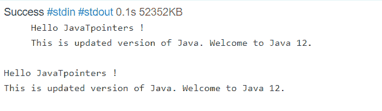

# Java 12 的新特性

> 原文：<https://www.tutorialandexample.com/whats-new-in-java-12>

2019 年 3 月 19 日 <sup>th</sup> 发布 Java 12 <sup>th</sup> 版本。在发布这个版本后，他们决定每六个月发布一个新版本。该版本是 JDK 11 的高级或更新版本。在这里，我们将了解 Java 12 的高级性能及其新特性。

## 功能和语言变化

Java 12 提供了许多新的语言特性，比 Java 11 更先进。下面列出了一些功能。

*   字符串类新方法
*   文件::不匹配方法
*   发球收集器

现在让我们用代码和输出来简单讨论一下它们。

### 字符串类新方法

在 Java 12 版本的更新版本中，Java String 类中有两个新方法。这两种新方法是

*   缩进()
*   转换()

让我们简单了解一下每种方法。

**indent()方法**

这个方法接受参数，并根据我们在方法中给定的参数或数字对每一行进行缩进。如果我们给定的数字或参数大于零或正数，那么在每一行的开头都会加上空格。否则，如果我们给出一个小于零的负数，那么这个方法将从行首删除空格。如果文本没有足够的空白，则所有前导白色字符都将被删除。

现在让我们举一个例子，首先我们将尝试添加空格，然后我们将尝试删除空格。

IndentExpl.java

```
// importing the packages
import java.util.*; 
import java.lang.*;
import java.io.*;
class IndentExpl
{
	public static void main (String[] args) throws java.lang.Exception
	{
		String txt = " Hello JavaTpointers !\n This is an updated version of Java. Welcome to Java 12.";
txt = txt.indent(4); // using the indent() method. Giving a positive number means spaces will be added
System.out.println(txt); // printing the txt

txt = txt.indent(-10); // using the indent() method. Giving a negative number means spaces will be reduced.
System.out.println(txt); // printing the txt
	}
}
```

**输出:**

  

**代码解释:**

在上面的代码中，我们首先导入了它们所使用的包。*，郎。*和木卫一。*.接下来，我们创建了一个名为 IndentExpl 的类。在 main 方法中，我们声明了一个字符串 txt。接下来，我们使用 indent()方法。首先，我们给了一个正数 4，所以空格被添加到 txt 中。在下一个方法中，我们给出了负数。这意味着空格将被删除。在这个程序中，我们给了-10，它超过了我们的空格，但是只有存在的空格被删除。文本不受数量超过的影响。

**transform()方法:**

因为这个方法的名字表明我们可以转换一个字符串。这里，Java 12 的这个新函数只接受一个参数作为输入，并返回转换后的形式作为输出。

让我们通过使用程序和输出来更多地了解这个函数。

```
import java.util.*;
import java.lang.*;
import java.io.*;

class TransformExpl
{
	public static void main (String[] args) throws java.lang.Exception
	{
String s = "Welcome, To, JavaTpoint";
List l = s.transform(s1 -> {return Arrays.asList(s1.split(","));});
System.out.println(l);
}
}
```

**输出:**

  

**代码解释:**

在上面的代码中，我们首先导入了包 util。*，郎。*和木卫一。*.接下来，我们创建了一个新类 TransformExpl。在 main 方法中，我们声明了一个字符串 s。接下来，我们将该字符串转换为列表 l。我们使用 split()函数来拆分 txt。因此，我们得到了如上图所示的输出。

### 文件::不匹配方法

在“nio.file.Files 实用程序”类中，java 12 版本提供了一个新的不匹配方法。

```
public static long mismatch(Path path, Path path2) throws IOException
```

通常，此方法用于比较两个文件，第一个不匹配的字节作为输出返回。如果文件是相同的意思，我们将得到-1L 作为输出。如果文件中有任何不匹配，那么输出将在 0L 到较小字节大小的范围内。

让我们使用一个示例语法来更好地理解这种方法。在第一个程序中，我们将创建两个相同的文件来获得输出 as -1L。接下来，我们将

```
Path path1 = Files.createTempFile("file1", ".txt");
        Path path2 = Files.createTempFile("file2", ".txt");
        Files.writeString(path1, " Hello ! Welcome to JavaTpoint ");
        Files.writeString(path2, " Hello ! Welcome to JavaTpoint ");
        long mismatch1 = Files.mismatch(path1, path2); // using mismatch method
        System.out.println(
            " Below the mismatch position in a file is returned. If the files are the same, then -1 is returned. ");
        System.out.println(
            " In file 1 and file 2 the mismatch position is at : "
            + mismatch1);
        Path path3 = Files.createTempFile("file3", ".txt");
        Path path4 = Files.createTempFile("file4", ".txt");
        Files.writeString(path3, " Hello ! Welcome to JavaTpoint ");
        Files.writeString(path4, " Hello ! Welcome to Tutorial and Example ");
        long mismatch2 = Files.mismatch(path3, path4); // using mismatch method 
        System.out.println(
            " In file 3 and file 4 the mismatch position is at : "
            + mismatch2); 
```

**说明**:

我们创建了两个字符串，这两个字符串是相同的。接下来，我们使用失配方法来检查文本是否有任何失配。由于这些是相同的文件，我们不会得到任何不匹配，我们得到-1L 作为输出。接下来，我们还创建了不同的文本，并使用这种不匹配的方法，因为它们是不同的文本，我们将获得不匹配的地方的位置。

### 发球收集器

对于收集器，在 Java 的新版本 Java 12 中添加了类 teeing collector。

下面是 tee collector 的语法。通过这种语法，我们可以很容易地了解 tee collector。

```
Collector<T, ?, R> teeing(Collector<? super T, ?, R1> downstream1,
  Collector<? super T, ?, R2> downstream2, BiFunction<? super R1, ? super R2, R> merger)
```

在 tee collector 的语法中，我们使用两个下游收集器。所以，每个元素通过使用两个下游收集器被处理。现在，已处理的元素被发送到合并函数。在 merge 函数中，元素被合并，并产生最终的输出。

开球收集器包含三个组件，即两个收集器和一个 bi 函数。因此，输入被提供给收集器，我们将通过双函数接收输出。

让我们使用一个语法示例来更多地了解这个 teeing collector。

```
double meanofthedigits = Stream.of(10,5,2,6,1)
                .collect(Collectors.teeing(
                        summingDouble(i -> i),
                        counting(),
                        (sum, n) -> sum / n));
System.out.println(meanofthedigits);
```

这里我们给了收集者号码。接下来，我们想找出这些数字的平均值。我们已经计算了平均值，输出将是 4.8。