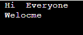

# Java 14 的新特性

> 原文：<https://www.tutorialandexample.com/new-features-of-java-14>

在 Java 13 版本中预览的开关表达式和文本块等特性在 Java 14 中是标准化的。

## Java 14 中的特性

1.  开关表达式
2.  文本块
3.  记录
4.  空指针异常
5.  实例 of
6.  包装工具
7.  垃圾收集者

## 1.切换表达式

Switch 表达式最初是在 Java 12 版本中发布的。但是在 Java 14 发布之前，它只是预览版，在 Java 14 中它被标准化了。

**Main.java**

```
import java.util.*;
public class Main{  
public static void main(String[] args) {  
    //Declaring a variable for switch expression  
    Scanner sc=new Scanner(System.in);
    System.out.println("Enter the number");
    int n=sc.nextInt();
    //Switch  expression is declared  
    switch(n){  
    //Different Case statements  are declared 
    case 10: System.out.println("Entered number is 10");  
    break;  
    case 20: System.out.println("Entered number is  20");  
    break;  
    case 30: System.out.println("Entered number is 30");  
    break;  
    //Default case statement  
    default:System.out.println("Number is not in 10, 20 or 30");  
    }  
}  
} 
```

通过使用开关表达式，我们可以用更简单的方式修改代码

**Main.java**

```
public class Main{  
public static void main(String[] args) {  
    //Declaring a variable for switch expression  
    String n= "Cse";
    String result= " ";
    //Switch  expression is declared  
    switch(n)
    {  
    //Different Case statements  are declared 
    case "Cse" -> result=" computers"; 
    case "ece" -> result= " electrical";  

    //Default case statement  
    default-> result="B.Tech";
    }  
    System.out.println(result);
}  
} 
```

## 2.文本块

与 Java 13 版本相比，Java 14 版本增加了两个转义字符。

*   \:表示行尾
*   \s:表示一个空格

以前在 Java 13 中，文本块是这样写的

**Main.java**

```
import java.io.*;
import java.util.*;
public class Main{  
public static void main(String[] args) 
{  
    // text is given
    String text = "Hello everyone ; Welcome to Java 14 Features";
    System.out.println(text);
}  // Main
} // class 
```

现在有了 Java 14 的新特性，我们可以将上面的文本写成

**Main.java**

```
import java.io.*;
import java.util.*;
public class Main{  
public static void main(String[] args) 
{  
    // text is given
   String text =" Hi  Everyone \n Welocme";
    System.out.println(text);
}  // Main
} // class
```

**输出:**



## 3.模式匹配

我们使用关键字 instance 来检查对象是否是一个类的实例。

**Main.java**

```
import java.io.*;
import java.util.*;
public class Main {
  public static void main(String[] args) {
    Main Obj = new Main();
    System.out.println(Obj instanceof Main); 
// prints true
  }
}
```

## 4.记录

*   在记录中，您可以利用嵌套的类和接口。
*   您还可以拥有嵌套的记录，这些记录是自动静态的。
*   接口可以通过记录来实现。
*   可以创建一个通用记录类。
*   序列化数据是可能的。

## 5.空指针异常

当一个对象引用一个空值时，就会引发 NullPointerException。

**TestSingleton.java**

```
import java.util.UUID;
import java.io.*;
class Main
{
    private static Singleton single = null;
    private String ID = null;
     Singleton()
    {
        ID = UUID.randomUUID().toString();
    }
    public static Singleton getInstance()
    {
        if (single == null)
            single = new Singleton();
        return single;
    }
    public String getID()
    {
        return this.ID;
    }
}
// Driver Code
public class TestSingleton
{
    public static void main(String[] args)
    {
        Singleton s = Singleton.getInstance();
        System.out.println(s.getID());
    }
} 
```

### 6.内存访问

Java 14 提供了 Java API，允许 Java 应用程序访问安全有效地存储在 Java 堆之外的外部内存。