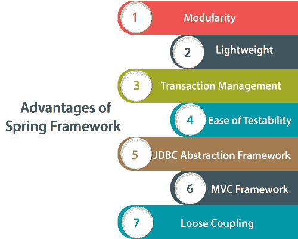
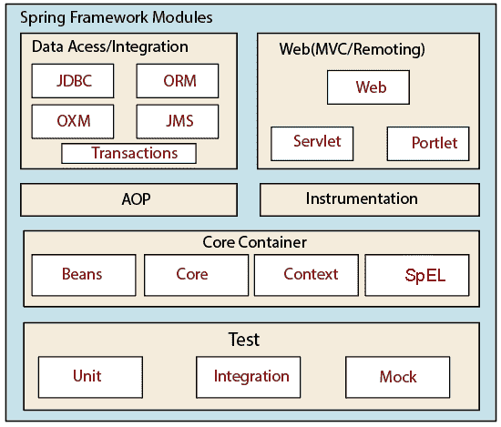

# 春季教程

> 原文：<https://www.tutorialandexample.com/spring-tutorial/>

### 什么是 Spring 框架？

Spring 是用于开发 Java 应用程序的最流行的企业应用程序框架之一。“Spring 是一个轻量级的开源框架。它允许 Java 开发人员构建简单、可靠、可伸缩的企业应用程序。”它是由 Rod Johnson 开发的，并于 2003 年在发布，在 Apache 2.0 许可下首次发布。大多数开发人员使用 Spring 框架来开发大型应用程序。它还提供了构建复杂应用程序所需的所有工具。

### 对 Spring 框架的需求

Spring 框架作为 Enterprise JavaBeans (EJB)的补充或替代，已经在 Java 社区中流行起来。EJB 不能提供一些重要的功能，如交易管理、安全性等。，这是开发安全应用程序所必需的。此外，用 EJB 开发一个应用程序并不容易；因此，春天带来了 EJB 所有复杂问题的解决方案。

Spring 框架使用了新的技术，如**控制反转(IoC** )、**面向方面编程(AOP)、普通旧 Java 对象(POJO)、依赖注入(DI)和 T** **事务** **M** **管理。**

 **### Spring 框架的优势

以下是 Spring 框架的优势:

*   **模块化—**Spring 是一个灵活的框架，因为它为开发人员提供了模块化。Spring 框架提供了许多用于开发复杂应用的模块，如 **Spring Core Container、Spring AOP、Spring Test、Spring IoC、Spring MVC、Spring ORM、Spring OXM、**和 **Spring Transactions** 。
*   **轻量级—**Spring 是一个轻量级框架。它还让开发者可以有选择地使用它的任何模块。它支持 POJO 应用程序，这使得 Spring 框架更加轻量级。

 ***   **事务管理—**Spring 框架支持一个统一的抽象层，用于从各种环境访问事务服务，如 **JTA、JDBC、JPA** 和 **Hibernate** 。它还支持类似于 Java EE 和 EJB 的声明式事务服务。

*   **易测试性—**在 Spring 中，由于依赖注入，应用程序的测试变得更加容易。Spring 使用 JavaBean 样式的 POJOs，这使得测试数据的注入更加简单。

*   **JDBC 抽象框架——**Spring 框架提供了一个抽象层，用于解决**代码复制、**资源处理、**异常处理等问题。**

*   **MVC 框架–**Spring 的 web 框架是一个很有吸引力的 Web-MVC 框架，它简化了用 Java 开发 Web 应用程序。此外，它是高度可配置的，并支持多种视图技术，如 JSP、Tiles 等。

*   **松耦合—**在 Spring 中，松耦合可以通过一个叫做依赖注入(DI)和 IoC 容器(控制反转)的主要特性来实现。依赖注入保持 Java 类相互独立，以实现它们之间的松散耦合。

### 弹簧模块

Spring 框架包含了大量的特性，这些特性被进一步划分为 20 个模块。这些模块根据其功能进行分组，例如:

*   **弹簧芯容器**
*   **数据访问/集成**
*   **网页**
*   **AOP 和仪器**
*   **测试**

### 弹簧芯容器

**Spring 核心容器**层由**bean**、 **Core** 、 **Context** 和**表达式** **语言**或 **Sp** **EL** 模块组成。这些模块描述如下:

**Bean &核心**-**Bean&核心**模块提供了框架的基础部分。它用于包装应用程序，并在一个称为**应用程序上下文**或 **BeanFactory** 的包装器中管理对象/实例。BeanFactory 允许用户将依赖性的配置和规范从程序逻辑中分离出来。BeanFactory 接口在**org . spring framework . beans . factory**包中提供。

**上下文****-****核心容器**提供了上下文模块。它继承了 Bean 模块的特性。上下文模块提供了一种以框架风格的方式访问对象的方法，这种方式类似于 JNDI 注册表。上下文模块还支持一些 Java EE 特性，如 **EJB、JMX 和远程管理。**

**表达式语言(SpEL)** **-** 它为运行时查询和操纵对象图提供了强大的表达式语言。这个模块支持一些基本特性，比如设置和获取持久值、属性赋值、方法调用、访问数组上下文、命名变量以及从 Spring 的 IoC 容器中按名称检索对象。

**数据访问/整合**

 **这个模块层允许开发者使用持久性 API，比如 JDBC 和 Hibernate。这些 API 用于在数据库中存储持久数据。它还使开发人员能够编写代码来轻松访问整个应用程序中的持久数据。它使用 JDBC 和 orm(对象关系映射)工具与 Java 平台上的关系数据库管理系统一起工作。

**数据访问/集成**层包含以下模块:

**JDBC**–它提供了一个 JDBC 抽象层，消除了单调编码的需要，并为特定于数据库供应商的代码提供了一个解决方案。

**ORM**——为对象关系映射(ORM)提供一个集成层，如 JPA、JDO 等。通过 ORM 模块，我们可以使用所有 O/R-mapper 和所有 Spring 特性，比如简单的声明式事务管理。

**JMS**–它在 Spring 框架中提供对 Java 消息服务(JMS)的支持。它可以用于生成和接收消息。它允许用户异步发送消息。

**OXM****–**它为使用对象/XML 映射(OXM)实现提供了一个抽象层。OXM 支持 JAXB、Castor、XMLBeans 和 XStream 等技术。

**事务****–**它帮助处理应用程序的事务管理，而不影响其代码。事务管理模块跨不同的事务 API(如 Java 事务 API (JTA)、Java 持久性 API (JPA)、Hibernate 和 JDBC)提供一致的编程模型。

**网**

 **Web 层由 **Spring Web** 、 **Servlet** 和 **Portlet** 模块组成:

Spring Web——它提供了一些面向 Web 的特性，比如文件上传功能、通过 servlet 监听器初始化 IoC 容器以及应用程序上下文。它还包含了 Spring 远程系统的一些部分。

**we b-Servlet****–**它为 Web 应用**提供了**模型-视图-控制器(MVC)** 的实现。模型-视图-控制器(MVC)是一种架构模式，通常用于组织应用程序代码。它将代码分成三个相互连接的部分，一个**模型、视图、**和**控制器**。MVC 给出了代码的概要。**

**Web-Portlet** **-** 它提供了 Portlet 环境中使用的 MVC 实现。

### 面向方面编程(AOP)和工具

Spring 框架的关键特性之一是面向方面编程(AOP)。AOP 模块用于将应用程序分解成方面或关注点，也称为模块化。它对于实现安全性、日志、事务等特性也很有用，并提供了基本的 AOP 特性。

一个单独的 **Aspects** 模块是可用的，它提供了与 **AspectJ 的集成。**

有一个模块 **Instrumentation** ，它提供了类插装支持和类加载器实现，在应用服务器中使用。

**测试**

 **它包含**测试框架**，支持使用 **JUnit** 或 **TestNG** 测试弹簧组件。它包含几个**模拟**对象，这些对象对测试代码很有用。我们还可以通过创建一个应用程序上下文来利用**集成**测试。

### Spring 框架教程

*   [Spring 框架介绍](https://www.tutorialandexample.com/spring-tutorial/)
*   [弹簧反转控制(IoC)](https://www.tutorialandexample.com/spring-annotation-based-inversion-of-control-ioc/)
*   [弹簧依赖注射(DI)](https://www.tutorialandexample.com/spring-dependency-injection/)
*   [春豆范围](https://www.tutorialandexample.com/spring-bean-scope/)
*   [春豆生命周期](https://www.tutorialandexample.com/spring-bean-lifecycle/)

### 弹簧注释

*   [弹簧注解](https://www.tutorialandexample.com/spring-framework-annotations/)
*   [使用注释的控制弹簧反转](https://www.tutorialandexample.com/spring-annotation-based-inversion-of-control-ioc/)
*   [使用注释的 Spring bean 作用域](https://www.tutorialandexample.com/spring-bean-scopes-with-annotations/)
*   [使用注释的 Spring bean 生命周期](https://www.tutorialandexample.com/spring-bean-lifecycle-using-annotations/)

### 自动布线

*   [自动布线](https://www.tutorialandexample.com/spring-autowiring/)
*   [通过构造器注入自动布线](https://www.tutorialandexample.com/spring-autowiring-constructor-injection/)
*   [通过 Setter 注入自动布线](https://www.tutorialandexample.com/spring-autowiring-setter-injection/)
*   [通过现场注入自动布线](https://www.tutorialandexample.com/spring-autowiring-field-injection/)

### 弹簧配置

*   [使用@Configuration 的弹簧配置](https://www.tutorialandexample.com/spring-configuration-using-configuration/)
*   [春豆使用@Bean](https://www.tutorialandexample.com/spring-beans-using-bean/)
*   [从属性文件注入值](https://www.tutorialandexample.com/spring-injecting-values-from-property-files/)

### 春季 AOP

*   [之前的建议](https://www.tutorialandexample.com/spring-aop-before-advice-type/)
*   [切入点表达式](https://www.tutorialandexample.com/spring-aop-pointcut-expressions/)
*   [退货后通知](https://www.tutorialandexample.com/spring-aop-afterreturning-advice/)
*   [抛后建议](https://www.tutorialandexample.com/spring-aop-afterthrowing-advice/)
*   [后建议](https://www.tutorialandexample.com/spring-aop-after-advice/)
*   [四处建议](https://www.tutorialandexample.com/spring-aop-around-advice/)

### Spring MVC

*   [春季 MVC 教程](https://www.tutorialandexample.com/spring-mvc-tutorial/)
*   [Spring MVC 示例](https://www.tutorialandexample.com/spring-mvc-example/)
*   [Spring MVC 示例–读取 HTML 表单数据](https://www.tutorialandexample.com/spring-mvc-example-reading-html-form-data/)
*   [弹簧模型界面](https://www.tutorialandexample.com/spring-model-interface/)
*   [Spring @RequestParam 注释](https://www.tutorialandexample.com/spring-mvc-requestparam/)

### Spring MVC 表单标签库

*   [Spring MVC 表单标签](https://www.tutorialandexample.com/spring-mvc-form-tag-library/)
*   [表单文本字段示例](https://www.tutorialandexample.com/spring-mvc-form-text-field/)
*   [表单下拉示例](https://www.tutorialandexample.com/spring-mvc-form-drop-down-list/)
*   [表单单选按钮示例](https://www.tutorialandexample.com/spring-mvc-form-radio-button/)
*   [表单复选框示例](https://www.tutorialandexample.com/spring-mvc-form-checkbox/)

### **Spring MVC 表单验证**

*   [Spring MVC 表单验证](https://www.tutorialandexample.com/spring-mvc-form-validation/)
*   [数字范围验证](https://www.tutorialandexample.com/spring-mvc-number-range-validation/)
*   [正则表达式验证](https://www.tutorialandexample.com/spring-mvc-regular-expression-validation/)
*   [自定义验证](https://www.tutorialandexample.com/spring-mvc-form-custom-validation/)**********