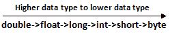

# 如何在 Java 中将 long 转换成 int

> 原文：<https://www.tutorialandexample.com/how-to-convert-long-to-int-in-java/>

**Java 中如何将 long 转换成 int**

当我们将一个较大的类型值赋给一个较小类型的变量时，我们需要为转换执行**显式转换**。从 **long** 到 **int** 的转换称为**显式转换**或**收缩转换。** long 是比 int 更大的数据类型。

    

有两种方法可以将 long 转换成 int。

*   使用**赋值运算符**T3】
*   使用 **intValue()** 方法

**使用赋值运算符**

**铸造**用于执行两个**不兼容**类型之间的转换。  强制转换只是一个显式的类型转换。强制转换的语法是:

```
data type variable_name = (target data type) variable to convert;
```

**例如**

在下面的例子中， **num1** 是一个 long 类型的变量，包含值 **10000** 。 **num2** 是 **int** 类型的变量，存储 **num1** 转换后的 **int** 值。 **(int)num1** 将 **long** 值转换为 **int** 值。 **println** 语句打印变量 **num1 转换后的 **int** 值。**T25】

```
public class longTointExample
{ 
public static void main(String args[])
{ 
long num1 = 10000; 
int num2 = (int)num1;  //explicit conversion
System.out.println("Converted int value is: "+num2); 
}
}
```

**输出**

```
Converted int value is: 10000
```

**使用 intValue()方法**

**intValue()** 是 **java.lang** 包中**整数**包装类的内置方法。这个方法**不接受任何参数**。它返回转换为整数类型后由对象表示的值。下面给出了该方法的签名:

```
public int intValue()
```

**例如**

在下面的例子中， **Long** 是**包装类**，而 **number** 是该类的引用变量。 **num** 是类型为 **int** 的变量，存储变量 **number** 的转换值。 **intValue()** 是**整数包装类**的方法。 **println** 语句打印变量**编号转换后的 **int** 值。**

```
public class longTointExample1
{ 
public static void main(String args[])
{ 
Long number = 789L;
int num = number.intValue();  //explicit conversion
System.out.println("Converted int value is: "+num); 
}
}
```

**输出**

```
Converted int value is: 789
```