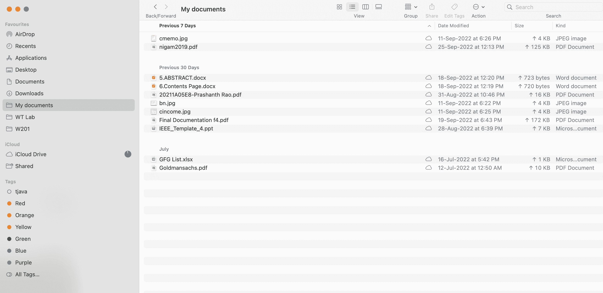

# 用 Java 列出一个目录中的所有文件

> 原文：<https://www.tutorialandexample.com/list-all-files-in-a-directory-in-java>

目录中所有文件的列表可以使用 Java 来完成。您应该知道，一个目录可能包含一个子文件夹，该子目录也可能包含一些文件。这些文件也是主目录的一部分。因此，我们必须提到他们。

## 没有子目录的目录

它表示文件夹的仅文件状态。下面给出的步骤将描述如何打印文件

1.在第一步中为目录创建一个对象。

2.第二步是获取目录的文件数组。

3.以递归方式一次打印一个文件名(包括扩展名)。

### 履行

下面的代码输出在 Documents 文件夹中找到的文件名。在 Documents 文件夹中找到的文件显示在下面的屏幕截图中。



**DisplayFile.java**

```
//this program is for a list of all the documents in the directory in java
//import section
import java.io.File; 
//The class DisplayFile is created
public class DisplayFile 
{  
public void printNames(File[] array, int i, int lvl)  
{  
//initializing the base condition  
// if the condition i==array.length then there are  
// no more files.The loop will terminate. 
if(i == array.length)  
{  
return;  
}  
// checking whether it is f  file or not
if(array[i].isFile())  
{  
System.out.println(array[i].getName());  
}  
// The files in the directory are printed according to the recursion process  
// the value i+1 means checking the next file in the directory 
printFileNames(array, i + 1, lvl);  
}  
// Main section
public static void main(String[] argvs)  
{  
// the path of the directory
String path = "/Users/mprashanthrao/Documents/My documents";  
//A file object fobject was created  
File fObject= new File(path);  
//   an object obj i created for the class DisplayFile
DisplayFile obj = new DisplayFile();  
if(fObject.exists() && fObjcte.isDirectory())  
{  
// the files in the directory are printed by using the fobject 
File array[] = fObject.listFiles();  
// display the required statements  
System.out.println("-----------------------------------------------------------------------");  
System.out.println("The files in the directory : " + fObject);  
System.out.println("-----------------------------------------------------------------------");  
// the method for calling 
obj.printNames(array, 0, 0);  
}  
}  
} 
```

**输出:**

 **

## 包含子目录的目录

该短语表示文件夹既有文件又有子文件夹。这些步骤将显示如何显示目录及其子目录的文件。

1.  在第一步中为目录创建一个文件对象。
2.  第二步是获取包含文件和子目录的目录数组。
3.  它将显示文件名，如果 array[j]是一个文件，将在第 3 步中递归到达随后的 array[j]元素。
4.  如果 array[j]确实是一个目录并显示了目录名，请重复步骤 4 中的步骤 2。

**DisplayFileEx1.java**

```
// This program is for a list of all  documents in the given document
//import section
import java.io.File;  
public class DisplayFileEx1  
{  
public void printFiles(File[] array, int i, int level)  
{  
//initializing the base condition  
// if the condition i==array.length then there are  
// no more files.The loop will terminate. 
if(i == array.length)  
{  
return;
}  
//files are provided by indentation
for (int j = 0; j < level; j++)  
{  
System.out.print("\t");  
}  
// the condition will checks whether it is the file or not
if(array[i].isFile())  
{  
System.out.println(array[i].getName());  
}  
//reading the files in subdirectories  
else if(array[i].isDirectory())  
{  
System.out.println("[" + array[i].getName() + "]");  z
//the files read until the condition 
printFileNames(array[i].listFiles(), 0, level + 1);  
}  
//The files in the directory are printed according to the recursion process  
// the value i+1 means checking the next file in the directory 
printFileNames(array, i + 1, level);  
}  
// Main section  
public static void main(String[] argvs)  
{  
// Providing the full path for the directory  
String path = "";  
// creating a file object  
File fObject = new File(path);  
// creating an object of the class DisplayFileExample1  
DisplayFileEx1 obj = new DisplayFileEx1();  
if(fObject.exists() && fObject.isDirectory())  
{  
// array contains the files belonging to that directory pointed by fObject 
File array[] = fObject.listFiles();  
// display the required statements  
System.out.println("-----------------------------------------------------------------------");  
System.out.println("The files in the directory : " + fObject);  
System.out.println("-----------------------------------------------------------------------");  
// the method for calling 

obj.printFiles(array, 0, 0);  
}  
}  
} 
```

**输出:**

**