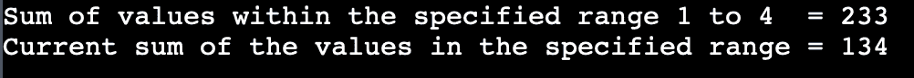

# Java 中的段树

> 原文：<https://www.tutorialandexample.com/segment-tree-in-java>

二叉树可以解决各种问题；然而，就时间复杂度而言，段树更有效。Java 中的段树是用数组表示的。

## 本地方法

完成这些活动很简单。可以通过运行从 x 到 y 的 for 循环来计算位于索引 x 和索引 y 之间的元素的累积和。当我们查看获得总和需要多长时间时，我们获得 O(n)时间。

A[j] = p 也可以用来更新第 j 个索引处的值，这个操作需要 O(1)时间。因此，完成这两项任务的总时间复杂度为 O(n) + O(1) = O (n)。

## 其他方法

另一种策略是首先创建一个前缀数组，然后完成前面提到的活动。一旦前缀数组被创建，从索引 x 到索引 y 的项目的总和需要 O(1)时间。然而，现在更新第 j 个索引需要 O(n)时间。这是因为更新任何索引都需要更新前缀数组，这需要 O(1)时间。因此，总时间复杂度为 O(1) + O(n) = O(n)，这与简单方法相同。由于这两种方法总的来说花费的时间是一样的，我们必须找到一种方法使它花费更少的时间，解决方案是使用一个段树。在 O(log(n))时间内在段树中计算从索引 x 到索引 y 的总和。段树需要 O(log(n))量的时间来更新第 j 个索引处的值。比 O 小的 O(log(n)) + O(log(n)) = O(2 *(log(n))就是结果(n)。

## 片段树表示法

数组的元素由叶节点表示。通过组合它们的子节点，产生树的内部节点。索引 j 处的节点在 2 * j + 1 处有一个左子节点，在 2 * j + 2 处有一个右子节点，在(j - 1) / 2 处有一个父节点，因为我们使用数组来表示段树。

## 分段树的伪代码

困难在于，在建立了细分树之后，利用细分树来计算总数。

```
int Sum1(node, a, b)   
{  
   if (the range of the node is within a and b)  
{
                  return value of the node  

}
   else if (the range of the node is outside of a and b)  
        return 0  
   else  
    return Sum1(node left child, a, b) +   
           getSum1(node right child, a, b)  
} 
```

## 价值的提升

递归更新用于段树操作。假设第 j 个索引的值是 val，并且它必须被改变。从根节点开始，将值 val 添加到段树中范围包括指定范围的所有节点。如果一个节点的范围不包含指定的索引，则应该避免对该节点进行任何修改。

## 用 Java 语言编写树分段程序

SegmentTree.java

```
public class SegmentTree
{  
int stArray[];
SegmentTree(int var[], int s1)  
{  
int height = (int) (Math.ceil(Math.log(s1) / Math.log(2)));  
int maximum_size = 2 * (int) Math.pow(2, height) - 1;  
stArray = new int[maximum_size]; constructST(var, 0, s1 - 1, 0);  
}  
int getMidIndex(int f1, int l1)   
{  
return f1 + (l1 - f1) / 2;  
}  
int getSumUtil(int start, int end, int i_r, int j_r, int segment_index)  
{  
if (i_r <= start && j_r >= end)  
{  
return stArray[segment_index];  
}  
if (end < i_r || start > j_r)  
{  
return 0;  
}  
int mid_value = getMidIndex(start, end);  
return getSumUtil(start, mid_value, i_r, j_r, 2 * segment_index + 1) +  
    getSumUtil(mid_value + 1, end, i_r, j_r, 2 * segment_index + 2);  
}  
void updateValUtil(int start, int end, int j_u, int value, int segment_index)  
{  
if (j_u < start || j_u > end)  
{  
return;  
}
stArray[segment_index] = stArray[segment_index] + value;  
if (end != start)   
{  
int mid_value = getMidIndex(start, end);  
updateValUtil(start, mid_value, j_u, value, 2 * segment_index + 1);  
updateValUtil(mid_value + 1, end, j_u, value, 2 * segment_index + 2);  
}  
}   
void updateVal(int N[], int s1, int j_r, int new_value)  
{  
if (j_r < 0 || j_r > s1 - 1)   
{  
System.out.println("Invalid Input");  
return;  
} 
int different_value = new_value - N[j_r];  
stArray[j_r] = new_value; 
updateValUtil(0, s1 - 1, j_r, different_value, 0);  
}  
int getSum(int sum, int start, int end)  
{  
if (start < 0 || end > sum - 1 || start > end)   
{  
System.out.println("Invalid Input");  
return -1;  
}  
return getSumUtil(0, sum - 1, start, end, 0);  
}  
int constructST(int N[], int start, int end, int segment_index)  
{  
if (start == end)   
{  
stArray [segment_index ] = N[start];  
return N[start ] ;  
}   
int middle = getMidIndex ( start , end ) ;  
stArray [ segment_index ] = constructST ( N , start, middle, segment_index * 2 + 1) +  
    constructST ( N , middle + 1 , end , segment_index * 2 + 2 ) ;  
return stArray [ segment_index ] ;  
}  
public static void main(String argvs[])  
{  
int N[] = {22, 44, 77, 110, 2, 1};  
int size_array = N.length;
SegmentTree t = new SegmentTree(N, size_array);  
System.out.println ( " Sum of values within the specified range 1 to 4  = " + t . getSum ( size_array, 1, 4 ) ) ;  
 t. updateVal ( N , size_array , 3 , 11 ) ;  
System . out . println ( " Current sum of the values in the specified range = " + t.getSum ( size_array, 1, 4 ) ) ;  
}  
} 
```

**输出** **:**

