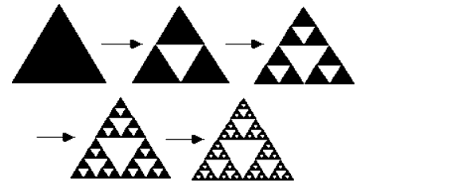
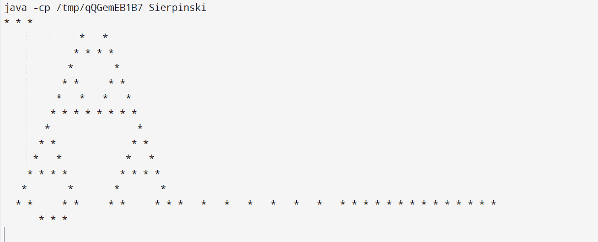

# Java 中的 Sierpinski 数

> 原文：<https://www.tutorialandexample.com/sierpinski-number-in-java>

### Sierpinski 三角形——是分形吗？

谢尔平斯基三角形分形。一个自相似的分形是 Sierpinski 三角形。它由一个等边三角形组成，其剩余面积由更小的等边三角形依次减小。

这里，它包含覆盖集，是 3，5，7，13，19，37，73，这是一个 Sierpinski 数。它被称为覆盖集，因为结构 78557*2n+1 的每一个数都可以用这些小素数中的一个来区分。

### Java Sierpinski 数

要确定给定的数是否是 Sierpinski 数，请使用 Java 程序和 Sierpinski 数。因为 Sierpinski 数与 Sierpinski 三角形直接相关，所以在继续这一部分之前，我们将首先研究它。

### 谢尔平斯基三角

一种自相似的几何形状，Sierpinski 三角形，也称为垫片三角形。这意味着即使我们放大它，它仍然保持同样的外观或结构。分形的一个例子是 Sierpinski 三角形，它是通过绘制一个三角形，然后擦除一个内部三角形(一条曲线或几何图形，其每个部分与整体具有相同的统计特征)而产生的，该内部三角形是通过连接外部三角形的边的中点而形成的。这个过程无限地递归重复。

下图说明了迭代四次的 Sierpinski 三角形。短语“具有等边三角形一般形状的分形和吸引人的固定集合，递归地将三角形细分成更小的三角形”也可以用来描述它。

N=3k-1 是 Sierpinski 三角形计数公式。

用户可以继续(或重复)这个过程。我们移除每个剩余三角形的“中心”，留下三个更小的三角形，每个三角形的大小是父三角形的一半(是原始三角形的四分之一)。在这一点上还有九个三角形。下一次迭代留下 27 个小三角形，下一步留下 81 个，下一步留下 3 N 个小三角形。验证第 n 次迭代后留下的三角形大小正好是初始大小的 1/2N 是很简单的。

  

### Sierpinski 数

对于全自然数 n 全合成的整数 k*2n+1 称为 Sierpinski 数。换句话说，如果以下设置中的所有个体都是复合的，那么 k 将是一个 Sierpinski 数。

序列是来自 OEIS 的 A076336。最小的 Sierpinski 数是数列的第一，78557；然而，这只是一个假设(尚未被证明)。因为它包含 3、5、7、13、19、37 和 73 的覆盖集，所以它是一个 Sierpinski 数。类型 78557*2n+1 被认为是一个覆盖集，因为其中的每个数都可以被这些小素数之一整除。

### 几个 Sierpinski 数的例子:

1290677, 1624097, 1259779, 1518781, 1777613, 2131043, 2131099, 2191531, 2510177, 2541601, 2576089, 2931767, 3083723, 3098059, 3555593, 3608251, 271129, 271577, 322523, 271129, 271577, 322523, 327739, 482719, 575041

Java 编程的 Sierpinski 三角形

```
// Java printing program statement
// The Sierpinski triangle.
import java.util.*;
import java.io.*;

class Sierpinski
{
static void printSierpinski(int n)
{
for (int y = n - 1; y >= 0; y--) {

// printing area until
// the value of y
for (int i = 0; i < y; i++) {
System.out.print(" ");
}

// printing '*'
for (int x = 0; x + y < n; x++) {

// printing "*" when necessary
// role is fulfilled by the and
// wherever value, x and y's values
// is 0, "*" has been printed.
if ((x & y) != 0)
System.out.print(" "
+ " ");
Else
System.out.print("* ");
}
System.out.print("\n");
}
}
// Driver code
public static void main(String args[])
{
int n = 16;
// Function invocation
printSierpinski(n);
}
} 
```

**输出:**



### 谢尔平斯基三角形的目的是什么？

Sierpinski 三角形练习举例说明了分形的基本思想。它展示了一个图案是如何以不同的比例重复出现的，以及这种复杂的形状是如何通过简单的重复创造出来的。每个学生用连续变小的三角形创建一个分形设计三角形。

### 在 Sierpinski，有多少个三角形？

我们剩下三个三角形，每个正好是原三角形的四分之一，尺寸正好是原三角形的一半。每一个幸存的三角形都和原来的相似。