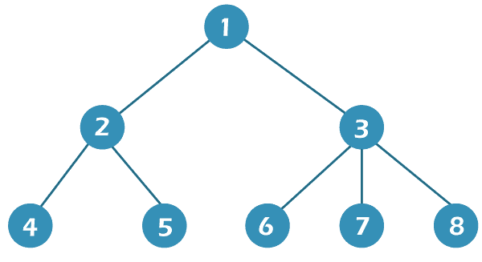

# Java 中二叉树的之字形遍历

> 原文：<https://www.tutorialandexample.com/zigzag-traversal-of-binary-tree-in-java>

在本文中，您将了解 java 中二叉树的之字形遍历以及实现之字形遍历的方法或途径。

## 之字形遍历

二叉树以之字形模式遍历，这意味着对于顶层的每个节点，我们从左向右移动，对于下一层的节点，我们从右向左移动，等等。请注意，虽然进入下一个级别需要从左到右，但顶级允许我们从右到左，而不是从左到右。在 Java 中对二叉树进行之字形遍历时，要记住的一个关键点是，每一层的遍历方向都与前一层相反。



在上述带有给定节点的二叉树中，两种类型的之字形遍历路径是

向右遍历:1 3 2 8 7 6 5 4

向左遍历:1 2 3 4 5 6 7 8

有 4 种方法可以在一个简单的二叉树中实现之字形遍历。他们是

*   利用两个堆栈
*   带德克
*   利用递归
*   堆栈和队列利用率

## 利用两个堆栈

两个堆栈可以用来以之字形模式遍历二叉树。您应该将第一个堆栈视为实际级堆栈，并将第二个堆栈视为下一级堆栈。为了获得当前级别顺序的信息，还需要一个变量。我们实际上从实际的层堆栈中弹出节点并显示它们的值。当从左到右遍历实际的级别顺序时，我们首先将该级别的左子级推到下一个级别堆栈，然后是该级别的右子级。我们知道堆栈是根据后进先出(LIFO)规则运行的。

因此，下次从下一级堆栈中取出节点时，遍历的顺序将会颠倒。类似于我们在从右向左遍历时将当前节点的右子节点移动到左子节点之前。请记住，我们必须在每一级结束时切换堆栈(当该级的所有节点都被浏览完时发生)；也就是说，下一级堆栈成为当前级堆栈，反之亦然。

让我们用一个示例程序来理解它

文件名:Zigzag1.java

```
import java.util.*;  
  class TreeNode   
{  
int val;  

TreeNode left, right;  

public TreeNode(int i)  
{  
val = i;  
right = left = null;  
}  
}  
class BTZigZag   
{  
TreeNode r;  
//method that shows the zigzag traversal in a binary tree 
void displayZigZagTraversal()   
{  
if (r == null)   
{  
return;  
}  
//Initializing the two stacks  
Stack<TreeNode> currLevel = new Stack<TreeNode>();  
Stack<TreeNode> nextLevel = new Stack<TreeNode>();  
currLevel.push(r);  
boolean LtoR = true;  
while (!currLevel.isEmpty())   
{  
//The node has been removed from the current level   
TreeNode currNode = currLevel.pop();  
System.out.print(currNode.val + " ");  
if (LtoR)   
{  
if (currNode.left != null)   
{  
nextLevel.push(currNode.left);  
}  
if (currNode.right != null)   
{  
nextLevel.push(currNode.right);  
}  
}  
else   
{  
if (currNode.right != null)   
{  
nextLevel.push(currNode.right);  
}  
if (currNode.left != null)   
{  
nextLevel.push(currNode.left);  
}  
}  
if (currLevel.isEmpty())   
{  
// toggle the value of LtoR  
LtoR = !LtoR;  
Stack<TreeNode> stk = currLevel;  
currLevel = nextLevel;  
nextLevel = stk;  
}  
}  
}  
}  
public class ZigZag1 
{  
// main method  
public static void main(String[] args)  
{  
BTZigZag   
BTZigZag  tree = new BTZigZag ();  
//the root node
tree.r = new TreeNode(10);  
//The other nodes of the tree are
tree.r.left = new TreeNode(6);  
tree.r.right = new TreeNode(15);  
tree.r.left.left = new TreeNode(5);  
tree.r.left.right = new TreeNode(8);  
tree.r.right.left = new TreeNode(11);  
tree.r.right.right = new TreeNode(23);  
tree.r.left.left.left = new TreeNode(12);  
tree.r.left.left.right = new TreeNode(16);  
tree.r.left.right.left = new TreeNode(9);  
tree.r.left.right.right = new TreeNode(19);  
tree.r.right.left.left = new TreeNode(17);  
tree.r.right.left.right = new TreeNode(29);  
tree.r.right.right.left = new TreeNode(33);  
tree.r.right.right.right = new TreeNode(36);  
System.out.println("The nodes in the form of zigzag traversal : ");  
tree.displayZigZagTraversal();  
}  
} 
```

**输出:**

```
The nodes in the form of zigzag traversal 
10 6 15 5 8 11 23 12 16 9 19 17 29 33 36 
```

**时间复杂度**

该程序只包含一个 while 循环。结果，前面的程序具有 O(n)时间复杂度，其中 n 表示二叉树中的节点总数。

**空间复杂度**

该代码包含两个堆栈，每个堆栈的空间复杂度为 O(n ),其中 n 对应于二叉树中节点的总数。结果是 O(2 * n)，就指数增长复杂度(n)而言等于 O。

## 使用 Deque

deque 也可以用来执行二叉树的之字形遍历。选择从正面还是背面执行 pop 操作是一个至关重要的考虑因素。我们是从右向左移动还是从左向右移动是由弹出操作决定的。

让我们用一个在队列中使用 deque 操作的例子程序来理解它。

文件名:Zigzag2.java

```
import java.util.*;  
  class TreeNode   
{  
//holds the nodes values  
int val;  
//Linking all the nodes left nodes for the left and right nodes for the right nodes  
TreeNode left, right;  
//The initialization of class fields in done with help of a constructor  
public TreeNode(int i)  
{  
val = i;  
right = left = null;  
}  
}  
class BTreeZigZag1   
{  
TreeNode r;  
//This method helps in showing the zigzag traversal
public Vector<Integer> zigZagTraversal(TreeNode node)  
{  
Deque<TreeNode> dq = new LinkedList<TreeNode>();  
Vector<Integer> vec = new Vector<Integer>();  
dq.add(node);  
vec.add(node.val);  
TreeNode t;  
int lvl = 1;  
while (dq.size() > 0)   
{  
int n = dq.size();  
for (int j = 0; j < n; j++)   
{   
if (lvl % 2 == 0)   
{  
t = dq.peekLast();  
// deleting from the end 
dq.pollLast();  
}   
else   
{  
t = dq.peekFirst();  
dq.pollFirst();  
}
// The left child node is followed by the right child node when the level is odd
// The right child node is followed by the left child node when the level is even 
if (lvl % 2 != 0)   
{  
// The null nodes are found to be useless because they do not have any child nodes  
if (t.right != null)   
{  
dq.add(t.right);  
vec.add(t.right.val);  
}  
if (t.left != null)   
{  
dq.add(t.left);  
vec.add(t.left.val);  
}  
}  
else if (lvl % 2 == 0)  
{  
// // The null nodes are found to be useless because they do not have any child nodes
if (t.left != null)   
{  
dq.offerFirst(t.left);  
vec.add(t.left.val);  
}  
if (t.right != null)   
{  
dq.offerFirst(t.right);  
vec.add(t.right.val);  
}  
}  
}  
lvl = lvl + 1;  
}  
return vec;  
}  
}  
public class Zigzag2 
{ 
public static void main(String[] args)  
{  
BTZigZag1  tree = new BTZigZag1 ();  
tree.r = new TreeNode(10);    
tree.r.left = new TreeNode(6);  
tree.r.right = new TreeNode(15);  
tree.r.left.left = new TreeNode(5);  
tree.r.left.right = new TreeNode(8);  
tree.r.right.left = new TreeNode(11);  
tree.r.right.right = new TreeNode(23);  
tree.r.left.left.left = new TreeNode(12);  
tree.r.left.left.right = new TreeNode(16);  
tree.r.left.right.left = new TreeNode(9);  
tree.r.left.right.right = new TreeNode(19);  
tree.r.right.left.left = new TreeNode(17);  
tree.r.right.left.right = new TreeNode(29);  
tree.r.right.right.left = new TreeNode(33);  
tree.r.right.right.right = new TreeNode(36);  
System.out.println("The nodes in the form of zigzag traversal are: ");  
Vector<Integer> vec = tree.zigZagTraversal(tree.r);  
for (int j = 0; j < vec.size(); j++)   
{   
//printing the nodes in zigzag way 
System.out.print(vec.get(j) + " ");  
}  
}  
} 
```

**输出**

```
The nodes in the form of zigzag traversal are: 
10 15 6 23 11 8 5 36 33 29 16 19 9 16 12
```

**时间复杂度**

前述代码的时间复杂度是 O(n)，其中 n 是二叉树中节点的总数，因为我们只访问每个节点一次。

**空间复杂度**

deque 的最大大小是 O((n + 1) / 2)，其具有等于 O(n)的渐近复杂度，其中 n 是指二叉树中节点的总数。考虑在一个完整的二叉树中子树的总数是(n + 1) / 2。

## 利用递归

递归也可以用来以之字形模式遍历二叉树。这个想法是以一种新颖的方式利用二叉树的层次顺序遍历。其值在 0 和 1 之间变化的参数将建立遍历将进行的路径。请记住，变量的值会在每个级别的探索结束后进行修改。

让我们通过递归方法用一个示例程序来理解它。

文件名:Zigzag3.java

```
import java.util.*;  
class TreeNode   
{  
//For the value of node to be assigned 
int val;   
TreeNode left, right;  
//The class fields are created by the constructor  
public TreeNode(int i)  
{  
val = i;  
right = left = null;  
}  
}  
class BTreeZigZag2   
{  
TreeNode r;  
// The length of the tree is found by the recursion approach
//The important point is that all the levels of binary tree must be equal
public int heightOfBTree(TreeNode r)  
{  
if(r == null)  
{  
return 0;  
}  
int lh = heightOfBTree(r.left);  
int rh = heightOfBTree(r.right);  
return Math.max(lh + 1, rh + 1);  
}  
//This method displays the values of nodes from the right to left
public void displayRightToLeft(TreeNode r, int lvl)  
{  
if(r == null)  
{  
return;  
}  
if(lvl == 1)  
{  
System.out.print(r.val + " ") ;  
}  
else if(lvl > 1)  
{  
displayRightToLeft(r.right, lvl - 1);  
displayRightToLeft(r.left, lvl - 1);  
}  
}  
//This method displays the values of nodes from left to right  
public void displayLeftToRight(TreeNode r, int lvl)  
{   
if(r == null)  
{  
return;  
}    
if(lvl == 1)  
{  
System.out.print(r.val + " ");  
}  
//This is for managing the other nodes of the binary tree. 
else if(lvl > 1)  
{  
displayLeftToRight(r.left, lvl - 1);  
displayLeftToRight(r.right, lvl - 1);  
}  
}  
//This method displays the nodes of binary tree in zigzag traversal 
public void displayZigZagTraversal(TreeNode r)  
{  
int f = 0;  
//Length of the binary tree  
int ht = heightOfBTree(r);     
for(int j = 1; j <= ht; j++)  
{  
//The nodes values are displayed from right to left if the flag value is one  
if(f == 1)  
{  
displayRightToLeft(r, j);    
f = 1 - f;  
}  
// The nodes values are displayed from right to left if the flag value is one  
else if(f == 0)  
{  
displayLeftToRight(r, j);  
f = 1 - f;  
}  
}  
}  
}  
public class Zigzag3   
{  
public static void main(String[] argvs)  
{  
BTZigZag2 tree = new BTZigZag2();  
tree.r = new TreeNode(10);  
tree.r.left = new TreeNode(6);  
tree.r.right = new TreeNode(15);  
tree.r.left.left = new TreeNode(5);  
tree.r.left.right = new TreeNode(8);  
tree.r.right.left = new TreeNode(11);  
tree.r.right.right = new TreeNode(23);  
tree.r.left.left.left = new TreeNode(12);  
tree.r.left.left.right = new TreeNode(16);  
tree.r.left.right.left = new TreeNode(9);  
tree.r.left.right.right = new TreeNode(19);  
tree.r.right.left.left = new TreeNode(17);  
tree.r.right.left.right = new TreeNode(29);  
tree.r.right.right.left = new TreeNode(33);  
tree.r.right.right.right = new TreeNode(36);  
System.out.println("The nodes in the from of zigzag traversal are: ");  
tree.displayZigZagTraversal(tree.r);  
}  
}
```

**输出**

```
The nodes in the form of zigzag traversal are
10 15 6 23 11 8 5 36 33 29 16 19 9 16 12 
```

**时间复杂度**

前面的程序的时间复杂度是 O(n)，其中 n 是二叉树中节点的总数，我们只访问每个节点一次。

**空间复杂度**

上述程序的空间复杂度为 O (n)。

## 使用堆栈和队列利用率

这种方法包括遍历层次顺序，但不总是在同一个方向。当从左向右移动一个级别时，我们将遇到的每个节点添加到数组列表维护中。此外，我们为堆栈的下一层保留连接。当从右向左移动时，我们从堆栈中推出前一阶段保存的节点。数组列表 retain 包含弹出的节点。最后，我们交付数组列表维护。请记住，我们用于该方法优化的方法是 deque。

让我们通过递归方法用一个示例程序来理解它。

文件名:Zigzag4.java

```
import java.util.*;  
class TreeNode   
{    
int val;  
TreeNode left, right;  

public TreeNode(int i)  
{  
val = i;  
right = left = null;  
}  
}  
public class Zigzag4  
{  
TreeNode r = null;    
ArrayList<Integer> zigzagLevelOrderTraversal(TreeNode root)   
{   
ArrayList<Integer> keep = new ArrayList<Integer>();  
Queue<TreeNode> nodes = new LinkedList<TreeNode>();  
Stack<TreeNode> currentLevelNodes = new Stack<TreeNode>();  
nodes.add(root);  
int ltor = 1;  
while (!nodes.isEmpty())   
{  
if (ltor == 1)   
{  
int size = nodes.size();  
for (int j = 0; j < size; j++)   
{  
TreeNode currNode = nodes.peek();  
nodes.poll();  
keep.add(currNode.val);  
if (currNode.left != null)   
{  
nodes.add(currNode.left);  
currentLevelNodes.push(currNode.left);  
}  
if (currNode.right != null)   
{  
nodes.add(currNode.right);  
currentLevelNodes.push(currNode.right);  
}  
}  
}   
else   
{  
int size = nodes.size();  
for (int j = 0; j < size; j++)   
{  
TreeNode currentNode = nodes.peek();  
nodes.poll();  
keep.add(currentLevelNodes.peek().val);  
currentLevelNodes.pop();  
if (currentNode.left != null)   
{  
nodes.add(currentNode.left);  
}  
if (currentNode.right != null)   
{  
nodes.add(currentNode.right);  
}  
}  
}  
ltor = 1 - ltor;  
}  
return keep;  
}  

public static void main(String[] argvs)  
{  
Zigzag4 tree = new Zigzag4();  
tree.r = new TreeNode(10);  
tree.r.left = new TreeNode(6);  
tree.r.right = new TreeNode(15);  
tree.r.left.left = new TreeNode(5);  
tree.r.left.right = new TreeNode(8);  
tree.r.right.left = new TreeNode(11);  
tree.r.right.right = new TreeNode(23);  
tree.r.left.left.left = new TreeNode(12);  
tree.r.left.left.right = new TreeNode(16);  
tree.r.left.right.left = new TreeNode(9);  
tree.r.left.right.right = new TreeNode(19);  
tree.r.right.left.left = new TreeNode(17);  
tree.r.right.left.right = new TreeNode(29);  
tree.r.right.right.left = new TreeNode(33);  
tree.r.right.right.right = new TreeNode(36);  
System.out.println("The nodes in the form of zigzag traversal are: ");  
ArrayList<Integer> list = tree.zigzagLevelOrderTraversal(tree.r);  
for(int i = 0; i < list.size(); i++)  
{  
System.out.print(list.get(i) + " ");  
}  
}  
} 
```

**输出**

```
The nodes in the form of zigzag traversal are
10 15 6 23 11 8 5 36 33 29 16 19 9 16 12
```

**时间复杂度**

二叉树的节点总数 n 对应的时间复杂度为 O(n)。

**空间复杂度**

上述程序的空间复杂度为 O (n)。