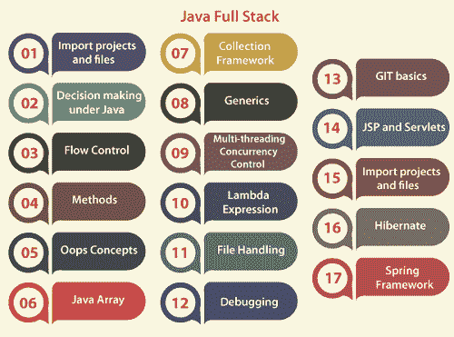
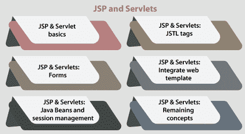

# Java 全栈

> 原文：<https://www.tutorialandexample.com/java-full-stack>

一个可以创建应用程序前端和后端的人是全栈开发人员。本质上，“Java 全栈”这个术语指的是使用 Java 构建整个技术栈的 web 开发者。被称为全栈开发人员的工程师在软件应用程序的客户端和服务器端工作。这种开发人员在软件应用程序的整个堆栈上工作。

“既能设计客户端软件又能设计服务器软件的候选人”是对全栈开发人员最简单的定义。如果一个开发人员是全栈的，他们处理所有与前端、后端、数据库和集成过程相关的工作。作为一名全栈开发人员，您必须关注编写服务器端 API 和后端编程语言，运行客户端 JavaScript 代码，以及访问数据库和版本控制系统。全栈开发人员为团队和组织带来价值，因为他们拥有多样化的技能组合和独立完成项目的能力，这降低了运营费用。

  

要成为 Java 全栈开发者，开发者应该具备以下技能:

### 1.导入项目和文件

开发人员应该了解如何在系统上安装 IntelliJ 和 Eclipse 等 IDE，如何在 IntelliJ 中运行 hello world 程序，如何导入项目文件，以及如何在 IntelliJ 中导入 Eclipse (Java IDE)项目。这些是有经验和没有经验的候选人都应该理解的基本概念。

### 2.Java 下的决策

开发人员应该熟悉决策语句和用于做出决策的操作符。算术、赋值和三元运算符等运算符用于决策。If，else，if，else 语句有助于决策。因此，开发人员应该熟悉所有决策语句和操作符。

### 3.流控制

在做出决定后，开发人员应该熟悉控制流语句和循环语句，包括 while、do-while、for、switch case、break、continue、modulo 运算符和嵌套循环。如果开发人员不熟悉流程控制，他们就无法编写代码。首先也是最重要的，如果你想在全栈岗位工作，你要学习 Java 的所有基础知识。否则，您将无法为企业编写复杂的 Java 代码。

### 4.方法

开发人员应该熟悉返回类型的参数化和非参数化方法。两个最重要的多态思想，方法重载和方法覆盖，对于创建 Java 桌面和 web 应用程序是必不可少的。因为 Java 是一种面向对象的编程语言，所以您应该对进程如何工作有一个坚实的理解。此外，开发人员必须精通代码块、缩进和语句。

### 5.哎呀概念

因为 Java 完全是围绕对象、方法和类构建的，所以开发人员必须熟悉所有 Oops 原则。在学习更高级的 Java 之前，您应该熟悉基本的 Java 概念，比如类、getters、setters、构造函数、继承、组合、封装、抽象、对象和多态。

### 6.核心概念

每一种使用对象作为基础的语言都被称为面向对象。接口、利用接口的多重继承、匿名对象、匿名内部类、用户输入和静态元素都属于核心概念。

一个静态内部类、final 关键字、包、范围、访问修饰符和一个抽象类异常处理、几个 try-catch 块、Finally 子句后的一个块、throws 和 more throws、用户定义的异常、检查的和未检查的异常，也是核心概念的一部分。

枚举器枚举和字符串(包括文字字符串、由字符串组成的对象、操作字符串的方法和字符串格式)等等。如果你不熟悉 Java 的基础知识，请彻底学习上述所有思想。

### 7.Java 数组

尽管 Java array 可以合并到核心概念中，但最好还是把它分开。因为我们可以利用数组进行许多操作，所以它本身就是一个重要的概念。我们需要了解如何定义和初始化数组，如何使用 for 循环遍历数组，如何从数组中访问和移除变量，如何通过值调用和引用方法调用，以及许多其他事情。

### 8.集合框架

Java 的核心包括了刚才提到的所有思想。一旦熟悉了 Java 的基本原理，您就可以开始钻研高级 Java 并学习它的概念了。集合框架是第一个也是最重要的，它提供了几个有用的类，比如迭代器、数组列表、堆栈、LinkedList、Comparable interface 等等。就方法和实现而言，所有这些类和接口都应该为我们所熟悉。

此外，收集框架有几个高级类，如 Set、Queue、Dequeue、Map 和 TreeMap。

当创建复杂的逻辑和过程时，这些类对于维护数据非常有益。除了这些类之外，开发人员还应该熟悉各种集合类型、比较自定义排序、equal 和 hashcode 方法，以及在地图中的搜索。

### 9.无商标消费品

Java 开发人员应该知道类型参数、泛型方法、有界类型可比接口、通配符和泛型。对于编写复杂而冗长的代码来说，这些是至关重要的。

### 10.多线程并发控制

高级 Java 中最重要的概念是并发控制和多线程并发。开发人员应该熟悉多线程、扩展线程类或实现 runnable 接口，以及其他相关概念。静态同步、volatile 关键字、等待和通知、中断、连接、死锁、CountDownLatch、阻塞队列、可重入锁和线程池是并发管理下同步的一些示例。这些想法对于创建逻辑或创建多线程 Java 程序是必要的。

### 11.λ表达式

为了用表达式表示一个方法接口，Java SE 8 中添加了 Lambda Expression。谓词、带方法的 lambda 表达式和迭代器是开发人员应该熟悉的其他概念。

λ表达式:

*   非常适合图书馆收藏。
*   帮助迭代集合中的数据。
*   通过过滤帮助从组中提取数据。
*   提供功能接口的实现。
*   节省了大量代码。

### 12.文件处理

每种编程语言都必须理解文件处理的概念。为了处理文件，开发人员需要熟悉所有与读写相关的原则。开发人员应该熟悉写入文件、创建目录、在光盘上创建文件以及处理数据流。扫描仪 vs 缓冲阅读器读取文件时，使用扫描仪时用缓冲区读取文件，删除文件，尝试使用资源和对象序列化。

要创建使用文件的程序，必须理解上述所有思想。因此，作为一名全栈 Java 开发人员，您应该熟悉这些思想。

### 13.排除故障

寻找代码中的缺陷和错误包括一个叫做调试的过程。通过调试提高代码质量至关重要。调试技能是开发人员应该具备的。调试对于修复代码中的错误和理解程序如何工作都是有益的。开发人员必须了解在运行时如何更新变量，什么是观察器，以及如何对变量使用观察器。

### 14.GIT 基础

当前最流行的版本控制系统之一是 GIT。Linus Torvalds 在 2005 年将其作为开源项目创建。Java 程序员使用 GIT 来维护版本控制下的任何项目集合。

要成为 Java 全栈开发人员，需要具备以下知识:

*   GIT 的属性。
*   GIT 配置。
*   克隆 GIT 项目并将其导入 Eclipse。
*   直接从 Eclipse 克隆一个 GIT 项目。

### 15.Servlets 和 JSP

开发人员需要了解以下概念:

  

1.  **JSP 基础知识& Servlets**
    它涵盖了 Servlets 生命周期、JSP expressions 元素、JSP scriptlets 元素、JSP declarations 元素、JSP comment 元素、JSP directive 元素、部署描述符和 annotations 元素、使用部署描述符的 JSP 设置、读取 URL 参数(包括 JSP 页面中的文件)、导入类、JSP 内的转发和重定向、MVC 概述、使用 Servlets 的基本重定向以及基于 MVC 的应用程序等主题。

2.  JSP&Servlet:表单
    开发人员应该熟悉表单元素、JSP 和 Servlet 表单、表单验证以及其他相关主题。Java 表单设计需要理解这些思想。出于安全考虑，每个应用程序都必须有一个身份验证页面，比如登录或注册页面。因此，没有表单就不可能设计或实现应用程序。

3.  JSP 和 Servlets 中的 Java bean 和会话管理
    创建一个应用程序需要 Java bean 和会话管理。bean 是一个可重用的软件组件，它将多个对象组合成一个可以从不同位置访问的对象。会话管理对于 Java web 应用程序来说是至关重要的，它使用许多方法来维护用户会话，如 Cookies 和 HttpSession 等。

    请求范围、页面&应用程序、会话、bean 范围、bean 的在线表单、JSP 下的会议、cookie 读写操作、用户注销和组织软件都是基本概念。要成为 Java 全栈开发人员，您必须了解修复重定向和转发链接、管理没有 cookies 的会话以及 servlet 过滤器。

4.  **JSP 和 Servlets 的 JSTL 标签**
    五种不同的 JSTL 标签被称为 JSTL 核心标签、JSTL 函数标签、JSTL XML 标签、JSTL 格式化标签和 JSTL 定制标签。

    术语“JSTL 设置”、“JSTL 设置和删除”、“使用表达式语言从 Bean 中读取”、“JSTL 选择和何时”、“JSTL 循环”、“JSTL forEach”、“JSTL 令牌”、“JSTL 导入和参数”、“JSTL URL 和重定向”以及“JSTL catch”都是 JSTL 核心标签的示例。

    JSTL 长度函数、JSTL 修剪和 escapeXml 函数、JSTL 莫尔函数、JSTL 莫尔函数和 JSTL 拆分和连接操作都是 JSTL 函数标签的例子。JSTL XML 和 Parse and Out 标签、JSTL XML ForEach 和 if 标签以及 JSTL XML Choose、When 和 otherwise 都是 JSTL XML 标签的例子。JSTL 格式化标签(文档)支持格式化日期和数字。开发人员创建的标签是 JSTL 定制标签。

5.  **使用 JSP 和 Servlet 集成 web 模板**
    这是 JSP 和 Servlet 中一个额外的基本概念。我们经常需要在程序中嵌入 web 模板。要集成 web 模板，我们需要了解如何从模板中提取页眉和页脚，将模板与项目集成，以及使用 JSTL。

6.  JSP 和 Servlets 的其余概念
    开发人员还应该熟悉数据库，使用工作台，设置 JNDI，在网页上列出数据，使用 include 指令，从数据库中添加、更新、删除和获取记录，以及提供 JSTL 支持和图像/文件上传功能。

### 16.冬眠

另一个 Java 概念是 Hibernate。一个有效的开发人员应该了解 Hibernate 的实现和架构。

开发人员应该了解 MySQL 和 SQL Workbench。开发人员应该了解 hibernate 中的会话工厂和会话。嵌入实体类，Hibernate in Action，HQL (Hibernate 查询语言)，HQL where 子句和 CRUD(从数据库中检索记录，更新数据库中的记录，从数据库中删除记录)都是这些动作的首字母缩写。用 HQL 更新记录，用 HQL 删除记录，集成 hibernate 与 JSP 和 Servlet，配置 hibernate，用 JSP 配置 Hibernate 实体类，以及 Hibernate 概念中包含的 Servlet。

使用 JSP 和 Servlet 的 Hibernate、显示图像文件、增强页面的视觉吸引力、添加更新信息表单、实现更新信息特性、使用 hibernate 更新特定的列数据、添加查看图像动作、实现查看图像页面以及添加删除图像动作都是基本概念。

### 17.弹簧框架

对于 Java，主要使用 Spring 框架。现代基于 Java 的企业应用程序可以使用其完整的编程和配置范例进行编程和配置。我们应该熟悉使用 Spring 框架的必要工具、依赖注入、autowire 情况、限定符的反转控制注释、构造器注入、Spring Bean、Springtime IntelliJ 项目、在 Eclipse 简单项目中添加对 SpringMVC 的支持用于动态 web、web 项目中的模型、Spring MVC 的基本设置、带有数据输入和单选按钮的 ModelAndView、Spring MVC 和 foreach 的简单表单、带有背景的单选按钮、下拉列表、文本框、复选框以及其他 Springform 组件添加了 Eclipse 的 STS 3 支持添加一个外部源，一个样式表，表单验证 JDBC 用于数据库连接(XML 配置和注释)，Spring MVC 的异常处理，带 restful API 的 Web 服务，hibernate 数据库连接，JAX-RS，带 restful web 服务背景的 Spring MVC，带 restful API 构建微服务的 spring boot，带数据库连接的可靠微服务。

要成为一名全栈 Java 开发人员(一个既能创建应用前端又能创建应用后端的人就是全栈开发人员)，必须掌握以上主题。如果你熟悉这些概念，你无疑会通过 Java 全栈开发者面试过程。