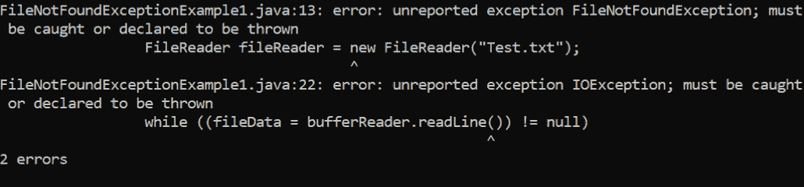
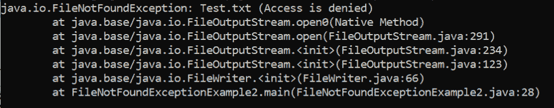

# Java IO 文件未找到异常

> 原文：<https://www.tutorialandexample.com/java-io-filenotfoundexception>

java.io 包提供的异常类之一是 FileNotFoundException。当我们试图访问系统中不存在的文件时，会引发一个异常。这是一个检查异常，因为它是由下列构造函数之一引发的，并且发生在运行时而不是编译时:

*   文件输入流
*   Randomaccessfile
*   文件输出流

### FileNotFoundException 的构造函数

FileNotFoundException 类中有两种类型的构造函数。那就是:

*   FileNotFoundException()(默认构造函数)

由于缺少 function Object(){[本机代码] }参数，它创建了一个 FileNotFoundException 并将错误详细信息设置为 null。

**使用这种类型构造函数的语法**

```
public FileNotFoundException ()
```

*   FileNotFoundException(字符串)

当我们向函数 Object(){[本机代码] }提供 str 时，它会创建一个 FileNotFoundException 并设置错误详细信息。

**使用这种类型构造函数的语法**

公共 FileNotFoundException(字符串 s)

### FileNotFoundException 类的方法

因为它是 java.lang.Throwable 和 java.lang.Object 的子类，所以它提供了这些类型提供的所有方法。


| **Java . lang . throwable 中的方法** | **Java . lang . object 中的方法** |
| 添加抑制() | 克隆() |
| fillInStackTrace() | 等于() |
| getCause() | 最终确定() |
| getLocalizedMessage() | getClass() |
| getMessage() | 哈希码() |
| getStackTrace() | 通知() |
| getSuppressed() | notifyAll() |
| initCause() | 等待() |
| printStackTrace() |   |
| setStackTrace() |   |
| toString() |   |


### 为什么会出现 FileNotFoundException

这个错误主要有两个原因。以下是收到此例外的理由:

*   当我们试图访问该文件时，系统没有它。
*   当我们试图访问一个不可用的文件时，例如当我们试图改变一个只读文件时，可能会引发一个错误。

FileNotFoundExcep.java

```
// all the required packages are imported  
import java.io.*;   // io class for handling input stream and output stream  
// Class FileNotFoundExcep main class creation.  
public class FileNotFoundExcep   
{  
    public static void main (String[] args)   
    {  
         // object creation for file reader class  
         FileReader fr = new FileReader("Exp.txt");  
         // object creation for buffered reader class and sending fr file reader as the parameter.  
         BufferedReader br = new BufferedReader(fr);  
         // Declaring varible data for storing the file data  
         String data = null;  
         // reading the data in the file using the readLine method of br till the last line   
         while ((data = br.readLine()) != null)   
         {  
             System.out.println(data);  
         }  
         // closing the br object created for bufferreader class  
         try {  
            br.close();  
        } catch (IOException e) {  
            e.printStackTrace();  
        }  
    }  
}  S
```

**输出**



FileNotFoundExcep1.java

```
// all the required packages are imported  
import java.io.*;   
// io class for handling input stream and output stream  
// Class FileNotFoundExcep main class creation.    
public class FileNotFoundExceptionExample2   
{   
    public static void main (String[] args)   
    {  
        try {  
            // object creation for file class as to open the file   
            File obj = new File("Exp.txt");  
            // object creation for print writer class   
            PrintWriter PW = new PrintWriter(new FileWriter(obj), true);  
            // printing the simple print line   
            PW.println("Simple print");  
            PW.close();    
            obj.setReadOnly();  
            // inserting the data into a new file 
            PrintWriter pw1 = new PrintWriter(new FileWriter("Exp.txt"), true);  
            pw1.println("Simple print");  
            pw1.close();  
        }  
        catch (Exception ex) {  
            ex.printStackTrace();  
        }  
    }  
} 
```

**输出**



### 处理异常

需要使用 try-catch 块来处理异常。我们将把可能引发异常的代码行放在 try 块中。catch 块将处理任何出现的异常。下列附加方法可用于删除 FileNotFoundException:

*   假设错误消息指出请求的文件或目录不存在。在这种情况下，可以通过重新验证程序并确定所请求的文件是否在所请求的位置来移除异常。
*   如果我们看到错误代码访问受到限制，我们必须确定文件的权限是否满足我们的要求。如果文件的许可证不符合我们的需要，必须更换。
*   我们还必须确定另一个软件是否正在使用该文件，然后才能解决访问被拒绝的问题消息。
*   如果错误消息指出所选文件是一个文件夹，我们必须将其删除或更改其名称。

FileNotFound.java

```
// all the required packages are imported   
import java.io.*;   
// io class for handling input stream and output stream  
// Class FileNotFound main class creation.    
public class FileNotFound   
{  
    public static void main(String[] args)   
    {  
         // object creation for file reader class  

         try {  
                FileReader fr = new FileReader("Exp.txt");  
                // object creation for buffered reader class and sending fr file reader as the parameter. 
                BufferedReader br = new BufferedReader(fr);  
                // Declaring varible data for storing the file data    
                String fileData = null;  
                // reading the data in the file using the readLine method of br till the last line 
                try {  
                    while ((fileData = br.readLine()) != null)   
                    {  
                        System.out.println(fileData);  
                    }  
                } catch (IOException e) {       
                    e.printStackTrace();  
                }  
         } catch (FileNotFoundException ex) {    
            ex.printStackTrace();  
        }  
    }  
} 
```

**输出**

```
Simple print
```