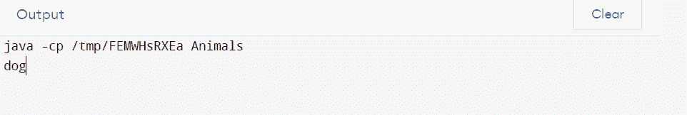
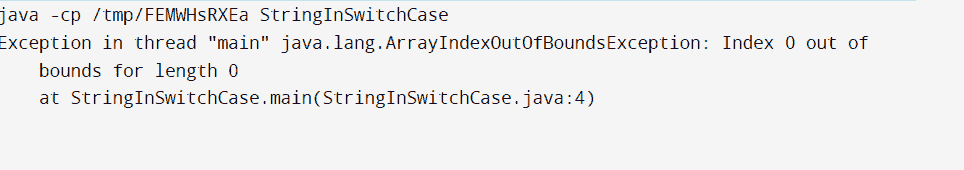

# Java 开关字符串

> 原文：<https://www.tutorialandexample.com/java-switch-string>

多路分支语句是 switch 语句。它提供了一种简单的方法，根据表达式的值将执行分配给不同的代码段。基本数据类型，包括字节、短整型、字符和整型，都可以在这个词中使用。它现在可以处理字符串类、包装类和枚举类型(Java 中的枚举)。加上多异常捕获块和自动资源管理，这是最受欢迎的 JDK 7 版本的功能之一。在 Java 7 代码中，可以在 switch 语句表达式中使用字符串对象。

与使用一系列等效的 if/else 报告相比，使用基于字符串的开关更有优势。现在，用户只需将一个字符串声明为 string 类的对象，如下所示:

**举例:**

```
String hello = "Hello World"; // Valid from JDK7 and onwards
Object hello = "Hello World"; // Invalid from JDK7 and onwards
```

虽然 switch 语句很方便，但是它们也有一些应该记住的重要缺点。为此，我们应该经历以下特征:

1.  **string string 不应为 NULL:** 使用行时，用户应确保 switch 语句中的表达式不为 NULL，以避免在运行时引发 NullPointerException。
2.  **昂贵的操作:**就执行成本而言，字符串可能比原始数据类型更昂贵。因此，建议只在控制数据已经是字符串形式的情况下激活字符串。
3.  **比 if-else 语句更好:**使用 String 对象的 Switch 语句通常是比链式 if-then-else 表达式更有效的 Java 字节码生成器。
4.  **区分大小写比较:**switch 语句中字符串对象的比较是区分大小写的，因为 switch 语句使用 String 类的 equals()函数来比较其表达式中的字符串对象与链接到每个 Case 标签的表达式。

### 演示字符串用法的示例

**Animalss.java**

```
// Java Program to Demonstrate use of String to
// Control a Switch Statement
// Main class
public class Animals {
// Main driver method
public static void main(String[] args)
{
// Custom input string
String str = "two";
// Switch statement over above String
switch (str) {
// Case 1
case "one":
// Print statement corresponding case
System.out.println("cat");
// break keyword terminates the
// code execution here itself
break;

// Case 2
case "two":
// Print statement corresponding case
System.out.println("dog");
break;

// Case 3
case "three":
// Print statement corresponding case
System.out.println("rabbit");
break;

// Case 4
// Default case
default:
// Print statement corresponding case
System.out.println("no match");
}
}
} 
```

**输出:**



Equals()和 hashCode()方法可用于在开关中实现字符串，但我对 Java 7 在控件中实现行更感兴趣。

这个简单的测试程序的主要方法和开关块对字符串变量进行操作。这个程序使用一个字符串参数运行，然后从主方法的字符串数组参数访问它。

该应用程序可以在主动、被动或安全模式下启动。虽然如果您决定使用字符串，最好使用枚举来表示这些众所周知的不变值，但一定要用大写字母来表示，以避免区分大小写的问题。

**StringInSwitchCase.java**

```
public class StringInSwitchCase{

public static void main(String[] args) {
String mode = args[0];

switch (mode) {
case "PASSIVE":
System.out.println("Application is running on Passive mode");
break;
case "ACTIVE":
System.out.println("Application is running on Active mode");
break;
case "SAFE":
System.out.println("Application is running on Safe mode");
}
}
}
```

**输出:**



要编译和运行此代码，必须安装 JDK 1.7 版。任何 JDK 7 版本都可以。

上面提到的类的反编译版本是使用 jdk1.7.0 40 版本创建的。

### 开关中可以有字符串吗？

字符串是除整数之外唯一可以在 switch 语句中使用的类型。

### Java 中开关的用途是什么？

Java switch case 允许用户从几个语句中选择一个来执行。其结果类似于 if-else-if 梯形表达式。它支持多种数据类型。switch 语句用于将变量值与测试用例中给出的一些值进行比较。