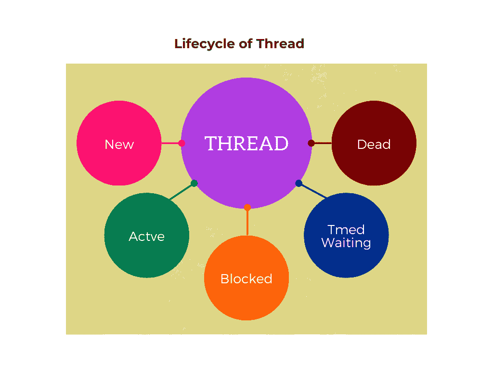

# Java 线程生命周期:状态和阶段

> 原文：<https://www.tutorialandexample.com/java-thread-lifecycle-states-and-stages>

## 多线程操作

多线程是面向对象编程中最重要的特性之一，这种多线程可以由各种面向对象编程语言实现，如 Java、Python 和 C++。多线程进程由许多小作业组成。每个任务都有一个“线程”名称或表示。因此线程是快速进程。术语“多线程”是指在一个进程中有许多线程同时工作。

## Java 多线程是什么意思？

Java 中的多线程定义为多个线程的并发执行。这是一个同时进行的过程，执行的过程是连续进行的。多线程确保处理单元的最佳使用。

## 线

既然我们讨论了很多关于线程的内容，那么 Java 线程到底指的是什么呢？

线程被定义为非常轻量级的子进程。所有线程都是不依赖的，并且彼此唯一。它们都有不同的执行路径，都是操作系统中的小单元。

为了在后台执行复杂的进程，我们利用了 Java 的线程思想。所有任务的执行都不会对主程序产生影响。

使用线程的另一个好处是，如果一个线程在运行时遇到错误或异常，它不会干扰任何其他线程的操作。在进程中，运行一个线程，并且每个进程可以有多个线程。线索在各种上下文之间变化。操作系统可以包括许多进程。

## 多任务处理

这种多线程和多重处理被用来实现完全的多任务处理。为了使用 CPU，我们更喜欢多任务处理，在这个过程中，许多任务同时执行。为了完成这项任务，需要考虑多重处理和多线程。与多处理相比，多线程更受青睐，因为它可以在程序的各个部分之间进行上下文切换，而且多线程的主要重要用途是内存使用。程序的较小部分将使用相同的内存区域，允许多个线程共享一个内存，这将有助于节省和控制内存。通过这个多线程，我们可以节省内存和处理时间也较少。

## 线程的生命周期

由于线程是一个子进程，它将处于不同的执行状态，这些状态称为线程状态。一个线程只能处于所描述的状态之一。现有的线程状态有

1.  新状态
2.  就绪或活动状态
3.  等待或阻止状态
4.  定时等待状态
5.  终止状态

## 线程执行状态解释

### 1.新状态

这是一个线程的诞生状态，意味着一个新的线程被创建。新线程应该总是处于新状态。当线程处于新状态时，它表示执行尚未开始，代码尚未开始。要开始执行，我们必须调用 start()方法。

### 2.就绪或活动状态

这种状态也被定义为“就绪阶段”或“队列”。每当使用 start()方法时，线程就达到可运行状态。哪些线程运行多长时间由线程调度器决定。当调用 start()方法时，尽管状态处于此状态，执行仍会开始。从“新”到“就绪”级别，线程会发生变化。这个阶段进一步细分为两个类别:可运行状态和正在运行状态。

**可运行状态**

当执行开始时，准备运行的线程将进入可运行状态。在这种状态下，线程可能是活动的，或者准备在任何给定的时刻启动。调度程序将负责将正在执行的线程转移到运行状态。

可运行状态由准备执行并等待轮到它们的线程占据。当线程处于可运行状态时，它们通常存储在一个队列中。当执行所有线程的程序为每个线程提供一定的执行时间时，就会出现这种情况。每个处于可运行状态的线程只运行很短的时间。

**运行状态**

该状态是线程活动状态的一部分。在运行状态中，所有可运行的线程现在都被转移到运行状态，此时所有线程都到达 CPU。最常见的线程状态转换是从可运行状态到正在运行状态，然后像往常一样回到可运行状态。

### 3.等待或阻止状态

这一阶段也称为非活动状态，因为线程可能处于非活动状态，或者在特定的一小段时间内不会运行。顺便说一下，线程不会永远处于非活动状态。这意味着线程可能正在等待执行，或者线程可能处于阻塞状态。

这可以用一个例子来说明

如果有两个线程 t1 和 t2。两个线程都想使用一台机器，并且只有一个线程可以在这台机器上执行任何操作。假设 t1 正在机器中执行，那么 t2 将处于阻塞或等待状态，这样 t1 可以在没有任何中断的情况下完成它的任务。而处于等待状态的 t2 在处于等待状态时不能进行任何执行，并且不会消耗或干扰中央处理单元的处理周期。

当线程调度器在 t1 完成任务后反应线程 t2 时，线程 t2 将进入活动状态。在任何执行中，线程调度器都扮演着最重要的角色。线程调度器的主要作用是选择或拒绝处于等待状态或阻塞状态的线程运行。

父线程调用 join()方法，表明该线程被阻塞或正在等待。因此，任务可以由子线程首先完成。当每个子线程成功完成它们的工作时，通知被传送到主线程，主线程因此进入活动状态并开始执行。

### 4.定时等待状态

在这种状态下，允许线程休眠一段设定的时间。因此，如果有两个线程，第一个和第二个，第二个线程必须等待很长时间才能执行，如果第一个线程处于异常状态并且无法执行。当这种情况发生时，线程将使用 sleep()方法进入定时等待状态，等待一段预定的时间。当时间到时，线程将被唤醒并从它停止的地方继续执行。

### 5.终止状态

这种状态也称为死状态，这意味着线程已经死了，根本不存在于系统中。一旦线程被终止，我们就无法检索该线程来执行。

终止的线程意味着要么它已经完全完成了它的任务，要么不能执行的线程已经离开了执行。当线程完成其任务时，它正常退出，而当有少数异常情况(如异常或分段错误)时，线程将异常终止，称为异常终止。



**线程实现**

在执行线程程序时，如果想知道线程处于哪个状态，就必须使用**线程。getState()方法**以便返回线程现有状态。

下面定义了几个枚举常量的线程摘要

1.  公共静态最终线程。状态新
2.  公共静态最终线程。状态可运行
3.  公共静态最终线程。状态可运行
4.  公共静态最终线程。状态等待
5.  公共静态最终线程。状态定时 _ 等待
6.  公共静态最终线程。状态终止

所有上述声明定义了线程在不同阶段的状态，如新状态、可运行状态、等待和时间等待，以及多线程中的终止状态。

用于实现线程的不同状态和生命周期的示例 Java 程序

**代码**

```
// Example Java program to implement thread lifecycle and states
import java.io.*;
import java.lang.*;
class thread implements Runnable {
public void run ()
{
// this try block will move thread 2 to timed waiting state
try
{
Thread.sleep(100);
}
//to handle if there is any exception
catch(Interrupted Exception e)
{
System.out.print(e);
}

// join() method is invoked on thread 2, the current state of thread 1 is printed 
System.out.print(Demo.thread1.getState());

try
{
Thread.sleep(2000);
}
// to handle the exception
catch(Interrupted Exception e)
{
System.out.print(e);
}
}
}

// implementing base class Demo
public class Demo implements Runnable
{
// declare first thread
public static Thread thread1; 
// declare obj
public static Demo obj;          
 // main function
public static void main(String[] args)
{
obj = new Demo();
thread1 = new Thread(obj);

// thread 1 is initialized that means it is in the NEW state
// display thread 1 current state 
System.out.print (thread1.getState());

thread1.start();

// now thread 1 is in runnable state after invoking start () method
// display the state of thread 1 after invoking start () method

System.out.print(thread1.getState());
}
public void run()
{
thread t = new thread();
Thread thread2 = new Thread(t);

// thread 2 is initialized that means it is in the NEW state
// display thread 2 current state

System.out.print(thread2.getState());
thread2.start();

// now thread 1 is in runnable state after invoking start () method
// display the state of thread 1 after invoking start () method

System.out.print(thread2.getState());

// to move thread 1 to timed waiting state
try
{
Thread.sleep(300);
}
// to handle interrupted exceptions
catch(Interrupted Exception e)
{
System.out.print(e);
}

// display the state of thread 2 after invoking sleep () method
System.out.print(thread2.getState());
Try
// join() is called to send thread 2 to dead state
{
thread2.join();
}
// to handle the exception
catch(Interrupted Exception e)
{
System.out.print(e);
}
System.out.print(thread2.getState());
}
} 
```

**输出**

```
C:\java>javac Demo.java
C:\java>java Demo
NEW
RUNNABLE
NEW
RUNNABLE
TIMED_WAITING
TIMED_WAITING
TERMINATED 
```