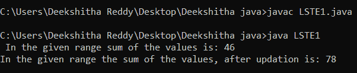

# Java 中段树的惰性传播

> 原文：<https://www.tutorialandexample.com/lazy-propagation-in-segment-tree-in-java>

Java 中的段树主题由段树中缓慢传播的主题继续。建议读者先通读章节树主题。在段树中，惰性传播意味着延迟某些值的更新，并在必要时更改它们。

## 更新操作

让我们回想一下分段树是如何更新的。

*   从细分树的底部开始。
*   如果当前节点的范围不包括输入数组的索引，则返回。
*   如果没有，更新当前节点，并对当前节点的子节点再次执行步骤 2。

## 惰性传播场景

让我们来讨论一下懒惰传播策略适合的情况。

假设赋值是将数字 6 加到输入数组从索引 1 到 4 的每一项上。必须为从索引 1 到 4 的每个项目调用 update()方法来完成操作。由于这些大量的呼叫，花费了更多的时间。由于采用了惰性传播策略，这里的更新过程变得很快。

请注意，只搜索几个索引的结果包含在段树的一个节点中。此外，如果更新操作的范围与该节点的范围重叠，则必须更新该节点的所有后代。例如，在上图中，值为 35 的节点包括索引从 3 到 5 的所有元素。(见上图)。如果更新的查询在 2 到 5 的范围内，则修改该节点及其所有后代。

我们必须通过延迟传播来升级编号为 35 的节点，并通过将更新后的信息存储在不同的节点(称为休眠节点或值)中来推迟后续节点的更改。为了表示惰性节点，我们创建了一个名为 lazy[]的数组。下面代码中数组 t[]的大小与

数组 lazy[]，它表示段树。

策略是将 lazy[]数组的每个元素初始化为 0。段树节点 j 没有挂起的更改，如数组 lazy[j]中的值 0 所示。lazy[j]的任何替代值(假设它是 v)表示在进行任何查询之前，必须首先将段树的节点 j 加上等于 v 的量。

## 如何使用惰性传播更新段树中的节点

//反映段树中数组元素的更新

//在数组中的 x 和 y 之间。

updateRange(美国、欧盟)

1)如果当前段树中的任何节点有任何未决更新，则

首先完成该节点挂起的更改。

2)如果当前节点的范围完全在更新查询的范围内，则首先更新当前节点。然后，通过将所有子节点的惰性值设置为 true 来更新它们。

3)如果当前节点的范围与更新范围重叠，则使用与上次简单更新相同的过程:

1.  左右孩子重复出现。
2.  用左右调用的结果更新当前节点。

## 惰性传播的使用

斯坦 1.java

```
public class LSTE1
{  
final int MAX_SIZE = 50;    
int s[] = new int[MAX_SIZE]; 
int l[] = new int[MAX_SIZE];
void updateRangeUtil(int currNode, int y, int z, int t, int f, int v)  
{
if (l[currNode] != 0)  
{ 
s[currNode] += (z - y + 1) * l[currNode];  
if (y != z)  
{  
l[2 * currNode + 1] += l[currNode];  
l[2 * currNode + 2] += l[currNode];  
}  
l[currNode] = 0;  
}
if (y > z || y > f || z < t)  
{  
return;  
}  
if (y >= t && z <= f)  
{ 
s[currNode] += (z - y + 1) * v; 
if (y != z)  
{  
l[2 * currNode + 1] += v;  
l[2 * currNode + 2] += v;  
}  
return;  
}  
int m = (y + z) / 2;  
updateRangeUtil(2 * currNode + 1, y, m, t, f, v);  
updateRangeUtil(2 * currNode + 2, m + 1, z, t, f, v);  
s[currNode] = s[2 * currNode + 1] + s[2 * currNode + 2];  
} 
void updateRange(int n, int y, int z, int v)   
{  
updateRangeUtil(0, 0, n - 1, y, z, v);  
}  
int getSumUtil(int y, int z, int t, int f, int si)  
{  
if (l[si] != 0)  
{  
s[si] += (z - y + 1) * l[si];  
if (y != z)  
{
l[2 * si + 1] += l[si];  
l[2 * si + 2] += l[si];  
}  
l[si] = 0;  
} 
if (y > z || y > f || z < t)  
{  
return 0;  
}  
if (y >= t && z <= f)  
{  
return s[si];  
}  
int m = (y + z) / 2;  
return getSumUtil(y, m, t, f, 2 * si + 1) +  
getSumUtil(m + 1, z, t, f, 2 * si + 2);  
}  
int getSum(int t, int y, int z)  
{ 
if (y < 0 || z > t - 1 || y > z)  
{  
System.out.println("Invalid input");  
return -1;  
}  
return getSumUtil(0, t - 1, y, z, 0);  
}  
void constructSTUtil(int b[], int y, int z, int si)  
{
if (y > z)  
{  
return;  
} 
if (y == z)  
{  
s[si] = b[y];  
return;  
}  
int m = (y + z) / 2;  
constructSTUtil(b, y, m, 2 * si + 1);  
constructSTUtil(b, m + 1, z, 2* si + 2);  
s[si] = s[2 * si + 1] + s[2 * si + 2];  
}  
void constructST(int b[], int t)  
{  
constructSTUtil(b, 0, t - 1, 0);  
}  
public static void main(String argvs[])  
{  
int b[] = {3, 5, 8, 11, 13, 14};  
int t = b.length;  
LSTE1 tObj = new LSTE1();  
tObj.constructST(b, t);  
System.out.println(" In the given range sum of the values is: " +  
tObj.getSum(t, 2, 5));  
tObj.updateRange(t, 2, 10, 8);  
System.out.println("In the given range the sum of the values, after updation is: " +  
tObj.getSum(t, 2, 5));  
}  
} 
```

**输出:**

