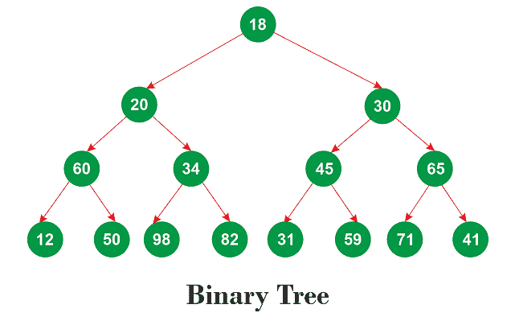
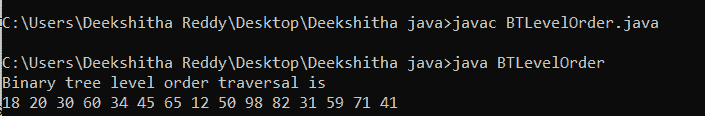
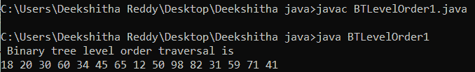

# Java 中二叉树的层次顺序遍历

> 原文：<https://www.tutorialandexample.com/level-order-traversal-of-a-binary-tree-in-java>

在 Java 中，树结构的层次顺序遍历也称为二叉树的广度优先遍历。

关于后面的二叉树:



等级顺序遍历如下:18 20 30 60 34 45 65 12 50 98 82 31 59 71 41

## 使用递归

使用递归可以浏览二叉树的层次顺序。递归技术必须考虑左右子树。下面的代码更全面地展示了这一点。

### 履行

让我们使用前面提到的伪代码来执行二叉树的层次顺序遍历。

BTLevelOrder.java

```
// a class for producing binary tree nodes 
// A left and right reference
// as well as the node's value
// are contained in each binary tree node. 
class TreeNode   
{  
// for maintaining the node's value
int v;  

// to discuss the other nodes  
TreeNode l, r;  

// builder for the class 
// The construct TreeNode initializes the class fields.  
public TreeNode(int i)  
{  
v = i;  
r = l = null;  
}  
}  

public class BTLevelOrder    
{  
// the Binary Tree's top node, or root  
TreeNode r1;  

// function Object() { [native code] } for the BTree class  
public BTLevelOrder() { r1 = null; }  

// a technique for visualizing the binary tree's level order traversal 
void displayLevelOrder()  
{  
int ht1 = treeHeight(r1);  
int j;  

for (j = 1; j <= ht1; j++)  
{  
displayCurrentLevel(r1, j);  
}  
}  

// discovering the binary tree's "height"
// Keep in mind that the lengthiest path 
// from the topmost node (root node) to the leaf node, 
// which is the farthest from the root node, 
// determines the tree's height. 
int treeHeight(TreeNode r1)  
{  
if (r1 == null)  
{  
return 0;  
}  
else   
{  
// determining the left and right subtrees' heights  
int lh1 = treeHeight(r1.l);  
int rh1 = treeHeight(r1.r);  

// grabbing the bigger one  
if (lh1 > rh1)  
{  
return (lh1 + 1);  
}  
else  
{  
return (rh1 + 1);  
}  
}  
}  

// Nodes in the current level that can be printed  
void displayCurrentLevel(TreeNode r1, int l)  
{  
// Null indicates there is nothing to print.  
if (r1 == null)  
{  
return;  
}  

// If l == 1, 
// then there is just one node in the binary tree.  
if (l == 1)  
{  
System.out.print(r1.v + " ");  
}  

// We must search both the left and 
// the right sides of the current node since l > 1 denotes 
// that either node is present on the left side 
// of the current node, the right side 
// of the current node, or both sides.
else if (l > 1)   
{  
displayCurrentLevel(r1.l, l - 1);  
displayCurrentLevel(r1.r, l - 1);  
}  
}  

// main method  
public static void main(String args[])  
{  
// creating an instance of the class BTLevelOrder   
BTLevelOrder  t = new BTLevelOrder ();  

// root node  
t.r1 = new TreeNode(18);  

// the remaining tree nodes  
t.r1.l = new TreeNode(20);  
t.r1.r = new TreeNode(30);  
t.r1.l.l = new TreeNode(60);  
t.r1.l.r = new TreeNode(34);  
t.r1.r.l = new TreeNode(45);  
t.r1.r.r = new TreeNode(65);  
t.r1.l.l.l = new TreeNode(12);  
t.r1.l.l.r = new TreeNode(50);  
t.r1.l.r.l = new TreeNode(98);  
t.r1.l.r.r = new TreeNode(82);  
t.r1.r.l.l = new TreeNode(31);  
t.r1.r.l.r = new TreeNode(59);  
t.r1.r.r.l = new TreeNode(71);  
t.r1.r.r.r = new TreeNode(41);  
System.out.println(" Binary tree level order traversal is ");  
t.displayLevelOrder();  
}  
} 
```

**输出:**



### 时间复杂度:

程序最坏情况下的时间复杂度是 O(n2)，其中 n 是二叉树中节点的总数。请记住，倾斜的树会导致最坏的情况。

### 空间复杂性:

该程序最坏情况下的空间复杂度是 O(n)，其中 n 是二叉树中节点的总数。请记住，倾斜的树会导致最坏的情况。O(n)空间调用堆栈由 displayCurrentLevel()方法用于倾斜树。在我们的例子中所需的空间是 O(log(n))，它等于一棵平衡树的高度，因为这棵树是平衡的。

## 使用队列

队列也可以用来遍历二叉树的层次顺序。我们最初使用一个队列来分组一个节点的所有子节点。在队列中，左边的孩子排在右边的孩子前面。因为队列根据 FIFO(先入先出)规则运行，该规则规定左孩子先出来，右孩子跟随，所以树的等级排序遍历成为可能。为了更好的理解，我们先来看看实现。

### 履行

BTLevelOrder1.java

```
// importing the program's necessary 
// classes for queues and linked lists 
import java.util.Queue;  
import java.util.LinkedList;  

// a class for producing binary tree nodes
// A left and right reference, as well as 
// the node's value, is contained in 
// each binary tree node. 
class TreeNode   
{  
// for maintaining the node's value  
int v;  

// to discuss the other nodes 
TreeNode l, r;  

// builder for the class 
// The construct TreeNode initializes the class fields.  
public TreeNode(int i)  
{  
v = i;  
r = l = null;  
}  
}  

// a class that prints a 
// level order of queue traversal
public class BTLevelOrder1   
{  

// the Binary Tree's top node, or root  
TreeNode r1;  

//  function Object() { [native code] } for the BTree class   
public BTLevelOrder1() { r1 = null; }  

// a technique for visualizing the binary tree's level order traversal  
void displayLevelOrder()  
{  
// making a blank queue  
Queue<TreeNode> q = new LinkedList<TreeNode>();  

// the node being added 
q.add(r1);  

while (!q.isEmpty())   
{  
// deleting the queue's front node 
TreeNode tNode = q.poll();  

//  the removed node's value.
System.out.print(tNode.v + " ");  

// Enqueue the left child if it's already there.   
if (tNode.l != null)   
{  
q.add(tNode.l);  
}  

// Enqueue the right child if it's already there.
if (tNode.r != null)   
{  
q.add(tNode.r);  
}  
}  
}  

// main method  
public static void main(String args[])  
{  
// creating an instance of the class BTLevelOrder1      
BTLevelOrder1  t = new BTLevelOrder1();  

// root node  
t.r1 = new TreeNode(18);  

// the remaining tree nodes
t.r1.l = new TreeNode(20);  
t.r1.r = new TreeNode(30);  
t.r1.l.l = new TreeNode(60);  
t.r1.l.r = new TreeNode(34);  
t.r1.r.l = new TreeNode(45);  
t.r1.r.r = new TreeNode(65);  
t.r1.l.l.l = new TreeNode(12);  
t.r1.l.l.r = new TreeNode(50);  
t.r1.l.r.l = new TreeNode(98);  
t.r1.l.r.r = new TreeNode(82);  
t.r1.r.l.l = new TreeNode(31);  
t.r1.r.l.r = new TreeNode(59);  
t.r1.r.r.l = new TreeNode(71);  
t.r1.r.r.r = new TreeNode(41);  
System.out.println(" Binary tree level order traversal is ");  
t.displayLevelOrder();  
}  
} 
```

**输出:**



### 时间复杂度:

该程序的时间复杂度为 O(n ),其中 n 是二叉树中节点的总数。

### 空间复杂性:

该程序的空间复杂度为 O(n ),其中 n 是二叉树的节点数。

## 两种方法的对比分析

通过对比这两种方法的时间和空间复杂度，我们发现使用队列产生期望的输出要快得多。排队程序的时间复杂度和空间复杂度与节点的排列方式无关。换句话说，程序的空间和时间复杂度不受树的偏斜度的影响。这在递归方法中是不可能的。树的节点的位置在递归技术中是至关重要的。