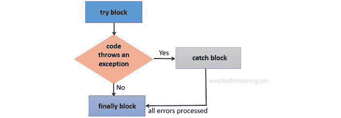

# Java 最终关键字

> 原文：<https://www.tutorialandexample.com/java-finally-keyword>

Java 中的最后一个块用于运行基本代码，比如连接关闭等等。无论异常是否被解决，Java finally 块总是运行的。即使事先给出了程序的执行或打印语句，我们也无法知道是否发生了异常，也无法执行必要的语句。

try-catch 块在 finally 块实现或执行后执行。

### 最后方框流程图



与 Java 的 final 是保留关键字一样，finally 也是不能用作标识符的保留关键字。最后，当与 try/catch 块结合使用时，keyword 确保即使抛出异常，部分代码仍将运行。在执行 try 和 catch 块之前，程序对其源代码的控制，然后执行最后一个块。

注意:如果我们不处理异常，JVM 将在终止或停止应用程序(如果有的话)之前实现或执行 finally 块。

### Java 中 Finally 块的用法

在 Java 编程语言中，可以在 finally 块中插入“清理”代码，如终止文件或连接。作为编程规范的一部分，我们通过创建连接、使用输入和输出流以及 try 块中的资源来与数据库进行交互。建议将 finally 块与 try-catch 块一起使用，作为一个好的程序员来确保资源的安全性，并确保我们的软件中没有资源泄漏。

finally 块是您可以打印基本语句的地方。

### Java 关键字的用法最后

让我们来理解和研究 Java finally 块可以应用和实现的各种场景。

**情况 1:在没有异常的情况下**

让我们看看下面的例子，其中 Java 程序没有引发任何异常，并且在 try 块之后执行 finally 块。

```
TestFinallyBlock.java

class Fnl_Block {    
  public static void main (String s []) {
try {
// any exception is not thrown in the above code
   int ja=25/5;
   System.out.println(ja);
  }    
//executed without regard to exception happened or not
catch (NullPointerException e) {
System.out.println(e);
}    
 finally {  
System.out.println("Ececution of the finally block is always done.");
}    

System.out.println("remaining of the code...");
  }    
} 
```

**输出:**

```
Java finally block
```

**情况二:异常发生时不使用 catch 块。**

在这种情况下，当代码引发异常语句时，catch 块无法处理异常。除此之外，在运行 try 块之后执行 finally 块之后，程序会不正确或不规则地终止。

```
public class Fnl_block_1{    
      public static void main (String s []) {
      try {    
        System.out.println("inner of try block");

        //The code below raises the divide-by-zero exception.
       int ja=25/0;
       System.out.println(ja);
      }    
//cannot handle exception of the arithmetic type
//can only accept exceptions of the Null Pointer type.
catch (Null_Pointer_Exptne) {
        System.out.println(e);
      }   
//checking whether an exception has occurred is executed or not.
      finally {  
        System.out.println("Execution of the finally block is always done");
      }    

      System.out.println("remaining of the code...");
      }    
    } 
```

**输出:**

```
Java finally block
```

**情况 3:当 catch 块用于处理出现的异常时。**

**举例:**

让我们看看下面的例子，catch 块处理 Java 代码抛出的异常。在 try-catch 块之后，运行 finally 块。此外，其余代码也正常运行。

```
public class Fnl_Block_2{    
      public static void main (String s []){
      try {    
        System.out.println("Inner side of try block");

        //below code throws divide by zero exception  
       int ja=25/0;
       System.out.println(ja);
}  //handles the Arithmetic Exception 
            // Divide by zero

catch (Arithmetic_Exception e) {
        System.out.println("Exception handled");
        System.out.println(e);
      }   

      //regardless of whether an exception has occurred, /executes
      finally {  
        System.out.println("Execution of the final block is always done");
      }    

      System.out.println("remaining of the codeexecuted...");
      }    
    } 
```

**输出:**

```
Java finally block
```

**规则:**每个尝试块可能有零个或多个 catch 块，但可能只有一个 finally 块。

> **注意:**如果应用程序终止(通过调用 System.exit()或者通过引入导致过程返回的致命错误)，它们将不会在 finally 关键字下执行。