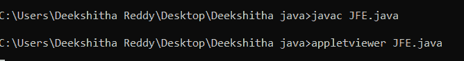
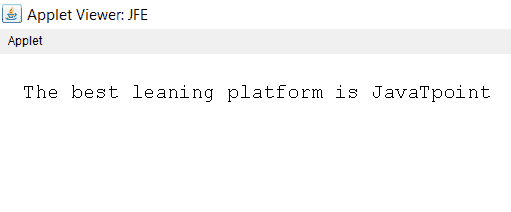
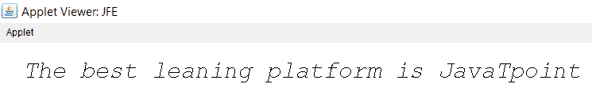

# Java 字体

> 原文：<https://www.tutorialandexample.com/java-font>

字体是 Java 类，是 java.awt 包的一部分。Serializable 接口由它实现。Java 字体类的直接识别子类是 FontUIResource。

用来产生文本的字体由它来表示。字符和字形是 Java 中用来描述字体的两个技术词汇。

## Java 中的字体类型

Java 支持两种不同的字体类型:

1.  物理字体
2.  逻辑字体

## 物理字体

实际的 Java 字体库被用作物理字体。它包括使用 TrueType 字体(TTF)和 PostScript Type 1 字体等字体技术将字符序列转换为字形序列的表格。请记住，所有 Java 实现都必须支持 TTF。使用不同的字体技术取决于它们是如何实现的。实际字体的名称，如 Helvetica，帕拉蒂诺，HonMincho，和其他人都包括在内。

物理字体的独特之处在于，它只支持少量的书写系统，如拉丁语或日语以及基本拉丁语。关于配置修改，可能会有所不同。如果应用程序需要，Java Font 类的 createFont()函数可用于捆绑和实例化特定的字体。

## 逻辑字体

Serif、SansSerif、Monospaced、Dialog 和 DialogInput 是 Java 定义的五种逻辑字体系列。JRE 必须能够支持它。因为这些不是真正的字体库，应该注意的是 JRE 将逻辑字体名称转换成物理字体。映射的实现通常是位置特定的。为了适应各种各样的字符，每个逻辑字体名称都映射到多个物理字体。

例如，像 Label 和 TextField 这样的 AWT 组件只使用逻辑字体。

## 字体和名称

字体可以有多种风格，包括重字体、正常字体、中等字体、倾斜字体、哥特式字体等。所有字体的排版设计都是一样的。

字体对象有三个名称，分别是:

**逻辑字体名称**:用来创建字体的名称是逻辑上的。

**字体名称:**这是字体名称。例如，Helvetica·博尔德。

**家族名称:**在众多面孔中，它选择了排版设计。

Java 字体类表示主机系统的系统资源中可用的一组字体中的特定字体。Arial 粗体和 Courier 粗斜体是字体的两个例子。字体可以与许多字体对象相关联，每个字体对象都有不同的大小、样式、变换和字体特征。

## 字体类字段


| 修改 | **字段** | **描述** |
| 静态 int | 大胆的 | 总是以大胆的方式。 |
| 静态 int | 中心 _ 基线 | 排列表意字符(包括中文、日文和韩文)中的文本时使用的基础。 |
| 静态字符串 | 对话 | “对话框”的字符串常量，是逻辑字体的标准系列名称。 |
| 静态字符串 | 对话框 _ 输入 | 一个字符串常量，表示逻辑字体“DialogInputcanonical”的系列名称。 |
| 静态 int | 悬挂 _ 基线 | Devanigiri 和相关脚本中文本布局的起点。 |
| 静态 int | 斜体的 | 持续的斜体风格。 |
| 静态 int | 布局从左到右 | 向 layoutGlyphVector 指示，根据 Bidi 分析，文本是从左到右的。 |
| 静态 int | 布局 _ 无 _ 限制 _ 上下文 | LayoutGlyphVector 被赋予了一个标志，指示不应检查 char 数组中超出特定限制的文本。 |
| 静态 int | 布局 _ 无 _ 开始 _ 上下文 | 不应查看 layoutGlyphVector 的一个标志，该标志指定 char 数组中指定开始位置之前的第一个文本。 |
| 静态 int | 布局从右向左 | layoutGlyphVector 的标志，告诉它根据 Bidi 分析，文本是从右向左的。 |
| 静态字符串 | 单空间 | 逻辑字体“Monospaced”有一个代表其规范系列名称的字符串常量。 |
| 静态字符串 | 名字 | 函数 Object(){[本机代码] }被赋予了该字体的逻辑名称。 |
| 静态 int | 平原 | 简单、永恒的设计。 |
| 静态浮动 | pointSize(点大小) | 这种字体的磅值是浮动的。 |
| 静态 int | 罗马字 _ 基线 | 罗马字体中最常见的文本布局基线。 |
| 静态字符串 | SANS_SERIF | 逻辑字体“SansSerif”有一个表示其规范系列名称的字符串常量。 |
| 静态字符串 | 衬线 | 逻辑字体“Serif”有一个字符串常数，代表其规范的姓。 |
| 受保护 int | 大小 | 字体的磅值以整数表示。 |
| 受保护 int | 风格 | 提供给 function Object(){[本机代码] }的字体样式。 |
| 静态 int | TRUETYPE_FONT | 识别 TRUETYPE 字体资源。 |
| 静态 int | TYPE1_FONT | 查找具有 TYPE1 字体系列的字体资源。 |


## 字体类构造函数


| **构造器** | **描述** |
| 字体(字体) | 使用提供的字体创建新字体。 |
| 字体(映射属性) | 将创建具有所提供属性的替换字体。 |
| 字体(字符串名称、整数样式、整数大小) | 使用提供的名称、样式和磅值创建新字体。 |


## 字体类方法


| 方法 | 描述 |
| canDisplay(字符 c) | 它确定该字体是否再次包含所请求字符的字形。 |
| canDisplay(int 码点) | 它确定该字体是否再次包含所请求字符的字形。 |
| canDisplayUpTo(char[] text，int start，int limit) | 它指示是否可以使用该字体显示提供的文本，从起始处开始，到限制处结束。 |
| canDisplayUpTo(字符计数器 iter，int start，int limit) | 它显示了由 iter 定义的从开始到结束的文本是否可以用这种字体显示。 |
| canDisplayUpTo(字符串 str) | 它说明提供的字符串是否可以用这种字体显示。 |
| createFont(int 字体格式，文件字体文件) | 提供的字体类型和指定的字体文件用于创建返回的新字体。 |
| createFont(int fontFormat、InputStream fontStream) | 提供的字体类型和指定的字体文件用于创建返回的新字体。 |
| creategly vector(fontrender context frc，char[] chars) | 使用这种字体的 Unicode cmap 建立一个 GlyphVector，将字符一对一地转换成字形。 |
| createGlyphVector(FontRenderContext frc，CharacterIterator ci) | 使用该字体的 Unicode cmap 将提供的字符一对一地转换为字形，以构建一个 GlyphVector。 |
| createGlyphVector(FontRenderContext frc，int[] glyphCodes) | 使用这种字体的 Unicode cmap 建立一个 GlyphVector，将字符一对一地转换成字形。 |
| createGlyphVector(FontRenderContext frc，String str) | 使用这种字体的 Unicode cmap 建立一个 GlyphVector，将字符一对一地转换成字形。 |
| 解码(字符串) | 返回 str 参数描述的字体。 |
| 衍生字体 | 通过复制当前的字体对象并给它一个新的变换，它产生一个新的字体对象。 |
| deriveFont(浮动大小) | 通过复制当前的字体对象并给它一个新的大小，它生成一个新的字体对象。 |
| deriveFont(int 样式) | 通过复制当前的字体对象并给它一个新的大小，它生成一个新的字体对象。 |
| deriveFont(int 样式，AffineTransform trans) | 通过复制这个字体对象并添加新的样式和变换，它产生一个新的字体对象。 |
| deriveFont(int 样式，浮点大小) | 该字体对象被复制并被赋予新的样式和大小以产生新的字体对象。 |
| deriveFont(映射 extends AttributedCharacterIterator.Attribute,?>属性) | 当前字体对象被复制并被赋予一组新的字体属性以产生新的字体对象。 |
| 等于(对象对象) | 它根据指定的对象评估这个字体对象。 |
| getAttributes() | 返回在该字体中找到的字体属性的映射。 |
| getAvailableAttributes() | 返回该字体键支持的所有属性。 |
| getBaselineFor(char c) | 它返回适合显示该字符的起点。 |
| getFamily() | 它返回该字体系列的名称。 |
| getFamily(区域设置 l) | 返回为请求的区域设置本地化的该字体的系列名称。 |
| getFont(映射属性) | 它提供了适合这些属性的字体。 |
| get font(nm 字串) | 从系统属性列表中返回一个字体对象。 |
| get font(nm 字串，字体) | 从系统属性列表中获取所需的字体。 |
| getFontName() | 它返回这个字体的字体名称。 |
| getFontName(本地 l) | 它给出了所提供字体的特定于地区的字体名称。 |
| getItalicAngle() | 它返回这个字体的倾斜角度。 |
| getLineMetrics(char[] chars，int beginIndex，int limit，FontRenderContext frc) | 返回用所提供的输入生成的 LineMetrics 对象。 |
| getline metrics(character terator ci，int beginIndex，int limit，FontRenderContext frc) | 返回用所提供的输入生成的 LineMetrics 对象。 |
| getLineMetrics(字符串 str，FontRenderContext frc) | 它返回一个 LineMetrics 对象，该对象是使用提供的 FontRenderContext 和 String 创建的。 |
| getLineMetrics(String str，int beginIndex，int limit，FontRenderContext frc) | 返回用所提供的输入生成的 LineMetrics 对象。 |
| getmaxcharbounds(fontrender context frc) | 它根据所选的 FontRenderContext 返回具有最高边界的角色边界。 |
| getMissingGlyphCode() | 如果该字体缺少某个 unicode 码位的标志符号，它将返回 glyphCode。 |
| getName() | 返回该字体的逻辑标识。 |
| getNumGlyphs() | 返回该字体的字形数量。 |
| getPeer() | 现在，字体渲染可以在所有平台上运行。 |
| getPSName() | 它返回这个字体的 postscript 名称。 |
| getSize() | 它返回一个整数形式的字体磅值。 |
| getSize2D() | 它以浮点值的形式返回字体的磅值。 |
| getStringBounds(char[] chars，int beginIndex，int limit，FontRenderContext frc) | 它在选择的 FontRenderContext 中返回字符数组的逻辑边界。 |
| getStringBounds(character iterator ci，int beginIndex，int limit，FontRenderContext frc) | 它为在所提供的 FontRenderContext 中索引的字符提供了所提供的 CharacterIterator 的逻辑边界。 |
| getStringBounds(字符串 str，FontRenderContext frc) | 它在提供的 FontRenderContext 中返回字符串的逻辑边界。 |
| getStringBounds(String str，int beginIndex，int limit，FontRenderContext frc) | 它在提供的 FontRenderContext 中返回字符串的逻辑边界。 |
| getStyle() | 它恢复了这种字体的外观。 |
| getTransform() | 它返回与该字体相关的转换的副本。 |
| 哈希码() | 对于这种字体，返回一个 hashcode。 |
| hasLayoutAttributes() | 如果该字体具有需要额外布局处理的属性，则返回 true。 |
| hasUniformLineMetrics() | 它检查字体线条度量的一致性。 |
| isBold() | 它显示字体对象的样式是否为粗体。 |
| 意大利语() | 它显示字体对象的样式是否是斜体。 |
| 伊斯普兰() | 它显示这个字体对象的样式是否是普通的。 |
| isTransformed() | 它显示了除了大小属性之外，字体对象的大小是否受变换的影响。 |
| layoutGlyphVector(FontRenderContext frc，char[] text，int start，int limit，int flags) | 如果可能，当返回新的 GlyphVector 对象时，将执行文本的完整布局。 |
| toString() | 这个字体对象被转换成一个字符串表示。 |


让我们看一个 Java 字体示例。

JFE.java

```
import java.applet.Applet;  
import java.awt.Font;  
import java.awt.Graphics;  
public class JFE extends Applet  
{  
public void paint(Graphics gph)   
{   
// establishing a function Object() for the font class and providing the font's name, style, and size
// These three parameters can be adjusted appropriately.
Font font= new Font("Courier", Font.PLAIN, 20); 
// Font is changed by calling the setFont() function.   
gph.setFont(font);  
gph.drawString(" The best leaning platform is JavaTpoint ", 11, 44);  
}  
} 

/*  
<applet code="JFE" width=300 height=300>  
</applet>  
*/   
```

**输出 1:**





对以下语句进行必要的调整，以获得所需的结果:

```
Font font= new Font("Monospaced", Font.ITALIC, 30);   // Name, font face, and font size are modified
```

**输出 2:**

