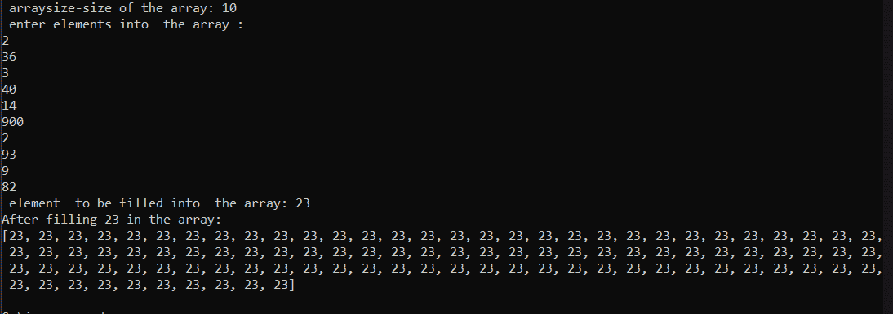
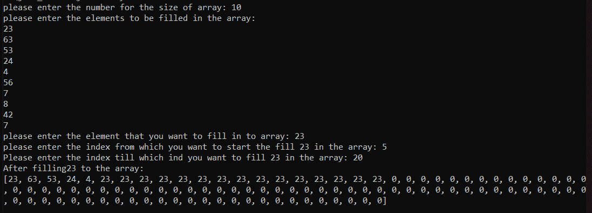
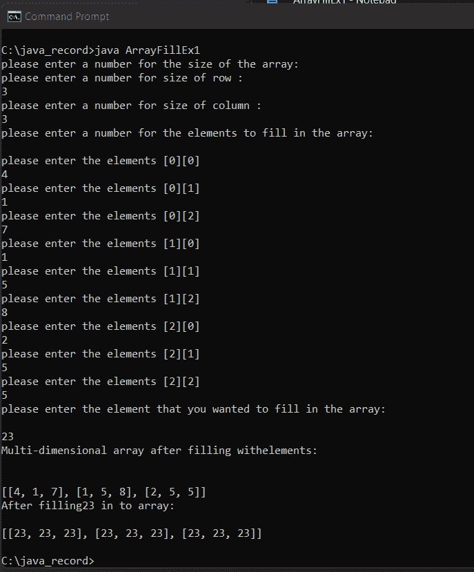
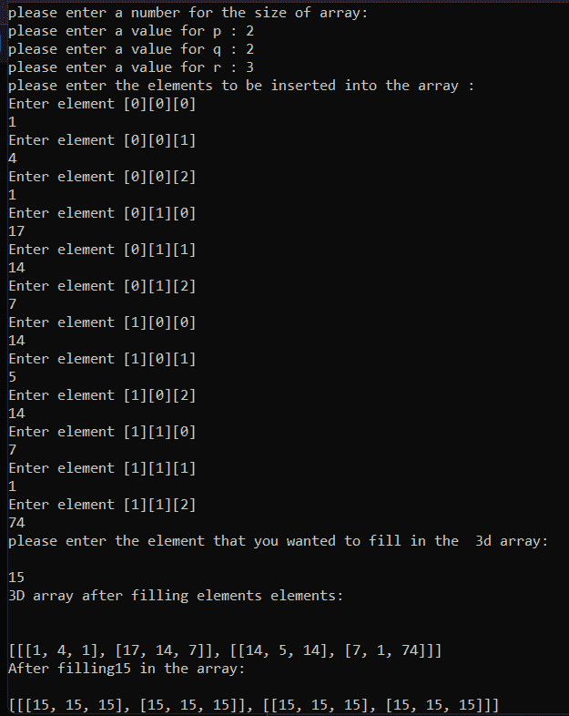

# Java 数组填充

> 原文：<https://www.tutorialandexample.com/java-arrays-fill>

我们可以使用 Arrays.fill()函数填充整个数组或它的一个子集。Arrays.fill()可以填充 2D 和 3D 数组。

**语法:**

```
Arrays.fill(boolean[] fillArr, int fromIndex, int toIndex, boolean val )  
```

**参数:**

*   要填充的数组由 arr 参数指定。
*   formIndex 参数指定将用指定值填充的第一个元素的索引。
*   toIndex 选项用指定的值指定最近填充的索引的索引。
*   val 选项指定要放入所有数组元素中的值。

**ArrayFillEx.java:**

```
// importing packages and the methods required  
import java.io.*;
import java.util.Arrays;  
import java.util.Scanner;    
// create ArrayFillEx 
public class ArrayFillEx 
{  

    public static void main (String [] args)  
    {  
        int arraysize, fillele;    
        Scanner sc = new Scanner (System.in);    
        System.out.print (" arraysize-size of the array: ");    
        arraysize = sc.nextInt ();    
        //creates an array of arraysize 100  
        Int [] arrfill = new int [100];    
        System.out.println (" enter elements into  the array : ");    
        for (int i = 0; i < arraysize; i++)    
        {    
            arrfill [i] = sc.nextInt ();    
        }  
        System.out.print (" element  to be filled into  the array: ");    
        fillele = sc.nextInt ();  
        // filling complete array with fillele  
        Arrays.fill (arrfill, fillele);  

        System.out.println ("After filling " +fillele+ " in the array:\n" + Arrays.toString (arrfill));  
    }  
} 
```

**输出:**



**ArrayFillEx1.java:**

```
// import packages 
import java.util.Arrays;  
import java.util.Scanner;    

public class ArrayFillEx1
{  

    public static void main(String[] args)  
    {  
        int arraysize, fillele, ind1, ind2;    
        Scanner sc = new Scanner(System.in);    
        System.out.print("please enter the number for the size of array: ");    
        arraysize = sc.nextInt();    

        int[] arrfill = new int[100];    
        System.out.println("please enter the elements to be filled in the array: ");    
        for(int i = 0; i < arraysize; i++)    
        {    
            arrfill[i] = sc.nextInt();    
        }  
        System.out.print("please enter the element that you want to fill into array: ");    
        fillele = sc.nextInt();  
    System.out.print("please enter the index from which you want to start the fill "+fillele+" in the array: ");    
        ind1 = sc.nextInt();  
        System.out.print("Please enter the index till which ind you want to fill "+fillele+" in the array: ");    
        ind2 = sc.nextInt();  

        Arrays.fill(arrfill, ind1, ind2, fillele);  

        System.out.println("After filling" +fillele+ " to the array:\n" + Arrays.toString(arrfill));  
    }  
} 
```

**输出:**



**二维数组填充:**

我们可以使用 Arrays.fill()函数填充多维数组，就像填充一维数组一样。为了填充多维数组，我们使用 for 循环，它填充数组的每一行。

让我们看一个例子，看看如何使用 Arrays.fill()函数填充多维数组。

**ArrayFillEx1.java**

```
// import required classes and packages  
import java.io.*;
import java.util.Arrays;  
import java.util.Scanner;    
// create ArrayFillEx1 for multidimensional array  
public class ArrayFillEx1
{  

    public static void main(String[] args)  
    {  

	  Scanner sc = new Scanner(System.in);    
        int fillele;    

        System.out.print("please enter a number for the size of the array: \n");    
        System.out.print("please enter a number for size of row : \n");  
        int r = sc.nextInt();  
        System.out.print("please enter a number for size of column : \n");  
        int c = sc.nextInt();    

        int twoDArrfill[][] = new int[r][c];  
        System.out.println("please enter a number for the elements to fill in the array: \n");    
        for(int i = 0; i < r; i++)  
        {              
           for(int j = 0; j < c; j++)  
           {  
               System.out.println("please enter the elements ["+i+"]["+j+"]");  
               twoDArrfill[i][j] = sc.nextInt();  
           }  
}         
        System.out.print("please enter the element that you wanted to fill in the array: \n\n");    
        fillele = sc.nextInt();  
        System.out.println("Multi-dimensional array after filling withelements: \n\n");    
        System.out.println(Arrays.deepToString(twoDArrfill));  

        for (int[] row : twoDArrfill)  
            Arrays.fill(row, fillele);  
        System.out.println("After filling" +fillele+ " in to array:\n\n" + Arrays.deepToString(twoDArrfill));  
        sc.close();  
    }  
} 
```

**输出:**



**ArrayFillEx2.java:**

```
// importing required classes and packages  
import java.io.*; 
import java.util.Arrays;  
import java.util.Scanner;    
// create ArrayFillEx2 class  
public class ArrayFillEx2
{  

    public static void main (String [] args)  
    {  
        int fillele;    

        Scanner sc = new Scanner (System.in);    
        System.out.print ("please enter a number for the size of array: \n");    
        System.out.print ("please enter a value for p : ");  
        int p = sc.nextInt ();  
        System.out.print ("please enter a value for q : ");  
        int q = sc.nextInt ();    
        System.out.print ("please enter a value for r : ");  
        int r = sc.nextInt ();   
        // create 3d array  
        int threeDArrFill [][][] = new int[p][q][r];  
        System.out.println ("please enter the elements to be inserted into the array : ");    
        for (int i=0; i < threeDArrFill.length; i++){  
            for (int j=0; j < threeDArrFill[i].length; j++){  
                for (int k=0; k < threeDArrFill[i][j].length; k++){  
                       System.out.println ("Enter element ["+i+"] ["+j+"] ["+k+"]");  
                       threeDArrFill [i][j][k] = sc.nextInt ();  
                }  
            }  
        }  
        System.out.print ("please enter the element that you wanted to fill in the  3d array: \n\n");    
        fillele = sc.nextInt ();  
        System.out.println ("3D array after filling elements elements: \n\n");    
        System.out.println (Arrays.deepToString(threeDArrFill));  

        for (int [][] newArr : threeDArrFill) {  
            for (int [] newRowColumnArr : newArr) {  
                Arrays.fill (newRowColumnArr, fillele);  
            }  
        }  
        System.out.println ("After filling" +fillele+ " in the array:\n\n" + Arrays.deepToString (threeDArrFill));  
        sc.close ();  
    }  
} 
```

**输出:**

