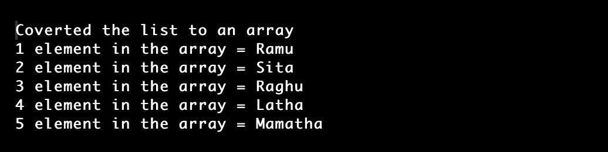

# 将列表转换为数组 Java

> 原文：<https://www.tutorialandexample.com/convert-list-to-array-java>

用于存储有序集合的一个流行的集合接口是列表。列表界面可以包含重复组，并保留条目的插入顺序。

本文将描述转换技术。在 Java 中将列表转换成数组的三种基本技术如下:

1.  使用 List.get()函数
2.  应用 toArray()函数
3.  Java 8 中的流

## 使用 get()方法

流是将列表转换成数组的最简单的方法之一。这允许我们单独访问每个列表元素，并将它们添加到数组中。

List 接口中的 get()方法具有以下语法:

```
public Ele get(int position)
```

位于列表中给定位置的元素由 get()函数返回。

为了理解如何利用 list 的 get()函数，让我们看一个将 list 转换成这样一个数组的例子。

**举例:ListToArrayEx1.java**

```
//this program is for converting the list into an array
//import section
import java.io.*;  
import java.util.LinkedList;  
import java.util.List;  
// a class ListToArrayEx1 can be created for converting the given list into an array
public class ListToArrayEx1 {  
    // main() method of the program
    public static void main(String[] args)  
    {  
         // a linked list was created by declaring the objects to list 
         List<String> name = new LinkedList<String>();  
         // the method add() is used for adding the elements to the liked list 
         name.add("Ramu");  
         name.add("Sita");  
         name.add("Raghu");  
         name.add("Latha");  
         name.add("Mamatha");  
         // the size of the linked list is then stored in the length variable  
         int length = name.size();  
         // the array elements were stored like the string as the datatype  
         String[] nameArray = new String[ length ]; 
         //the loop is then iterated over each element over the list completes
         //and then con converted it to the list array 
         for (int i = 0; i < length; i++)  
             nameArray[i] = name.get(i);  
         // the values which are in the array are printed  
         System.out.println("Coverted the list to an array");  
         for (int j = 0; j < nameArray.length; j++) {  
             System.out.println((j+1)+" element in the array = "+nameArray[j]);  
         }  
    }   
} 
```

**输出**



## 应用 toArray()方法

toArray()函数使得把一个列表变成一个数组变得很简单。这是从列表创建数组的另一种方法。使用 toArray()函数将列表中的所有条目返回到一个数组中。结果数组中的元素完全按照列表中的顺序组织。

List 接口的 toArray()方法具有相应的格式:

```
public <T> T[] toArray(T[] array)  
```

函数的作用是:返回一个包含列表中所有元素的数组，要么接受一个数组作为参数，要么不接受。

为了进一步理解如何使用 list 的 toArray()方法，让我们看另一个将 list 转换成这样一个数组的例子。

**ListToArrayEx2.java**

```
//this program is for converting the list into an array
//importing the required packages
import java.io.*;
import java.util.LinkedList;  
import java.util.List;  
//a class ListToArrayEx2 can be created for converting the given list into an array
public class ListToArrayEx2 {  
    // main() section of the program 
    public static void main(String[] args)  
    {  
         // a linked list was created by declaring the objects to list 
         List<String> name = new LinkedList<String>(); 
        // the add() method was used for pushing the elements to list 
         // use add() method of the list to add elements in the linked list  
         name.add("Panini");  
         name.add("Daniel");  
         name.add("Johny"); 
         name.add("Ramesh");  
         name.add("Mahesh");
         //the method toArray() method can be used for converting the list to an array
         String[] nameArray = name.toArray(new String[0]);  
         // the total elements in the list are printed  
         System.out.println("The list after converted to array");  
         for (int j = 0; j < nameArray.length; j++) {  
             System.out.println((j+1)+" element in array = "+nameArray[j]);  
         }  
    }   
} 
```

**输出:**


## 利用水流

ma 还可以利用 Java 8 中包含的 Stream 特性将一个列表转换成一个数组。

List 接口的 toArray()函数具有以下语法:

```
public <T> T[] toArray(T[] array) 
```

toArray()函数只接受两个参数中的一个:一个数组或什么都不接受。列表的所有项目都包含在返回的数组中。

**ListToArrayExample3.java**

```
//this program is for converting the list into an array
//importing the required packages
//import section
import java.io.*;  
import java.util.LinkedList;  
import java.util.List;  
//create  ListToArrayExample3 class
public class ListToArrayExample3 {  
    // main() section of the program 
    public static void main(String[] args)  
    {  
         // a linked list was created by declaring the objects to list   
         List<String> name = new LinkedList<String>();  
         // the add() method is used for adding elements to 
         name.add("Niranjan");  
         name.add("Somesh");  
         name.add("Johny");  
         name.add("Ramu");  
         name.add("Mamatha");  
         //the stream() method, which was used for converting the list to an array
         String[] nameArray = name.stream().toArray(String[] ::new);  
         // the result of all the elements in the array
         System.out.println("The converted list into an Array");  
         for (int j = 0; j < nameArray.length; j++) {  
             System.out.println((j+1)+" element in the array= "+nameArray[j]);  
         }  
    }   
} 
```

**输出:**

